# 吾爱破解 2024 年春节解题领红包活动非官方题解暨吐槽（Ishisashi 篇）
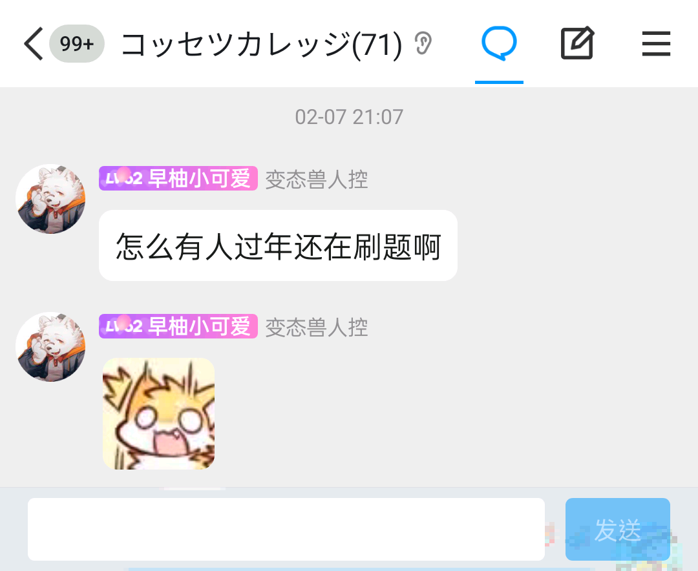

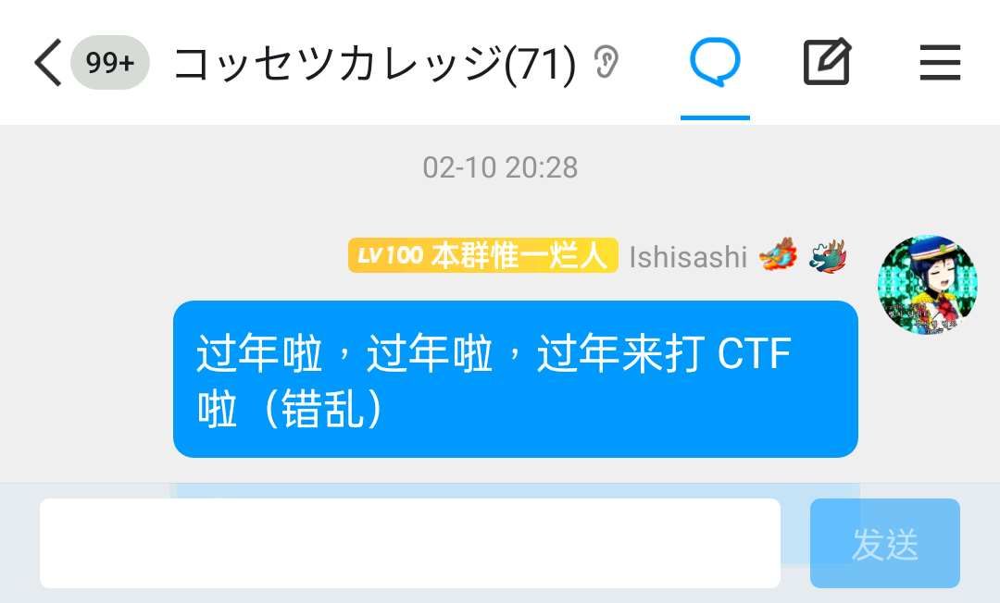

## 一（送分题）
按提示向公众号发消息即可。

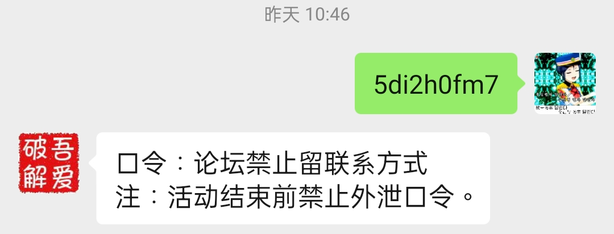
```
论坛禁止留联系方式
```

## 二（Windows 初级题）
执行「【2024春节】解题领红包之Windows初级题.exe」，程式要求输入口令。随便输点东西看看。


当然这完全没关系，还是拿 HxD 打开搜一下出现的字符串。

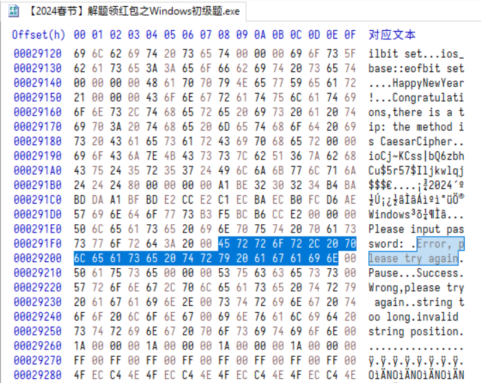

不搜不知道，一搜吓一跳，字符串区直接给了提示：
```
Congratulations,there is a tip: the method is CaesarCipher
```
Caesar 密码嘛。我想紧跟着的那串就是密文。
```
69 6F 43 6A 7E 4B 43 73 73 7C 62 51 36 7A 62 68 43 75 24 35 72 35 37 24 49 6C 6A 6B 77 6C 71 6A 24 24 24 80
```
（以 ASCII-Hex 表示）

注意到第五位 0x7E 与最后一位 0x80 之差正好与 0x7B 与 0x7D 之差相等，考虑到「flag{…}」这种形式的字符串已然品鉴得足够多了（鉴定为玩 CTF 玩的），合理猜测 0x7E 和 0x80 对应的原文就是「{」和「}」。

还有一个线索是中间出现了「5r57」，而今年是 2024 年——「5r57」倒推 3 位正好是「2o24」。

这样就可以大胆断定密文相对于原文的偏移量是 3，直接减去即可。
```JavaScript
'use strict';

let buf = Buffer.from('696F436A7E4B4373737C6251367A62684375243572353724496C6A6B776C716A24242480', 'hex');
let bufDec = Buffer.alloc(buf.length);

let offset = 0;
while (offset < buf.length) {
    bufDec[offset] = (buf[offset] - 3) % 256;
    offset += 1;
};

console.log(bufDec.toString());
```
立刻得到 Flag。
```
fl@g{H@ppy_N3w_e@r!2o24!Fighting!!!}
```
这种语义极为明确的字符串就没必要丢回去验证了罢，直接提交 Flag 完事。倒也可以验证一下。

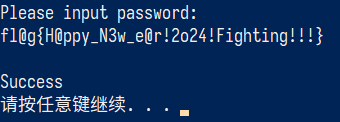

不过猜不出也没有关系，穷举偏移量也能做出来。

当天（2024 年 2 月 11 日）起晚了所以成了九血。

PKU GeekGame 3rd 的签到题就是 Caesar 密码——虽然只有字母部分应用，偏移量为 13——即使没有那个提示也不难想到的样子。

## 三（Android 初级题）
```
小明和李华是同学，最近小明发现李华技术进步很快，他太想进步了，于是他一直在观察李华，却发现他老是在玩圈小猫，直到一次偶然发现，小明惊呼:“WC，原。。。”
```
说起来圈小猫是 52pojie 的传统罢，只要 404 就能触发。

拆开「【2024春节】解题领红包之三-Android初级题.apk」一看，果然有原神。

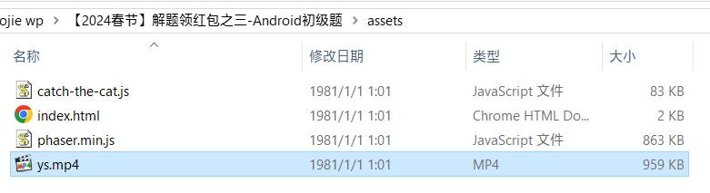

不过我反复看了几遍也没发现 Flag。其实，Flag 藏在档案的末尾。

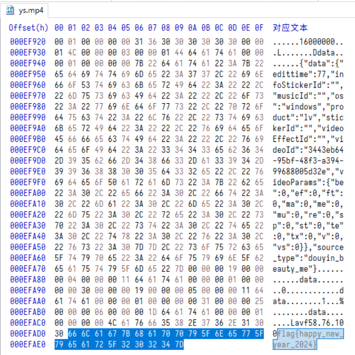
```
flag{happy_new_year_2024}
```
事实上反编译后阅读 com.zj.wuaipojie2024_1:YSQDActivity.java 就能发现，程式机理是读取 /data/user/0/com.zj.wuaipojie2024_1/files/ys.mp4，然后提取出以「flag{」开头并以「}」结尾的字符串。
```Java
String filePath = "/data/user/0/com.zj.wuaipojie2024_1/files/ys.mp4";
```
```Java
int indexOf = str2.indexOf("flag{");
if (indexOf != -1) {
    String str3 = str2.substring(indexOf).split("\\}")[0] + "}";
    randomAccessFile.close();
    return str3;
}
```
这次我是趴床上用手机做题，所以又是九血。10:00 的时候，我被踢掉的汤婆子砸地的声音吓醒；拿起手机，看到画面上的 10:00，赶紧打开 52pojie 做题——结果还得登录。

↑汤婆子闹钟是罢（

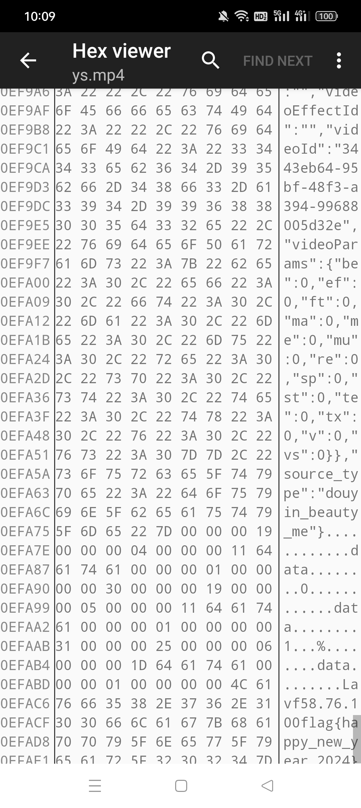

## 四（Android 初级题）
反编译后阅读 com.kbtx.redpack_simple:FlagActivity.java 发现，Flag 以应用签名为密钥作异或加密。
```Java
public static byte[] o = {86, -18, 98, 103, 75, -73, 51, -104, 104, 94, 73, 81, 125, 118, 112, 100, -29, 63, -33, -110, 108, 115, 51, 59, 55, 52, 77};
```
```Java
Signature[] signatureArr = getPackageManager().getPackageInfo(getPackageName(), 64).signatures;
if (signatureArr != null) {
    if (signatureArr.length >= 1) {
        byte[] byteArray = signatureArr[0].toByteArray();
        ByteBuffer allocate = ByteBuffer.allocate(bArr2.length);
        for (int i = 0; i < bArr2.length; i++) {
            allocate.put((byte) (bArr2[i] ^ byteArray[i % byteArray.length]));
        }
        bArr = allocate.array();
        StringBuilder d = a.d("for honest players only: \n");
        d.append(new String(bArr));
        ((TextView) findViewById(R.id.tvFlagHint)).setText(d.toString());
    }
}
```
按理说有 Frida 的话可以直接调试，但我手机就没有办法 su，只好硬分析。

签名应该在 CERT.RSA 里面，首先来推断一下密钥的内容。

我想 Flag 大概以「flag」开头，所以用 [0x66, 0x6C, 0x61, 0x67] 与密文 [0x56, 0xEE, 0x62, 0x67] 异或，得到 [0x30, 0x82, 0x03, 0x00]。

一搜，果然出现了。

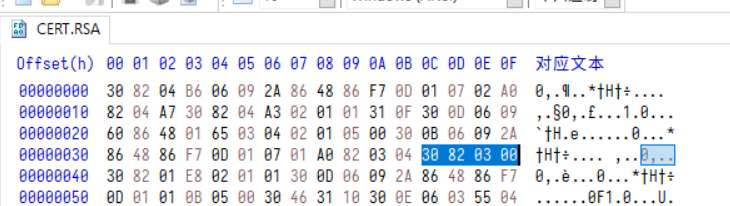

签名长度不知道怎么办？没关系，先取长一点，然后从后往前删，得到有意义的内容就可以了。
```JavaScript
'use strict';

let flag = Buffer.from([86, -18, 98, 103, 75, -73, 51, -104, 104, 94, 73, 81, 125, 118, 112, 100, -29, 63, -33, -110, 108, 115, 51, 59, 55, 52, 77]);
let key = Buffer.from([0x30, 0x82, 0x03, 0x00, 0x30, 0x82, 0x01, 0xE8, 0x02, 0x01, 0x01, 0x30, 0x0D, 0x06, 0x09, 0x2A, 0x86, 0x48, 0x86, 0xF7, 0x0D, 0x01, 0x01, 0x0B, 0x05, 0x00, 0x30]);

let offset = 0;
while (offset < flag.length) {
    flag[offset] ^= key[offset % key.length];
    offset += 1;
};

console.log(flag.toString());
```
结果发现，签名似乎比 Flag 长，所以根本不用删。
```
flag{52pj_HappyNewYear2024}
```
起晚了，十血没了；摆了个小烂，中午才开始做。

## 八（Web 初级题）、九（Web 中级题）、十（Web 高级题）
```
仔细查看视频和视频下方的介绍链接获得信息：https://www.bilibili.com/video/BV1ap421R7VS/
```
开头的雪花部分展现出了播放时肉眼可见的 Flag 3：
```
flag3{GRsgk2}
```
Logo 消失，然后点状波纹扩散，这时在波纹的稀疏处显现了 Flag 1 的轮廓：
```
flag1{52pj2024}
```
末尾出现了 GitHub 连结：
```
https://github.com/ganlvtech/52pojie-2024-challenge
```
[Commit 6bbac03](https://github.com/ganlvtech/52pojie-2024-challenge/commit/6bbac038c4813fbc5d129a8d605471ea2e374786) 的标题「删除不小心提交的flag内容」就很此地无银三百两，得到 Flag 7：
```
flag7{Djl9NQ}
```
中间出现了四个 QR 码的残片：


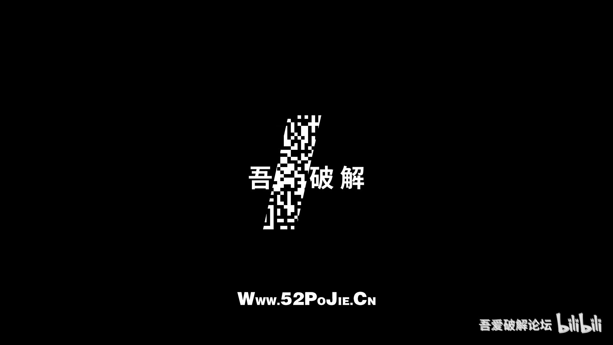

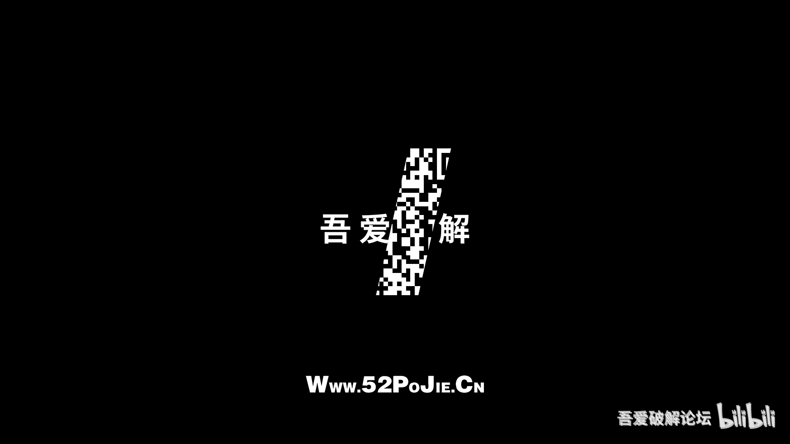

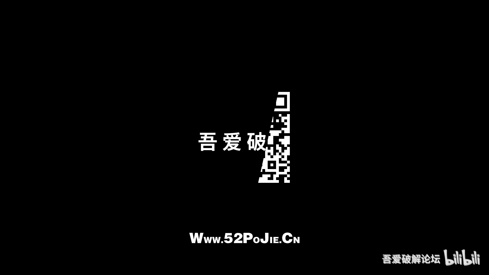

可以用华清大学连夜购买的 Photoshop 拼起来：


目测宽度及阅读格式信息可以知道这个 QR 码是 Version 4 Level H Mask 0 的。H 级容错，有文字没关系，直接扫就行。

这是个混合型的 QR 码。
```
Version: 4 (33×33)
Error correction level: H
Data mask pattern: 000 (0)
(Begin data)
Byte mode: https
Alphanumeric mode: ://2024
Byte mode: challenge.52pojie.cn/
(End data)

https://2024challenge.52pojie.cn/
```
可惜一开始因为 DNS 的问题没能成功打开。

顺带复现一下这个 QR 码。


打开时 Header 有 Flag 2：
```
HTTP/1.1 302 Found
X-Flag2: flag2{xHOpRP}
```
登录时的 Set-Cookie 藏着一点东西：
```
POST /auth/login HTTP/1.1
HTTP/1.1 302 Found
Date: Sat, 17 Feb 2024 03:57:15 GMT
Set-Cookie: flagA=jSFoeEAv9TLOh5Vu9v2rPpwibER05UMT/7sgK93Vonp3anYy9XMq/782NA==; expires=Sat, 17 Feb 2024 04:00:00 GMT; path=/; SameSite=Lax
Set-Cookie: uid=45Wru7lYfiPf6Sei5KBK231Dr6jwzZMNPUNP9CZrzT+sWhQ=; path=/; SameSite=Lax
```
但是我不会解密啊。

等等，如果 Cookie 只有加密的 UID，那，网页是怎么显示 UID 的呢……


原来，把加密后的 UID 用 Cookie 传入 `https://2024challenge.52pojie.cn/auth/uid` 便能得到明文 UID……嗯？如果我狸猫换太子，把 UID 改成 Flag 呢？

Fiddler，启动！


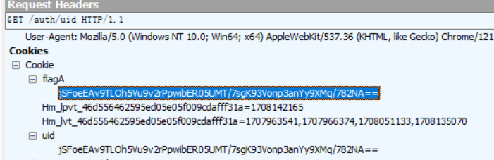

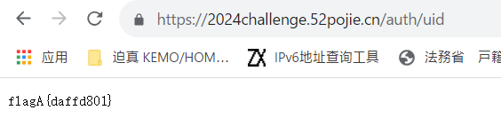

やったぜ！

在源代码赫然发现一些东西。
```CSS
background: url("flag4_flag10.png") white center center no-repeat;
```
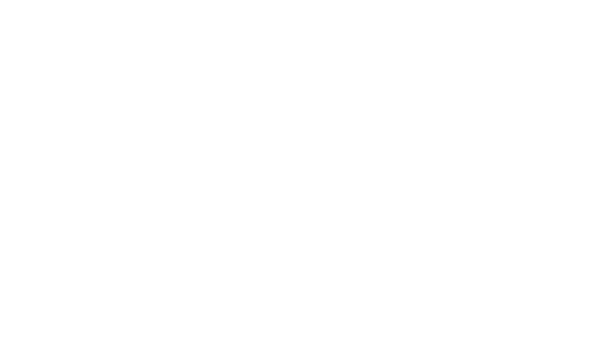

肉眼就能看到 Flag 4。当然是白字，所以白背景下看不见。

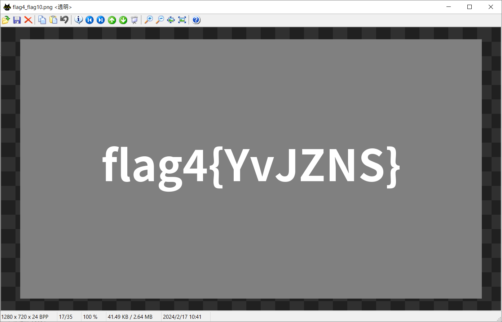
```
flag4{YvJZNS}
```
把 Alpha 通道去掉，只留下 RGB 部，就能看到 Flag 10。

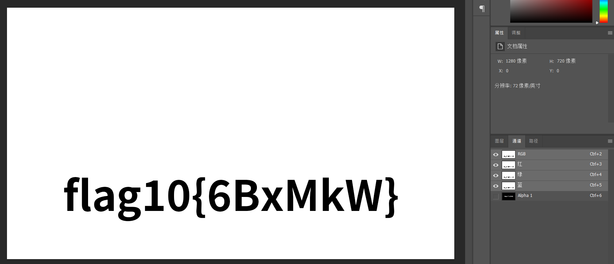

秒杀两题的解法是同时展示两部。

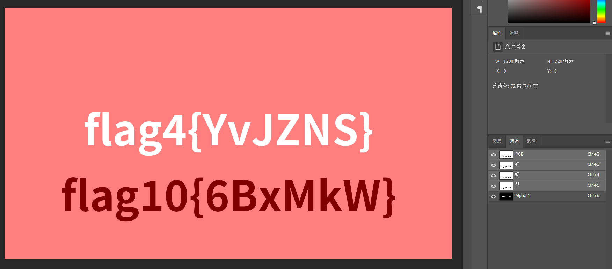
```
flag10{6BxMkW}
```
现在已经完成初级题了。
```
flag1{52pj2024} flag2{xHOpRP} flag3{GRsgk2} flag4{YvJZNS} flagA{daffd801}
```
三血。

Flag 5 同样是藏在源代码里面。
```HTML
<!-- flag5 flag9 -->
<pre style="position: absolute; z-index: -1; left: 0; top: 0; right: 0; margin: 0; color: white; user-select: none; pointer-events: none; white-space: pre-wrap; word-break: break-all; line-height: 1;">f<wbr>.<wbr>_<wbr>_<wbr>_<wbr>_<wbr>_<wbr>_<wbr>_<wbr>_<wbr>_<wbr>_<wbr>_<wbr>_<wbr>_<wbr>_<wbr>_<wbr>_<wbr>_<wbr>_<wbr>_<wbr>_<wbr>_<wbr>_<wbr>_<wbr>_<wbr>_<wbr>_<wbr>_<wbr>_<wbr>_<wbr>_<wbr>_<wbr>_<wbr>_<wbr>_<wbr>_<wbr>_<wbr>_<wbr>_<wbr>_<wbr>_<wbr>_<wbr>_<wbr>_<wbr>_<wbr>_<wbr>_<wbr>_<wbr>_<wbr>_<wbr>_<wbr>_<wbr>_<wbr>_<wbr>_<wbr>_<wbr>_<wbr>_<wbr>_<wbr>_<wbr>_<wbr>_<wbr>_<wbr>_<wbr>_<wbr>_<wbr>_<wbr>_<wbr>_<wbr>_<wbr>_<wbr>_<wbr>_<wbr>_<wbr>_<wbr>_<wbr>_<wbr>_<wbr>_<wbr>_<wbr>_<wbr>_<wbr>_<wbr>_<wbr>_<wbr>_<wbr>_<wbr>_<wbr>_<wbr>_<wbr>_<wbr>_<wbr>_<wbr>_<wbr>_<wbr>_<wbr>_<wbr>_<wbr>_<wbr>_<wbr>_<wbr>_<wbr>_<wbr>_<wbr>_<wbr>_<wbr>_<wbr>_<wbr>_<wbr>_<wbr>_<wbr>_<wbr>_<wbr>_<wbr>_<wbr>_<wbr>_<wbr>_<wbr>_<wbr>_<wbr>_<wbr>_<wbr>_<wbr>_<wbr>_<wbr>_<wbr>_<wbr>_<wbr>_<wbr>_<wbr>_<wbr>_<wbr>_<wbr>_<wbr>_<wbr>_<wbr>_<wbr>_<wbr>_<wbr>_<wbr>_<wbr>_<wbr>_<wbr>_<wbr>_<wbr>_<wbr>_<wbr>_<wbr>_<wbr>_<wbr>_<wbr>_<wbr>_<wbr>_<wbr>_<wbr>_<wbr>_<wbr>_<wbr>_<wbr>_<wbr>_<wbr>_<wbr>_<wbr>_<wbr>_<wbr>_<wbr>_<wbr>_<wbr>_<wbr>_<wbr>_<wbr>_<wbr>_<wbr>_<wbr>_<wbr>_<wbr>_<wbr>_<wbr>_<wbr>_<wbr>_<wbr>_<wbr>_<wbr>_<wbr>_<wbr>_<wbr>_<wbr>_<wbr>_<wbr>_<wbr>_<wbr>_<wbr>_<wbr>_<wbr>_<wbr>_<wbr>_<wbr>_<wbr>_<wbr>_<wbr>_<wbr>_<wbr>_<wbr>_<wbr>_<wbr>_<wbr>_<wbr>.<wbr>.<wbr>.<wbr>.<wbr>.<wbr>.<wbr>.<wbr>.<wbr>.<wbr>.<wbr>.<wbr>.<wbr>.<wbr>l<wbr>.<wbr>.<wbr>_<wbr>_<wbr>_<wbr>_<wbr>_<wbr>_<wbr>_<wbr>_<wbr>_<wbr>_<wbr>_<wbr>_<wbr>_<wbr>_<wbr>_<wbr>_<wbr>_<wbr>_<wbr>_<wbr>_<wbr>_<wbr>_<wbr>_<wbr>_<wbr>_<wbr>_<wbr>_<wbr>_<wbr>_<wbr>_<wbr>_<wbr>_<wbr>_<wbr>_<wbr>_<wbr>_<wbr>_<wbr>_<wbr>_<wbr>_<wbr>_<wbr>_<wbr>_<wbr>_<wbr>_<wbr>_<wbr>_<wbr>_<wbr>_<wbr>_<wbr>_<wbr>_<wbr>_<wbr>_<wbr>_<wbr>_<wbr>_<wbr>_<wbr>_<wbr>_<wbr>_<wbr>_<wbr>_<wbr>_<wbr>_<wbr>_<wbr>_<wbr>_<wbr>_<wbr>_<wbr>_<wbr>_<wbr>_<wbr>_<wbr>_<wbr>_<wbr>_<wbr>_<wbr>_<wbr>_<wbr>_<wbr>_<wbr>_<wbr>_<wbr>_<wbr>_<wbr>_<wbr>_<wbr>_<wbr>_<wbr>_<wbr>_<wbr>_<wbr>_<wbr>_<wbr>_<wbr>_<wbr>_<wbr>_<wbr>_<wbr>_<wbr>_<wbr>_<wbr>_<wbr>_<wbr>_<wbr>_<wbr>_<wbr>_<wbr>_<wbr>_<wbr>_<wbr>_<wbr>_<wbr>_<wbr>_<wbr>_<wbr>_<wbr>_<wbr>_<wbr>_<wbr>_<wbr>_<wbr>_<wbr>_<wbr>_<wbr>_<wbr>_<wbr>_<wbr>_<wbr>_<wbr>_<wbr>_<wbr>_<wbr>_<wbr>_<wbr>_<wbr>_<wbr>_<wbr>_<wbr>_<wbr>_<wbr>_<wbr>_<wbr>_<wbr>_<wbr>_<wbr>_<wbr>_<wbr>_<wbr>_<wbr>_<wbr>_<wbr>_<wbr>_<wbr>_<wbr>_<wbr>_<wbr>_<wbr>_<wbr>_<wbr>_<wbr>_<wbr>_<wbr>_<wbr>_<wbr>_<wbr>_<wbr>_<wbr>_<wbr>_<wbr>_<wbr>_<wbr>_<wbr>_<wbr>_<wbr>_<wbr>_<wbr>_<wbr>_<wbr>_<wbr>_<wbr>_<wbr>_<wbr>_<wbr>_<wbr>_<wbr>_<wbr>_<wbr>_<wbr>_<wbr>_<wbr>_<wbr>_<wbr>_<wbr>_<wbr>_<wbr>_<wbr>_<wbr>_<wbr>_<wbr>_<wbr>_<wbr>_<wbr>_<wbr>_<wbr>.<wbr>.<wbr>.<wbr>.<wbr>.<wbr>.<wbr>.<wbr>.<wbr>.<wbr>.<wbr>.<wbr>.<wbr>a<wbr>.<wbr>.<wbr>_<wbr>_<wbr>_<wbr>_<wbr>_<wbr>_<wbr>_<wbr>_<wbr>/<wbr>\<wbr>\<wbr>\<wbr>\<wbr>\<wbr>_<wbr>_<wbr>/<wbr>\<wbr>\<wbr>\<wbr>\<wbr>\<wbr>\<wbr>_<wbr>_<wbr>_<wbr>_<wbr>_<wbr>_<wbr>_<wbr>_<wbr>_<wbr>_<wbr>_<wbr>_<wbr>_<wbr>_<wbr>_<wbr>_<wbr>_<wbr>_<wbr>_<wbr>_<wbr>_<wbr>_<wbr>_<wbr>_<wbr>_<wbr>_<wbr>_<wbr>_<wbr>_<wbr>_<wbr>_<wbr>_<wbr>_<wbr>_<wbr>_<wbr>_<wbr>_<wbr>/<wbr>\<wbr>\<wbr>\<wbr>\<wbr>\<wbr>\<wbr>\<wbr>\<wbr>\<wbr>_<wbr>_<wbr>_<wbr>_<wbr>_<wbr>_<wbr>_<wbr>_<wbr>_<wbr>_<wbr>_<wbr>_<wbr>_<wbr>_<wbr>_<wbr>_<wbr>_<wbr>_<wbr>/<wbr>\<wbr>\<wbr>\<wbr>_<wbr>_<wbr>_<wbr>_<wbr>_<wbr>_<wbr>_<wbr>_<wbr>/<wbr>\<wbr>\<wbr>\<wbr>_<wbr>_<wbr>/<wbr>\<wbr>\<wbr>\<wbr>_<wbr>_<wbr>_<wbr>_<wbr>_<wbr>_<wbr>_<wbr>_<wbr>/<wbr>\<wbr>\<wbr>\<wbr>_<wbr>_<wbr>/<wbr>\<wbr>\<wbr>\<wbr>\<wbr>\<wbr>\<wbr>\<wbr>\<wbr>\<wbr>\<wbr>\<wbr>\<wbr>\<wbr>\<wbr>\<wbr>_<wbr>_<wbr>_<wbr>_<wbr>_<wbr>/<wbr>\<wbr>\<wbr>\<wbr>\<wbr>\<wbr>\<wbr>\<wbr>\<wbr>\<wbr>_<wbr>_<wbr>_<wbr>_<wbr>_<wbr>/<wbr>\<wbr>\<wbr>\<wbr>_<wbr>_<wbr>_<wbr>_<wbr>_<wbr>_<wbr>_<wbr>_<wbr>_<wbr>_<wbr>_<wbr>_<wbr>_<wbr>_<wbr>/<wbr>\<wbr>\<wbr>\<wbr>_<wbr>_<wbr>_<wbr>_<wbr>_<wbr>_<wbr>_<wbr>_<wbr>/<wbr>\<wbr>\<wbr>\<wbr>_<wbr>_<wbr>_<wbr>_<wbr>_<wbr>_<wbr>_<wbr>_<wbr>_<wbr>_<wbr>_<wbr>_<wbr>_<wbr>.<wbr>.<wbr>.<wbr>.<wbr>.<wbr>.<wbr>.<wbr>.<wbr>.<wbr>.<wbr>.<wbr>g<wbr>.<wbr>.<wbr>.<wbr>_<wbr>_<wbr>_<wbr>_<wbr>_<wbr>_<wbr>/<wbr>\<wbr>\<wbr>\<wbr>/<wbr>/<wbr>/<wbr>_<wbr>_<wbr>\<wbr>/<wbr>/<wbr>/<wbr>/<wbr>\<wbr>\<wbr>\<wbr>_<wbr>_<wbr>_<wbr>_<wbr>_<wbr>_<wbr>_<wbr>_<wbr>_<wbr>_<wbr>_<wbr>_<wbr>_<wbr>_<wbr>_<wbr>_<wbr>_<wbr>_<wbr>_<wbr>_<wbr>_<wbr>_<wbr>_<wbr>_<wbr>_<wbr>_<wbr>_<wbr>_<wbr>_<wbr>_<wbr>_<wbr>_<wbr>_<wbr>_<wbr>_<wbr>/<wbr>\<wbr>\<wbr>\<wbr>/<wbr>/<wbr>/<wbr>/<wbr>/<wbr>/<wbr>/<wbr>\<wbr>\<wbr>\<wbr>_<wbr>_<wbr>_<wbr>_<wbr>_<wbr>_<wbr>_<wbr>_<wbr>/<wbr>\<wbr>\<wbr>\<wbr>\<wbr>\<wbr>_<wbr>\<wbr>/<wbr>\<wbr>\<wbr>\<wbr>_<wbr>_<wbr>_<wbr>_<wbr>_<wbr>/<wbr>\<wbr>\<wbr>\<wbr>/<wbr>/<wbr>_<wbr>_<wbr>\<wbr>/<wbr>\<wbr>\<wbr>\<wbr>_<wbr>_<wbr>_<wbr>_<wbr>_<wbr>_<wbr>_<wbr>\<wbr>/<wbr>\<wbr>\<wbr>\<wbr>_<wbr>\<wbr>/<wbr>/<wbr>/<wbr>/<wbr>/<wbr>/<wbr>/<wbr>\<wbr>\<wbr>\<wbr>/<wbr>/<wbr>/<wbr>/<wbr>/<wbr>_<wbr>_<wbr>_<wbr>_<wbr>/<wbr>\<wbr>\<wbr>\<wbr>\<wbr>\<wbr>\<wbr>\<wbr>\<wbr>\<wbr>\<wbr>\<wbr>\<wbr>\<wbr>_<wbr>_<wbr>\<wbr>/<wbr>\<wbr>\<wbr>\<wbr>_<wbr>_<wbr>_<wbr>_<wbr>_<wbr>_<wbr>_<wbr>_<wbr>_<wbr>_<wbr>_<wbr>_<wbr>_<wbr>\<wbr>/<wbr>\<wbr>\<wbr>\<wbr>_<wbr>_<wbr>_<wbr>_<wbr>_<wbr>/<wbr>\<wbr>\<wbr>\<wbr>/<wbr>/<wbr>_<wbr>_<wbr>_<wbr>/<wbr>\<wbr>\<wbr>\<wbr>\<wbr>\<wbr>_<wbr>_<wbr>_<wbr>_<wbr>_<wbr>.<wbr>.<wbr>.<wbr>.<wbr>.<wbr>.<wbr>.<wbr>.<wbr>.<wbr>.<wbr>5<wbr>.<wbr>.<wbr>.<wbr>.<wbr>_<wbr>_<wbr>_<wbr>_<wbr>_<wbr>/<wbr>\<wbr>\<wbr>\<wbr>_<wbr>_<wbr>_<wbr>_<wbr>_<wbr>_<wbr>_<wbr>_<wbr>_<wbr>\<wbr>/<wbr>\<wbr>\<wbr>\<wbr>_<wbr>_<wbr>_<wbr>_<wbr>_<wbr>_<wbr>_<wbr>_<wbr>_<wbr>_<wbr>_<wbr>_<wbr>_<wbr>_<wbr>_<wbr>_<wbr>_<wbr>_<wbr>_<wbr>_<wbr>_<wbr>/<wbr>\<wbr>\<wbr>\<wbr>\<wbr>\<wbr>\<wbr>\<wbr>\<wbr>_<wbr>_<wbr>_<wbr>_<wbr>/<wbr>\<wbr>\<wbr>\<wbr>_<wbr>_<wbr>_<wbr>_<wbr>_<wbr>_<wbr>\<wbr>/<wbr>/<wbr>\<wbr>\<wbr>\<wbr>_<wbr>_<wbr>_<wbr>_<wbr>_<wbr>/<wbr>\<wbr>\<wbr>\<wbr>/<wbr>/<wbr>/<wbr>_<wbr>_<wbr>\<wbr>/<wbr>\<wbr>\<wbr>\<wbr>_<wbr>_<wbr>/<wbr>\<wbr>\<wbr>\<wbr>/<wbr>/<wbr>_<wbr>_<wbr>_<wbr>_<wbr>_<wbr>\<wbr>/<wbr>\<wbr>\<wbr>\<wbr>_<wbr>_<wbr>_<wbr>_<wbr>_<wbr>_<wbr>_<wbr>\<wbr>/<wbr>\<wbr>\<wbr>\<wbr>_<wbr>_<wbr>_<wbr>_<wbr>_<wbr>_<wbr>_<wbr>\<wbr>/<wbr>\<wbr>\<wbr>\<wbr>_<wbr>_<wbr>_<wbr>_<wbr>_<wbr>_<wbr>_<wbr>_<wbr>/<wbr>\<wbr>\<wbr>\<wbr>/<wbr>/<wbr>/<wbr>/<wbr>/<wbr>/<wbr>/<wbr>/<wbr>/<wbr>\<wbr>\<wbr>\<wbr>_<wbr>\<wbr>/<wbr>\<wbr>\<wbr>\<wbr>_<wbr>_<wbr>_<wbr>_<wbr>_<wbr>_<wbr>_<wbr>_<wbr>_<wbr>_<wbr>_<wbr>_<wbr>_<wbr>\<wbr>/<wbr>\<wbr>\<wbr>\<wbr>_<wbr>_<wbr>/<wbr>\<wbr>\<wbr>\<wbr>/<wbr>/<wbr>_<wbr>_<wbr>_<wbr>_<wbr>_<wbr>\<wbr>/<wbr>/<wbr>/<wbr>/<wbr>\<wbr>\<wbr>\<wbr>_<wbr>_<wbr>_<wbr>_<wbr>.<wbr>.<wbr>.<wbr>.<wbr>.<wbr>.<wbr>.<wbr>.<wbr>.<wbr>{<wbr>.<wbr>.<wbr>.<wbr>.<wbr>.<wbr>_<wbr>_<wbr>/<wbr>\<wbr>\<wbr>\<wbr>\<wbr>\<wbr>\<wbr>\<wbr>\<wbr>\<wbr>_<wbr>_<wbr>_<wbr>_<wbr>_<wbr>_<wbr>\<wbr>/<wbr>\<wbr>\<wbr>\<wbr>_<wbr>_<wbr>_<wbr>_<wbr>_<wbr>/<wbr>\<wbr>\<wbr>\<wbr>\<wbr>\<wbr>\<wbr>\<wbr>\<wbr>\<wbr>_<wbr>_<wbr>_<wbr>_<wbr>_<wbr>/<wbr>\<wbr>\<wbr>\<wbr>/<wbr>/<wbr>/<wbr>/<wbr>\<wbr>\<wbr>\<wbr>_<wbr>_<wbr>\<wbr>/<wbr>/<wbr>\<wbr>\<wbr>\<wbr>_<wbr>_<wbr>_<wbr>_<wbr>_<wbr>/<wbr>\<wbr>\<wbr>\<wbr>\<wbr>\<wbr>_<wbr>_<wbr>_<wbr>_<wbr>\<wbr>/<wbr>/<wbr>\<wbr>\<wbr>\<wbr>_<wbr>_<wbr>_<wbr>_<wbr>\<wbr>/<wbr>\<wbr>\<wbr>\<wbr>\<wbr>\<wbr>\<wbr>/<wbr>/<wbr>\<wbr>\<wbr>\<wbr>_<wbr>_<wbr>_<wbr>_<wbr>_<wbr>\<wbr>/<wbr>\<wbr>\<wbr>\<wbr>\<wbr>\<wbr>\<wbr>\<wbr>\<wbr>\<wbr>\<wbr>\<wbr>\<wbr>\<wbr>\<wbr>\<wbr>_<wbr>_<wbr>_<wbr>_<wbr>_<wbr>_<wbr>_<wbr>\<wbr>/<wbr>\<wbr>\<wbr>\<wbr>_<wbr>_<wbr>_<wbr>_<wbr>_<wbr>_<wbr>_<wbr>\<wbr>/<wbr>\<wbr>\<wbr>\<wbr>_<wbr>_<wbr>_<wbr>_<wbr>_<wbr>_<wbr>_<wbr>\<wbr>/<wbr>\<wbr>\<wbr>\<wbr>_<wbr>\<wbr>/<wbr>\<wbr>\<wbr>\<wbr>_<wbr>_<wbr>_<wbr>_<wbr>_<wbr>_<wbr>_<wbr>_<wbr>_<wbr>_<wbr>_<wbr>_<wbr>_<wbr>\<wbr>/<wbr>\<wbr>\<wbr>\<wbr>\<wbr>\<wbr>\<wbr>/<wbr>/<wbr>\<wbr>\<wbr>\<wbr>_<wbr>_<wbr>_<wbr>_<wbr>_<wbr>_<wbr>_<wbr>_<wbr>/<wbr>\<wbr>\<wbr>\<wbr>_<wbr>_<wbr>_<wbr>_<wbr>_<wbr>.<wbr>.<wbr>.<wbr>.<wbr>.<wbr>.<wbr>.<wbr>.<wbr>P<wbr>.<wbr>.<wbr>.<wbr>.<wbr>.<wbr>.<wbr>_<wbr>\<wbr>/<wbr>/<wbr>/<wbr>/<wbr>\<wbr>\<wbr>\<wbr>/<wbr>/<wbr>_<wbr>_<wbr>_<wbr>_<wbr>_<wbr>_<wbr>_<wbr>\<wbr>/<wbr>\<wbr>\<wbr>\<wbr>_<wbr>_<wbr>_<wbr>_<wbr>\<wbr>/<wbr>/<wbr>/<wbr>/<wbr>/<wbr>/<wbr>/<wbr>/<wbr>\<wbr>\<wbr>\<wbr>_<wbr>_<wbr>_<wbr>\<wbr>/<wbr>/<wbr>\<wbr>\<wbr>\<wbr>\<wbr>\<wbr>\<wbr>\<wbr>\<wbr>\<wbr>_<wbr>_<wbr>_<wbr>\<wbr>/<wbr>/<wbr>/<wbr>\<wbr>\<wbr>\<wbr>\<wbr>\<wbr>\<wbr>\<wbr>\<wbr>/<wbr>\<wbr>\<wbr>\<wbr>_<wbr>_<wbr>/<wbr>\<wbr>\<wbr>\<wbr>\<wbr>\<wbr>\<wbr>_<wbr>_<wbr>_<wbr>_<wbr>_<wbr>\<wbr>/<wbr>\<wbr>\<wbr>\<wbr>/<wbr>/<wbr>_<wbr>\<wbr>/<wbr>/<wbr>\<wbr>\<wbr>\<wbr>_<wbr>_<wbr>_<wbr>_<wbr>\<wbr>/<wbr>\<wbr>\<wbr>\<wbr>/<wbr>/<wbr>/<wbr>/<wbr>/<wbr>/<wbr>/<wbr>/<wbr>/<wbr>\<wbr>\<wbr>\<wbr>_<wbr>_<wbr>_<wbr>_<wbr>_<wbr>_<wbr>_<wbr>\<wbr>/<wbr>\<wbr>\<wbr>\<wbr>_<wbr>_<wbr>_<wbr>_<wbr>_<wbr>_<wbr>_<wbr>\<wbr>/<wbr>\<wbr>\<wbr>\<wbr>\<wbr>\<wbr>\<wbr>\<wbr>\<wbr>\<wbr>\<wbr>\<wbr>\<wbr>\<wbr>\<wbr>\<wbr>_<wbr>\<wbr>/<wbr>\<wbr>\<wbr>\<wbr>_<wbr>_<wbr>_<wbr>_<wbr>_<wbr>_<wbr>_<wbr>_<wbr>_<wbr>_<wbr>_<wbr>_<wbr>_<wbr>\<wbr>/<wbr>\<wbr>\<wbr>\<wbr>/<wbr>/<wbr>_<wbr>\<wbr>/<wbr>/<wbr>\<wbr>\<wbr>\<wbr>_<wbr>_<wbr>_<wbr>_<wbr>_<wbr>_<wbr>\<wbr>/<wbr>/<wbr>\<wbr>\<wbr>\<wbr>\<wbr>\<wbr>\<wbr>_<wbr>.<wbr>.<wbr>.<wbr>.<wbr>.<wbr>.<wbr>.<wbr>3<wbr>.<wbr>.<wbr>.<wbr>.<wbr>.<wbr>.<wbr>.<wbr>_<wbr>_<wbr>_<wbr>_<wbr>\<wbr>/<wbr>\<wbr>\<wbr>\<wbr>_<wbr>_<wbr>_<wbr>_<wbr>_<wbr>_<wbr>_<wbr>_<wbr>_<wbr>\<wbr>/<wbr>\<wbr>\<wbr>\<wbr>_<wbr>_<wbr>_<wbr>_<wbr>_<wbr>_<wbr>/<wbr>\<wbr>\<wbr>\<wbr>\<wbr>\<wbr>\<wbr>\<wbr>\<wbr>\<wbr>\<wbr>_<wbr>_<wbr>_<wbr>\<wbr>/<wbr>/<wbr>/<wbr>/<wbr>/<wbr>/<wbr>/<wbr>\<wbr>\<wbr>\<wbr>_<wbr>_<wbr>_<wbr>_<wbr>_<wbr>\<wbr>/<wbr>/<wbr>/<wbr>/<wbr>/<wbr>/<wbr>/<wbr>/<wbr>\<wbr>/<wbr>\<wbr>\<wbr>\<wbr>_<wbr>\<wbr>/<wbr>/<wbr>/<wbr>/<wbr>/<wbr>\<wbr>\<wbr>\<wbr>_<wbr>_<wbr>_<wbr>_<wbr>\<wbr>/<wbr>\<wbr>\<wbr>\<wbr>_<wbr>_<wbr>_<wbr>_<wbr>\<wbr>/<wbr>/<wbr>\<wbr>\<wbr>\<wbr>_<wbr>_<wbr>_<wbr>\<wbr>/<wbr>\<wbr>\<wbr>\<wbr>_<wbr>_<wbr>_<wbr>_<wbr>_<wbr>_<wbr>_<wbr>\<wbr>/<wbr>\<wbr>\<wbr>\<wbr>_<wbr>_<wbr>_<wbr>_<wbr>_<wbr>_<wbr>_<wbr>\<wbr>/<wbr>\<wbr>\<wbr>\<wbr>_<wbr>_<wbr>_<wbr>_<wbr>_<wbr>_<wbr>_<wbr>\<wbr>/<wbr>\<wbr>\<wbr>\<wbr>/<wbr>/<wbr>/<wbr>/<wbr>/<wbr>/<wbr>/<wbr>/<wbr>/<wbr>\<wbr>\<wbr>\<wbr>_<wbr>\<wbr>/<wbr>\<wbr>\<wbr>\<wbr>_<wbr>_<wbr>_<wbr>_<wbr>_<wbr>_<wbr>_<wbr>_<wbr>_<wbr>_<wbr>_<wbr>_<wbr>_<wbr>\<wbr>/<wbr>\<wbr>\<wbr>\<wbr>_<wbr>_<wbr>_<wbr>_<wbr>\<wbr>/<wbr>/<wbr>\<wbr>\<wbr>\<wbr>_<wbr>_<wbr>_<wbr>_<wbr>_<wbr>_<wbr>/<wbr>\<wbr>\<wbr>\<wbr>/<wbr>/<wbr>/<wbr>_<wbr>_<wbr>.<wbr>.<wbr>.<wbr>.<wbr>.<wbr>.<wbr>p<wbr>.<wbr>.<wbr>.<wbr>.<wbr>.<wbr>.<wbr>.<wbr>.<wbr>_<wbr>_<wbr>_<wbr>_<wbr>\<wbr>/<wbr>\<wbr>\<wbr>\<wbr>_<wbr>_<wbr>_<wbr>_<wbr>_<wbr>_<wbr>_<wbr>_<wbr>_<wbr>\<wbr>/<wbr>\<wbr>\<wbr>\<wbr>_<wbr>_<wbr>_<wbr>_<wbr>_<wbr>/<wbr>\<wbr>\<wbr>\<wbr>/<wbr>/<wbr>/<wbr>/<wbr>/<wbr>\<wbr>\<wbr>\<wbr>_<wbr>_<wbr>_<wbr>/<wbr>\<wbr>\<wbr>_<wbr>_<wbr>_<wbr>_<wbr>_<wbr>\<wbr>\<wbr>\<wbr>_<wbr>_<wbr>_<wbr>/<wbr>\<wbr>\<wbr>_<wbr>_<wbr>_<wbr>_<wbr>_<wbr>_<wbr>_<wbr>_<wbr>/<wbr>\<wbr>\<wbr>\<wbr>_<wbr>_<wbr>_<wbr>_<wbr>_<wbr>_<wbr>/<wbr>\<wbr>\<wbr>\<wbr>_<wbr>_<wbr>_<wbr>_<wbr>_<wbr>\<wbr>/<wbr>\<wbr>\<wbr>\<wbr>_<wbr>_<wbr>_<wbr>_<wbr>_<wbr>\<wbr>/<wbr>/<wbr>\<wbr>\<wbr>\<wbr>_<wbr>_<wbr>\<wbr>/<wbr>\<wbr>\<wbr>\<wbr>_<wbr>_<wbr>_<wbr>_<wbr>_<wbr>_<wbr>_<wbr>\<wbr>/<wbr>\<wbr>\<wbr>\<wbr>_<wbr>_<wbr>_<wbr>_<wbr>_<wbr>_<wbr>_<wbr>\<wbr>/<wbr>\<wbr>\<wbr>\<wbr>_<wbr>_<wbr>_<wbr>_<wbr>_<wbr>_<wbr>_<wbr>\<wbr>/<wbr>\<wbr>\<wbr>\<wbr>_<wbr>_<wbr>_<wbr>_<wbr>_<wbr>_<wbr>_<wbr>\<wbr>/<wbr>\<wbr>\<wbr>\<wbr>_<wbr>\<wbr>/<wbr>\<wbr>\<wbr>\<wbr>_<wbr>_<wbr>_<wbr>_<wbr>_<wbr>_<wbr>_<wbr>_<wbr>_<wbr>_<wbr>_<wbr>_<wbr>_<wbr>\<wbr>/<wbr>\<wbr>\<wbr>\<wbr>_<wbr>_<wbr>_<wbr>_<wbr>_<wbr>\<wbr>/<wbr>/<wbr>\<wbr>\<wbr>\<wbr>_<wbr>_<wbr>_<wbr>_<wbr>\<wbr>/<wbr>/<wbr>\<wbr>\<wbr>\<wbr>_<wbr>_<wbr>_<wbr>_<wbr>.<wbr>.<wbr>.<wbr>.<wbr>.<wbr>r<wbr>.<wbr>.<wbr>.<wbr>.<wbr>.<wbr>.<wbr>.<wbr>.<wbr>.<wbr>_<wbr>_<wbr>_<wbr>_<wbr>\<wbr>/<wbr>\<wbr>\<wbr>\<wbr>_<wbr>_<wbr>_<wbr>_<wbr>_<wbr>_<wbr>_<wbr>/<wbr>\<wbr>\<wbr>\<wbr>\<wbr>\<wbr>\<wbr>\<wbr>\<wbr>\<wbr>_<wbr>\<wbr>/<wbr>/<wbr>\<wbr>\<wbr>\<wbr>\<wbr>\<wbr>\<wbr>\<wbr>\<wbr>/<wbr>\<wbr>\<wbr>_<wbr>\<wbr>/<wbr>/<wbr>\<wbr>\<wbr>\<wbr>\<wbr>\<wbr>\<wbr>\<wbr>\<wbr>_<wbr>_<wbr>_<wbr>\<wbr>/<wbr>/<wbr>\<wbr>\<wbr>\<wbr>\<wbr>\<wbr>\<wbr>\<wbr>\<wbr>\<wbr>\<wbr>\<wbr>/<wbr>_<wbr>_<wbr>_<wbr>_<wbr>_<wbr>_<wbr>\<wbr>/<wbr>/<wbr>/<wbr>\<wbr>\<wbr>\<wbr>\<wbr>\<wbr>_<wbr>\<wbr>/<wbr>\<wbr>\<wbr>\<wbr>_<wbr>_<wbr>_<wbr>_<wbr>_<wbr>_<wbr>\<wbr>/<wbr>/<wbr>\<wbr>\<wbr>\<wbr>_<wbr>\<wbr>/<wbr>\<wbr>\<wbr>\<wbr>_<wbr>_<wbr>_<wbr>_<wbr>_<wbr>_<wbr>_<wbr>\<wbr>/<wbr>\<wbr>\<wbr>\<wbr>_<wbr>_<wbr>_<wbr>_<wbr>_<wbr>_<wbr>_<wbr>\<wbr>/<wbr>\<wbr>\<wbr>\<wbr>_<wbr>_<wbr>_<wbr>_<wbr>_<wbr>_<wbr>_<wbr>\<wbr>/<wbr>\<wbr>\<wbr>\<wbr>_<wbr>_<wbr>_<wbr>_<wbr>_<wbr>_<wbr>_<wbr>\<wbr>/<wbr>\<wbr>\<wbr>\<wbr>_<wbr>\<wbr>/<wbr>\<wbr>\<wbr>\<wbr>\<wbr>\<wbr>\<wbr>\<wbr>\<wbr>\<wbr>\<wbr>\<wbr>\<wbr>\<wbr>\<wbr>\<wbr>_<wbr>\<wbr>/<wbr>\<wbr>\<wbr>\<wbr>_<wbr>_<wbr>_<wbr>_<wbr>_<wbr>_<wbr>\<wbr>/<wbr>/<wbr>\<wbr>\<wbr>\<wbr>_<wbr>_<wbr>/<wbr>\<wbr>\<wbr>\<wbr>\<wbr>\<wbr>_<wbr>_<wbr>_<wbr>_<wbr>_<wbr>.<wbr>.<wbr>.<wbr>.<wbr>q<wbr>.<wbr>.<wbr>.<wbr>.<wbr>.<wbr>.<wbr>.<wbr>.<wbr>.<wbr>.<wbr>_<wbr>_<wbr>_<wbr>_<wbr>\<wbr>/<wbr>/<wbr>/<wbr>_<wbr>_<wbr>_<wbr>_<wbr>_<wbr>_<wbr>_<wbr>\<wbr>/<wbr>/<wbr>/<wbr>/<wbr>/<wbr>/<wbr>/<wbr>/<wbr>/<wbr>_<wbr>_<wbr>_<wbr>\<wbr>/<wbr>/<wbr>/<wbr>/<wbr>/<wbr>/<wbr>/<wbr>/<wbr>\<wbr>/<wbr>/<wbr>_<wbr>_<wbr>_<wbr>\<wbr>/<wbr>/<wbr>/<wbr>/<wbr>/<wbr>/<wbr>/<wbr>/<wbr>_<wbr>_<wbr>_<wbr>_<wbr>_<wbr>\<wbr>/<wbr>/<wbr>/<wbr>/<wbr>/<wbr>/<wbr>/<wbr>/<wbr>/<wbr>/<wbr>/<wbr>_<wbr>_<wbr>_<wbr>_<wbr>_<wbr>_<wbr>_<wbr>_<wbr>_<wbr>_<wbr>\<wbr>/<wbr>/<wbr>/<wbr>/<wbr>/<wbr>_<wbr>_<wbr>\<wbr>/<wbr>/<wbr>/<wbr>_<wbr>_<wbr>_<wbr>_<wbr>_<wbr>_<wbr>_<wbr>_<wbr>\<wbr>/<wbr>/<wbr>/<wbr>_<wbr>_<wbr>\<wbr>/<wbr>/<wbr>/<wbr>_<wbr>_<wbr>_<wbr>_<wbr>_<wbr>_<wbr>_<wbr>_<wbr>\<wbr>/<wbr>/<wbr>/<wbr>_<wbr>_<wbr>_<wbr>_<wbr>_<wbr>_<wbr>_<wbr>_<wbr>\<wbr>/<wbr>/<wbr>/<wbr>_<wbr>_<wbr>_<wbr>_<wbr>_<wbr>_<wbr>_<wbr>_<wbr>\<wbr>/<wbr>/<wbr>/<wbr>_<wbr>_<wbr>_<wbr>_<wbr>_<wbr>_<wbr>_<wbr>_<wbr>\<wbr>/<wbr>/<wbr>/<wbr>_<wbr>_<wbr>\<wbr>/<wbr>/<wbr>/<wbr>/<wbr>/<wbr>/<wbr>/<wbr>/<wbr>/<wbr>/<wbr>/<wbr>/<wbr>/<wbr>/<wbr>/<wbr>_<wbr>_<wbr>\<wbr>/<wbr>/<wbr>/<wbr>_<wbr>_<wbr>_<wbr>_<wbr>_<wbr>_<wbr>_<wbr>_<wbr>\<wbr>/<wbr>/<wbr>/<wbr>_<wbr>_<wbr>\<wbr>/<wbr>/<wbr>/<wbr>/<wbr>/<wbr>_<wbr>_<wbr>_<wbr>_<wbr>_<wbr>_<wbr>.<wbr>.<wbr>.<wbr>F<wbr>.<wbr>.<wbr>.<wbr>.<wbr>.<wbr>.<wbr>.<wbr>.<wbr>.<wbr>.<wbr>.<wbr>_<wbr>_<wbr>_<wbr>_<wbr>_<wbr>_<wbr>_<wbr>_<wbr>_<wbr>_<wbr>_<wbr>_<wbr>_<wbr>_<wbr>_<wbr>_<wbr>_<wbr>_<wbr>_<wbr>_<wbr>_<wbr>_<wbr>_<wbr>_<wbr>_<wbr>_<wbr>_<wbr>_<wbr>_<wbr>_<wbr>_<wbr>_<wbr>_<wbr>_<wbr>_<wbr>_<wbr>_<wbr>_<wbr>_<wbr>_<wbr>_<wbr>_<wbr>_<wbr>_<wbr>_<wbr>_<wbr>_<wbr>_<wbr>_<wbr>_<wbr>_<wbr>_<wbr>_<wbr>_<wbr>_<wbr>_<wbr>_<wbr>_<wbr>_<wbr>_<wbr>_<wbr>_<wbr>_<wbr>_<wbr>_<wbr>_<wbr>_<wbr>_<wbr>_<wbr>_<wbr>_<wbr>_<wbr>_<wbr>_<wbr>_<wbr>_<wbr>_<wbr>_<wbr>_<wbr>_<wbr>_<wbr>_<wbr>_<wbr>_<wbr>_<wbr>_<wbr>_<wbr>_<wbr>_<wbr>_<wbr>_<wbr>_<wbr>_<wbr>_<wbr>_<wbr>_<wbr>_<wbr>_<wbr>_<wbr>_<wbr>_<wbr>_<wbr>_<wbr>_<wbr>_<wbr>_<wbr>_<wbr>_<wbr>_<wbr>_<wbr>_<wbr>_<wbr>_<wbr>_<wbr>_<wbr>_<wbr>_<wbr>_<wbr>_<wbr>_<wbr>_<wbr>_<wbr>_<wbr>_<wbr>_<wbr>_<wbr>_<wbr>_<wbr>_<wbr>_<wbr>_<wbr>_<wbr>_<wbr>_<wbr>_<wbr>_<wbr>_<wbr>_<wbr>_<wbr>_<wbr>_<wbr>_<wbr>_<wbr>_<wbr>_<wbr>_<wbr>_<wbr>_<wbr>_<wbr>_<wbr>_<wbr>_<wbr>_<wbr>_<wbr>_<wbr>_<wbr>_<wbr>_<wbr>_<wbr>_<wbr>_<wbr>_<wbr>_<wbr>_<wbr>_<wbr>_<wbr>_<wbr>_<wbr>_<wbr>_<wbr>_<wbr>_<wbr>_<wbr>_<wbr>_<wbr>_<wbr>_<wbr>_<wbr>_<wbr>_<wbr>_<wbr>_<wbr>_<wbr>_<wbr>_<wbr>_<wbr>_<wbr>_<wbr>_<wbr>_<wbr>_<wbr>_<wbr>_<wbr>_<wbr>_<wbr>_<wbr>_<wbr>_<wbr>_<wbr>_<wbr>_<wbr>_<wbr>_<wbr>_<wbr>_<wbr>_<wbr>_<wbr>.<wbr>.<wbr>}<wbr>.<wbr>.<wbr>.<wbr>.<wbr>.<wbr>.<wbr>.<wbr>.<wbr>.<wbr>.<wbr>.<wbr>.<wbr>_<wbr>_<wbr>_<wbr>_<wbr>_<wbr>_<wbr>_<wbr>_<wbr>_<wbr>_<wbr>_<wbr>_<wbr>_<wbr>_<wbr>_<wbr>_<wbr>_<wbr>_<wbr>_<wbr>_<wbr>_<wbr>_<wbr>_<wbr>_<wbr>_<wbr>_<wbr>_<wbr>_<wbr>_<wbr>_<wbr>_<wbr>_<wbr>_<wbr>_<wbr>_<wbr>_<wbr>_<wbr>_<wbr>_<wbr>_<wbr>_<wbr>_<wbr>_<wbr>_<wbr>_<wbr>_<wbr>_<wbr>_<wbr>_<wbr>_<wbr>_<wbr>_<wbr>_<wbr>_<wbr>_<wbr>_<wbr>_<wbr>_<wbr>_<wbr>_<wbr>_<wbr>_<wbr>_<wbr>_<wbr>_<wbr>_<wbr>_<wbr>_<wbr>_<wbr>_<wbr>_<wbr>_<wbr>_<wbr>_<wbr>_<wbr>_<wbr>_<wbr>_<wbr>_<wbr>_<wbr>_<wbr>_<wbr>_<wbr>_<wbr>_<wbr>_<wbr>_<wbr>_<wbr>_<wbr>_<wbr>_<wbr>_<wbr>_<wbr>_<wbr>_<wbr>_<wbr>_<wbr>_<wbr>_<wbr>_<wbr>_<wbr>_<wbr>_<wbr>_<wbr>_<wbr>_<wbr>_<wbr>_<wbr>_<wbr>_<wbr>_<wbr>_<wbr>_<wbr>_<wbr>_<wbr>_<wbr>_<wbr>_<wbr>_<wbr>_<wbr>_<wbr>_<wbr>_<wbr>_<wbr>_<wbr>_<wbr>_<wbr>_<wbr>_<wbr>_<wbr>_<wbr>_<wbr>_<wbr>_<wbr>_<wbr>_<wbr>_<wbr>_<wbr>_<wbr>_<wbr>_<wbr>_<wbr>_<wbr>_<wbr>_<wbr>_<wbr>_<wbr>_<wbr>_<wbr>_<wbr>_<wbr>_<wbr>_<wbr>_<wbr>_<wbr>_<wbr>_<wbr>_<wbr>_<wbr>_<wbr>_<wbr>_<wbr>_<wbr>_<wbr>_<wbr>_<wbr>_<wbr>_<wbr>_<wbr>_<wbr>_<wbr>_<wbr>_<wbr>_<wbr>_<wbr>_<wbr>_<wbr>_<wbr>_<wbr>_<wbr>_<wbr>_<wbr>_<wbr>_<wbr>_<wbr>_<wbr>_<wbr>_<wbr>_<wbr>_<wbr>_<wbr>_<wbr>_<wbr>_<wbr>_<wbr>_<wbr>_<wbr>_<wbr>_<wbr>_<wbr>_<wbr>_<wbr>_<wbr>_<wbr>_<wbr>_<wbr>_<wbr>.</pre>
```
把「.」「_」「/」「\」全替换掉就得到了 Flag 5。
```
flag5{P3prqF}
```
留下「.」「_」「/」「\」就应该是 Flag 9 的信息。
```
.______________________________________________________________________________________________________________________________________________________________________________________________________________...............______________________________________________________________________________________________________________________________________________________________________________________________________________..............________/\\\\\__/\\\\\\_____________________________________/\\\\\\\\\__________________/\\\________/\\\__/\\\________/\\\__/\\\\\\\\\\\\\\\_____/\\\\\\\\\_____/\\\______________/\\\________/\\\_____________..............______/\\\///__\////\\\___________________________________/\\\///////\\\________/\\\\\_\/\\\_____/\\\//__\/\\\_______\/\\\_\///////\\\/////____/\\\\\\\\\\\\\__\/\\\_____________\/\\\_____/\\\//___/\\\\\_____.............._____/\\\_________\/\\\_____________________/\\\\\\\\____/\\\______\//\\\_____/\\\///__\/\\\__/\\\//_____\/\\\_______\/\\\_______\/\\\________/\\\/////////\\\_\/\\\_____________\/\\\__/\\\//_____\////\\\____..............__/\\\\\\\\\______\/\\\_____/\\\\\\\\\_____/\\\////\\\__\//\\\_____/\\\\\____\//\\\____\/\\\\\\//\\\_____\/\\\\\\\\\\\\\\\_______\/\\\_______\/\\\_______\/\\\_\/\\\_____________\/\\\\\\//\\\________/\\\_____.............._\////\\\//_______\/\\\____\////////\\\___\//\\\\\\\\\___\///\\\\\\\\/\\\__/\\\\\\_____\/\\\//_\//\\\____\/\\\/////////\\\_______\/\\\_______\/\\\\\\\\\\\\\\\_\/\\\_____________\/\\\//_\//\\\______\//\\\\\\_..............____\/\\\_________\/\\\______/\\\\\\\\\\___\///////\\\_____\////////\/\\\_\/////\\\____\/\\\____\//\\\___\/\\\_______\/\\\_______\/\\\_______\/\\\/////////\\\_\/\\\_____________\/\\\____\//\\\______/\\\///__..............____\/\\\_________\/\\\_____/\\\/////\\\___/\\_____\\\___/\\________/\\\______/\\\_____\/\\\_____\//\\\__\/\\\_______\/\\\_______\/\\\_______\/\\\_______\/\\\_\/\\\_____________\/\\\_____\//\\\____\//\\\____..............____\/\\\_______/\\\\\\\\\_\//\\\\\\\\/\\_\//\\\\\\\\___\//\\\\\\\\\\\/______\///\\\\\_\/\\\______\//\\\_\/\\\_______\/\\\_______\/\\\_______\/\\\_______\/\\\_\/\\\\\\\\\\\\\\\_\/\\\______\//\\\__/\\\\\_____..............____\///_______\/////////___\////////\//___\////////_____\///////////__________\/////__\///________\///__\///________\///________\///________\///________\///__\///////////////__\///________\///__\/////______.............._______________________________________________________________________________________________________________________________________________________________________________________________________________.............._______________________________________________________________________________________________________________________________________________________________________________________________________________.
```
难道是 ASCII Art？不由得让我想到了[甲辰年礼解谜](https://www.tuilixy.net/thread-162098-1-1.html)的最后一题。
```
右下角有一个很隐蔽的文本框调整手柄，这是本题的突破口之一（好像有人直接调浏览器窗口大小了，这确实也能做）。当你拖动这个手柄的时候文字内容会改变宽度，然后所有的字符都会重排。
```
所以就进行了一个典中典式的拉窗口。
```
.______________________________________________________________________________________________________________________________________________________________________________________________________________..............
.______________________________________________________________________________________________________________________________________________________________________________________________________________..............
________/\\\\\__/\\\\\\_____________________________________/\\\\\\\\\__________________/\\\________/\\\__/\\\________/\\\__/\\\\\\\\\\\\\\\_____/\\\\\\\\\_____/\\\______________/\\\________/\\\_____________..............
______/\\\///__\////\\\___________________________________/\\\///////\\\________/\\\\\_\/\\\_____/\\\//__\/\\\_______\/\\\_\///////\\\/////____/\\\\\\\\\\\\\__\/\\\_____________\/\\\_____/\\\//___/\\\\\_____..............
_____/\\\_________\/\\\_____________________/\\\\\\\\____/\\\______\//\\\_____/\\\///__\/\\\__/\\\//_____\/\\\_______\/\\\_______\/\\\________/\\\/////////\\\_\/\\\_____________\/\\\__/\\\//_____\////\\\____..............
__/\\\\\\\\\______\/\\\_____/\\\\\\\\\_____/\\\////\\\__\//\\\_____/\\\\\____\//\\\____\/\\\\\\//\\\_____\/\\\\\\\\\\\\\\\_______\/\\\_______\/\\\_______\/\\\_\/\\\_____________\/\\\\\\//\\\________/\\\_____..............
_\////\\\//_______\/\\\____\////////\\\___\//\\\\\\\\\___\///\\\\\\\\/\\\__/\\\\\\_____\/\\\//_\//\\\____\/\\\/////////\\\_______\/\\\_______\/\\\\\\\\\\\\\\\_\/\\\_____________\/\\\//_\//\\\______\//\\\\\\_..............
____\/\\\_________\/\\\______/\\\\\\\\\\___\///////\\\_____\////////\/\\\_\/////\\\____\/\\\____\//\\\___\/\\\_______\/\\\_______\/\\\_______\/\\\/////////\\\_\/\\\_____________\/\\\____\//\\\______/\\\///__..............
____\/\\\_________\/\\\_____/\\\/////\\\___/\\_____\\\___/\\________/\\\______/\\\_____\/\\\_____\//\\\__\/\\\_______\/\\\_______\/\\\_______\/\\\_______\/\\\_\/\\\_____________\/\\\_____\//\\\____\//\\\____..............
____\/\\\_______/\\\\\\\\\_\//\\\\\\\\/\\_\//\\\\\\\\___\//\\\\\\\\\\\/______\///\\\\\_\/\\\______\//\\\_\/\\\_______\/\\\_______\/\\\_______\/\\\_______\/\\\_\/\\\\\\\\\\\\\\\_\/\\\______\//\\\__/\\\\\_____..............
____\///_______\/////////___\////////\//___\////////_____\///////////__________\/////__\///________\///__\///________\///________\///________\///________\///__\///////////////__\///________\///__\/////______..............
_______________________________________________________________________________________________________________________________________________________________________________________________________________..............
_______________________________________________________________________________________________________________________________________________________________________________________________________________.
```
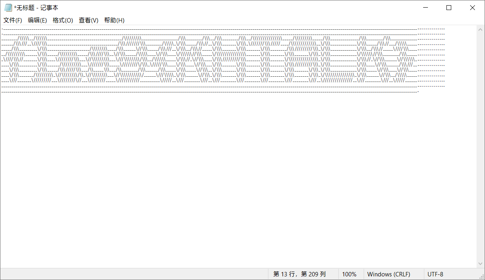

果然。
```
flag9{KHTALK}
```
但其实事后想想，最后一行要短一些，也许不需要去掉 Flag 5 的内容。
```
f.______________________________________________________________________________________________________________________________________________________________________________________________________________.............
l..______________________________________________________________________________________________________________________________________________________________________________________________________________............
a..________/\\\\\__/\\\\\\_____________________________________/\\\\\\\\\__________________/\\\________/\\\__/\\\________/\\\__/\\\\\\\\\\\\\\\_____/\\\\\\\\\_____/\\\______________/\\\________/\\\_____________...........
g...______/\\\///__\////\\\___________________________________/\\\///////\\\________/\\\\\_\/\\\_____/\\\//__\/\\\_______\/\\\_\///////\\\/////____/\\\\\\\\\\\\\__\/\\\_____________\/\\\_____/\\\//___/\\\\\_____..........
5...._____/\\\_________\/\\\_____________________/\\\\\\\\____/\\\______\//\\\_____/\\\///__\/\\\__/\\\//_____\/\\\_______\/\\\_______\/\\\________/\\\/////////\\\_\/\\\_____________\/\\\__/\\\//_____\////\\\____.........
{.....__/\\\\\\\\\______\/\\\_____/\\\\\\\\\_____/\\\////\\\__\//\\\_____/\\\\\____\//\\\____\/\\\\\\//\\\_____\/\\\\\\\\\\\\\\\_______\/\\\_______\/\\\_______\/\\\_\/\\\_____________\/\\\\\\//\\\________/\\\_____........
P......_\////\\\//_______\/\\\____\////////\\\___\//\\\\\\\\\___\///\\\\\\\\/\\\__/\\\\\\_____\/\\\//_\//\\\____\/\\\/////////\\\_______\/\\\_______\/\\\\\\\\\\\\\\\_\/\\\_____________\/\\\//_\//\\\______\//\\\\\\_.......
3.......____\/\\\_________\/\\\______/\\\\\\\\\\___\///////\\\_____\////////\/\\\_\/////\\\____\/\\\____\//\\\___\/\\\_______\/\\\_______\/\\\_______\/\\\/////////\\\_\/\\\_____________\/\\\____\//\\\______/\\\///__......
p........____\/\\\_________\/\\\_____/\\\/////\\\___/\\_____\\\___/\\________/\\\______/\\\_____\/\\\_____\//\\\__\/\\\_______\/\\\_______\/\\\_______\/\\\_______\/\\\_\/\\\_____________\/\\\_____\//\\\____\//\\\____.....
r.........____\/\\\_______/\\\\\\\\\_\//\\\\\\\\/\\_\//\\\\\\\\___\//\\\\\\\\\\\/______\///\\\\\_\/\\\______\//\\\_\/\\\_______\/\\\_______\/\\\_______\/\\\_______\/\\\_\/\\\\\\\\\\\\\\\_\/\\\______\//\\\__/\\\\\_____....
q..........____\///_______\/////////___\////////\//___\////////_____\///////////__________\/////__\///________\///__\///________\///________\///________\///________\///__\///////////////__\///________\///__\/////______...
F..........._______________________________________________________________________________________________________________________________________________________________________________________________________________..
}............_______________________________________________________________________________________________________________________________________________________________________________________________________________.
```
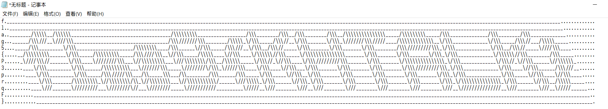

看上去的确更合理呢，还是立体的；Flag 5 的内容则全部出现在开头，同样秒杀两题。

F12 改掉文字颜色就可以直接在浏览器窗口看。

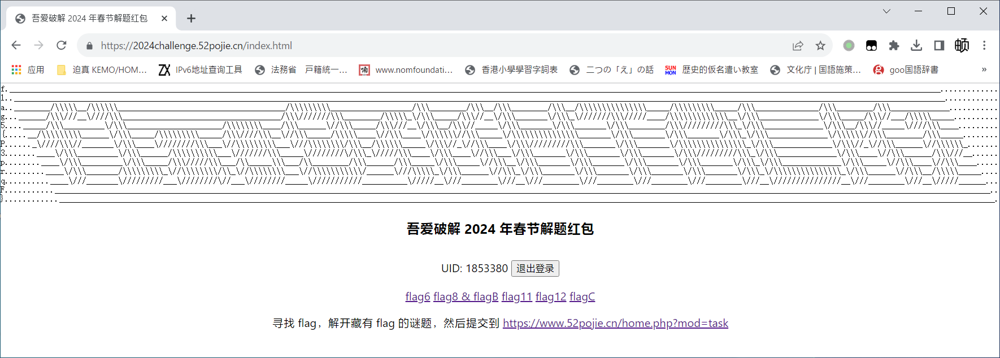

要不再试试秒杀三题？

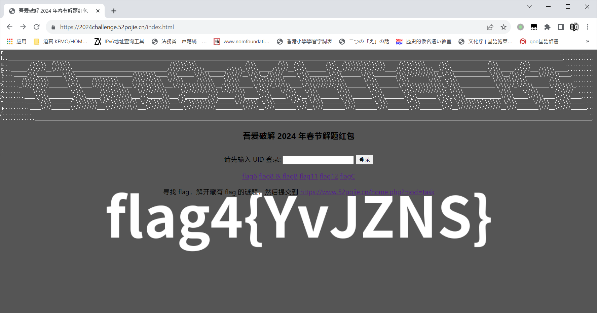

再看看 [Flag 6](https://2024challenge.52pojie.cn/flag6/index.html)。
```JavaScript
document.querySelector('button').addEventListener('click', () => {
    const t0 = Date.now();
    for (let i = 0; i < 1e8; i++) {
        if ((i & 0x1ffff) === 0x1ffff) {
            const progress = i / 1e8;
            const t = Date.now() - t0;
            console.log(`${(progress * 100).toFixed(2)}% ${Math.floor(t / 1000)}s ETA:${Math.floor(t / progress / 1000)}s`);
        }
        if (MD5(String(i)) === '1c450bbafad15ad87c32831fa1a616fc') {
            document.querySelector('#result').textContent = `flag6{${i}}`;
            break;
        }
    }
});
```
改写成 Node.js 的样子罢。
```JavaScript
'use strict';

const crypto = require('crypto');

const t0 = Date.now();
for (let i = 0; i < 1e8; i++) {
    if ((i & 0x1ffff) === 0x1ffff) {
        const progress = i / 1e8;
        const t = Date.now() - t0;
        console.log(`${(progress * 100).toFixed(2)}% ${Math.floor(t / 1000)}s ETA:${Math.floor(t / progress / 1000)}s`);
    };
    if (crypto.createHash('md5').update(String(i)).digest('hex') === '1c450bbafad15ad87c32831fa1a616fc') {
        console.log(`flag6{${i}}`);
        break;
    };
};
```
跑出来一看：
```
flag6{20240217}
```
哦，是日期啊……

然后是 [Flag 8 和 Flag B](https://2024challenge.52pojie.cn/flagB/index.html)。
```
Set-Cookie: game2048_user_data=sGSW8q3kCslksmaSrg9f5Xl6VyFHkfSlnKJ74Ae37YM9xdYc5iImLNzRVL/EkBl+CxjB00skKWYe014DTUzeU8yNbXWxjGkP9wR5hMif02fyfsuXWw==; expires=Mon, 18 Mar 2024 04:30:53 GMT; path=/; SameSite=Lax
```
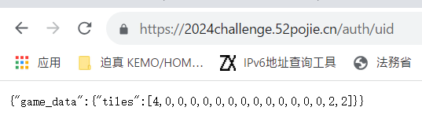

……搁这玩昨日重现呢。

不过加密算法并没有掌握，所以没法自己构造 Cookie。

……要不整个 2048 AI 狠狠爆米罢。先放着再说，跑去做高级题。

来到 [Flag 11](https://2024challenge.52pojie.cn/flag11/index.html)。

是 30×30 为小块的拼图呢。


[Gaps](https://github.com/nemanja-m/gaps)，启动！

……不是这玩意怎么不兼容 Python 3.12，直接退回 Python 3.10。

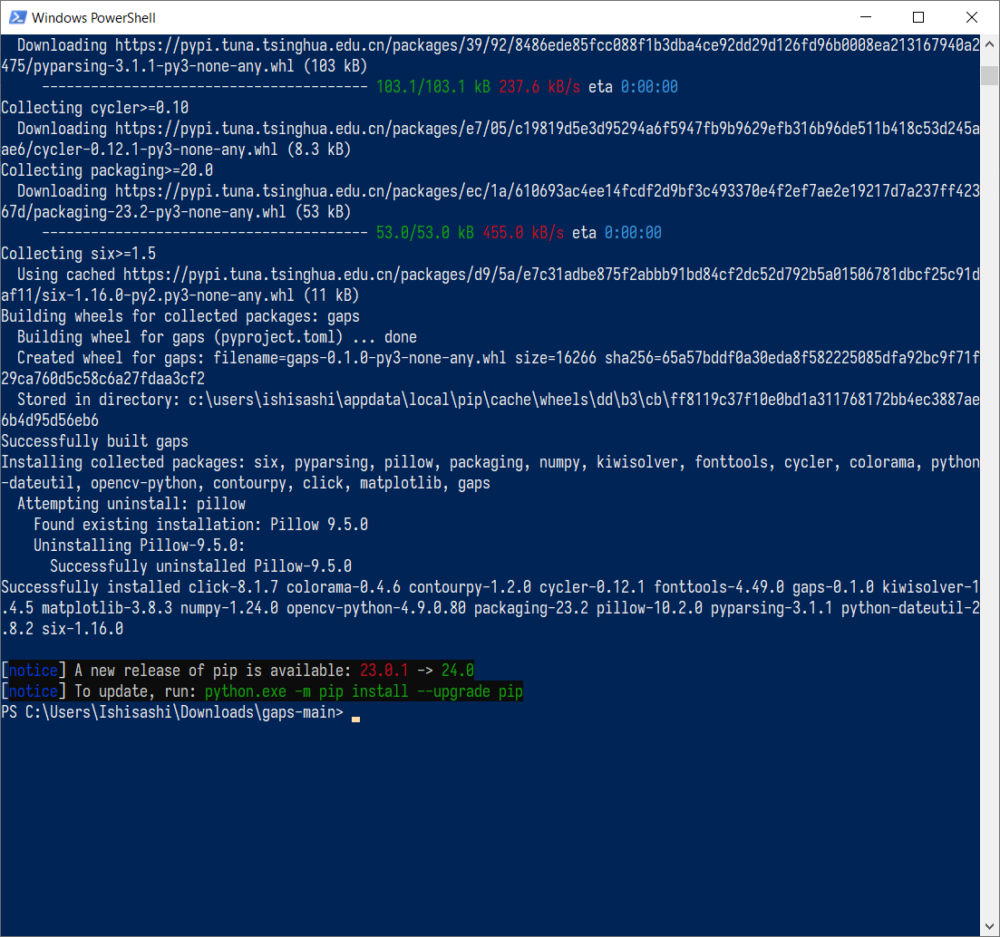
```PowerShell
gaps run .\flag11.png .\flag11-solution.png --generations=30 --population=300 --size=30
```


只能说好了一点，但依旧不理想。

看来还得从网页出发。
```CSS
:root {
    --var1: 0; /* 在 0 ~ 100 范围内找到一个合适的值 */
    --var2: 0; /* 在 0 ~ 100 范围内找到一个合适的值 */
}
```
……啊！原来是要调整变量！关键是让碎片集中在一起。

一通调整猛如虎，终于得到了合适的图像：
```CSS
:root {
    --var1: 71; /* 在 0 ~ 100 范围内找到一个合适的值 */
    --var2: 20; /* 在 0 ~ 100 范围内找到一个合适的值 */
}
```
其实 F12 就可以直接用方向键调整，视觉效果还挺炫酷。

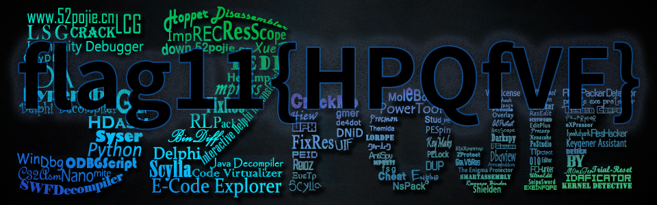
```
flag11{HPQfVF}
```
（上图是用 ImageMagick 切割后重排序合成的）
```PowerShell
.\magick.exe convert -crop 30x30 .\flag11.png .\temp-%03d.png
ren .\temp-000.png temp-trueSolution-184.png
ren .\temp-001.png temp-trueSolution-237.png
ren .\temp-002.png temp-trueSolution-006.png
ren .\temp-003.png temp-trueSolution-117.png
ren .\temp-004.png temp-trueSolution-269.png
ren .\temp-005.png temp-trueSolution-223.png
ren .\temp-006.png temp-trueSolution-199.png
ren .\temp-007.png temp-trueSolution-151.png
ren .\temp-008.png temp-trueSolution-086.png
ren .\temp-009.png temp-trueSolution-302.png
ren .\temp-010.png temp-trueSolution-215.png
ren .\temp-011.png temp-trueSolution-273.png
ren .\temp-012.png temp-trueSolution-248.png
ren .\temp-013.png temp-trueSolution-179.png
ren .\temp-014.png temp-trueSolution-249.png
ren .\temp-015.png temp-trueSolution-067.png
ren .\temp-016.png temp-trueSolution-054.png
ren .\temp-017.png temp-trueSolution-130.png
ren .\temp-018.png temp-trueSolution-075.png
ren .\temp-019.png temp-trueSolution-275.png
ren .\temp-020.png temp-trueSolution-060.png
ren .\temp-021.png temp-trueSolution-113.png
ren .\temp-022.png temp-trueSolution-171.png
ren .\temp-023.png temp-trueSolution-178.png
ren .\temp-024.png temp-trueSolution-100.png
ren .\temp-025.png temp-trueSolution-122.png
ren .\temp-026.png temp-trueSolution-093.png
ren .\temp-027.png temp-trueSolution-045.png
ren .\temp-028.png temp-trueSolution-088.png
ren .\temp-029.png temp-trueSolution-264.png
ren .\temp-030.png temp-trueSolution-156.png
ren .\temp-031.png temp-trueSolution-217.png
ren .\temp-032.png temp-trueSolution-118.png
ren .\temp-033.png temp-trueSolution-165.png
ren .\temp-034.png temp-trueSolution-014.png
ren .\temp-035.png temp-trueSolution-002.png
ren .\temp-036.png temp-trueSolution-141.png
ren .\temp-037.png temp-trueSolution-270.png
ren .\temp-038.png temp-trueSolution-280.png
ren .\temp-039.png temp-trueSolution-090.png
ren .\temp-040.png temp-trueSolution-136.png
ren .\temp-041.png temp-trueSolution-255.png
ren .\temp-042.png temp-trueSolution-114.png
ren .\temp-043.png temp-trueSolution-048.png
ren .\temp-044.png temp-trueSolution-012.png
ren .\temp-045.png temp-trueSolution-018.png
ren .\temp-046.png temp-trueSolution-186.png
ren .\temp-047.png temp-trueSolution-216.png
ren .\temp-048.png temp-trueSolution-146.png
ren .\temp-049.png temp-trueSolution-243.png
ren .\temp-050.png temp-trueSolution-133.png
ren .\temp-051.png temp-trueSolution-229.png
ren .\temp-052.png temp-trueSolution-293.png
ren .\temp-053.png temp-trueSolution-110.png
ren .\temp-054.png temp-trueSolution-305.png
ren .\temp-055.png temp-trueSolution-158.png
ren .\temp-056.png temp-trueSolution-259.png
ren .\temp-057.png temp-trueSolution-233.png
ren .\temp-058.png temp-trueSolution-043.png
ren .\temp-059.png temp-trueSolution-292.png
ren .\temp-060.png temp-trueSolution-246.png
ren .\temp-061.png temp-trueSolution-005.png
ren .\temp-062.png temp-trueSolution-028.png
ren .\temp-063.png temp-trueSolution-195.png
ren .\temp-064.png temp-trueSolution-252.png
ren .\temp-065.png temp-trueSolution-299.png
ren .\temp-066.png temp-trueSolution-310.png
ren .\temp-067.png temp-trueSolution-111.png
ren .\temp-068.png temp-trueSolution-035.png
ren .\temp-069.png temp-trueSolution-149.png
ren .\temp-070.png temp-trueSolution-185.png
ren .\temp-071.png temp-trueSolution-052.png
ren .\temp-072.png temp-trueSolution-085.png
ren .\temp-073.png temp-trueSolution-106.png
ren .\temp-074.png temp-trueSolution-080.png
ren .\temp-075.png temp-trueSolution-263.png
ren .\temp-076.png temp-trueSolution-285.png
ren .\temp-077.png temp-trueSolution-167.png
ren .\temp-078.png temp-trueSolution-212.png
ren .\temp-079.png temp-trueSolution-087.png
ren .\temp-080.png temp-trueSolution-245.png
ren .\temp-081.png temp-trueSolution-250.png
ren .\temp-082.png temp-trueSolution-316.png
ren .\temp-083.png temp-trueSolution-309.png
ren .\temp-084.png temp-trueSolution-228.png
ren .\temp-085.png temp-trueSolution-232.png
ren .\temp-086.png temp-trueSolution-258.png
ren .\temp-087.png temp-trueSolution-097.png
ren .\temp-088.png temp-trueSolution-303.png
ren .\temp-089.png temp-trueSolution-074.png
ren .\temp-090.png temp-trueSolution-047.png
ren .\temp-091.png temp-trueSolution-053.png
ren .\temp-092.png temp-trueSolution-025.png
ren .\temp-093.png temp-trueSolution-040.png
ren .\temp-094.png temp-trueSolution-055.png
ren .\temp-095.png temp-trueSolution-213.png
ren .\temp-096.png temp-trueSolution-202.png
ren .\temp-097.png temp-trueSolution-148.png
ren .\temp-098.png temp-trueSolution-225.png
ren .\temp-099.png temp-trueSolution-311.png
ren .\temp-100.png temp-trueSolution-034.png
ren .\temp-101.png temp-trueSolution-105.png
ren .\temp-102.png temp-trueSolution-286.png
ren .\temp-103.png temp-trueSolution-175.png
ren .\temp-104.png temp-trueSolution-204.png
ren .\temp-105.png temp-trueSolution-115.png
ren .\temp-106.png temp-trueSolution-211.png
ren .\temp-107.png temp-trueSolution-019.png
ren .\temp-108.png temp-trueSolution-015.png
ren .\temp-109.png temp-trueSolution-023.png
ren .\temp-110.png temp-trueSolution-208.png
ren .\temp-111.png temp-trueSolution-247.png
ren .\temp-112.png temp-trueSolution-091.png
ren .\temp-113.png temp-trueSolution-076.png
ren .\temp-114.png temp-trueSolution-089.png
ren .\temp-115.png temp-trueSolution-161.png
ren .\temp-116.png temp-trueSolution-281.png
ren .\temp-117.png temp-trueSolution-095.png
ren .\temp-118.png temp-trueSolution-134.png
ren .\temp-119.png temp-trueSolution-153.png
ren .\temp-120.png temp-trueSolution-050.png
ren .\temp-121.png temp-trueSolution-078.png
ren .\temp-122.png temp-trueSolution-013.png
ren .\temp-123.png temp-trueSolution-108.png
ren .\temp-124.png temp-trueSolution-200.png
ren .\temp-125.png temp-trueSolution-231.png
ren .\temp-126.png temp-trueSolution-101.png
ren .\temp-127.png temp-trueSolution-157.png
ren .\temp-128.png temp-trueSolution-183.png
ren .\temp-129.png temp-trueSolution-004.png
ren .\temp-130.png temp-trueSolution-168.png
ren .\temp-131.png temp-trueSolution-162.png
ren .\temp-132.png temp-trueSolution-103.png
ren .\temp-133.png temp-trueSolution-119.png
ren .\temp-134.png temp-trueSolution-124.png
ren .\temp-135.png temp-trueSolution-304.png
ren .\temp-136.png temp-trueSolution-198.png
ren .\temp-137.png temp-trueSolution-003.png
ren .\temp-138.png temp-trueSolution-297.png
ren .\temp-139.png temp-trueSolution-063.png
ren .\temp-140.png temp-trueSolution-209.png
ren .\temp-141.png temp-trueSolution-282.png
ren .\temp-142.png temp-trueSolution-207.png
ren .\temp-143.png temp-trueSolution-016.png
ren .\temp-144.png temp-trueSolution-120.png
ren .\temp-145.png temp-trueSolution-251.png
ren .\temp-146.png temp-trueSolution-294.png
ren .\temp-147.png temp-trueSolution-227.png
ren .\temp-148.png temp-trueSolution-307.png
ren .\temp-149.png temp-trueSolution-062.png
ren .\temp-150.png temp-trueSolution-236.png
ren .\temp-151.png temp-trueSolution-031.png
ren .\temp-152.png temp-trueSolution-244.png
ren .\temp-153.png temp-trueSolution-187.png
ren .\temp-154.png temp-trueSolution-129.png
ren .\temp-155.png temp-trueSolution-262.png
ren .\temp-156.png temp-trueSolution-267.png
ren .\temp-157.png temp-trueSolution-135.png
ren .\temp-158.png temp-trueSolution-253.png
ren .\temp-159.png temp-trueSolution-155.png
ren .\temp-160.png temp-trueSolution-138.png
ren .\temp-161.png temp-trueSolution-271.png
ren .\temp-162.png temp-trueSolution-116.png
ren .\temp-163.png temp-trueSolution-238.png
ren .\temp-164.png temp-trueSolution-008.png
ren .\temp-165.png temp-trueSolution-261.png
ren .\temp-166.png temp-trueSolution-073.png
ren .\temp-167.png temp-trueSolution-021.png
ren .\temp-168.png temp-trueSolution-044.png
ren .\temp-169.png temp-trueSolution-291.png
ren .\temp-170.png temp-trueSolution-172.png
ren .\temp-171.png temp-trueSolution-112.png
ren .\temp-172.png temp-trueSolution-177.png
ren .\temp-173.png temp-trueSolution-036.png
ren .\temp-174.png temp-trueSolution-277.png
ren .\temp-175.png temp-trueSolution-159.png
ren .\temp-176.png temp-trueSolution-315.png
ren .\temp-177.png temp-trueSolution-278.png
ren .\temp-178.png temp-trueSolution-192.png
ren .\temp-179.png temp-trueSolution-011.png
ren .\temp-180.png temp-trueSolution-029.png
ren .\temp-181.png temp-trueSolution-039.png
ren .\temp-182.png temp-trueSolution-041.png
ren .\temp-183.png temp-trueSolution-224.png
ren .\temp-184.png temp-trueSolution-174.png
ren .\temp-185.png temp-trueSolution-152.png
ren .\temp-186.png temp-trueSolution-314.png
ren .\temp-187.png temp-trueSolution-283.png
ren .\temp-188.png temp-trueSolution-290.png
ren .\temp-189.png temp-trueSolution-026.png
ren .\temp-190.png temp-trueSolution-279.png
ren .\temp-191.png temp-trueSolution-180.png
ren .\temp-192.png temp-trueSolution-145.png
ren .\temp-193.png temp-trueSolution-096.png
ren .\temp-194.png temp-trueSolution-214.png
ren .\temp-195.png temp-trueSolution-188.png
ren .\temp-196.png temp-trueSolution-143.png
ren .\temp-197.png temp-trueSolution-164.png
ren .\temp-198.png temp-trueSolution-140.png
ren .\temp-199.png temp-trueSolution-109.png
ren .\temp-200.png temp-trueSolution-147.png
ren .\temp-201.png temp-trueSolution-082.png
ren .\temp-202.png temp-trueSolution-066.png
ren .\temp-203.png temp-trueSolution-137.png
ren .\temp-204.png temp-trueSolution-219.png
ren .\temp-205.png temp-trueSolution-033.png
ren .\temp-206.png temp-trueSolution-300.png
ren .\temp-207.png temp-trueSolution-272.png
ren .\temp-208.png temp-trueSolution-070.png
ren .\temp-209.png temp-trueSolution-313.png
ren .\temp-210.png temp-trueSolution-079.png
ren .\temp-211.png temp-trueSolution-051.png
ren .\temp-212.png temp-trueSolution-210.png
ren .\temp-213.png temp-trueSolution-010.png
ren .\temp-214.png temp-trueSolution-265.png
ren .\temp-215.png temp-trueSolution-206.png
ren .\temp-216.png temp-trueSolution-049.png
ren .\temp-217.png temp-trueSolution-084.png
ren .\temp-218.png temp-trueSolution-317.png
ren .\temp-219.png temp-trueSolution-226.png
ren .\temp-220.png temp-trueSolution-121.png
ren .\temp-221.png temp-trueSolution-125.png
ren .\temp-222.png temp-trueSolution-104.png
ren .\temp-223.png temp-trueSolution-260.png
ren .\temp-224.png temp-trueSolution-289.png
ren .\temp-225.png temp-trueSolution-240.png
ren .\temp-226.png temp-trueSolution-001.png
ren .\temp-227.png temp-trueSolution-042.png
ren .\temp-228.png temp-trueSolution-017.png
ren .\temp-229.png temp-trueSolution-319.png
ren .\temp-230.png temp-trueSolution-182.png
ren .\temp-231.png temp-trueSolution-308.png
ren .\temp-232.png temp-trueSolution-191.png
ren .\temp-233.png temp-trueSolution-235.png
ren .\temp-234.png temp-trueSolution-131.png
ren .\temp-235.png temp-trueSolution-123.png
ren .\temp-236.png temp-trueSolution-312.png
ren .\temp-237.png temp-trueSolution-065.png
ren .\temp-238.png temp-trueSolution-022.png
ren .\temp-239.png temp-trueSolution-288.png
ren .\temp-240.png temp-trueSolution-221.png
ren .\temp-241.png temp-trueSolution-276.png
ren .\temp-242.png temp-trueSolution-000.png
ren .\temp-243.png temp-trueSolution-059.png
ren .\temp-244.png temp-trueSolution-024.png
ren .\temp-245.png temp-trueSolution-298.png
ren .\temp-246.png temp-trueSolution-046.png
ren .\temp-247.png temp-trueSolution-128.png
ren .\temp-248.png temp-trueSolution-126.png
ren .\temp-249.png temp-trueSolution-058.png
ren .\temp-250.png temp-trueSolution-201.png
ren .\temp-251.png temp-trueSolution-056.png
ren .\temp-252.png temp-trueSolution-057.png
ren .\temp-253.png temp-trueSolution-194.png
ren .\temp-254.png temp-trueSolution-197.png
ren .\temp-255.png temp-trueSolution-037.png
ren .\temp-256.png temp-trueSolution-072.png
ren .\temp-257.png temp-trueSolution-007.png
ren .\temp-258.png temp-trueSolution-218.png
ren .\temp-259.png temp-trueSolution-083.png
ren .\temp-260.png temp-trueSolution-242.png
ren .\temp-261.png temp-trueSolution-193.png
ren .\temp-262.png temp-trueSolution-190.png
ren .\temp-263.png temp-trueSolution-094.png
ren .\temp-264.png temp-trueSolution-295.png
ren .\temp-265.png temp-trueSolution-061.png
ren .\temp-266.png temp-trueSolution-139.png
ren .\temp-267.png temp-trueSolution-098.png
ren .\temp-268.png temp-trueSolution-181.png
ren .\temp-269.png temp-trueSolution-234.png
ren .\temp-270.png temp-trueSolution-069.png
ren .\temp-271.png temp-trueSolution-127.png
ren .\temp-272.png temp-trueSolution-266.png
ren .\temp-273.png temp-trueSolution-205.png
ren .\temp-274.png temp-trueSolution-203.png
ren .\temp-275.png temp-trueSolution-150.png
ren .\temp-276.png temp-trueSolution-170.png
ren .\temp-277.png temp-trueSolution-239.png
ren .\temp-278.png temp-trueSolution-154.png
ren .\temp-279.png temp-trueSolution-296.png
ren .\temp-280.png temp-trueSolution-268.png
ren .\temp-281.png temp-trueSolution-099.png
ren .\temp-282.png temp-trueSolution-092.png
ren .\temp-283.png temp-trueSolution-071.png
ren .\temp-284.png temp-trueSolution-009.png
ren .\temp-285.png temp-trueSolution-173.png
ren .\temp-286.png temp-trueSolution-230.png
ren .\temp-287.png temp-trueSolution-241.png
ren .\temp-288.png temp-trueSolution-132.png
ren .\temp-289.png temp-trueSolution-030.png
ren .\temp-290.png temp-trueSolution-027.png
ren .\temp-291.png temp-trueSolution-169.png
ren .\temp-292.png temp-trueSolution-189.png
ren .\temp-293.png temp-trueSolution-254.png
ren .\temp-294.png temp-trueSolution-142.png
ren .\temp-295.png temp-trueSolution-020.png
ren .\temp-296.png temp-trueSolution-064.png
ren .\temp-297.png temp-trueSolution-284.png
ren .\temp-298.png temp-trueSolution-166.png
ren .\temp-299.png temp-trueSolution-306.png
ren .\temp-300.png temp-trueSolution-196.png
ren .\temp-301.png temp-trueSolution-287.png
ren .\temp-302.png temp-trueSolution-222.png
ren .\temp-303.png temp-trueSolution-032.png
ren .\temp-304.png temp-trueSolution-077.png
ren .\temp-305.png temp-trueSolution-301.png
ren .\temp-306.png temp-trueSolution-081.png
ren .\temp-307.png temp-trueSolution-160.png
ren .\temp-308.png temp-trueSolution-068.png
ren .\temp-309.png temp-trueSolution-176.png
ren .\temp-310.png temp-trueSolution-257.png
ren .\temp-311.png temp-trueSolution-038.png
ren .\temp-312.png temp-trueSolution-107.png
ren .\temp-313.png temp-trueSolution-163.png
ren .\temp-314.png temp-trueSolution-318.png
ren .\temp-315.png temp-trueSolution-102.png
ren .\temp-316.png temp-trueSolution-256.png
ren .\temp-317.png temp-trueSolution-274.png
ren .\temp-318.png temp-trueSolution-220.png
ren .\temp-319.png temp-trueSolution-144.png
.\magick.exe montage .\temp-trueSolution-*.png -tile 32x10 -geometry +0+0 .\flag11-trueSolution.png
del temp-trueSolution-*.png
```
（甚至可以倒过来，自己生成一个）

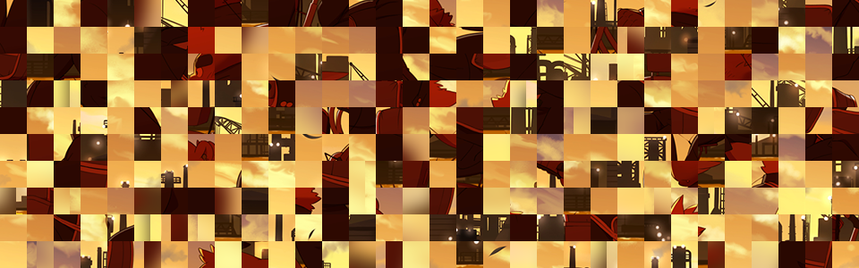

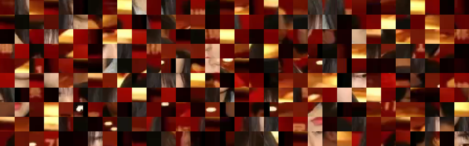

接着做 [Flag 12](https://2024challenge.52pojie.cn/flag12/index.html)。
```JavaScript
WebAssembly.instantiateStreaming(fetch('flag12.wasm'))
```
那是不是要逆向 flag12.wasm 呢？未必。
```JavaScript
'use strict';

const fs = require('fs');

const main = async() => {
    const wasm = await WebAssembly.instantiate(fs.readFileSync('./flag12.wasm'));
    const get_flag12 = wasm.instance.exports.get_flag12;

    let num = 0;
    while (num < 4294967296) {
        if (get_flag12(num) > 0) {
            console.log(num);
        };
        num += 1;
    };
};

main();
```
一跑得到密码 4005161829，然后就可以输进去得 Flag 12 了。
```
flag12{HOXI}
```
到了最后的 [Flag C](https://2024challenge.52pojie.cn/flagC/index.html)——虽然还有 Flag 8 和 Flag B 没做出来，但不管怎么说……为甚么我有一种高级题比中级题简单的错觉。
```
开始布置你的魔法阵吧，使用特定物品正确布置阵法即可获得 flagC
```
魔……魔法阵？

它给了个示例。

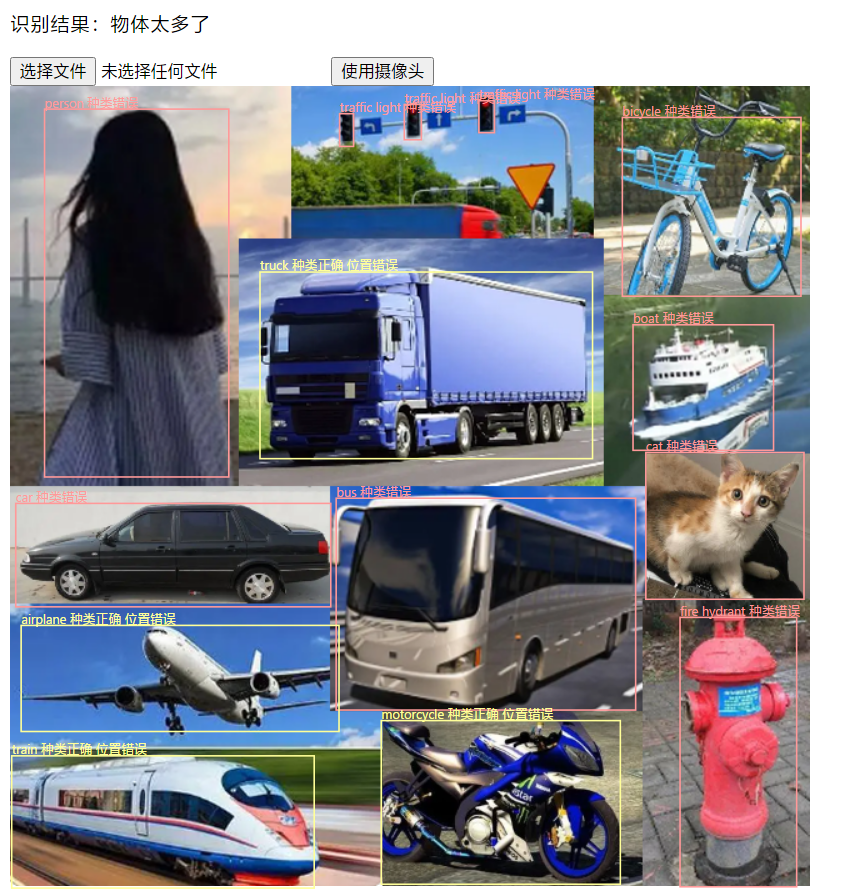

那就对着魔改。


只有位置不对了。
```JavaScript
return verify(boxes, scores, classes);
```
```JSON
{"boxes":[0.3155289888381958,0.23150303959846497,0.7270753383636475,0.4651218354701996,0.0019649118185043335,0.8346332311630249,0.3821478486061096,0.9994404315948486,0.463779479265213,0.7878023386001587,0.7620490789413452,0.9940140247344971,0.015448316931724548,0.6719939708709717,0.4104928970336914,0.8047492504119873],"scores":[0.900807797908783,0.8667296171188354,0.8469635844230652,0.6675565242767334],"classes":[7,6,3,4]}
```
表征位置的是 boxes 这一项，所以……？
```JSON
{"boxes":[0.1,0.8,0.3,0.9,0.8,0.1,0.9,0.3,0.1,0.1,0.3,0.3,0.8,0.8,0.9,0.9],"scores":[0.900807797908783,0.8667296171188354,0.8469635844230652,0.6675565242767334],"classes":[7,6,3,4]}
```
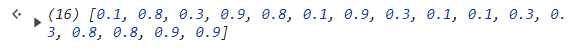

因为是直接传数据，所以不需要跑模型，速度快而便于试错；而且瞎放图片也没关系。

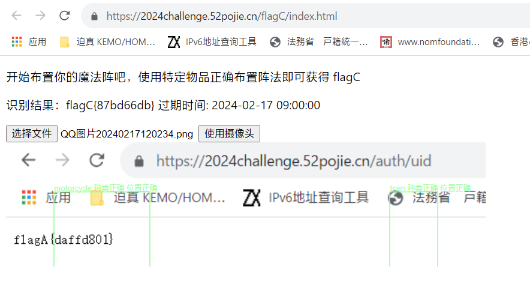
```
flagC{87bd66db}
```
实际上也试出了正确的位置。


高级题完成！
```
flag9{KHTALK} flag10{6BxMkW} flag11{HPQfVF} flag12{HOXI} flagC{87bd66db}
```
七血。
```
前面Web中级题完成了吗，再来试试Web高级题吧
```
没完成（即答）

现在还剩下中级题，也就是 [Flag 8 和 Flag B](https://2024challenge.52pojie.cn/flagB/index.html)。

我只好摆烂瞎打 2048，没想到有提示……

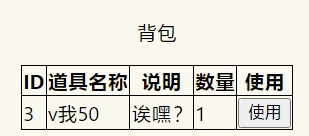

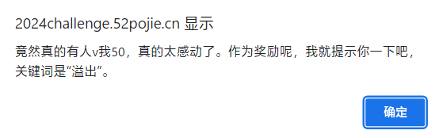
```
竟然真的有人v我50，真的太感动了。作为奖励呢，我就提示你一下吧，关键词是“溢出”。
```
不是，这个点我也想到过啊。可是我怎么样都触发不了负金币，一用钱就说「钱不够」，买负数量的道具会报「buyCount 不能小于 0」，买极大数量的道具又会报「购买商品之后钱怎么还变多了？不知道出什么 bug 了，暂时先拦一下 ^_^」。

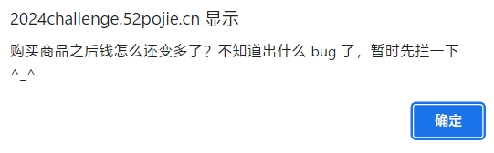

……它哪让我溢啊。

但至少有了明确的方向，而不是像之前那样只当成一个可能方向。

无聊试了一下，发现数据类型应该是 64 位有符号整数。它并没有写死一个拒绝购买的请求长度，因为不同单价的道具拦截阈值不一样——这我都没想过，不试还真不知道。有符号整数……？啊！

那就列一个同余方程，使得购买 Flag B 道具的金币数模 2^64 为一个很小的非负整数！

当然，购买数目本身得是小于 2^63 的正整数。

不妨就试试 0。
```Wolfram
Solve[Mod[999063388n, 2^64]==0 && n>0 && n<2^63, {n}, Integers]
```
很幸运的是，有解。
```Wolfram
{{n->4611686018427387904}}
```
那就买 4611686018427387904 个 Flag B 道具。

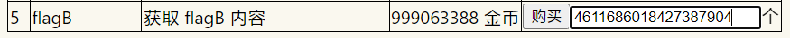

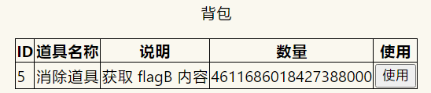

「啊？」

不是，原来它真就只挡为负的情形，非负的溢出它不拦啊。

……为甚么背包显示的数量是 64 位浮点数啊？那当然是因为 JS 的 Number 类型本来就是 64 位浮点（目移）

有趣的是传回来的 Cookie / JSON 实际上并没有精度损失，只是交给前端解析才变成了这个样子。

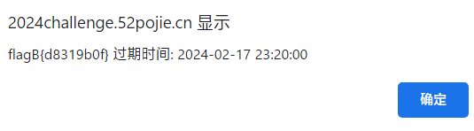
```
flagB{d8319b0f}
```
同样的手法也可以算出，Flag 8 道具就要买 1152921504606846976 个。
```Wolfram
Solve[Mod[10000n, 2^64]==0 && n>0 && n<2^63, {n}, Integers]
```
```Wolfram
{{n->1152921504606846976},{n->2305843009213693952},{n->3458764513820540928},{n->4611686018427387904},{n->5764607523034234880},{n->6917529027641081856},{n->8070450532247928832}}
```
……啊，其实 4611686018427387904 也可以，通杀两者了属于是。
```
flag8{OaOjIK}
```
100 金币的消除道具也是买 4611686018427387904 个，通杀三者。
```Wolfram
Solve[Mod[100n, 2^64]==0 && n>0 && n<2^63, {n}, Integers]
```
```Wolfram
{{n->4611686018427387904}}
```
为甚么是这样呢？不妨分析一下整数域内关于 n 的方程 mn mod 2^64 = 0。容易看出 mn 是 2^64 的倍数，也就是说 mn 应当是 m 和 2^64 的公倍数。

方程化归成 mn = kLCM(m, 2^64)（其中 k 为任意整数），即 n = kLCM(m, 2^64)/m——但是 LCM(m, 2^64)GCD(m, 2^64)=2^64 m，因而 GCD(m, 2^64)/m=2^64/LCM(m, 2^64)，代入得 n = 2^64 k/LCM(m, 2^64)。

不妨作质因数分解。

999063388 = 2^2 × 79 × 3161593

10000 = 2^4 × 5^4

100 = 2^2 × 5^2

它们和 2^64 的最大公因数就是质因数分解的 2^x 项。于 999063388 和 100 而言都是 2^2，于 10000 而言是 2^4。

2^62 就是 4611686018427387904，2^60 就是 1152921504606846976，印证了上面的结果。

但是，50 金币的剩下两个道具就不能零元购了呢……
```Wolfram
Solve[Mod[50n, 2^64]==0 && n>0 && n<2^63, {n}, Integers]
```
```Wolfram
{}
```
为甚么呢？因为 50 = 2 × 5^2，而 2^63 正好不小于 2^63。

其实没有关系，零元购不行那就去二元店。须购买 1106804644422573097 个。
```Wolfram
Solve[Mod[50n, 2^64]==2 && n>0 && n<2^63, {n}, Integers]
```
```Wolfram
{{n->1106804644422573097}}
```
中级题完成！
```
flag5{P3prqF} flag6{20240217} flag7{Djl9NQ} flag8{OaOjIK} flagB{d8319b0f}
```
「问题来了，怎么把道具用光啊？」

啊那好像是没办法了，老老实实删档重开罢。
```JavaScript
document.cookie = 'game2048_user_data=; path=/';
```
——真的是这样吗？如果是零元购而且还没用的话，其实继续购买就可以使道具数溢出归零了。

仔细一想，我卡在 Flag B 完全是因为自己把设计想得太严密了，根本没想到可能存在这种低级问题。

挡了，但没挡（？）

只拦倒贴，不拦亏本。

不由得让我想起了 PKU GeekGame 3rd 的某个未使用题，虽说 THUCTF 2023 用了。我当时在 Writeup 里这么写：
```
所有账户的退款订单池共用，所以不断注册小号就可以实现众筹。
```
这个也是无聊试出来的，而且我也根本没想到会有这么低级的错误。

不过那个还真是出题人的疏忽，而非故意为之，预期解是快速购买、退款形成 Race。

只能说还是不要下意识就排除掉低级问题了，说不定出题人就是这么出的呢。

既然有事实上无限的消除道具了，那就试着凑个 4096 罢（错乱）

结果刚凑出个 2048 和 1024 就不小心按到了重开，道心破碎了。气得我直接 F12 把按钮删了。

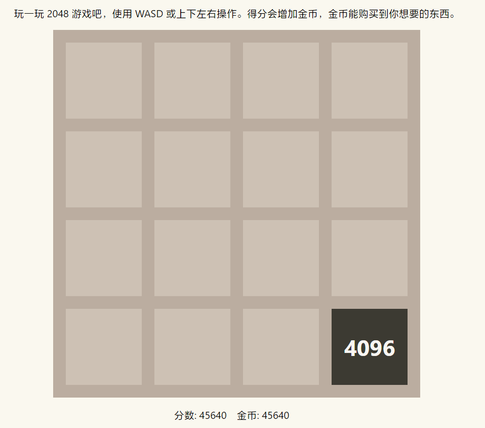

……哈？黑的？

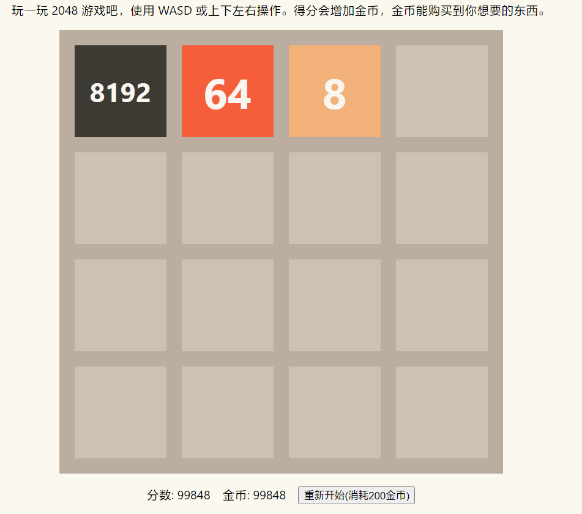

喜报：欠了 2932 个消除道具

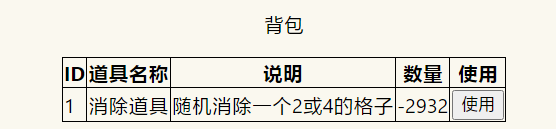
