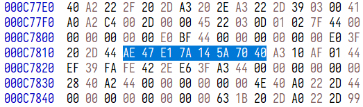
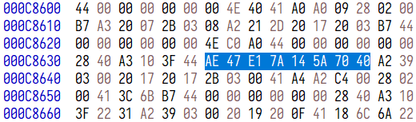
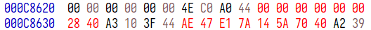

用十六进制编辑器打开 interactive_javascript.wasm，搜 `AE47E17A145A7040`，有两处结果：





根据个人经验，通常只改后者就够了。但我用大市唱时常常无参，所以不确定在有外加参数的情况下会不会有影响。如果有出问题的情形，欢迎与我讨论。

需要修改的是 `0000000000002840` 与 `AE47E17A145A7040`：



这两者都是小端序的 64 位二进制 IEEE Std 754 浮点数（binary64），前者代表的是八度等分数，后者代表的是 C4 的频率。在大市唱中，C4 的编号始终为 60。当然，完全可以任意指定 C4 的频率，令 C4 为 440 Hz 都是可以的。

顺带一提，大市唱的默认参数中，C4 = 261.63 Hz（浮点数转过来的精确值为 2301321817400279/8796093022208，但代码填写的原始数值应该就是 261.63），比标准值高了约 0.03 音分。当然这个误差几乎不可闻。

可以用以下 Wolfram 语言代码计算显映射的参数：
```
baseMonzo = {-4, 3} (* 基准音定为 A4，C4 到 A4 的音程是 27/16 *)
baseFreqHz = 440 (* 基准频率定为 440 Hz *)
edo = 19 (* 使用十九平均律显映射 *)
val = Table[Round[edo Log2[Prime[n]]], {n, 1, Length[baseMonzo]}]
C4FreqHz = baseFreqHz / 2 ^ (val . baseMonzo / edo)
BaseEncode[ExportByteArray[N[edo, 1000], "Real64", ByteOrdering -> -1], "Base16"] (* 不加 N 的话 Wolfram 引擎疑似会自己先 N 掉，结果成低精度了 *)
BaseEncode[ExportByteArray[N[C4FreqHz, 1000], "Real64", ByteOrdering -> -1], "Base16"]
```
原样运行可以得到 A4 = 440 Hz 时十九平均律显映射的参数。自行修改变量可以更换基音以及律制。
